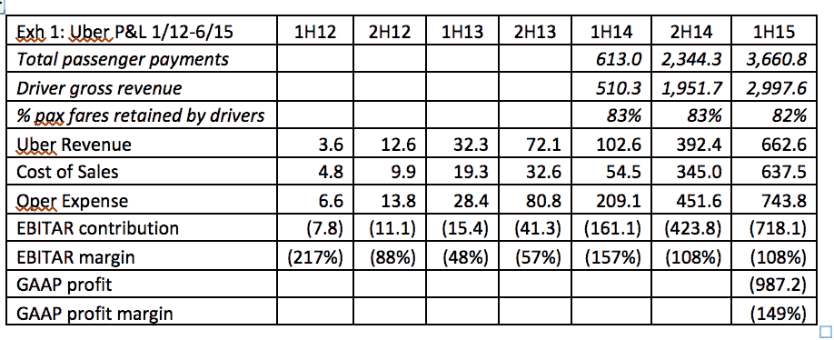
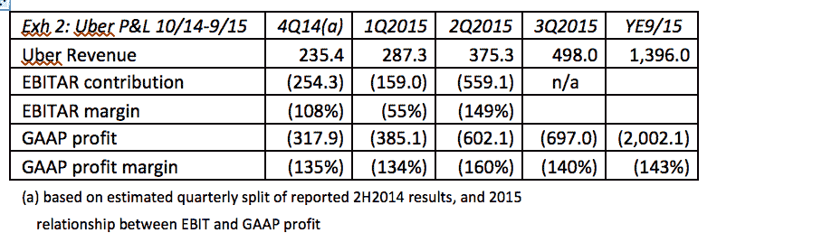
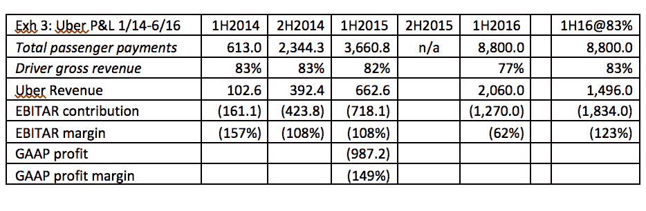

# 优步能做到吗？第一部分——理解优步惨淡的经营经济学|赤裸裸的资本主义

> 原文：<https://www.nakedcapitalism.com/2016/11/can-uber-ever-deliver-part-one-understanding-ubers-bleak-operating-economics.html?utm_source=wanqu.co&utm_campaign=Wanqu+Daily&utm_medium=website>

这是 Naked Capitalism 的特别筹款活动，通过资助法律费用和其他网站支持来对抗麦卡锡主义者对该网站和其他 200 家网站的攻击。关于《华盛顿邮报》如何抹黑赤裸裸的资本主义以及其他知名独立新闻网站的更多背景信息，以及为什么这是一个如此危险的发展，[参见本·诺顿和格林沃尔德](https://theintercept.com/2016/11/26/washington-post-disgracefully-promotes-a-mccarthyite-blacklist-from-a-new-hidden-and-very-shady-group/)的这篇文章，以及[马特·泰比](https://www.rollingstone.com/politics/features/washington-post-blacklist-story-is-shameful-disgusting-w452543)的这篇文章。我们的帖子[给出了我们计划如何反击](https://www.nakedcapitalism.com/2016/11/were-under-attack.html)的更多细节。23 个捐助者已经支持了这项运动。请加入我们，并通过我们的[小费罐](https://www.nakedcapitalism.com/tip-jar/)参与其中，小费罐展示了如何通过支票、信用卡、借记卡或 PayPal 进行捐赠。

我是伊夫。凭借在全球各大城市对当地出租车业务的大力支持，加上在商业媒体和硅谷自由主义者中培养啦啦队员，优步成功打造了一个不可避免、不可战胜的形象。多少是炒作，多少是真实？

正如运输行业专家休伯特·霍兰将在他的四部分系列中展示的那样，优步大大夸大了它的情况。没有理由相信优步会盈利，更不用说证明其高昂的估值了，除非无人驾驶汽车得到广泛应用。Lambert 已经开始深入研究这个问题，他在这个主题上的帖子一直认为，这项技术的支持者承认，这项技术的开发和实施将更加困难，需要对道路进行大幅升级，在恶劣的天气条件下(雪和雨)可能永远不可行，而且最不可能在城市中实施，这种技术对高速公路上的长距离运输提出了更令人生畏的设计要求。

很能说明问题的是，本月早些时候，彭博报道称摩根大通和德意志银行拒绝了向高净值个人出售优步股票的“机会”。原因？这家出租车公司提供了 290 页的文字材料，但不愿提供其净收入甚至年收入。

***作者 Hubert Horan，他在运输公司(主要是航空公司)的管理和监管方面拥有 40 年的经验。Horan 与任何城市汽车服务行业的竞争对手、投资者或监管机构，或任何代表行业参与者的公司没有财务联系。**T3】*

优步是目前世界上估值最高的私人公司。基于超过 130 亿美元的直接投资，其主要基于硅谷的投资者已经实现了 690 亿美元的风险资本估值。优步希望从城市汽车服务行业中为投资者赚取数十亿美元的回报，该行业生产商品的利润历来非常微薄。尽管一个多世纪以来，该行业一直处于竞争分散和结构稳定的状态，但优步一直在积极追求全球行业主导地位，认为该行业已经彻底转变为一个“赢者通吃”的市场。

这是一系列文章中的第一篇，旨在探讨优步对全球行业主导地位的追求是否会真正提高城市汽车服务业的效率，并改善整体经济福利。

优步(或任何其他激进的行业重组)要提高福利，就必须清楚地证明:

> 在足够大的竞争市场中赚取可持续利润的能力，以便为其投资资本提供有吸引力的回报
> 
> 以低得多的成本提供服务的能力，或者以类似的成本提供高得多的服务质量的能力
> 
> 它通过重大产品重新设计和技术/工艺创新创造了可持续竞争优势的新来源，现有生产商无法轻易与之匹敌，以及
> 
> 有证据表明，新占主导地位的公司将有强烈的动机将这些效率收益的很大一部分转移给消费者。

与大多数初创公司不同，优步进入该行业并不是为了追求巨大的市场份额，而是明确致力于将现有公司赶出业务，并实现全球行业主导地位。优步的巨额估值总是基于其向全球主导地位的戏剧性增长。因此，如果优步的估值和行业主导地位能够提高福利，优步的效率和竞争优势就必须是压倒性的，而且需要有明确的证据证明优步有能力从这些优势中获得高额利润和消费者福利。

虽然大多数媒体报道都集中在孤立的优步产品属性，或其企业风格和形象，但本系列将关注优步的整体经济，使用局外人通常会使用的方法来研究行业竞争动态或投资机会。第一篇文章将展示优步盈利能力的证据，而后续文章将展示成本效率、竞争优势和其他对更大的经济福利问题至关重要的问题。

**优步每年的运营损失高达 20 亿美元，超过了历史上任何一家初创公司**

公布的财务数据显示，优步的亏损超过了历史上任何一家初创公司，它从现有运营商那里吸引客户和司机的能力完全归功于每年 20 亿美元的投资者补贴。绝大多数媒体报道认为，优步正在走著名的数字初创公司的道路，这些公司最初的巨额亏损在几年内转化为丰厚的利润。

这一假设与优步的实际财务业绩相矛盾，该公司的财务业绩显示，到 2015 年为止，利润率没有显著提高，而 2016 年利润率的有限提高可以完全归因于优步强制削减司机薪酬。另一个矛盾的事实是，优步缺乏允许基于数字的初创公司实现快速利润增长的大规模和网络经济。

作为一家私营公司，优步不需要公布财务报表，私下传播的财务报表也不需要根据公认会计原则(GAAP)进行审计，也不需要满足 SEC 对上市公司的报告标准。

下面的财务表格是基于优步与投资者分享的私人财务报表，这些财务报表在三个不同的场合发表在金融媒体上。第一组包括 2012 年、2013 年和 2014 年上半年的数据，尽管只显示了息税折旧及摊销前利润(EBITAR ),而不是上市公司报告的真实(GAAP)利润。[【1】](#_edn1)第二套包括 2014 年全年和 2015 年上半年 GAAP 利润数据表；[【2】](#_edn2)第三组包括 2016 年上半年的息税前利润贡献汇总数据。[【3】](#_edn3)尚未公布 2015 年第四季度的业绩报告。

图表 1 总结了 2013 年至 2015 年上半年的数据。司机保留 83%的乘客费用(车费加小费)，这必须包括车辆所有权、保险和维护、燃料、信用卡和执照费以及健康保险和实得工资；余额就是优步的总收入。附件 2 显示了截至 2015 年 9 月的全年 GAAP 结果，该结果基于已公布的数字和已公布的 2014 年下半年结果的估计季度划分。图表 3 比较了 2016 年上半年的结果和 2014-15 年的结果。EBITAR 贡献和 GAAP 盈利能力之间没有简单的关系，即使是上市公司也有很大的回旋余地，可以从 EBITAR 等中期贡献指标中排除哪些费用。

如表 2 所示，截至 2015 年 9 月，优步的收入为 14 亿美元，GAAP 亏损 20 亿美元，利润率为负 143%。因此，优步目前的运营依赖于 20 亿美元的补贴，资金来自其投资者提供的 130 亿美元现金。

优步乘客只支付了实际旅行费用的 41%;优步利用这些巨额补贴来降低票价，并提供比竞争对手更多的运力，因为竞争对手必须从客运票价中支付 100%的成本。

许多其他科技创业公司在追求增长和市场份额时都亏损了，但这种规模的亏损是前所未有的；在 2000 年最糟糕的四个季度中，亚马逊的利润率为负 50%，收入为 28 亿美元，亏损 14 亿美元，公司的应对措施是解雇超过 15%的员工。[【4】](#_edn4)2015 年是优步运营的第五年；在其历史的那个时期，脸书实现了 25%的利润率。

**没有证据表明利润率的快速提高推动了其他科技创业公司的盈利**

没有证据表明，优步的快速增长推动了其他知名科技初创公司在“逐渐盈利”时实现的利润率快速提高

假设 2014 年上半年息税前利润的异常飙升(157%)是由一次性事件或会计异常引起的，那么自 2012 年以来，优步的息税前利润一直稳定地低于负 100%，亏损的绝对幅度一直在增加。

截至 2015 年 6 月的一年，优步公司收入比截至 2014 年 6 月的一年高出 500%以上，但息税前利润几乎没有变化，从负 115%上升到负 108%。2016 年上半年，优步的息税前利润为负 12 亿美元，表明全年 GAAP 亏损接近 30 亿美元。优步的息税前利润率从 2015 年上半年的负 108%提高到 2016 年上半年的负 62%，但这一利润率的提高完全归因于优步强制削减司机薪酬。如表 3 所示，2016 年优步只允许司机保留每位乘客美元的 77%，低于 2014-15 年的 83%[【6】](#_edn6)。如果司机保留了 2016 年乘客支付的 83%，优步的息税前利润贡献将为负 18 亿美元，其息税前利润率将降至负 122%。优步的息税前利润并没有提高，因为其生产效率或市场表现正在改善；资本只是在每一美元的收入中索取更高的份额，而给予劳动力的份额却更少。

如果快速增长无法在 2012 年至 2016 年间推动利润率大幅提高，那么就没有理由相信优步会在未来突然发现数十亿美元的规模经济。从根本上说，像亚马逊、易趣、谷歌和脸书这样的数字公司拥有巨大的经营规模经济，因为扩大经营的边际成本接近于零。激进的定价推动了增长，推动了利润的大幅增长，也创造了重大的消费者福利。

相比之下，自第一辆电动出租车问世以来的一百年里，没有证据表明城市汽车服务业存在显著的规模经济。这解释了为什么成功的运营商从来没有扩展到其他城市，以及为什么没有自然的趋势集中在个别市场。司机、车辆和燃油占城市汽车服务成本的 85%。这些成本都不会随着公司的成长而显著下降。正如上面 P&L 的数据所显示的，优步并没有发现降低单位成本的神奇新方法。

**优步中国没有解释优步的损失，也没有人能解释如何实现盈利**

几篇报道优步财务业绩的新闻报道引用了匿名消息来源，将很大一部分损失归因于优步在中国的失败努力。中国优步公司可能损失了很多钱，但这些损失不包括在这里讨论的损失中(或不重要)。优步中国直到 2014 年才开始运营，并在出售给滴滴出行[【7】](#_edn7)之前以独立的所有权结构运营。优步国际只有少数股权。因此，优步环球不能将优步中国的业绩计入其任何息税前利润贡献或 GAAP 运营盈利数字，而只能将归属于其少数股权的中国亏损百分比计入营业外支出。关于优步 2016 年上半年亏损的新闻报道称，优步尚未将任何中国亏损纳入其全球资产负债表，其中一些亏损将被优步新持有的滴滴 17.5%的股份以及滴滴在优步的 10 亿美元投资抵消。

媒体报道了许多未经证实的断言，即优步处于盈利边缘，或者在个别市场的业务是盈利的。2015 年 9 月，特拉维斯·卡兰尼克表示，优步的北美业务将在 2016 年初实现盈利，但没有解释这是指实际(GAAP)盈利能力，还是指人为的中期贡献指标，如 EBITAR 或正现金流。优步没有拿出任何证据证明卡兰尼克的承诺已经实现。

由于优步的公司支出几乎完全是联合/间接成本，不能直接与特定市场的当前运营相联系，因此尽管实际上存在大量 GAAP 损失，也很容易声称贡献数字为正数。报道优步 2015 年亏损的文章称，“该公司预计发达国家的老市场将在未来几年产生数十亿美元的利润。”但是，要将今天 20 亿美元的亏损转化为 20 亿美元的利润，需要 40 亿美元的利润增长，这需要结合私营企业历史上最惊人的效率增长(图表 2 中全球优步总支出为 34 亿美元)和巨大的票价增长(2015 年票价需要翻两番才能产生 20 亿美元的利润)。

优步拒绝考虑 IPO 的最好解释是，它认识到，公布详细的经审计的财务数据，证实这些巨额亏损和盈利能力完全缺乏进展，可能会破坏公众对其不可避免地迈向行业主导地位的信心。

已经有数百篇文章声称优步产生了巨大的利益，但是这些利益没有一个增加消费者的福利，因为它们依赖于数十亿的补贴。优步目前是一家严重亏损的公司。除了单方面削减司机薪酬，没有证据表明在实现盈亏平衡方面取得了任何进展，也没有人能够提供可信的解释，说明优步如何能够在 P&L 实现数十亿美元的改善，以实现可持续的利润和投资者回报。

优步迄今为止的增长完全可以解释为，它愿意参与由追求行业主导地位的硅谷亿万富翁资助的掠夺性竞争。但这一金融证据尽管极具启发性，却无法完全回答优步主导的行业将如何影响整体经济福利的问题。

本系列的下一篇文章将研究成本竞争力和行业动态的关键问题。优步能像那些被它挤出市场的现有运营商一样高效地提供城市汽车服务吗？优步的商业模式是否建立在重大产品/技术/工艺突破的基础上，这些突破能够提供足够大的可持续竞争优势，以弥补其投资者迄今为止一直在补贴的损失？优步是否已经将城市汽车服务转变为一个“赢家通吃”的市场？资本市场向优步和类似公司投入的数十亿美元是否反映了资源从低生产率用途向高生产率用途的重新分配？优步对其投资者提供的 130 亿美元回报的追求符合竞争市场的正常运作吗？

––––––––––––––––––––––––––––––––––––

[【1】](#_ednref1)新人 Eric，*优步债券条款清单披露 4.7 亿美元运营亏损*，彭博，2015 年 6 月 29 日；参见比德尔、萨姆、*以下是证明优步是一个金钱失败者的内部文件*，Gawker，2015 年 8 月 15 日；Griffith，Erin，*对于像优步这样的高风险创业公司来说，雄心壮志并不会减少亏损带来的不安*《洛杉矶时报》，2015 年 8 月 11 日；

[【2】](#_ednref2)efr ATI，Amir，*优步损失增加*，《信息》，2016 年 1 月 11 日；所罗门，布莱恩，*泄露:优步财务显示巨大增长，甚至更大的损失，*《福布斯》，2016 年 1 月 11 日。；新人 Eric & Huet，Ellen，*面对价格战，优步押注销量*，彭博，2016 年 1 月 21 日

[【3】](#_ednref3)新人 Eric，*优步 2016 年上半年亏损至少 12 亿美元*，彭博，2016 年 8 月 25 日<u>；</u> Issac，Mike，*优步如何在 2016 年上半年损失超过 10 亿美元*，纽约时报，2016 年 8 月 25 日第一组报告的底线被标记为“净亏损”或 EBIT(仅不包括利息和税收的收益)，但被假定为 EBITAR。第二组报告显示，40%的总 GAAP 费用被排除在 EBIT 数字之外，第三组被明确标记为 EBITAR。

Hansell，Saul，*亚马逊面临衰退，裁员 1300 人*，《纽约时报》，2001 年 1 月 31 日

[【5】](#_ednref5)格里菲斯，艾琳，*《财富》杂志，2015 年 8 月*

 *优步从 2015 年下半年开始削减司机薪酬。Huet，Ellen，*优步测试从司机那里拿走更多 30%的佣金*，福布斯，2015 年 5 月 18 日。

基于 12 亿美元的投资基数，优步中国的估值为 82 亿美元。本辛格，格雷格&温克勒，罗尔夫，*优步和滴滴的合作威胁到 Lyft 在美国的地位*。《华尔街日报》，2016 年 8 月 2 日。Hook，Leslie，*优步的中国之战*，金融时报杂志，2016 年 6 月。

[【8】](#_ednref8)新来者前注 1

[【9】](#_ednref9)efr ATI，前注 2*