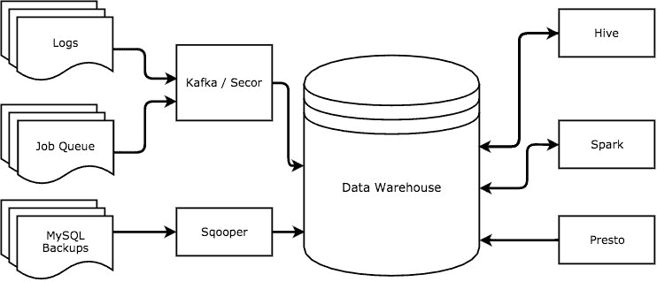
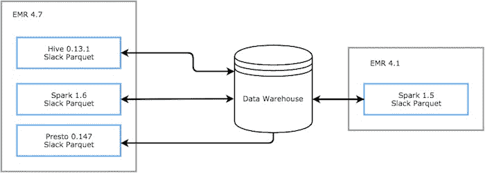

# 松弛-松弛工程中的数据争论

> 原文：<https://slack.engineering/data-wrangling-at-slack-f2e0ff633b69?utm_source=wanqu.co&utm_campaign=Wanqu+Daily&utm_medium=website>

对于 Slack 这样努力尽可能以数据驱动的公司来说，了解我们的用户如何使用我们的产品是至关重要的。

Slack 的数据工程团队致力于提供一个生态系统，帮助公司员工快速轻松地回答有关使用的问题，以便他们可以做出更好的数据知情决策:“*根据团队在第一周内的活动，它升级为付费团队的概率是多少？*或*最新发布的桌面应用程序对性能有何影响*

## 梦想

当我们开始构建这个系统时，我们知道我们需要灵活地选择工具来处理和分析我们的数据。有时被问的问题涉及少量数据，我们想要一种*快速、交互*的方式来探索结果。其他时候，我们在更长的时间序列上运行*大型聚合*，我们需要一个能够处理大量数据并帮助将计算分布到整个集群的系统。我们的每个工具都将针对特定的用例进行优化，它们都需要作为一个集成的系统一起工作。

我们设计了一个系统，在这个系统中，我们所有的处理引擎都可以访问我们的数据仓库，并且能够写回数据仓库。只要我们选择共享数据格式，我们的计划看起来就足够简单了，但是随着时间的推移，我们遇到了越来越多的不一致，挑战了我们的假设。

## 设置

我们的中央数据仓库托管在亚马逊 S3 上，可以通过三个主要工具查询数据: [Hive](https://hive.apache.org/) *，* [Presto](https://prestodb.io/) 和[Spark](http://spark.apache.org/) 。

为了帮助我们跟踪我们想要的所有指标，我们从 MySQL 数据库、服务器、客户端和作业队列中收集数据，并将它们全部推送到 S3。我们使用一个名为 Sqooper 的内部工具来抓取我们的日常 MySQL 备份，并将表导出到我们的数据仓库。我们所有的其他数据都被发送到 [Kafka，](https://kafka.apache.org/)一个可扩展的、只附加的消息日志，然后使用一个叫做 [Secor](https://github.com/pinterest/secor) 的工具持久保存到 S3。



对于计算，我们使用亚马逊的弹性 MapReduce(EMR)服务来创建临时集群，这些集群预先配置了我们使用的所有三种服务。

**Presto** 是一个针对交互式查询而优化的分布式 SQL 查询引擎。这是一种快速的方式来回答特别的问题，验证数据假设，探索更小的数据集，创建可视化，并将其用于一些内部工具，在这些情况下，我们不需要非常低的延迟。

当处理更大的数据集或更长的时间序列数据时，我们使用 **Hive** *，*，因为它隐式地将类似 SQL 的查询转换为 MapReduce 作业。Hive 可以处理更大的连接，并对阶段故障具有容错能力，我们的 ETL 管道中的大多数作业都是这样编写的。

Spark 是一个数据处理框架，它允许我们编写更加高效和健壮的批处理和聚合作业，因为我们可以使用更具表现力的语言，而不是类似 SQL 的查询。Spark 还允许我们在内存中缓存数据，以提高计算效率。我们在 Scala 中编写大部分 Spark 管道来执行重复数据删除，并编写所有核心管道。

## **把所有东西绑在一起**

我们如何确保所有这些工具能够安全地相互交互？

为了将所有这些分析引擎绑定在一起，我们使用 [Thrift](https://thrift.apache.org/) 来定义我们的数据，这允许我们实施类型化模式并拥有结构化数据。我们使用 [Parquet](https://parquet.apache.org/) 存储文件，它以列格式格式化和存储数据。我们的三个处理引擎都支持 Parquet，它在查询和空间效率方面提供了很多优势。

由于我们在多个地方处理数据，我们需要确保我们的系统总是知道最新的模式，因此我们依赖 [Hive Metastore](https://cwiki.apache.org/confluence/display/Hive/Design#Design-Metastore) 作为我们的数据及其模式的基础。

```
CREATE TABLE IF NOT EXISTS server_logs(
  team_id BIGINT,
  user_id BIGINT,
  visitor_id STRING,
  user_agent MAP<STRING, STRING>,
  api_call_method STRING,
  api_call_ok BOOLEAN 
)
PARTITIONED BY (year INT, month INT, day INT, hour INT)
STORED AS PARQUET
LOCATION 's3://data/server_logs'
```

Presto 和 Spark 都有 Hive 连接器，允许它们访问 Hive Metastore 来读取表，我们的 Spark 管道随着数据的发展动态地添加分区和修改模式。

有了共享的文件格式和单一的表元数据来源，我们应该能够选择任何工具，毫无问题地从一个公共池中读取或写入数据。在我们的梦想中，我们的数据被很好地定义和结构化，我们可以随着数据需求的发展而发展我们的模式。不幸的是，我们的现实要比这微妙得多。

## **通信故障**

我们使用的所有三个处理引擎都附带了库，使它们能够读写 Parquet 格式。使用共享文件格式管理所有三个引擎的互操作听起来可能相对简单，但并不是所有的东西都以相同的方式处理 Parquet，当试图读取数据时，这些微小的差异可能会造成大麻烦。


在幕后，Hive、Spark 和 Presto 实际上使用的是不同版本的 Parquet 库，并修补了不同的 bug 子集，这并不一定保持向后兼容性。我们在 EMR 方面最大的困难之一是，它附带了一个定制版本的 Hive，该版本是从一个缺少重要 bug 修复的旧版本派生而来的。

这实际上意味着，您使用其中一种工具编写的数据可能无法被其他工具读取，或者更糟的是，您可能编写的数据被其他工具以错误的方式读取。以下是我们遇到的一些示例问题:

### 数据缺失

我们在不同的 Parquet 库之间发现的最大差异之一是每个库处理数据缺失的方式。

在 Hive 0.13 中，当您使用 use Parquet 时，字段中的空值将引发 NullPointerException。但是支持可选字段并不是唯一的问题。如果不存在非空值，加载数据的方式会将空值块(本身无害)变成错误( [PARQUET-136)](https://issues.apache.org/jira/browse/PARQUET-136) 。

在 Presto 0.147 中，复杂的结构让我们发现了一系列不同的问题——我们看到当映射或列表的键为空时抛出异常。该问题已在 Hive 中修复，但未移植到 Presto 依赖项( [HIVE-11625](https://issues.apache.org/jira/browse/HIVE-11625) )中。

为了防止这些问题，我们在写入 Parquet 文件之前对数据进行清理，这样我们就可以安全地执行查找。

### 图式进化的烦恼

不兼容的另一个主要原因是模式和文件格式的变化。Parquet 文件格式在每个文件中都定义了一个基于现有列的模式。每个配置单元表也有一个模式，该表中的每个分区都有自己的模式。为了正确读取数据，所有三种模式都需要一致。

当我们需要发展定制的数据结构时，这就成了一个问题，因为旧的数据文件和分区仍然有原始的模式。通过添加或删除字段来改变数据结构会导致新旧数据分区的列出现不同的偏移量，从而引发错误。进行完整的更新需要重新序列化所有旧数据文件并更新所有旧分区。为了避免对每个模式更新进行完全重写的时间和计算成本，我们转移到一个扁平的数据结构，其中新的字段作为单独的列附加到模式的末尾。

这些会杀死正在运行的作业的错误没有看不见的失败危险，比如数据出现在不正确的列中。默认情况下，Presto 设置使用列位置来访问 Parquet 文件中的数据，而 Hive 使用列名。这意味着 Hive 支持创建 Parquet 文件模式和表模式列顺序不同的表，但是 Presto 将读取那些数据出现在不同列的表！

```
File schema:
"fields": [{"name":"user_id","type":"long"},
           {"name":"server_name","type":"string"},
           {"name":"experiment_name", "type":"string"}]

Table schema:
(user_id BIGINT, experiment_name STRING, server_name STRING)
----------------- Hive ------------------
user_id    experiment_name    server_name
  1             test1           slack-1
  2             test1           slack-2
---------------- Presto -----------------
user_id    experiment_name    server_name
  1            slack-1          test1
  2            slack-2          test1
```

这是一个很简单的问题，可以通过配置更改来避免或修复，但如果不检查，很容易被发现。

### 升级 EMR

升级版本是一个机会，可以修复之前提出的所有变通办法。但是深思熟虑地做这件事是非常重要的。当我们升级 EMR 版本来解决 bug 或获得性能改进时，我们也冒着交换一组与另一组不兼容的风险。当库升级时，期望新的库与旧的版本兼容，但是实现中的变化并不总是允许旧的版本读取升级的版本。

在升级我们的集群时，我们必须始终确保我们使用的分析引擎所使用的 Parquet 库彼此兼容，并且与我们集群上这些引擎的每个运行版本兼容。最近一个测试集群测试了 Spark 的新版本，结果导致 Presto 无法读取某些数据类型。

这导致我们被锁定在某些版本中，直到我们实现了所有兼容性问题的解决方案，这使得集群升级成为一个非常可怕的命题。更糟糕的是，当升级使我们的旧工作区变得不必要时，我们仍然需要做出艰难的决定。对于我们移除的每一个变通方法，我们都必须决定是回填我们的数据来移除黑客攻击更有效，还是使其永久化来保持向后兼容性更有效。我们如何让这个过程变得更容易？

## 共同的语言

为了解决其中一些问题，并使我们能够安全地执行升级，我们编写了自己的 Hive InputFormat 和 Parquet OutputFormat，以将我们的文件编码和解码固定到特定版本。通过在内部控制我们的序列化和反序列化，我们可以安全地使用现成的集群来运行我们的工具，而不用担心无法读取我们自己的数据。



这些格式本质上是正式版本的分支，它在不同的版本中引入了错误修复。

## 最后的想法

因为我们使用的各种分析引擎对值的序列化和反序列化有细微的不同要求，所以我们编写的数据必须符合所有这些要求，以便我们读取和处理它。为了保留使用所有这些工具的能力，我们最终限制了自己，只为共享的特性子集构建。

将对这些库的控制转移到我们拥有和维护的包中，使我们能够消除许多读/写错误，但确保我们考虑了文件和模式随时间演变的所有常见和不常见的方式仍然很重要。我们在数据工程团队中最大的挑战不是围绕着写代码，而是围绕着理解我们使用的系统之间的差异。正如您所看到的，当涉及到互操作性时，这些看似很小的差异会导致很大的麻烦。我们在数据团队的工作是更深入地了解我们的工具如何相互作用，这样我们就可以更好地预测如何构建、测试和发展我们的数据管道。

如果你想帮助我们让 Slack 每天变得更好，请查看我们的职位空缺页面并申请。[立即申请](https://slack.com/jobs/)