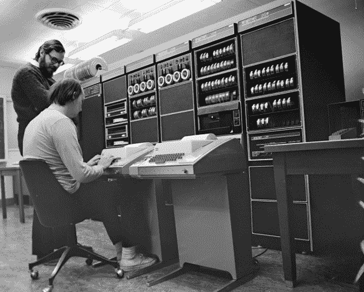

# 是什么造就了一个高级软件开发人员？

> 原文：<http://blog.professorbeekums.com/2016/12/what-makes-senior-software-developer.html?utm_source=wanqu.co&utm_campaign=Wanqu+Daily&utm_medium=website>

**UPDATE 2017-01-01:** This post has a [follow up](/2017/01/follow-up-on-what-makes-senior-software.html).

Most engineering organizations will have to answer the question: “What makes a software developer a senior developer?” This is a challenging question because it is extremely subjective. Search for the answer on the internet and you will get many different answers. Some will contain criteria that are also subjective themselves which adds additional difficulty to the question.

What makes the question even harder to answer is that some companies don’t really care. The senior title is **extremely easy to hand out** because it does not require a change in the reporting structure for the organization. That makes it useful to hand out when recruiting.

“Oh this other company is offering you 20% more money? Well, we will **give you a senior title instead!**”

On that same line, a company may also be able to get away with giving smaller raises if they hand out the title.

“We can’t afford to give you as much, but **you’re seeing rapid career growth!**”

This is in contrast with companies that do care and have a high bar for developers with the senior title. These companies want to make the title meaningful. **It should go to great developers** in recognition for the value they bring.

While that is a worthy goal, it still leaves us with the challenge of figuring out how to answer the question of what makes a senior software developer.

There is the “This person is doing a great job! Time for a promotion” approach. It’s easy to do because it’s simple. You follow your gut. The problem is that this approach can be prone to favoritism.

“This person is fun to hang out with! Their work is also really awesome. Time for a promotion.”

Even if there is no favoritism, this approach can lead to the **appearance of favoritism**. There could be someone else who thinks they are just as good as the developer who gets a promotion. If you’re unlucky, they will let their feelings swell up and eventually quit. If you are lucky, they will come and talk to you about why they didn’t get the promotion. At that point you have to have a better answer than “Oh you’re just not good enough yet.”

This leads us to the polar opposite of the follow your gut approach: creating a checklist.

Having a checklist of criteria can make it seem very easy to answer why one person got a promotion, but another did not. It also provides a map for someone who wants the promotion to get there.

There are many problems with the checklist though. The first is: if you were tasked with building a checklist, **would you stop at 2-3 items?**

Probably not. When we start building a checklist, we feel the need to fill it with things. Even if 2-3 items was appropriate, a short checklist is a sad looking checklist. If we get stuck at 2-3 items, we will start trying to find things to put down for the sake of putting them down and making our checklist look fuller.

This can lead to misplaced incentives. For example, let’s say you have “mentoring” on your checklist for a senior developer. We all know that being an expert in something does not mean that the expert has the ability to teach that topic effectively. What if your developer was phenomenal in everything else on your checklist EXCEPT mentoring? Would you stop their career progression for one item? Would you make them take time out from improving their other skillsets so that they can check off one thing on your list? That may not be the best way to bring value to a company, especially if you already have great mentors in your organization.

The other problem with checklists is that they only work well if you have quantifiable metrics for being a senior developer. There are no good quantifiable measures for being a good developer though. Lines of code written doesn’t work. Number of bugs fixed doesn’t work. Number of hours worked definitely doesn’t work. **Every measure of a good developer is qualitative.** That makes them all subjective. That makes the checklist no better than following your gut. In fact it’s actually worse because the checklist creates overhead in people spending their time building it and trying to follow it. Neither will bring value to a company.

I once had the pleasure of arguing for the promotion of a developer on my team. The reason I did this was because I noticed one day that for some reason I was much less stressed at work. That reason was because I had a much lighter workload. I didn’t need to scrutinize code reviews as much as I once did. I didn’t need to approve as many decisions as I once did. I didn’t need to handle as many issues resulting from my team’s work as I once did.

I didn’t need to do these things because this developer had improved his abilities significantly. His code quality was much higher. His reviews of *other* developers’ code was much better. Instead of reviewing every pull request, I only needed to review the pull requests that he had not already reviewed. And most importantly, he would move forward with projects if I wasn’t available. Sure he would still confirm things with me when possible, but the lack of my approval would not stop him from making progress.

There was a time where very little would get done if I took a vacation. When that stopped happening is when I knew this developer had become a senior developer, at least in abilities if not yet in title.

To me, what makes a senior developer is when you can trust them to get things done without you.

That criteria is still extremely subjective and very similar to the approach of following your gut. I could argue that it at least gives you a foundation for pointing at examples: “this was a great code review” or “that project was well handled”. Yet, those are still very subjective. You are still left open to the **perception of favoritism.** I’m not entirely sure there is any way around that.

If you have any thoughts to add on what makes a senior developer, I would love to [hear from you](https://professorbeekums.com/contact)!

**UPDATE 2017-01-01:** This post has a [follow up](/2017/01/follow-up-on-what-makes-senior-software.html).

**Hi there! I hope you enjoyed this post.**

如果你有，我会很感激你花时间看看我的产品:

[**Dynomantle**](https://www.dynomantle.com)

你是否为整理笔记、成千上万的书签、电子邮件或其他数字材料而苦恼？你会因为无法复制“生产力大师”的习惯而感到难受吗？

Dynomantle 可以提供帮助。这是一种知识管理工具，旨在与您现有的习惯相结合。你不需要新习惯。Dynomantle 围绕着你工作，而不是让你强迫自己围绕着一个工具工作。

[Signup for free!](https://www.dynomantle.com)