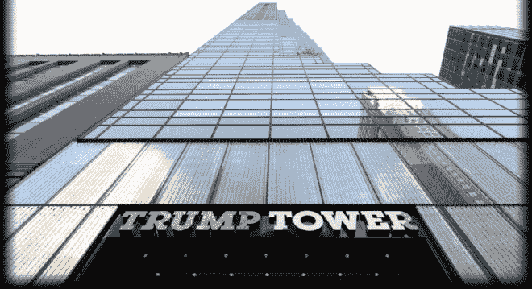

# 新公司换班|他们必须走吗？

> 原文：<https://shift.newco.co/why-they-sort-of-have-to-go-77535544d2bd?utm_source=wanqu.co&utm_campaign=Wanqu+Daily&utm_medium=website>

<noscript></noscript>

T4】

卡拉·斯威舍(Kara Swisher)写了一篇可靠而受欢迎的帖子，感叹我们的科技公民同胞本周将痛苦地参观邪恶的特朗普大厦。

> 虽然人们希望进行实质性的讨论，但我很清楚，这只会是媒体饱和的极客真人秀插曲，其中真正的亿万富翁在特朗普大厦(Trump Tower)走着跪倒的 gantlet，并且因为如此容易地放弃他们的尊严而一无所获。

她是对的。他们什么也得不到。通过参加会议，他们将不得不吞下他们的价值观，他们将有助于进一步使特朗普合法化。

克里斯·萨卡肯定是对的，他说:

> 如果特朗普公开承诺拥抱科学，停止威胁审查互联网，拒绝假新闻，并谴责对我们多样化员工的仇恨，只有到那时，科技领袖参观特朗普大厦才有意义……否则，他们正被用来合法化法西斯主义。

我也有同感。听我幸存的父母告诉我，特朗普的言辞和策略让他们想起了希特勒的上台，我可以向你保证，我永远不会参加特朗普大厦的会议。在地理上，我能找到的最近的地方就是几个街区外的汉密尔顿剧院。

但是将出席会议的高管们可能会觉得他们必须离开。这并不是因为他们对特朗普的不屑比我们这些科技行业的人少。(想想蒂姆·库克吧，一家已经受到特朗普攻击的公司的同性恋首席执行官，该公司建立在左海岸价值观的基础上，以前由一位叙利亚裔创始人领导，他正期待着这场狂欢呢？)这可能不是因为他们认为他们可以说服特朗普将他的一些观点转向他们的方向(阿尔·戈尔已经为他们挡了一枪)。

我怀疑他们会觉得必须参加这次会议，因为特朗普是当选总统，因此他们有一些爱国义务要履行。爱国是关于一个国家，而不是一个人。你可以很容易地辩称，抵制特朗普是这个时代最伟大的爱国行为。

不，他们觉得必须参加的原因是因为他们都经营上市公司。在过渡时期，特朗普向波音和洛克希德等公司发出推文，在这两种情况下，股票都立即下跌。

那些推文不是一个错误。如果你认为特朗普只是一些胡乱发推文的小丑，那你是在自欺欺人。这些都是权力游戏。这是一个职业商人在向曾经瞧不起他的首席执行官们树立影响力(因为欺骗、撒谎、自我膨胀等)。

科技公司首席执行官们感到额外被迫与特朗普“打交道”的原因，实际上比人们参加与当选总统会面的任何显而易见的原因都更可怕。他们担心，如果他们不听从他的意愿，他会故意采取行动惩罚他们的公司。这种担心是完全合理的，不像大多数与特朗普有关的事情，是基于事实的。

当我看到我所在行业的高层进入金特朗普大厦电梯时，我会感到恶心。但是，我的直觉告诉我，他们会这么做，因为他们觉得他们有责任维护股东价值。

我知道你在想什么:也许股东价值比股东价值更重要。也许他们应该表明立场。

但显而易见的事实是，任何 CEO 都不应该有两种选择:要么是你的价值观，要么是你公司的价值观。但这正是特朗普有意设置的场景。他的老导师罗伊·科恩会感到骄傲的。我们其他人应该担心。

戴夫·佩尔写道:一天中最引人入胜的新闻 **。**