# 表情符号是一种无声的语言符号，它的快速演变

> 原文：<https://nymag.com/daily/intelligencer/2014/11/emojis-rapid-evolution.html?utm_source=wanqu.co&utm_campaign=Wanqu+Daily&utm_medium=website>

 无言之舌的快速进化。

~

考虑一下波浪号。就是它，那个小小的曲线，挂在你电脑键盘的左上角。这个符号可以追溯到古希腊，尽管*波浪号*来自西班牙语，在现代英语中它被用来表示数学中的“大约”(例如~30 年)或“等价”(x ~ y)。并且，根据文本分析公司 Luminoso 对网站 emojitracker 的[分析【the tilde 在 Twitter 上的使用被代表“快乐”的表情符号超过哪个长这样:。](http://blog.luminoso.com/2013/09/04/emoji-are-more-common-than-hyphens/)

欢乐表情符号——在表情百科网站[上也被称为“喜极而泣的脸”或“LOL 表情符号”(表情符号没有官方名称，只是用户创造的昵称)——在北美可以追溯到大约 2011 年，当时苹果在 iOS 5 中为 iPhone 提供了一个易于使用的表情键盘。也就是说，在短短的三年里，喜极而泣的脸打败了有 3000 年历史的罗非鱼。](http://emojipedia.org/face-with-tears-of-joy/)

这只是一个表情符号。如果我们把所有表情符号都算在一起——笑脸和带笑脸的脸和咧着嘴笑的脸和挤眉弄眼的脸和带心形眼睛的笑脸和接吻脸和闭眼接吻脸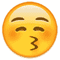和闭着眼睛吐舌头的脸， 更不用说有花园的房子和便利店和有轨电车和爱情旅馆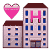和幽灵和有翅膀的钱和有上升趋势的图表和汉堡——那么表情符号作为一个群体，现在在 Twitter 上的使用频率比连字符或数字 5 更高。

所有这些都是在说:这个有 3000 年历史的 tilde 可能会考虑将自己重新命名为留着卷曲小胡子的隐形人。

我 很容易忽略表情符号。乍看之下，它们很可笑。他们是一个由面孔、车辆、旗帜、食物和符号组成的入侵性卡通大军，试图颠覆长达千年的文字统治。表情符号旨在说明，或者在某些情况下完全取代，我们以数字方式相互发送的词语，无论是在短信、电子邮件还是推特上。综合来看，表情符号看起来就像那些用来装饰他们的饲养员的泡泡贴的电子版。

然而，如果你有智能手机，表情符号现在可以作为一种可选的书面语言提供给你，就像任何全球语言一样，如阿拉伯语、加泰罗尼亚语、切诺基语、泰米尔语、藏语和英语。你会在你的 iPhone 上找到一个表情键盘，位于荷兰语和爱沙尼亚语之间。目前的集合被限制为 722 个符号——这些是被正式编码为 Unicode 的符号，Unicode 是一种国际编程标准，允许一个操作系统识别另一个操作系统的文本。(基本上，Unicode 是你从 iPhone 上发送的文本信息对于使用 Android 手机的人来说清晰可辨的原因，反之亦然。)今年夏天，[Unicode Consortium](http://www.unicode.org/)——一家总部位于美国的非营利组织，拥有一个品钦 ian 名称，负责管理 Unicode 的一切事务— [宣布，将在现有的表情符号集中添加 250 多个新的表情符号](http://nymag.com/thecut/2014/06/250-new-emoji-are-coming-to-your-phone-in-july.html)。这些新表情符号的范围很广，从明显有用的像下雨的云和黑色太阳镜，到可疑有用的像伸出中指的反手，到坦率地说很奇怪的像西装男子漂浮。今年秋天，为了应对现有表情符号缺乏种族多样性的持续担忧——如果涉及人脸，大多数表情符号都被表示为模糊的高加索人——[Unicode 宣布，用户很快就可以选择将某些表情符号的肤色](http://nymag.com/thecut/2014/11/rejoice-emoji-realizes-nonwhite-people-exist.html)更改为菲茨帕特里克色阶(FitzPatrick scale)上的不同色调，这是“公认的皮肤病学标准”

对于表情符号爱好者来说，这是一个非常大的消息。这对你来说应该也是个大新闻。我们越来越多地通过屏幕相互交流。2010 年的一份皮尤报告显示，青少年相互发短信的频率超过了他们使用的任何其他交流方式，包括排在第三位的面对面交谈。如果你随便问一个人，尤其是一个 30 岁以下的人，波浪符号是什么，他很可能会茫然地盯着你。但是他很可能认出，并且理解，那张带着喜悦泪水的脸。

2013 年，在回答“你在信息应用中使用贴纸或表情符号吗？”74%的美国人和 82%的中国人[回答说他们有。(贴纸是一种*仿*表情符号——类似于*宋飞*表情符号或你在脸书上找到的“花生”字符——你可以使用某些应用程序发送，但不会被转化为 Unicode。)现在有超过 4.7 亿个快乐表情符号在 Twitter 上来回发送——这使得快乐表情符号成为 Twitter 上最受欢迎的表情符号(它倾向于与心脏争夺榜首)。情侣们已经成功地用表情符号相互求爱了。ISIS 的招募者在他们友好的、宣传 ISIS 的推文中使用表情符号。有人把碧昂斯的《沉醉在爱里》的歌曲长度](http://www.statista.com/statistics/301061/mobile-messaging-apps-sticker-emoji-usage/)[表情符号翻译视频](http://nymag.com/thecut/2014/03/this-drunk-in-love-emoji-video-is-a-dream.html)，有人把 R·凯利的《困在壁橱里》翻译成表情符号，还有人把《白鲸记》的全部内容*翻译成表情符号*(标题必然是 *[表情符号迪克](http://www.emojidick.com/)* )。目前正在开发的只有表情符号的社交网络不下三个: [Emojicate](http://emojicate.com/) 、 [Emoji.li](http://emojisites.com/) 和一个叫做 [Steven](https://steventheapp.com/) 的东西。网站[表情分析](http://emojinalysis.tumblr.com/)将追踪你最近使用的表情符号，以分析你的情绪状态。说唱歌手德雷克最近纹了一个名副其实的表情符号，取决于你问的是谁，意思是“祈祷之手”或“击掌”。(德雷克说祈祷手。“我同情 2014 年击掌庆祝的傻瓜，”他通过 Instagram 澄清道。)

这种意义的弹性是表情符号吸引力的一大部分，或许也是它的天才之处。事实证明，它们非常适合于那种情绪上的重担，因为书面语言往往笨拙、尴尬或有问题，特别是当它在小屏幕上转播，用我们的拇指实时敲击时。这些看似幼稚的漫画一眼就能认出来，这使得它们即使跨越语言障碍也能被理解。然而表情符号的含义——它们的秘密含义——一直在变化。

自从有了书面语言以来，解码图片作为交流的一部分一直是书面语言的基础。“事实上可以确定的是，”安德鲁·罗宾逊在《写作与剧本:一个非常简短的介绍》，中写道，“最早的文字符号以图画的形式开始了生命。”象形文字——也就是真实事物的图片，比如太阳的图画——是书面交流的最初元素，发现于美索不达米亚、埃及和中国。从象形文字，也就是字面上的表达，我们发展到了语标，也就是代表一个单词(例如$)的符号和表意文字，也就是代表一个想法或抽象概念的图片或符号。表意文字的现代例子包括普遍传达无障碍信息的轮椅上的人符号，以及人行横道上的红色手符号，它表示“停止”而不是“红色手”。

表情符号可以神奇地同时充当象形文字和表意文字。最直接的例子就是茄子表情符号。在一个层面上，它看起来像一个茄子，可以用来交流“茄子”在另一个层面上，它看起来(有点)像阴茎，可以用来传达各种各样的淫荡意图，尤其是和桃子结合在一起的时候。正如纽约*时报*科技记者詹娜·沃瑟姆[在为*妇女杂志*的表情符号专刊撰写的一篇关于表情符号的文章](http://issuu.com/lindseyweber5/docs/emoji_by_womanzine)中所说，表情符号“已经成为一种不断进化的密码语言，随着我们与谁交谈以及何时交谈而变化。”简而言之，表情符号是一种由每个人都已经直观理解的符号组成的秘密代码语言。

“说到基于文本的交流，我们还是婴儿，”泰勒·施诺贝伦解释道，他是斯坦福大学的语言学博士，在文本分析公司 Idibon 工作。正如他所说，我们已经学会了说话，我们已经学会了写作，但我们现在只是在以说话的速度(即文本)学习写作，在广阔的范围内发送信息，缺乏任何物理上下文线索。如果你和某人面对面交谈，你不需要额外的单词或符号来表达“我在微笑”，因为你可能会微笑。心理学家艾伯特·梅拉比安(Albert Mehrabian)在一项经常被引用(偶尔被批评)的研究中指出，20 世纪 50 年代，只有 7%的交流是口头的(我们说什么)，而 38%是口头的(我们怎么说)，55%是非口头的(我们做什么以及我们说话时的样子)。这对于面对面的交流来说很好，但是当我们发短信时，93%的交流工具都被否定了。

输入表情符号。

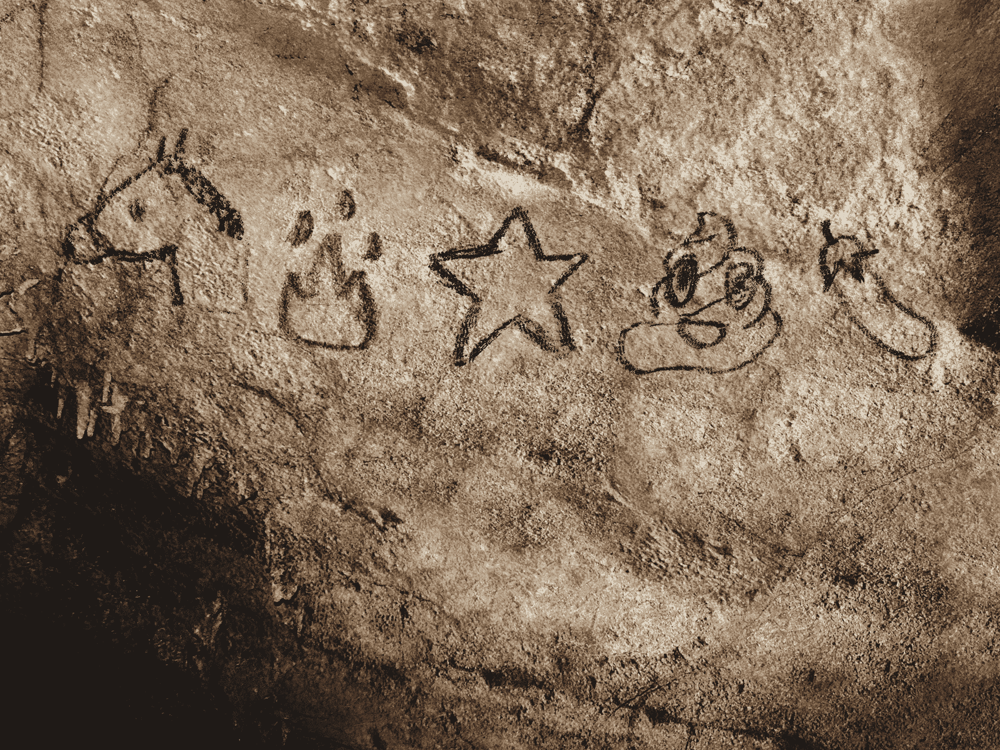

an ancient stallion’s journey

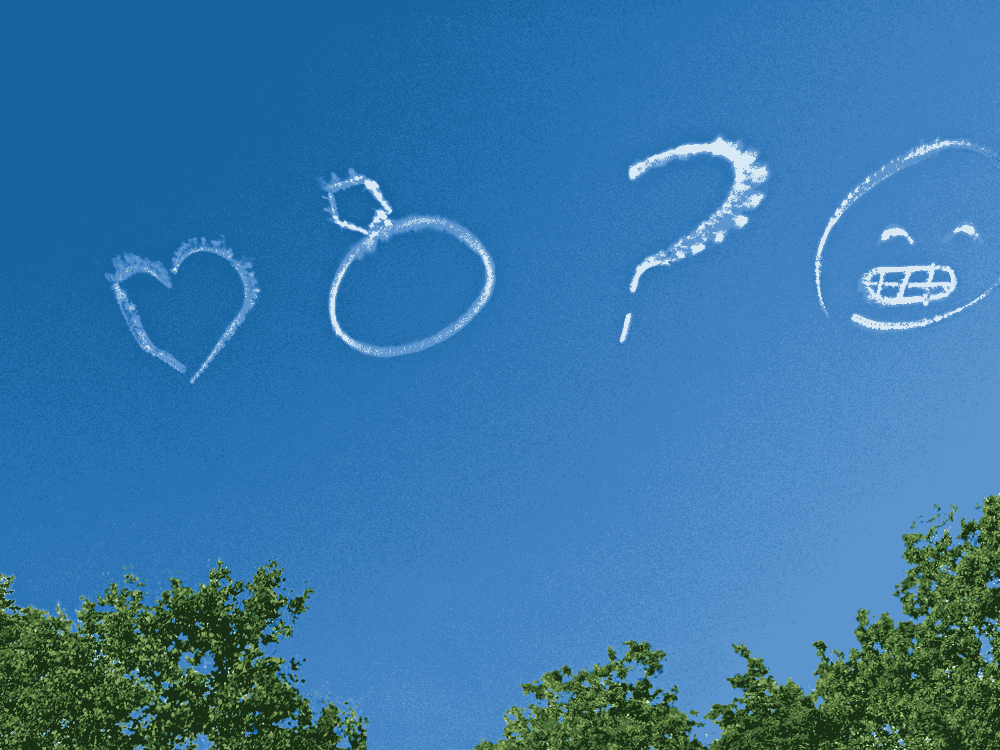

a marriage proposal Illustrations by Paul Sahre

莫吉出生于一个真正的灵光乍现的时刻，诞生于一个男人的脑海中:栗田茂高，日本电信公司 NTT Docomo 的一名员工。早在 20 世纪 90 年代末，该公司就在寻找一种方法，在一个非常紧张的市场中将其寻呼机服务与竞争对手区分开来。栗田想出了一个主意，将简单的卡通图像添加到其信息功能中，以吸引青少年。第一轮表情符号是由栗田设计的，使用铅笔和纸，在 12×12 像素的网格上绘制，灵感来自日本的图像资源，如日本漫画和汉字。

栗田最终创作了从笑脸到音符的 176 个原始符号。这一功能非常受欢迎，以至于其他日本电信公司都采用了它。2007 年，苹果发布了第一款 iPhone——全球智能手机市场繁荣起来。苹果和谷歌都意识到，为了打入日本市场，他们需要在自己的操作系统中提供表情符号功能，哪怕只是在日本使用。因此，苹果在 iPhone 中埋下了一个表情键盘，而北美人是不会发现它的。但最终，对日本表情符号现象感到好奇的美国精通技术的用户发现，你可以通过下载一个日语应用程序，迫使你的手机打开这个隐藏的键盘，瞧——突然你就可以用一堆微笑的便便来发短信了。

在北美人看来，有一些表情符号确实令人困惑，几乎所有这些表情符号都可以追溯到一些日本习俗或传统。例如，在日本，一堆便便被认为是好运。下面是日本《泰晤士报》给一位来自华盛顿州雷德蒙市的读者的解释，他在被成田机场出售的大量金色便便符咒迷惑后写道:“你看到的产品被称为 Kin no Unko(金色便便)，这个名字利用了一个事实，即日语中的便便(Unko)以同一个‘oon’音开头，是一个完全不相关的单词，意思是‘运气’。”日本人喜欢这种双关语——传统故事中充满了这种双关语——这可能有助于解释为什么在过去的七年里，《幸运的小负载》卖出了超过 250 万部。”(文章继续写道:“此外，在日本，与便便相关的崇拜有着悠久的历史……”)

"但是为什么这堆粪便在笑？"会是下一个合乎逻辑的问题。在我们回答这个问题之前，你可能想系好安全带，因为我们即将滑下一堆微笑的便便表情符号虫洞。

E 非常智能手机操作系统——苹果、安卓等。—每个表情符号都有自己的渲染，包括便便。安卓的便便堆被苍蝇和波浪线包围着，暗示着便便般的恶臭。苹果那堆便便睁大了眼睛在笑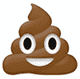。Twitter 的便便堆也有眼睛，但看起来有点惊讶，可能是因为它刚刚意识到这是一堆有眼睛的有知觉的便便。所以，如果你的便便堆在微笑，很可能是因为你有一部 iPhone，苹果公司的某个人认为让便便开心会很有趣。

每个操作系统背后的程序员可以随心所欲地设计他们的表情符号。然而，表情符号调色板——可供您使用的 722 个标准化表情符号的集合——已经由 Unicode Consortium 编码，该联盟成立于 1990 年，由一个松散的贡献成员网络组成。为 Unicode 工作的人往往是对语言学有兴趣的计算机编程专家——典型的传记:“他的爱好包括马耳他语宣传。”在某种程度上，他们是虔诚的僧侣的现代模拟，这些僧侣坐着勤奋地创作有照明的手稿，以便伟大的神学著作可以被广泛分享。

表情符号给 Unicode 带来了一个新的独特的困境。Unicode 副总裁彼得·康斯特布尔(Peter Constable)说:“对于大多数文本来说，你没有被发明的东西在左边、右边和中间。”。“英文字母就是英文字母。我们没有人每天发明新的英文字母。”然而，有了表情符号，新符号就有了无限的可能性，而且几乎不可能满足需求。所以，尽管事实上，在 2011 年，你可以给世界上任何一个人发一堆便便的卡通短信，但世界上的人并不快乐。世界想要一个表情热狗！还有一个表情符号鳄梨！可以理解的是，有色人种的代表！但是为了添加新的表情符号，Unicode 必须发明它们，然后设计它们，然后批准它们，然后编码它们。Unicode 不会发明或设计新的表情符号，也不会发明和设计新的英文字母并将它们添加到字母表中。

然而，Unicode 确实决定对今年夏天发布的 250 个新表情符号进行编码，一旦苹果、谷歌、微软和其他 Unicode 签署者将它们添加到他们的操作系统中，这些表情符号就会出现在你的手机上。(例如，苹果的 iOS 8 没有最新的表情符号，该公司拒绝就它们何时上线发表评论。)这些“新”表情符号实际上都不是新的——相反，新表情符号要么是对先前存在的 Wingdings 和 Webdings 字体集的翻译，要么是相当无聊的新符号，比如一直有用的增加字体大小符号。

<aside class="largeEmoji">Man In A Business Suit Levitating</aside>

不过，也有一些值得注意的新增内容，比如那个穿着西装的人漂浮(也被称为跳跃表情符号或悬停表情符号)，这是一个很好的例子，说明新表情符号的技术复杂路径如何导致完全怪异和随机的角色的存在。Wingdings 字体最初是由微软在 1990 年开发的，作为一种允许计算机用户将符号融入其文本的方式，包括诸如打开的文件夹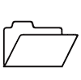和邮箱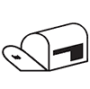这样的性感图标。随后的字体 Webdings 于 1997 年问世，允许在线使用类似的符号。在 Webdings 中，包含了一个不寻常的符号。由于缺乏更好的描述，这是一个穿着西装的人在漂浮。

互联网侦探对微软为什么决定加入这个特殊的令人费解的符号感到困惑，他们找到了 Webdings 的最初设计者之一，他解释说这个符号——取代了小写的*m*——是为了向 two Tone Records 的“rude boy”标志致敬，two Tone Records 是 ska 唱片公司，由特别节目中的一个人创立。现在，至少就你的 Unicode 智能手机而言，穿着西装的人漂浮是一个合法的字符，就像数字 5，字母 *A，*或波浪符号，或便便一样。那个人意味着什么——嗯，那完全取决于你。这就是表情符号的乐趣。在某些圈子里，画指甲的表情符号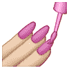已经意味着“我不介意”或者“讨厌的人会讨厌”身着西装的男子漂浮可能意味着“高兴得跳起来”，也可能意味着“神秘”(网上的投机者已经给它起了个绰号叫“黑衣人表情符号。”)正如沃瑟姆在解释她最喜欢的表情符号——天妇罗虾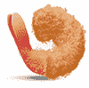时所说，她喜欢它的原因恰恰是它可以有许多不同的含义。有时她用它来表示一种不好的或“咸”的情绪，当她想像一只虾一样蜷缩起来的时候。和她的一些朋友一起，这只虾演变成了一个代表“玛丽亚·凯莉”的笑话。(“关于她的肤色和她总是被塞进筒状连衣裙的方式，”沃瑟姆在她的虾散文中写道。)其他人用虾作为“古怪的填充物”——点头、眨眼、承认你只是在想某人。她写道，天妇罗虾表情符号已经成为“一种在无话可说的时候在场的方式。”

考虑一下感叹号。在感叹号的大部分历史中，它有一个相当简单的用法:直截了当、真诚地表示兴奋，或者，如果包含在引语中，表示强烈或数量。(“滚出我的草坪！”而不是"滚出我的草坪")然而，在很长一段时间里，大约在 20 世纪 90 年代中期，从语言学和社会学的角度来看，我似乎可以单音地使用感叹号。我将把这个观察锚定到彼得·贝格的标志性垃圾文化漫画 *[恨！](http://www.peterbagge.com/)、*于 1990 年首次亮相，原名为*恨、*，但在 1994 年第 16 期的名字上加了一个警告性的惊叹号。我还要补充一点，根据我个人的回忆，如果你加上一句感叹句，比如“我太激动了！”或者“晚上见！”比如说，在 1999 年之前的任何书面电子通信中，你可以可靠地假设它会被解读为假笑的标点符号。

总之，这就是我们这一代人如何使用感叹号的。最近，随着推文和短信等新形式的出现，感叹号又回到了更接近其原意的位置。事实上，它或多或少地与句号交换了位置，以至于“我很高兴见到你！”现在传达见到你的真诚兴奋，而“见到你我很兴奋。”似乎，至少在屏幕上，暗示着相反的意思。根据本·雅戈达在《T2 时报》上发表的一篇文章，中的描述，曾经如此活泼有力的感叹号已经出现，表示“最低限度可接受的热情”

所有这些流动性意味着很难保持下去——这就是作家艾米丽·古尔德(Emily Gould)向一位朋友描述的“沟通风格的军备竞赛，这让我觉得有时只有一个感叹号似乎缺乏热情，甚至是彻头彻尾的讽刺。”她在某种程度上解释了自己对表情符号的吸引力——她写道，“我认为，表情符号让谈论任何事情都变得更容易！”

她的朋友菲比·康纳利给她发了一条关于订婚戒指的短信——一个令人担忧的话题。康奈利经常用表情符号来描述她的订婚:心脏，钻石，钻戒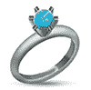，结婚蛋糕，派对开始者。(奇怪的是，没有戴面纱的新娘，这是最明显与婚礼相关的表情符号，她避免使用，原因她自己也不太清楚。)“表情符号，”康奈利[在一篇为*女性杂志*表情符号特刊撰写的文章中写道](http://www.toosexyandweird.com/08-emoji/)“在订婚的令人畏惧的快乐真诚中，给我一个讽刺的空间。我会表情符号钻戒；因此，是的，我有一枚钻石戒指是可以的。我默认使用表情符号，这是一种安全的隐语，作为讨论婚姻的一种方式，我在情感上已经准备好了，但仍然缺乏语言来描述。”

当我第一次遇到表情符号时，我以为它们只是用来讽刺的——也许是因为，作为 X 一代的一员，我习惯于把讽刺作为一种默认的交流方式。毫无疑问，表情符号很受欢迎，这并不奇怪，它受到早期采用者、技术迷恋者和对潮流敏感的人的欢迎——例如，这些人可能会下载一款日本应用程序，“强迫”他们的 iPhone 显示隐藏的表情键盘。但事实证明，表情符号也很受我们当中最不懂技术、最具讽刺意味的人的欢迎，也就是我们的父母。我采访的许多人转述说，他们的妈妈是他们所知道的表情符号最热情的采纳者。一位女士说，她几乎每天都和母亲通过短信交流，几乎全部是由一串心形表情符号组成的。另一位有着 70 多岁母亲的女性向我透露，她母亲最近发了一条传达歉意的短信，后面是一个哭脸表情符号——这可能是她母亲向她表达过的最直白的情感。

现在，我们开始关注表情符号擅长什么——也许它们比语言本身做得更好，至少在混乱的网络世界中是这样。除了用笨拙的大拇指实时表达自己的普遍困难之外，当弯腰驼背坐在亮着的屏幕上，并且可能被 50 件其他事情分心，互联网是卑鄙的事实。网络广泛的匿名性给它的新生岁月打上了一种阴险的不文明的烙印，我们现在都无可奈何地接受了这一点。评论部分是一个注销。“巨魔”是一个新的不受欢迎的人类亚种。Twitter 是一个布满标签的战场。

但事实证明，表情符号并不是用来表达卑鄙的。首先，它们是卡通。现存的表情符号虽然在表达兴奋、快乐、困惑、迷惑甚至爱情方面非常有用，但在表达愤怒、嘲笑或仇恨方面却不太擅长。如果我们可以假定千禧一代是在数字环境中长大的——这是他们第一次将数字关系作为一种同样合法、在某种程度上占主导地位的人际互动形式——那么他们可能会被一种沟通工具所吸引，这是显而易见的，这种工具可以消除周围的不文明行为。他们可能特别容易接受，甚至对一种抵消网络世界严酷生活的工具感到兴奋。他们可能会用表情符号拍照。

在很多对话中，很多人多次提到表情符号，这个词就是*软化。*

语言学专家泰勒·施诺贝伦说:“它的作用是软化事物。”。

“我一直在个人邮件中使用表情符号，因为我觉得我在软化邮件，”秃鹫的林赛·韦伯说，他是“表情符号”艺术展的联合策划人。

20 多岁的爱丽丝·罗伯在*的《新共和》杂志*上撰文，讲述了通过短信向一位即将穿越美国的朋友道别的经历。“我给她发了一个哭脸的表情符号。她回复了一个张开双臂的小鸡形象。这种交流可能是真诚的。这本来是很讽刺的。我还是不太确定。这位朋友和我可能在情感上特别迟钝，但我至少把部分责任归咎于表情符号:它们让我们不用说什么就能交流，让我们不用说出任何实际的情感。”然而，令人惊讶的是，她的整个故事充满了真实的情感——她的朋友要走了，她无疑很难过，她的朋友要走了，她无疑也很难过。给一条信息添加表情符号并不会削弱这些情绪(就像讽刺一样)，而是说，“我是认真的，但很难说出来，我知道这很难，但这并不减少它的真实性。”表情符号的默认含义不是讽刺；它的默认是真诚，但真诚是自知的。如果说具有讽刺意味的感叹号是 X 一代的标志性标点符号，那么表情符号——试图弥合我们的感受和我们的意图以及我们的话语和我们的文本之间的困难差距——就是千禧一代的标志性标点符号。

“表情符号真的没有负面或负面的意思，”韦伯说。“没有暴力或攻击性的表情符号。连生气的脸都是爆笑或者傻乎乎的。”当然，有手枪表情符号。但是想象一下用手枪和怒脸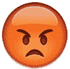 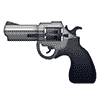发出死亡威胁。如果有可能“软化”死亡威胁，表情符号就能做到。

坦率地说，这很奇怪，在一个不断被指责过度攻击和恶意的网络环境中，表情符号没有内在的语言表达能力。有愤怒的脸，皱眉的脸和拇指朝下的脸，甚至还有所谓的没有好手势的脸，在苹果系列中，这是一个双臂交叉成 x 形的女人，但是，说真的，看看她: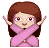。没有好姿态的脸，其实从来没有伤害过一个人的感情。作为 Unicode 7 的一部分，许多新的官方表情符号中有一个是凸起的中指——像所有新的表情符号一样，它只是因为是 Wingdings 字体的一部分而被添加的。乍一看，这似乎很粗暴，尤其是对一个表情符号来说。但作为一种攻击性的表达，它是无害的。如果网络流氓能做的最糟糕的事情是向你发送一串无休止的竖起中指的表情符号，我想我们都会同意我们将生活在一个更美好的世界。

用微笑的眼睛看待微笑的脸。现在，在推特上，微笑被使用了 157，439，872 次。就受欢迎程度而言，它排在第八位。下面是其他几个受欢迎的:品尝美食的脸。失望却释然。男女牵手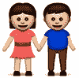。宝贝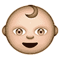。抛脸一吻。庆祝的人举起双手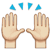。好的手势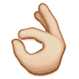。竖起大拇指。

1974 年，美国图形艺术研究所与美国运输部联合设计了一种新的符号系统[用于世界各地的机场，以应对全球旅行的增加。它想出的 34 个符号包括不可否认的弹性图标，如 Man Hailing Taxi、尿布婴儿和行李箱符号，这些符号仍然指引人们到世界各地的出租车站、换衣台和行李传送带。但设计委员会也做出了如下推论:“我们确信，符号的有效性是严格受限的。”他们发现，符号只能增加语言，而不能取代语言。](http://www.aiga.org/symbol-signs/)

带着微笑的眼睛的笑脸是我们语言中的一个永久的附加成分，这是不可能的；卡通笑脸可能是向某人传达“我很开心”的最简单的方式然而我们在这里。正如加州大学欧文分校的文化人类学家 Mimi Ito 解释的那样，“当人们被赋予以这些方式交流的能力时，他们就学会了这些方式，并发展了全新的文化形式。”

目前，表情符号完成了这项工作。我们比以往任何时候都更加联系在一起——伊藤称之为“无处不在的交流”——我们需要知道我们的联系没有被误解。我们需要让人们知道，即使是很远的人，盯着屏幕，我们也很快乐。或者迷茫。或者开玩笑。或者想念他们。尽管“快乐”这个符号很受欢迎，但表情符号并不仅仅被用来传达快乐。我的朋友(有一个发送哭泣表情符号的母亲)给我发了一个她喜欢的组合:咧着嘴笑的脸和微笑的眼睛，手枪指着头 。(合在一起，它们被解读为“压力”，这在纽约尤其有用。)我最喜欢的表情符号用法之一是，当我在网上问是否有人可以给我一个 MTV 上 VMAs 的表情符号评论时，有人发了一条推特，简单地说，一个锤子表情符号摆在一个电视机表情符号上。这是我能在任何地方找到的对该节目的最简洁和敏锐的评论，这表明表情符号作为一种有用的语言工具正在发挥作用。

在 Kickstarter 工作的弗雷德·本纳森对表情符号的未来更加乐观。他应该是:他是那个带头将整个《白鲸记》翻译成表情符号的人，部分是作为一个艺术项目，部分是为了看看他是否能做到。他还与哈佛大学的学者劳伦斯·莱斯格一起工作，他写了大量的文章，阐述了看似与政治无关的计算机编码如何影响我们的法律，甚至我们的人权。因此，贝纳森认识到，尽管表情符号被认为是短暂的，但它是语言的一个重要补充，尤其是现在我们在网上进行了如此多的交流。“表情符号在软件中可用的事实，使其作为人类表达的一种形式合法化，”他说。“尤其是现在，我们与这些设备如此亲密，我们以短信和社交媒体的形式向彼此讲述一些最引人注目的事情。”

换句话说，我们无意中发现了全新的令人困惑的交流方式，所以我们有了全新的词汇来表达“我在笑”，或者“快乐”，或者“做得好”这种新方法不会取代所有的旧方法，但它可以补充旧方法，帮助我们蒙混过关。当我们说这些事情的时候，我们没有能够读懂对方的表情，而是开发了这些代理人的脸。它们很简单。他们很傻。他们还没有玉米卷。但是它们至少有一点效果，至少现在是这样。我们互相飞吻。我们微笑着，眼里充满了爱心。我们喜极而泣。我们说“我爱你”，但有一百万种不同的方式，每一种方式都承载着我们热切希望传达的特定含义，然后满怀希望地发出去，就像瓶子里的笑脸，等待着被真正想要的人接收，打开，完全理解。

**本文发表在 2014 年 11 月 17 日的《纽约杂志》上。*