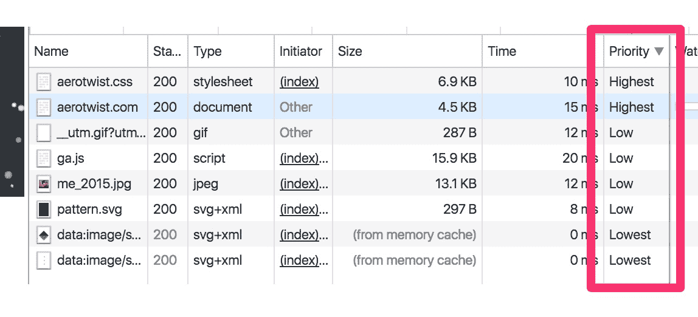
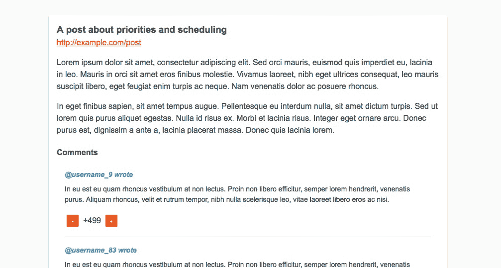
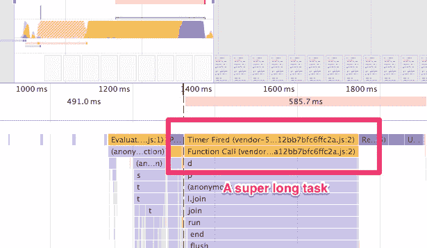
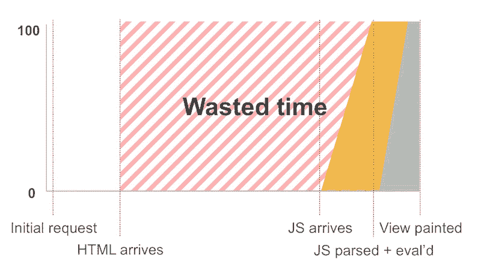
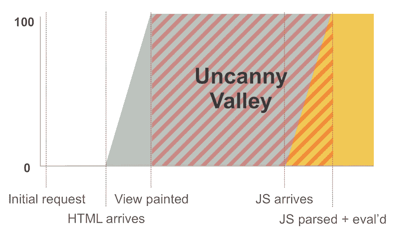
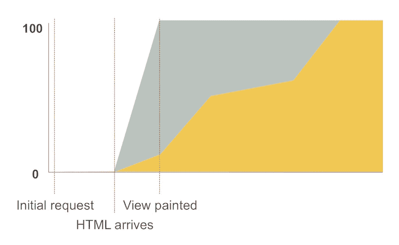
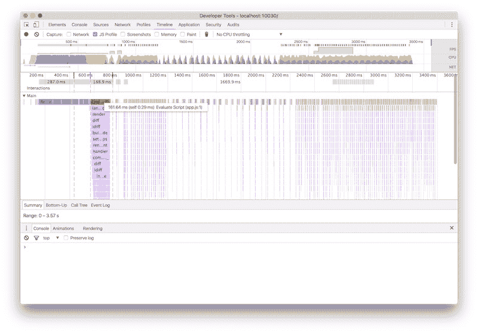

# Aerotwist -🌟当一切都很重要的时候，什么都不重要！🌟

> 原文：<https://aerotwist.com/blog/when-everything-is-important-nothing-is/?utm_source=wanqu.co&utm_campaign=Wanqu+Daily&utm_medium=website>

**更新 2016-12-12** :有些人对测试中的 SSR 代码不满意，因为它不是以惯用的方式生成的。首先，**我非常乐意[对代码](https://github.com/GoogleChrome/sample-framework-boot)采取 PRs 并相应地更新数字**；其次，我查阅了指南和教程，试图把它做好(以免有人认为我很懒)；第三，如果做好这件事需要成为专家，我认为学习网络平台可能是更好的投资；最后，SSR 与 CSR 的实际价值，在事情的计划中，相对较小:**这里的关键问题是库和框架不会产生主线程**，无论是 300 毫秒、3000 毫秒还是 30000 毫秒，都只是程度不同而已。

那件事完了，让我们继续吧！

* * *

我不知道你是否看过《超人特工队》,但如果你看过，你可能还记得那个坏蛋，综合症，他对超能先生说:“当每个人都超级棒的时候...没有人会。”最近，当我与 [Preact](https://preactjs.com/) 合作时，这种感觉又回来了。

首先，让我说我真的很喜欢 Preact。和 React(或任何其他基于 VDOM 的库/框架)一样，我完全理解函数式方法，并且我认为人机工程学非常好！(JSX 让我有点奇怪，但是 nbd。)我想澄清这个事实，因为上一次我发布关于框架的文章时，有些人觉得我过于挑剔，我还想说，我知道从事框架工作的人正在努力让世界变得更好。许多人奉献出大量业余时间，这样我们就不必写那么多代码。好吧，我不恨这里的任何人。好吗？酷毙了。

无论如何，当我看着 DevTools 的时间线记录时，我想知道的是*“Preact 认为什么是特别的？”*

> 浏览器非常擅长优先排序，主要是因为他们已经做了很多年了。

让我换一种方式来说:**浏览器非常擅长优先考虑**，很大程度上是因为他们已经做了很多年了。反过来，我们也学会了玩这个游戏:把`async`或`defer`放在你的脚本上，把脚本放在你的`<body>`的末尾，内联你的关键 CSS，延迟加载其余的，等等。我们给浏览器大量的提示(或者使用他们的优先级系统)来得到想要的结果。

如果你对 Chrome 如何看待优先级感兴趣，你可以在网络面板的请求列表中点击右键，添加优先级栏。看哪！优先级！

Chrome DevTools showing request priorities.

好吧，我说到哪了？是的，预先行动...其实这并不是 Preact 特有的。框架。图书馆。性能。

问题是这样的:*现代的库和框架在引导时区分组件的优先级吗？*一切都是“超级”的吗，使一切都正常化到最高优先级，或者我们在引导过程中看到了细微差别？为了回答这个问题，我觉得我们应该通过背景来定义几个相关指标:[第一次有意义的绘画](https://developers.google.com/web/tools/lighthouse/audits/first-meaningful-paint)(《FMP》)和[互动时间](https://developers.google.com/web/tools/lighthouse/audits/time-to-interactive)(《TTI》)。

### 第一幅有意义的画

FMP 是指我们在屏幕上看到有用的东西(这是人们真正想要使用的部分，而不仅仅是你的应用外壳)。大多数人建议使用服务器端渲染(SSR)来减少时间。毕竟，如果你在最初的响应中发送 HTML，你会比不发送的时候更快地得到结果。杰克在这方面做了很多研究，这就是 TL；博士

### 互动时间到了

TTI 一般翻译为*“如果有人试图与这个东西互动，它能做出反应吗？”*如果你查看 DevTools 的时间线追踪，你可以亲自观察。

First Meaningful Paint and Time to Interactive on a DevTools Timeline

我已经标记了我认为 FMP 和 TTI 在上面的时间线中的位置。如果你启用了截图功能，你可以找到你的 FMP，当主要内容显示出来时，你就会发现。当主线程中的一切都在后 JavaScript 时代平静下来时，TTI 就是一个典型的照看 FMP 的例子。

[Lighthouse 正在寻找自动捕捉这两个测量值的方法](https://github.com/GoogleChrome/lighthouse/)，所以如果你感兴趣的话，一定要去看看。

继续前进...

让我们想象一下，我正在构建一个 web 应用程序，它允许人们对一个故事进行评论。比如黑客新闻，或者 Reddit，我会用一个框架。对这些类型网站的快速调查显示，你可以看到有成千上万(有时是嵌套的)评论的帖子。

如果我们用 React、Preact、Vue、自定义元素和 Vanilla 制作一个这样的页面会怎么样？什么...如果...

(其实 Reddit 移动用的是 React，所以我说的也不算离谱。)

## 样本设置

My demo setup: a page which loads a lot of the same Comment component

这是我的设置:

*   故事梗概、标题和链接。
*   500 条评论。(我认为这是一个相对适度的统计，有些帖子很容易就达到数千个。)
*   每个评论都有上下投票按钮，至少需要调整分值。(无需根据分数重新排序评论。)

> 我的主要假设是，框架通常没有可以呈现给开发人员的优先级概念。

我的主要假设是，框架通常没有可以呈现给开发人员的优先级概念。如果这是真的，那么**我们将会看到一个单一的、可靠的任务，当 JavaScript 有效负载被交付时，它将锁定主线程**。为了好玩，我尝试给各种框架一个服务器端呈现的页面版本([像 FlipKart 做的那样](https://medium.com/@AdityaPunjani/building-flipkart-lite-a-progressive-web-app-2c211e641883#.cc57btnml))和客户端呈现的页面版本，看看 SSR 是否改变了数字。

我还添加了定制元素 1.0 和香草变种，看看它们是如何产生的。

让我们看看在一台运行 Chrome 的 3G 连接的 Moto G 上，这些数字是如何出来的。

### 服务器端呈现(“SSR”)-FMP 和 TTI

| 技术 | FMP 时间 | TTI 时间 |
| --- | --- | --- |
| 预测(7.1.0) | 2343 毫秒 | 4000 毫秒 |
| 反应(15.4.1) | 2746 毫秒 | 4850 毫秒 |
| Vue (2.1.4) | 2578 毫秒 | 4600 毫秒 |
| 余烬(2.10.0) | 不适用的 | 不适用的 |
| 自定义元素(1.0) | 2456 毫秒 | 2700 毫秒 |
| 香草 | 2610 毫秒 | 2610 毫秒 |

### 客户端渲染(“CSR”)-FMP 和 TTI

| 技术 | FMP 时间 | TTI 时间 |
| --- | --- | --- |
| 预测(7.1.0) | 3042 毫秒 | 3200 毫秒 |
| 反应(15.4.1) | 4701 毫秒 | 4701 毫秒 |
| Vue (2.1.4) | 3948 毫秒 | 3950 毫秒 |
| 余烬(2.10.0) | 10，180 毫秒 | 10，180 毫秒 |
| 自定义元素(1.0) | 1，897 毫秒 | 2900 毫秒 |
| 香草 | 1，824 毫秒 | 2700 毫秒 |

### 服务器端渲染脚本持续时间和组件安装时间

让我们看看在脚本中花费的时间。

*   **脚本持续时间:**脚本在启动时所花费的总时间。包括框架启动时间、解析、评估、编译和垃圾收集。
*   **挂载时间:**引导 500 个评论组件及其向上和向下投票按钮所花费的时间。

| 技术 | 脚本 dur。 | 挂载时间 |
| --- | --- | --- |
| 预测(7.1.0) | 1，028 毫秒 | 986.92 毫秒 |
| 反应(15.4.1) | 1，272 毫秒 | 1，219.10 毫秒 |
| Vue (2.1.4) | 1，436 毫秒 | 1，285.10 毫秒 |
| 余烬(2.10.0) | 不适用的 | 不适用的 |
| 自定义元素(1.0) | 204 毫秒 | 197.99 毫秒 |
| 香草 | 168 毫秒 | 156.83 毫秒 |

### 客户端渲染脚本持续时间和组件安装时间

| 技术 | 脚本 dur。 | 挂载时间 |
| --- | --- | --- |
| 预测(7.1.0) | 509 毫秒 | 504.55 毫秒 |
| 反应(15.4.1) | 1，183 毫秒 | 1139.70 毫秒 |
| Vue (2.1.4) | 1，295 毫秒 | 1，145.10 毫秒 |
| 余烬(2.10.0) | 5565 毫秒 | 3986.70 毫秒 |
| 自定义元素(1.0) | 564 毫秒 | 516.78 毫秒 |
| 香草 | 395 毫秒 | 362.10 毫秒 |

#### 注释、警告、免责声明、非小号字体、附带条款

以下是你需要记住这些结果的事情。

*   这些结果是中期结果。我可能犯了错误(尽管我试图避免这一点！)。如果你愿意，你可以在[的 GitHub repo](https://github.com/GoogleChrome/sample-framework-boot) 上查看我的代码。如果有需要解决的问题，我们就在这里聊天吧。
*   所有的测试都是在一台正常 3G 连接的 Moto G 上进行的。
*   根据主线程的设置和第一次有意义的绘制，TTI 被 WebPagetest 中的痕迹所吸引。
*   Ember 说快速启动水合作用还没有为生产做好准备，所以我认为不把它包括在 SSR 结果中更公平。
*   Polymer 2.0 对于 Custom Elements 1.0 来说是一个相当薄的包装，所以我认为不值得在这个测试中加入它。如果有强烈的愿望看到数字，我会考虑重新考虑。

## 结论

我们该如何看待这些结果？以下是我的高层次结论。

*   SSR 通常能让你更快地画出第一幅有意义的画。这对感知性能来说很好，但是对于虚拟地重新创建 DOM 的库/框架来说，TTI 似乎被推了回来，有时是很远。我猜把真正的 DOM 改造成 VDOM 比重新开始更昂贵？有点像继承某人的遗留代码！
*   **进行 SSR** 时，Preact 中的水合作用异常缓慢(慢约 2 倍)。我不完全确定这是为什么，但我已经[提交了一个问题](https://github.com/developit/preact/issues/445)，所以希望杰森·米勒和其他 Preact 乡亲将能够找到原因！
*   **当有多个`innerHTML`调用**时，Chrome 似乎更快。将工作分成多个`appendChild` / `innerHTML`调用似乎比从 SSR 中大量转储 HTML 要快。我发现这很令人惊讶！我以为浏览器会刷新得更频繁，但似乎不是。因此，对于定制元素和普通变体，当有相当多的东西要引导时，SSR 的表现似乎不如 CSR。
*   **即使南车打败 SSR，也要谨慎**。多想想上面这一点，如果 JavaScript 因为某种原因失败了，SSR 还是会给我们一些有人看得懂的内容。南车不会。这在很大程度上是一个个案考虑，因为有些人会说评论是不重要的内容，这对于新闻文章来说可能是正确的，但对于 Hacker News 或 Reddit 来说则完全不是这样，因为评论是由社区生成的。

### 主线程锁定

不管你同意还是不同意这个高层次的结论，有一点真的很重要，值得仔细研究:**组件启动时间**。

在所有情况下，安装组件的 JavaScript 同步运行，并用一个大任务阻塞主线程。如果你使用自定义元素，这甚至是真的，尽管我将试着展示一点，有一个或两个出口。

A DevTools timeline showing a single long task

这样锁主线程不好吗？我怎么强调都不为过:**是的！**

> 对于本地开发人员来说，锁定主线程是不可想象的，因为它对用户体验有很大的负面影响。

对于本地开发人员来说，锁定主线程是不可想象的，因为它对用户体验有很大的负面影响。当主线程被钉住时，您通常会看到:

*   **更少的 CPU 时间用于滚动和其他线程上的任务**。因为手机上的 CPU 被严格控制，长时间使用意味着没有时间做其他事情。[亚历克斯·罗素有一个关于为什么你的手机讨厌你的精彩演讲，你应该看看这个](https://www.youtube.com/watch?v=4bZvq3nodf4)。但这对用户体验来说是一件大事，因为我们锁定了手机。
*   **被钉住的 CPU**。当你锁定 CPU 时，你会更快地耗尽用户的电池。

### 可能的异议

我想在这一点上，可能有些人觉得这并不能代表他们的情况。

*   “我不是在制造 Reddit /黑客新闻。”当然。您可能没有，但是您可能会一次启动很多组件，这很可能意味着您锁定了主线程。
*   **“我的用户都在【此处插入高端手机】”**爽！这不一定是每个人的情况，也可能是因为如果它太重而无法很好地加载，那么功能不太强大的设备就会被排除在体验之外。
*   **“您可以使用[在此插入策略]来解决这个问题”**很有可能是这样，但是它们是您正在使用的框架或库的默认设置吗？如果你必须成为一个专家(或者倾向于那个方向)来不破坏用户体验，那么你肯定 a)更好地使用底层平台，b)说框架没有实现它让生活更容易的承诺？

## 三种引导模式

去年我制作了一些图形来解释我认为的三种主要的野外引导模式。人们问是否有博客文章来支持这一观点。这就是了...比我希望的晚了一点。

#### 客户端渲染又名 CSR

Rendering your app client-side.

在基于 JavaScript 的客户端呈现中，在呈现页面之前，需要下载、解析和评估脚本。从 HTML 到达到你给用户一些有意义的东西，这会浪费很多时间。

如果 JavaScript 失败了，你可能最终什么都不会给别人。

* * *

#### 服务器端渲染又名 SSR

Rendering your app server-side.

使用服务器端呈现，您可以向用户发送一个视图，但是在功能可用之前，您通常需要依赖 JavaScript 来完全启动。这可能会导致一个“恐怖谷”,在那里应用程序看起来是交互的，但实际上不是。

SSR 非常适合在屏幕上获得像素，但正如数据所暗示的那样，在某些情况下，它会增加启动的计算成本，这意味着它需要更长的时间来进行交互。

比起 CSR，我还是更喜欢这个，因为你向用户展示了一些东西，但是如果引导进程阻塞了主线程，那将是一个非常糟糕的体验。

* * *

#### 渐进引导又名渐进引导

Rendering your app progressively.

渐进式引导介于 CSR 和 SSR 之间。您在 HTML 中 SSR 了一个功能上可行的(尽管是最小的)视图，包括最小的 JavaScript 和 CSS。随着更多资源的到来，应用程序逐渐“解锁”功能。

> 然而，今天，渐进式引导是我们在大多数库和框架中不容易访问的行为。

这需要知道访问你的应用程序的人在那里做什么，以及确定启动顺序的适当策略。如果用户与您认为优先级较低的东西进行交互，您可能还需要一个重新确定优先级的策略。

### 用哪个？渐进引导。

看着上面的数据，我会说渐进式引导模型是最好的方法:**它使用 SSR 来获得更好的 FMP，但包含了最少的 JavaScript，所以我们不盯住主线程，使 TTI 更接近 FMP** 。然后，我们可以根据需要，或者在时间允许的情况下，启动应用程序的非必要部分。

然而，今天，渐进式引导是我们在大多数库和框架中不容易访问的行为。没有地方可以挂接组件引导。

简而言之:**一切都是特别的，所以没有什么是**。

## 平台式缓解

我们这里有一个平台级原语可以帮忙: [**`requestIdleCallback`**](https://developers.google.com/web/updates/2015/08/using-requestidlecallback) 。

我们可以使用`requestIdleCallback`将引导负载分散到几个任务上，浏览器将优先处理用户交互，而不是其他主线程代码，这正是我们在渐进引导世界中想要的。如果浏览器不支持`requestIdleCallback`，我们仍然可以立即调用组件引导，如果这是我们所需要的。如果我们不需要，为什么不在以后启动组件呢？

> 我们有一个平台级原语可以提供帮助:`requestIdleCallback`。

当谈到定制元素或普通元素时，我们已经有了控制权，可以自己将东西包装在`requestIdleCallback`中，或者甚至在尝试引导给定组件(或组件集)之前等待用户交互。但是我的目标实际上并不是“转变”任何人去使用定制元素或香草(尽管我发现对我来说，学习 Web 平台比任何特定的库、框架或工具都是更好的长期投资)。我更担心的是在链条末端的人，*我们为*打造的人，得到了最好的体验。

我希望看到 is 库和框架采用渐进引导模型，尤其是当我们向用户交付更多代码的时候。不是每个组件都是特殊的，开发者应该被给予控制来决定如何引导！

为了展示采用这种方法的影响，我[为 Preact 制作了一个使用 requestIdleCallback](https://github.com/developit/preact/pull/409) 的稻草人 PR。它把 TTI 缩短了 **6x** 。我知道制作 Preact 的杰森·米勒对这个领域非常感兴趣，我也希望其他人能加入进来。

Using requestIdleCallback in Preact to boot progressively.

## 收尾工作

优先级是一件大事。随着我们的应用程序变得越来越大越来越复杂，我们需要一些机制来处理这些问题。

> 我想我真正想说的是，我们需要从一个分分合合的组件世界转向一个有细微差别和优先级的世界。

我想我真正想说的是，我们需要从一个分分合合的世界走向一个有细微差别的世界，特别是有优先权的世界。web 已经可以支持它，浏览器已经为许多事情做了它自己，我们需要在我们的库和框架中启用它。

## 链接

测试结果已经过期，所以我已经删除了那些链接。

### 源代码

[GitHub 回购](https://github.com/GoogleChrome/sample-framework-boot)