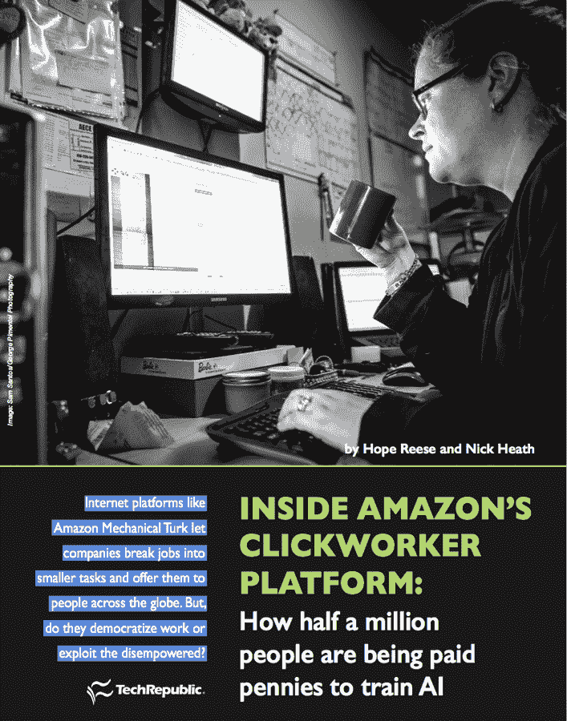
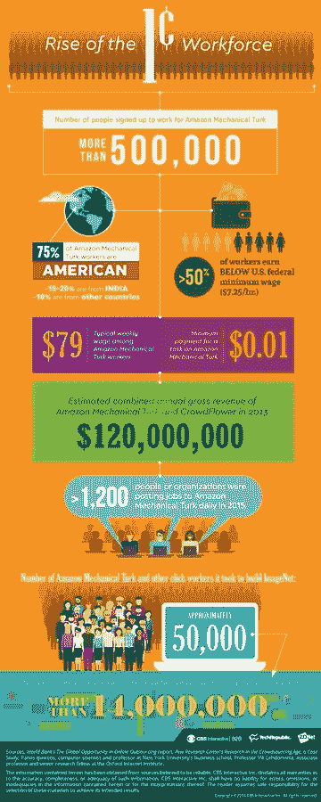
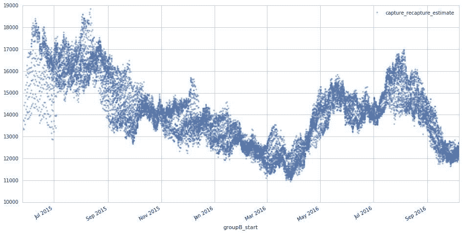
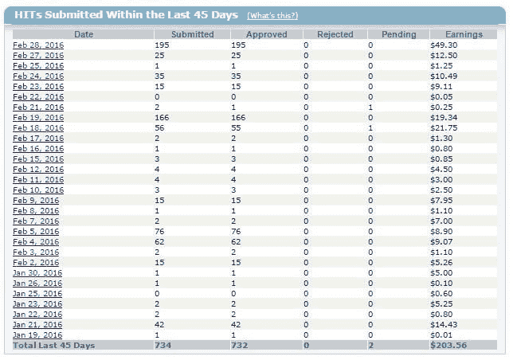

# 亚马逊 clickworker 平台内部:50 万人如何被支付一分钱来训练人工智能| TechRepublic

> 原文：<https://www.techrepublic.com/article/inside-amazons-clickworker-platform-how-half-a-million-people-are-training-ai-for-pennies-per-task/?utm_source=wanqu.co&utm_campaign=Wanqu+Daily&utm_medium=website>

每天早上醒来时，克里斯蒂·米兰德打开她在多伦多的家用电脑，登录亚马逊土耳其机械公司，等待她的电脑启动。

亚马逊机械土耳其公司(Amazon Mechanical Turk)已经存在了十多年，是一个在线平台，人们可以在这里有偿执行小任务。

米兰德正在寻找招聘信息，或者说“点击率”——当列表符合她的标准时，提醒就会告诉她。“警报每分钟响一次，”米兰德说。"在接受这份工作之前，我会停下手头的工作，看看它是否有好处。"

有时候，会发布一组点击量。“如果有一批来了，到了午饭时间，或者我有一个医生的预约，或者我的狗需要出去，”米兰德说，“我放下一切去做。我简直被拴在我的电脑上了。如果这就是你喂养孩子的方式，你就不要离开。”

她这样做了 11 年。

米兰德是 500，000 多名“Turkers”中的一员，这些“Turkers”是在亚马逊的数字平台上执行小任务的合同工，他们称之为“mTurk”。纽约大学商学院教授、计算机科学家帕诺斯·伊皮罗蒂斯(Panos Ipeirotis)表示，全球活跃员工的数量估计在每月 1.5 万至 2 万人之间。工人每天在任何地方工作几分钟到 24 小时不等。

谁是土耳其人？据 Ipeirotis 报道，2016 年 10 月，美国的土耳其人大多是女性。在印度，他们大多是男人。从全球来看，他们最有可能是 1980-1990 年间出生的人。大约 75%是美国人，大约 15-20%来自印度，其余 10%来自其他国家。

“请求者”——外包工作的人、企业和组织——为每项任务设定价格，而这些任务千差万别。它们包括但不限于:

*   数据分类
*   元数据标记
*   字符电子识别
*   数据输入
*   电子邮件收集
*   情感分析
*   视频广告投放

例如，米兰德最近的一项任务是转录一张收据的内容。根据米兰德的说法，要求这项工作的公司会将这些信息出售给强生、P&G 等公司的营销和研究部门。(这个特定任务的报酬是 3 美分。)

## AMT 的早期

米兰德称自己为数字土著。“我到了青春期，开始上网，”她说。米兰德说，她总是“在网上拉客”，利用易贝这样的平台赚取额外收入。因此，当她看到一篇关于亚马逊土耳其机械公司 2005 年推出时从事点击工作的机会的文章时，这似乎是一个完美的契合。

她说，在早期，米兰德认为这“更像是一次实验”，而不是真正的工作。但在 2008-2009 年的衰退期间，这种情况发生了变化。米兰德经营着一家日托中心，她不得不搬家，失去了收入。与此同时，她的丈夫失业了。她开始全职从事 AMT 的工作。对米兰德来说，这意味着一周七天，一天 17 小时。

“我们开始把它视为工作，”她说。“我们真的开始把它当成工作来质疑。”

## 

总部位于洛杉矶的 Rochelle LaPlante 自 2012 年以来一直致力于 AMT 多功能体适一体机的研究。拉普兰特同意米兰德的观点，认为这项工作是不可预测的。“你永远不知道工作什么时候会被公布，”她说。“可能是凌晨 3 点。而且上午 9 点绝对没事可做。”

“我不像有些人那样铁杆，”拉普兰特说，“因为我确实重视我的睡眠。”她说，其他人会发出警报。“如果一个请求者在凌晨 3 点发帖，他们的电脑会叮铃作响，他们的手机会叮铃作响，他们会起床去做那些工作。它完全控制了他们的一天。”

米兰德和拉普兰特都没有经历过“典型”的一天——主要是因为他们通常会为自己需要赚多少钱设定一个目标。正常情况下，拉普兰特可能工作八小时。“但这里是 10 分钟，那里是 20 分钟——这一切都是一起进行的，”她说。

那么，土耳其人平均能赚多少钱？很难说。但是印度的 Adrien Jabbour 说“每天工作 4-5 个小时，两个月就能挣 700 美元，这是一项成就。”米兰德报告说，她最近工作 8 小时赚了 25 美元，并称之为“美好的一天”根据皮尤研究中心的一项研究，超过一半的工人收入低于美国联邦最低工资标准 7.25 美元每小时。

拉普兰特谈到了她需要做出的艰难选择，在工作和生活之间周旋。“我必须决定:我是接受那份工作，还是去参加我的家庭晚宴？”

“对于靠这种东西生活的人来说，处于被驱逐的边缘，”她说，“这些决定很难做出。”

## 火鸡大师

对于那些在 AMT 上工作的人来说，有一个令人沮丧的现实:并不是所有的土耳其人都生来平等。

亚马逊的系统指定某些工人为“大师级”当一个新的请求者发布了一个点击，它会自动默认找到这个级别的 Turkers 这对请求者来说花费更多，对工作者来说支付更多。

如果你没有这个头衔，你有资格申请的工作会少得多。

米兰德说，3 月份的一个工作日，机械土耳其人上有 4911 个可用任务。她有资格获得其中的 393 项——只有 8%。

那么，一个人如何获得“硕士水平”的称号呢？没人知道。

米兰德见过不合格的人——那些完成任务数量少、支持率低、做假账或被停职的人——都获得了硕士学位。

“似乎没有任何韵或原因，”她说。

亚马逊不会透露他们达到这一水平的标准。(TechRepublic 联系了亚马逊请其置评，但在最初同意后，该公司后来拒绝就本文接受采访。)

关于如何达到硕士水平，Turker 论坛上流传着各种各样的理论。有时候会贴一批点击率，那一批上的高绩效者闯入大师级别。“这是一个在正确的时间出现在正确的地点的问题，”米兰德说。

除了主人的指定，你居住的地方也会使你失去从事某些工作的资格。例如，身在美国之外是一个障碍，因为许多请求者将他们的任务仅限于美国。

## 获得报酬

“没有两个土耳其人是一样的，”拉普兰特说。“有些人是为了基本收入，有些人只是用来玩钱。”

William Little 是 TurkerNation 的主持人，这是一个为来自加拿大安大略省的 Turkers 提供服务的在线社区。他用 AMT 赚外快。利特尔的目标是每天工作三小时挣 15 美元。“大多数时候，我都能做到，”他说，“这比别人一开始就做到要好。”

然而，支付过程对许多土耳其人来说是一个主要问题。

目前，只有美国和印度的土耳其人接受现金支付。所有其他的，包括加拿大的米兰德和利特尔，都是通过亚马逊礼品卡支付的。

利特尔将开车 45 分钟到一家美国边境商店，在那里他可以从亚马逊获得免费送货，以领取他的包裹。对于那些真正需要现金的人来说，也有变通办法——尽管它们大多涉及亏损。例如，不同的网站，如 purse.io，可以将亚马逊礼品卡转换成比特币。

“你把你的‘愿望清单’贴在了钱包上。io .我看到那个清单，然后说‘我会为了希望而买它。’“我购买了产品，并运送给你，”利特尔说比特币由第三方保管。当你收到产品，我收到比特币。"

然后，利特尔可以出售比特币，通过贝宝(PayPal)接收现金，并将其转移到他的银行。“我在这笔交易中损失了两次，”他说。“真的不值得。”

另一个问题？无偿劳动。一份工作可能会毫无理由地被拒绝。除此之外，土耳其人经常花时间评估一份工作是否好。搜索，查找请求者。加载脚本，添加工具，检查统计数据。

[**下载本文为 PDF 格式(需要免费注册)。**T3】](http://www.techrepublic.com/resource-library/downloads/inside-amazon-s-clickworker-platform-how-half-a-million-people-are-being-paid-pennies-to-train-ai-pdf-download/)

## 机器的奴隶

米兰德和拉普兰特是无形的在线劳动力的一部分——他们在帮助训练智能机器方面的重要作用日益受到需求。

随着人工智能(AI)开始在整个社会投入使用，智能系统正逐渐进入日常使用。今天的狭义人工智能版本为一切提供了动力，从语音控制的虚拟助理，如亚马逊的 Alexa 和微软的 Cortana，到支持特斯拉汽车自动驾驶的计算机视觉系统。

这些系统正在被教导执行历史上对计算机来说过于复杂的任务，这些任务可以从理解口头命令到发现一个过马路的人。

教导人工智能系统执行这些棘手任务的一种常见技术是通过使用大量带标签的例子来训练它们。这些机器学习系统被输入了大量的数据，这些数据已经被注释以突出感兴趣的特征。这些例子可能是带有标签的照片，以表明它们是否包含一只狗，或者是带有脚注的书面句子，以表明单词“bass”是否与音乐或鱼有关。

这种通过例子来教授机器的过程被称为监督学习，标记这些例子的角色通常由 Turkers 和其他在线工作人员执行。

训练这些系统通常需要大量的数据，一些系统需要搜索数百万个例子来学习如何有效地执行任务。训练数据集非常庞大，而且规模还在不断增长——[谷歌最近宣布的开放图像数据集拥有大约 900 万张图像](https://research.googleblog.com/2016/09/introducing-open-images-dataset.html)，而其标记视频库 [YouTube-8M](https://research.googleblog.com/2016/09/announcing-youtube-8m-large-and-diverse.html) 链接到 800 万个标记视频。 [ImageNet](http://www.image-net.org/) ，这种类型的早期数据库之一，拥有超过 1400 万张分类图片。该网站历时两年编制，由近 50，000 人(其中大部分是通过亚马逊土耳其机械公司招募的)整理而成，他们检查、分类并标记了近 10 亿张候选图片。

由于这些数据集的规模，即使标记分布在许多工人身上，每个人也可能重复数百次基本相同的简单动作。这是一项体力劳动，而且经常需要耗费脑力的工作。

除了标记之外，Turkers 和其他在线工作人员还清理了经常混乱的数据集，准备用于训练机器学习系统——重复数据删除、填补空白以及净化数据所需的其他任务。

随着人工智能变得无处不在，科技行业的每一家知名公司都在让人们从事这种微工作，以支持他们的机器学习努力。亚马逊、苹果、脸书、谷歌、IBM 和微软——所有主要的科技公司——要么拥有自己的内部众包工作平台，要么将任务外包给外部替代者，比如最大的两家公司——亚马逊机械土耳其公司和众包公司。

这些内部微工作平台，如微软的通用人类关联系统(UHRS)或谷歌的 EWOK，用于大量的工作。大约在五年前，UHRS 推出的时候，该平台被列为在必应内部和微软的各个产品团队中使用，每月协调 750 万个任务。

微软高级研究员玛丽·格雷(Mary Gray)表示，该公司的 UHRS 与亚马逊机械土耳其人“非常相似”。格雷说，该公司利用 UHRS 在“亚马逊土耳其机械公司没有最佳影响力”的地区或工作敏感且需要秘密进行的地区寻找劳动力。

“每一家对自动化服务感兴趣的公司都可以访问或使用类似亚马逊土耳其机械公司这样的平台。事实上，他们中的许多人使用亚马逊土耳其机器人，”她说。

微软剑桥研究院实验室主任克里斯·毕晓普(Chris Bishop)表示，与 AMT 等第三方平台相比，UHRS 给了微软“更多一点的灵活性”，称该公司正在使用人工智能来自动识别众包员工的优势和劣势，如专业知识的相对水平，这反过来帮助微软决定是否更重视或更不重视不同员工的成果。

除了帮助训练人工智能，像 AMT 这样的平台被家喻户晓的名字使用，从易贝到欧特克，每个人都在卸载各种重复的小规模繁重工作，这些工作多年来一直是 AMT 上微任务的主要部分。

这种低技能、单调的工作跨越许多任务:筛选用户生成的图像和其他内容的偶尔创伤性过程，完成营销和学术调查，删除重复条目，以及为在线零售商检查产品描述和图像——亚马逊创建了 Mechanical Turk 来帮助其库存管理，对图像和产品进行分类，编写网站描述，从电子邮件中提取姓名，翻译文本，从语音或图像中转录文本，纠正拼写，验证地理位置，对网页设计提供反馈，留下产品评论，选择视频缩略图，或让公司跟踪您查看的广告部分。

## 我们是怎么到这里的？

人类努力帮助机器完成他们认为不可能完成的任务的想法并不新鲜。

格雷说，虽然最近的人工智能爆炸放大了对数据标签和管理的需求，但这些微任务可以追溯到二十多年前，当时的工作围绕着试图改善微软 word 等文字处理器的拼写和语法检查。

点击工作和微任务的广泛历史可以追溯到 20 世纪 90 年代末和 21 世纪初网络泡沫期间在线零售商的兴起。

2001 年，亚马逊寻找新的方法来更有效地组织其快速增长的商店中的产品，并解决超出计算机能力的困难库存问题，[申请了一个混合机器/人类系统的专利](http://patft.uspto.gov/netacgi/nph-Parser?Sect1=PTO1&Sect2=HITOFF&d=PALL&p=1&u=%2Fnetahtml%2FPTO%2Fsrchnum.htm&r=1&f=G&l=50&s1=7,197,459.PN.&OS=PN/7,197,459&RS=PN/7,197,459)。

四年后，随着亚马逊机械土耳其人的推出，亚马逊实现了建立一个数字平台的目标，以提供对在线可用的巨大劳动力资源的按需访问。

能够利用亚马逊的“人工人工智能”——亚马逊对机械土耳其人的 USP 的描述——吸引了广泛的公司，从在线零售商到色情网站，每个人都在寻找负担得起的方式来分类他们的产品，特别是土耳其人执行微任务的低价。

2015 年，平均每天有 1278 人或组织向亚马逊土耳其人发布职位。虽然由大众劳动者完成的工作量正在增加，特别是通过像 CrowdFlower 这样的网站，但确切的工作量仍然不清楚，因为许多工作没有记录下来或被多次外包。

据亚马逊网站称，虽然可能有超过 50 万人注册为亚马逊机械土耳其人工作，但这些数字并没有揭示人们如何使用众包工作平台——无论是全职工作还是人们兼职赚钱。

世界银行的报告《在线外包的全球机遇》估计，2013 年，两个大型微任务平台——亚马逊机械土耳其公司和 crowd flower——的总年收入约为 1.2 亿美元。[牛津互联网研究所副教授兼高级研究员 Vili Lehdonvirta 教授估计，这大约占整个在线人群劳动力市场的 5%至 10%](http://ilabour.oii.ox.ac.uk/online-labour-index/),但他再次强调了通过非英语平台获得全球就业的准确数据的难度。

## 点击工作的另一个成本

对于从事点击工作的人来说，除了枯燥乏味之外，还有更昂贵的后果。它会对一些工人的身心健康造成严重影响。

“我会醒来，忽略其他一切，”米兰德说。“我的家人会准备好食物，放在这里给我，这样我就可以边工作边吃了。我会在电脑前吃饭，也不会见到我的家人。如果我女儿需要作业辅导，她必须去找她爸爸。情况变得如此糟糕，以至于我的手腕上长了一个神经节囊肿。我的手臂有重复性劳损，但这是你应该做的。”

米兰德说:“我很幸运，我在高峰时做这件事，当时我丈夫在家，因为他失业了。”。“如果有人听到表示高薪工作的‘叮’声，他们会说，‘走，走，走！’"

来自印度南部的土耳其人 Manish Bhatia 已经是 MTurk 论坛的志愿者主持人将近两年了，目前主持着两个论坛。

他被要求做的最奇怪的事？拍摄自己躺在放有玫瑰花瓣的浴缸里。“那真的很奇怪，”他说。就图像内容而言，巴蒂亚也报告说看到了令人不安的图像。“你不会事先知道，”他说。"事后你可以选择退出。"但是，如果你没有完成工作，你就没有报酬，这是浪费时间。

米兰德报道了类似的经历。“人们对我说‘天哪，你在家工作？“你真幸运，”米兰德说。“你不能告诉他们‘我今天在标记图像——这都是 ISIS 的截图。有一个装满人头的篮子。这是我几个月前看到的。那个着火的家伙，我得给那个视频加标签。一张照片大概 10 美分。"

米兰德并不是唯一一个负责标记图形或怪诞图片的人。

“在昨天的 YouTube 视频中，”拉普兰特在三月份说道，“有很多斩首视频。她说，底部有一个复选框，写着“不适当的内容”，你可以点击“提交”。

这种工作可能很重要，因为它有可能防止令人反感的材料出现在网上。尽管如此，对从事这项工作的人来说，这可能会造成相当大的创伤，报酬也不一定与它为 YouTube 或其用户提供的价值相符。

利特尔说，他经常不得不为色情内容的照片或视频添加标签。利特尔说:“唯一一次我会提出异议的是，如果有儿童色情内容的话。”。"然后我会向请求者和亚马逊报告."

但就淤血或肢解而言，例如，“看到这样的事情是正常的，”利特尔说。

一旦任务完成，就不可能知道结果会怎样。“我在想，有人会评论这个吗？希望这将被报道或删除，”拉普兰特说。“有人偶然发现了一些儿童色情作品，他们检查了这个盒子，但这将被检查或调查吗？你就是不知道。”

由于请求者使用假名，没有人知道是谁在请求完成这项工作。拉普兰特称之为“狂野的西部”虽然申请人对 Turkers 进行评级，但 Turkers 没有办法对申请人进行评级或审查。

“你可以在人群中标记人脸，但可能是出于恶意或其他目的而建造的，”她说。“你不知道你在做什么，确切地说，因为没有任何信息。”

莱德大学专门研究网络空间行为的心理学教授约翰·苏勒尔说:“这叫做替代性创伤”。“同样的事情也发生在急救人员身上，这是另一个例子。当人们在网上看到可怕的图像时，他们会受到创伤。”

但是我们并不总是意识到心理上的损失，他说。“我们的意识变得麻木，”苏勒尔说。“但我们的潜意识不会——它会感知事物。我们低估了我们在网上看到的所有这些东西在潜意识层面对我们的影响。”

工人们已经找到了在线社区论坛来相互联系，分享故事，相互同情，相互支持。“围绕付费和内容适度等问题有很多，”米兰德说。

“这是一个寻找社会支持的地方，”她说。

每个社区平台都有稍微不同的氛围。MTurk 论坛有一种“饮水机的感觉”另一方面， [Mturkgrind](http://www.mturkgrind.com/) “似乎更注重生产、效率和工作，”米兰德说。在 [TurkerNation](http://www.turkernation.com/) ，她说，“重点似乎是回答问题，帮助新用户导航和理解系统。他们更注重生产。”

还有一个名为 Mturk Members 的脸书封闭团体，有 4436 名成员。这个小组使用这个页面来提问，发布收入，并互相鼓励。

拉普兰特和其他三名女性创建了一个工人论坛 MTurk Crowd，帮助他们找到资源，使他们能够在这个平台上做最好的工作。网上还有许多其他论坛、子网站和组织平台。

还有一个工人的组织网站:WeAreDynamo.org。“亲爱的杰夫·贝索斯”活动就是在这里发起的。该运动试图使土耳其人人性化，让积极参与该平台的人们有发言权，他们在平台上陈述自己的经历并表达对其工作性质的关切。

不幸的是，这场运动影响甚微:尽管印度工人在运动后能够收到银行转账，但亚马逊和杰夫·贝索斯都没有直接解决这一问题。

实际上，与亚马逊沟通几乎是不可能的。巴蒂亚说:“我们缺乏支持令人不安。“没有实时聊天，没有电话号码。”一个土耳其人唯一可以联系的方式是通过电子邮件，这将引发一个样板回复。

“我对他们所做的选择感到完全困惑，”利特尔说，“他们犯的最大错误是缺乏沟通。他们为什么要这么放手？这是不可能的，因为有打官司的风险，因为他们的服务条款明确规定“不允许集体诉讼”。"

她说，米兰德和律师谈过，但是“他们中没有一个人会雇佣一个工人来对抗亚马逊”。而亚马逊仍然拒绝对话。“甚至没有关于拒绝，没有关于改进，没有关于我们如何认为他们可以赚更多的钱，”她说。“没什么。”

在加州大学圣地亚哥分校任教的莉莉·伊拉尼探索了“高科技工作实践的文化政治”伊拉尼在 2013 年与人合著了一份研究报告,关注土耳其人的论坛。这项工作旨在了解集体行动是如何工作的，着眼于像迪纳摩这样的东西，Turkers 的集体平台，以及 [Turkopticon](https://turkopticon.ucsd.edu/) ，它允许 Turkers 审查和评估可用的工作。在一篇名为“Turkopticon:中断亚马逊机械土耳其工人的隐形能力”的论文中，作者表示:“我们认为 AMT 是基于基础设施和隐藏人类劳动力，使其成为技术专家的可靠计算资源。”

尽管工作条件恶劣，但像米兰德这样的人依赖 AMT 提供的收入。她有残疾，这让她怀疑自己被传统工作聘用的机会。“我申请了麦当劳，他们不会雇用我，”她说。

[**下载本文为 PDF 格式(需要免费注册)。**T3】](http://www.techrepublic.com/resource-library/downloads/inside-amazon-s-clickworker-platform-how-half-a-million-people-are-being-paid-pennies-to-train-ai-pdf-download/)

## 与人工智能一起工作的人类

微软的格雷预测，促进人与机器之间共生关系的人类/人工智能系统的增长，将有助于推动这种零碎的按需就业的需求。

她列举了虚拟助手的出现，如脸书 M T1，或者像 IPsoft 的 Amelia 这样的客户服务聊天机器人，在这些机器人中，人类要么在人工智能的帮助下处理查询，要么人工智能处理查询，当机器无法处理问题时，人类会接管。随着时间的推移，这些智能系统还可以从人类的反应中学习，并逐渐增加它们可以处理的查询的广度。

使用狭义人工智能处理简单任务和人类处理更复杂需求的服务正在兴起。众包劳动力的主要中心之一 CrowdFlower 最近推出了一个机器学习平台，将以前由人工完成的某些任务自动化，让人类工人[“专注于更困难的案件，并帮助[机器学习]模型学习”](https://www.crowdflower.com/machine-learning-with-crowdflower/)。这种方法导致大量人工工作被自动化，但更乐观的预测预测，尽管在逐个工作的层面上，人类的工作份额有所减少，但总体就业机会不会下降，因为对这些人工智能服务的需求增加了。

## 机器需要人多久？

但是，人类在训练未来智能系统方面还能扮演多久的角色呢？

随着智能系统获得执行曾经必须由人执行的任务的能力，在 AMT 等平台上卸载给人类的工作性质发生了变化。

2006 年，AMT 推出一年后，亚马逊首席执行官杰夫·贝索斯表示，需要一个人来识别照片中的人，这项任务现在可以通过深度学习来完成，这是百度、脸书、谷歌和微软等公司运营的神经网络。那么这是否意味着今天提供就业的微任务将逐渐被机器取代？

牛津互联网研究所的 Lehdonvirta 认为，人工智能领域的微任务需求很难得到满足。他预测，随着机器学习被应用到越来越多的任务中，需要标记的数据将会越来越多。

“这是一个移动的目标。有如此多的应用程序，我不认为我们会很快用完这项工作，”他说。

微软的毕晓普表示，在不久的将来，人工智能系统可能会使用人类主导的、监督学习和非监督学习的混合来训练。微软的格雷认为，人类在循环中的需求将是长期的:“如果有什么的话，我们会预测它们将会上升，因为我们试图自动化的事情的数量正在上升，”她说。“如果我们把自然语言处理和图像识别的早期案例作为一个风向标或基准，我们会看到系统中有相当稳定的工作量。”

南安普顿大学电子和计算机科学系副教授 Sarvapali Ramchurn 博士用图像识别的例子来说明还有多少数据需要标记。

“我们还远未达到极限。举例来说，图像标签仍然依赖于人类对每一种拍照环境的标签。

他说，可以捕捉图像的不同设置范围是如此之广——在光线下、在阴影中、模糊不清、不模糊——以至于“即使在对 5000 万张图片进行分类后，只有很少的图片项目能够在所有可能的背景下被准确分类”。

他说，将在多种背景下对数据进行标记需求扩展到语音、自然语言理解、情感识别以及机器学习正在应用的所有许多领域，不会有工作枯竭的危险。尤其是当社会发现机器学习的新用途时。

“需求可能会继续增长，我们将看到更多的系统以新的方式结合人类和机器智能来解决现实世界的问题。”

## 工作即服务

无论从长远来看是否需要人来帮助训练人工智能，亚马逊机械土耳其人(Amazon Mechanical Turk)等平台的崛起反映了工作实践中更广泛、持续的转变。

微软的格雷表示，正如上世纪 90 年代末更快的全球电信连接的出现，使得更大范围的商业角色外包和离岸成为可能，在线人群劳动力平台和大量拥有宽带和家用电脑的人将再次重塑工作世界。

“不管是好是坏，我们能够打破过去的全职工作，把它们变成可以由不同时区、不同地点的一系列人全天候完成的工作，”她说。

“我们并没有将我们所做的工作分解或去技能化，而是创建了不同群体可以学习的模块。”

从长远来看，格雷认为个人在微任务之间切换是一种更常见的工作方式。她说，软件管理将工作分成大块的任务，然后在需要时通过在线平台将结果微任务分发给个人，这是当今公司外包的自然发展。

“从技术上来说，我们已经做到了，过去十年我们一直在客户服务的某些领域做到了，”她说，并提到了客户关系从呼叫中心到实时网络聊天的转变，以及零售、营销和活动行业中类似比例的软件管理的人工角色。

她说，随着这些在线平台在快速将雇主与他们完成特定任务所需的技能联系起来方面变得更好，这是当今公司实践的一个关键吸引力，因此微操作的使用将会增长。

“我们看到这个行业的工作是通过 API(应用编程接口)来采购、调度、管理、支付和运输的，”Gray 说。“它正在我们眼皮底下爆炸。”

牛津互联网研究所的 Lehdonvirta 同意 Gray 的观点，即计算机系统协调劳动将变得越来越普遍。

Lehdonvirta 说:“一些相同的做法和组织工作的方式，计算机调解——利用平台调解工作关系——这些事情似乎正在增加。”

格雷说，随着在线连接和人群劳动平台的持续增长，使得全职工作能够被分解为更小的合同工作包，现在是政府开始关注我们工作方式转变对人类的影响的时候了。

她说:“我们还没有以任何实质性的方式努力解决他们如何完全重新定位这个星球上绝大多数人的工作方式。”

“这种情况已经持续了 30 年，”格雷说。“我们没有关注，因为坦率地说，它没有触及当权者及其子女所从事的工作。”

*图片来源:山姆·桑托斯/乔治·皮门特尔摄影*

**[下载本文为 PDF 格式(需要免费注册)。](http://www.techrepublic.com/resource-library/downloads/inside-amazon-s-clickworker-platform-how-half-a-million-people-are-being-paid-pennies-to-train-ai-pdf-download/)T3】**

