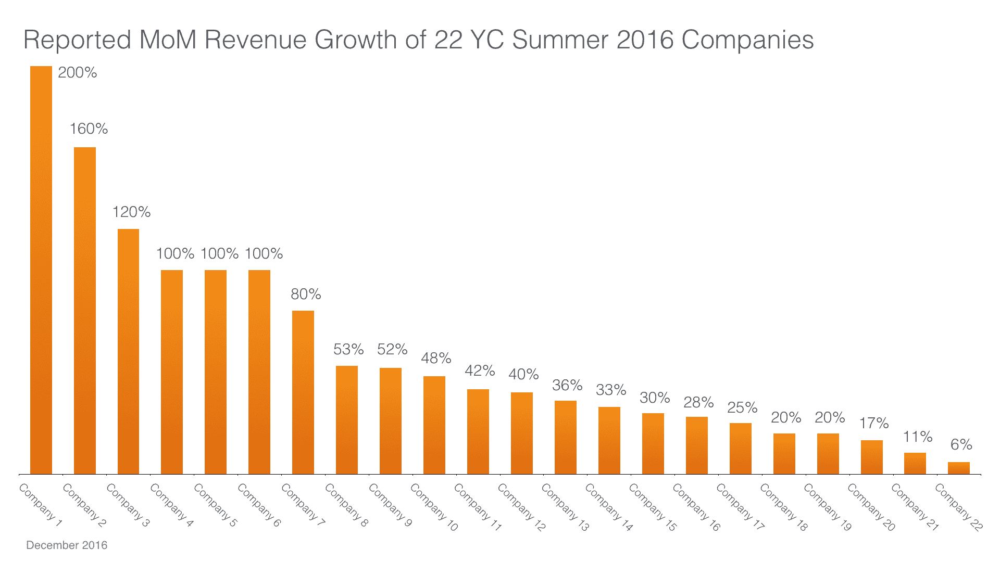
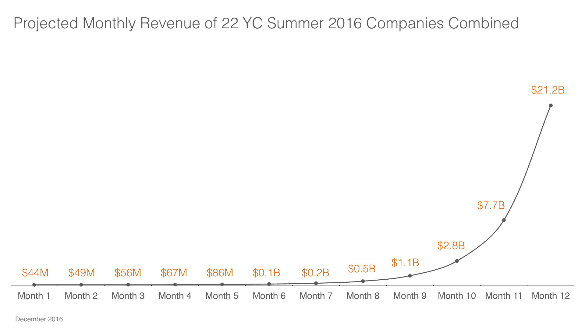
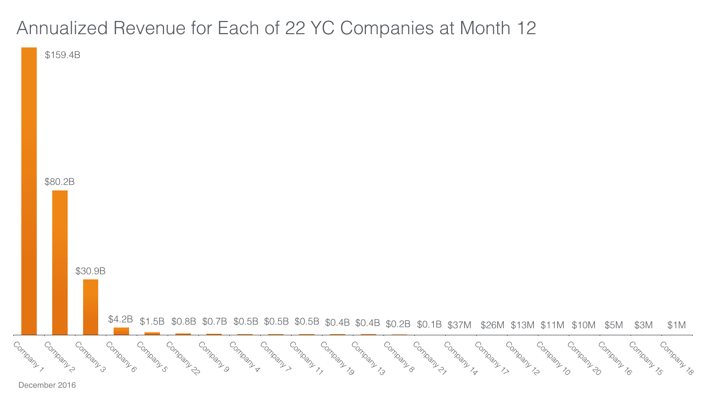

# Y Combinator 初创公司的增长是一个错误信号

> 原文：<https://techcrunch.com/2016/12/18/growth-as-a-false-signal-in-y-combinator-startups/?utm_source=wanqu.co&utm_campaign=Wanqu+Daily&utm_medium=website>

More posts by this contributor

人们不得不欣赏保罗·格拉厄姆如何将 Y Combinator 打造成为世界旗舰加速器，并将其交给其他人，以继续其令人印象深刻的顶级运行。事实上，我还没有遇到一个后悔加入这个项目的创始人。

但是在离开 YC 五年后，我又回来观察了最后两天的演示，我现在想知道保罗在他最初的、被广泛阅读的文章中分享的一些观点是否被带到了荒谬的极端。他接手的初创公司[的发展](http://paulgraham.com/growth.html)就是一个很好的例子。

## 收入增长是一根占卜棒

简而言之，保罗说“在 YC 期间，一个好的增长率是每周 5-7%”，而且“衡量增长率的最佳指标是收入。”他继续解释说，成功的创业遵循“S 曲线”创始人希望在展示日之前走出最初的缓慢增长期，表明他们刚刚开始攀登那条曲线的陡坡。如果一切顺利，在他们的公司多年后成熟之前，增长不会放缓。

事实上，现在的传统思路似乎是，这个“5%俱乐部”的成员状况良好，其他一切都应该符合要求。如此多的创始人竭尽所能地展示他们在演示日达到了这个里程碑。当然，这不仅仅是 Y Combinator 创业公司的情况；这已经成为各地加速器项目的普遍惯例。

从本质上来说，收入增长已经成为一家初创公司成功的推测标尺。就像农民多年来使用分叉的树枝来确定他们财产下面的水的位置一样，投资者正在利用早期的收入增长来确定哪些羽翼未丰的创业公司将成为长期的赢家。尽管 Y Combinator 的 Sam Altman 和其他人明确努力告诫不要采取“不惜一切代价的增长”的方式。

投资者和创始人在演示日越来越多地关注增长，而且仅仅关注增长，这已经变得荒谬和不现实。它会产生一个错误的信号，导致失望和投资损失。也许看看实际的收入增长数字会帮助每个人认识到这种荒谬的程度。

## 计算数字

让我们来看看 Y Combinator 初创公司在 8 月份最近的演示日声称的确切收入增长。我们对该集团中分享其收入和收入增长指标的 22 家公司**进行了统计。

来源:串联资本

这些公司报告的月环比收入增长率从 6%到 200%不等。平均值为 60 %,中位数为 41%。六家公司报告每月收入至少翻了一番。

来源:串联资本

如果我们将这些公司的月增长率应用于其报告的收入，那么仅仅一年后，这 22 家公司的月总收入将达到 210 亿美元，即每家公司的月收入为 9.63 亿美元。

如果我们在演示日之后的第十二个月计算每家公司的年化收入，那么每家公司的年化收入将从 100 万美元到 1590 亿美元不等。在这 22 家公司中，14 家的年化收入将超过 1 亿美元，其中 3 家的年收入将超过 300 亿美元，分别成为美国第 6 大(超过 CVS)、第 33 大(超过宝洁)和第 91 大(超过耐克)公司。

来源:串联资本

在这个 Y Combinator 类中，很可能会有另一个 Airbnb 或 Dropbox 成长为独角兽，但该类的整体结果将与上述数字相差甚远。

投资者应该意识到，在创业初期如此短的时间内实现高增长率，绝不意味着它已经走上了独角兽地位的轨道，或者接近独角兽地位。矛盾的是，有长期增长记录的公司通常不会首先加入 Y Combinator。他们利用产品与市场的契合以及由此带来的收入增长，一路顺风顺水。

## 那么投资者(和创始人)应该关注什么呢？

无论如何，如果一家公司确实有可持续的增长，那么创始人应该促进这种增长。事实上，他们应该大力宣传。投资者只需要确信任何报告的增长都是真实的，而不是来自初创公司的“疏忽”，如媒体上的发布文章、等候名单的开放或一次性的社会影响者闪电战。

但更重要的是，投资者应该认识到，大多数 Y Combinator 公司在演示日之前仍在搞清楚自己的业务。他们还没有准备好大力推动增长。这段探索期应该被期待和拥抱。

作为投资者，我们应该关注一家公司是否有令人印象深刻的参与度和保留率指标。我们应该仔细考察它的早期单位经济学。我们应该看看它的用户是否绝对喜欢这个产品。如果这些基本要素都到位了，我个人通常愿意打赌增长会到来，而且会来得更早而不是更晚。

*我参加了早期 Y Combinator 演示日的大部分活动，促成了 Tandem 对 PagerDuty、Flightcaster 和 ZumoDrive 等公司的投资。然而，当这些公司的规模变得太大，估值太高，无法支持 Tandem 当时的种子前投资模式时，我退出了。当 Tandem 今年早些时候开始进行 100 多万美元的传统种子投资时，我又开始参加演示日，我们在最后两批(Deako 和 Sixa)中各支持了一家公司。

* *所有公司名称均已匿名。两家公司只报告了 GMV 和 GMV 的增长。为了从这些数字中获取收入，我们假设收取 15%的交易费。

Tandem Capital 内容总监尼克·梅伯里对本文有贡献。