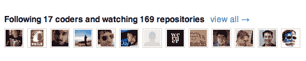
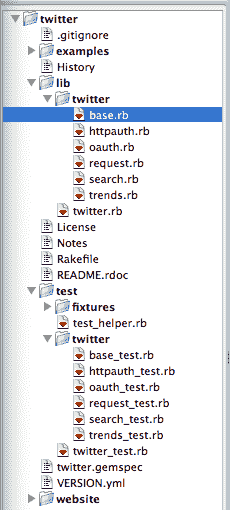

# 改进编码的一个可靠方法|> Changelog

> 原文：<https://changelog.com/posts/one-sure-fire-way-to-improve-your-coding?utm_source=wanqu.co&utm_campaign=Wanqu+Daily&utm_medium=website>

***编者按:*** 我最初写这篇文章是为了在 2010 年 5 月给你的编码加油。不幸的是，那个网站现在已经关闭了，所以为了后人的缘故，我在这里重新发布这篇文章。我考虑过为现代更新它，但我认为它保持得足够好了。不支持的部分有点可笑，但哦好吧。尽情享受吧！

* * *

改进编码最明显的方法是编写更多的代码。每个人都知道。然而，另一个我保证会提高你的编码的活动是与写作完全相反的。我会尽可能清楚地说明这一点:

如果你想大幅提高你的编程技能，你需要阅读别人的代码。

也许你相信，也许你不相信。你应该。如果你愿意试一试，我相信你的付出会有很大的回报。

在这篇文章中，我将帮助你选择阅读的内容，并就如何阅读给出实用的建议。如果你已经是一个代码阅读者，你可能会找到一些方法从你的努力中获得更多。如果你不是，你一定要继续读下去。

## 读什么

这是一个重大的决定，也是一个很难给出建议的决定。我不会简单地向您指出我认为您应该阅读的代码，因为它确实涉及到您所从事的工作。然而，我会提供一些你可以遵循的指导方针来帮助你选择阅读的内容。

### 阅读你所依赖的代码

一个很好的起点是你已经在使用的任何插件或库。

*   一个你非常喜欢的 WordPress 插件
*   你觉得有用的红宝石
*   一个你会不断回头去看的 jQuery 插件

这些都是很好的学习对象。您已经熟悉了它们的公共 API，因此理解它们内部工作方式的障碍更低。此外，作为代码的用户，你有机会添加文档，实现一个新的特性，或者以某种方式回馈项目。

### 阅读让你印象深刻的代码

我记得第一次看到 280 张幻灯片时，我对自己说，“这真是令人印象深刻。”我很快了解到驱动这个网站的代码是开源的 Cappuccino 项目。我把这些知识藏在大脑深处，当我最终发现[另一个令人印象深刻的运行在](http://web.archive.org/web/20100530025343/http://almost.at/)[卡布奇诺](http://www.cappuccino-project.org)上的应用时，我知道我有一个可以从中学习很多东西的项目。最近让你印象深刻的是什么？它是开源的吗？如果是这样的话，这是一个很好的阅读选择，因为代码可能会像最终的应用程序一样给你留下深刻的印象。

### 阅读你尊敬的人写的代码



如果你用开源软件编码已经有一段时间了，可能还有其他的程序员赢得了你的尊重。我能想到一些开发人员，他们的代码绝对令人羡慕。

如果你心中没有一个受尊敬的开发者，很容易找到一个。他/她可能已经在前两部分中的某一部分编写了一些代码(您所依赖的代码，或者让您印象深刻的代码)。

### 阅读你能真正读懂的代码

如果你是喜欢冒险的类型，你可能会考虑投身于一个大型项目，比如 Ruby on Rails、Drupal 或 jQuery。我建议现在避免这样的项目，除非你是一个有经验的代码读者。

大型项目有更多可移动的部分，你可能会在概念上纠结太多，以至于学不到任何有直接价值的东西。困惑会导致沮丧，更大的项目更有可能让你在阅读中感到困惑和沮丧。挑选一个小项目来阅读的好处是，你可以一下子把整个程序逻辑掌握在脑子里。这留给你的只是发现和学习的细节。

## 如何阅读

既然您已经选择了一些要阅读的代码，那么阅读它的最佳方式是什么呢？我读过很多代码，我可以建议一些方法来最大化你的投资回报率。

### 查看大图



我将假设您至少在宏观层面上知道您正在阅读的代码完成了什么。如果没有，我建议阅读项目的网站、教程、文档以及除了代码之外你能得到的任何东西。

好了，清楚了这一点，我建议你的第一步是围绕项目的结构来思考。这是一个可变的工作量，取决于你选择的代码库的大小，但是任何大于一个文件的东西都需要一点时间。

首先，注意文件结构。这个步骤由一个编辑器辅助，它有一个类似 TextMate 的文件夹层次视图。例如，这是 Twitter Ruby gem 的一个很好的概述。

这一步的目标是熟悉源代码。找出哪些文件包含/需要/加载其他文件，大部分代码在哪里，使用的名称空间(如果有的话)，以及类似的事情。一旦你有了大致的了解，你就可以开始钻研细节了。

### 记录你的发现

阅读代码不应该是一种被动的活动。我鼓励你边走边添加评论，当你开始理解程序流程时，记录下你的假设和结论。当你第一次开始时，你的评论可能看起来像这样:

```
# I think this function is called after 'initialize'
# What does this equation even do?
# Pretty sure this variable loses scope after line 17 
```

随着你理解的进步，你可以去掉你自己留下的小面包屑式的评论，也许可以写一些更有意义和权威的评论，这些评论可能会被提交到项目中。

### 使用测试，卢克

希望你选择的项目有一个测试套件。如果没有，你可以完全跳过这一部分(或者找一个有这个功能的)。

每当你阅读别人的代码时，测试都是一个很好的起点，因为它们记录了代码应该完成什么。有些测试比其他的更能提供信息，但是不管写得多好，你经常会在测试中比在实现中更容易发现程序员的意图。当你阅读的时候，试着让测试套件成功运行。这将确保您的开发环境得到正确配置，并使您在进行更改时更加自信。

### 执行，改变东西，执行

谁说阅读代码必须放手？一旦你打破了一切，又把它重新组合起来，你就会真正开始理解事情。还记得你通过的那些测试吗？让它们失败，再添加一些，或者尝试在不破坏它们的情况下改变实现。尝试添加一个您认为很酷的小功能，或者设置项目范围的日志记录，以便您可以在代码的各个阶段打印输出。这还是读书吗？当然，但在这一点上，它更像是一部《选择你自己的冒险》，而不是一部推理小说。这是一件好事！

### 冲洗并重复

一旦你读完一个代码库，选择另一个并重新开始这个过程。你读的代码越多，你就越能读懂它，并且在更短的时间内获得更多。我想你会发现投资回报率增长很快，这实际上是一种非常愉快的学习方式。

## 从哪里开始

对我的代码阅读影响最大的因素是 [GitHub](https://github.com) 。这个网站让你很容易找到新的项目和优秀的程序员，如果你不利用它，你会给自己带来伤害。我建议从 GitHub 开始，直接在网站上阅读代码，直到你找到一个可以学习的项目。然后，宝宝开始阅读！

你呢？你把阅读代码作为一种学习工具吗？你会向别人推荐哪些项目？最近读过什么好的代码吗？

* * *