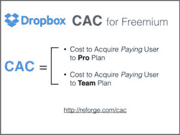
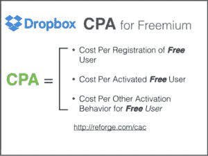
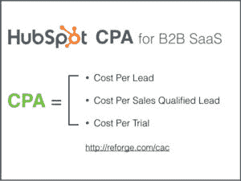
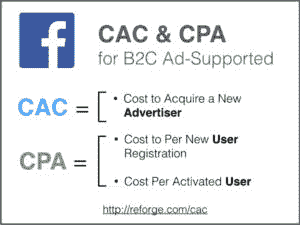
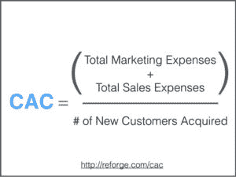
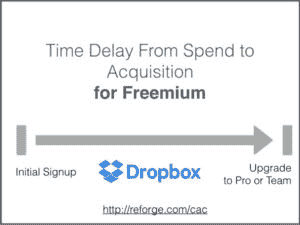
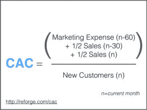
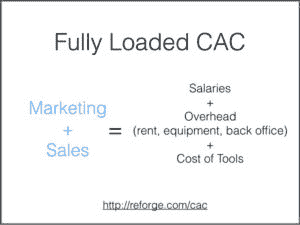
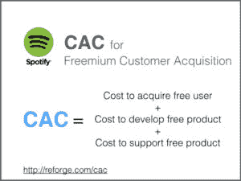
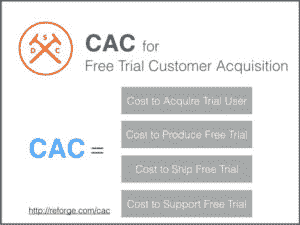

# 如何(实际)计算 andrewchen 的 CAC

> 原文：<http://andrewchen.co/how-to-actually-calculate-cac/?utm_source=wanqu.co&utm_campaign=Wanqu+Daily&utm_medium=website>

*【Andrew:付费营销仍然是许多产品获取渠道不可或缺的一部分，其中一个关键指标是获取客户的成本，这是一个细致入微的计算，有很多问题。我的好朋友[布莱恩·鲍尔弗](http://www.coelevate.com/)(Hubspot 前增长副总裁)整理了这篇令人难以置信的文章，详细介绍了如何思考这个问题。]*

# 布莱恩·鲍尔弗(Hubspot 前增长副总裁):

从增长预测到公司估值，CAC 和 CPA 互换使用是很常见的——但这是错误的，而且会让你付出代价。在这篇文章中，我打破了增长的最重要的行话，以揭开收购的真实成本，并挖掘导致增长团队偏离轨道的最常见的错误。

注意:这是一个大话题，最好用实例和交互式框架来解决。为此，我在整个指南中加入了一些真实公司的例子，以及交互式电子表格。要将任何电子表格用于您自己的计算， [**单击此处**](https://docs.google.com/spreadsheets/d/1k42ndFybND75kjbviKwecrpVXrKolKA0Gdp2xgFeKtU/edit?usp=sharing) ，然后转到文件>复制一份创建您自己的版本。

## 客户获取不是 CPA 三个例子

首先，让我们解决一个常见的误区。客户获取成本(CAC)和每次获取成本(CPA)通常被混为一谈，但实际上它们是完全不同的指标。理解其中的区别是深入理解 CAC 的开始。

CAC 专门衡量获得一个**客户的成本。**相反，CPA(每次收购成本)衡量的是收购**而非**客户的成本，例如注册、激活用户、试用或销售线索。这两者是相关的，因为 CPA 通常用于衡量成本，而成本是 CAC 的主要指标。

CAC 和 CPA 不同但相关的四个例子:

### 1.Dropbox

由于 Dropbox 是一个免费增值产品，CAC 将是在他们的职业或团队计划*中获得一个 ***付费用户*** 的成本。* CPA 将用于(免费用户的)每次注册成本、每次激活(免费)用户的成本，以及其他重要但仍然不付费的行为，这些行为表明某人已经从访问者转变为产品的用户。

### 2.轮毂点

由于 HubSpot 是一个 B2B SaaS 产品，CAC 将等于在其基本、专业或企业计划中获得一个新客户的成本。CPA 将用于 CAC 的领先指标，如每条线索的成本、每条销售合格线索的成本、每次试用的成本或营销和销售漏斗中的其他点。

### 3.脸谱网

**靠广告模式支撑的 B2C 公司就有点不一样了。在脸书的案例中，付费用户是广告商，因此 CAC 是获得新广告商的成本。然而，如果你只看用户，用户/客户是一样的。CPA 最有可能用于诸如每次注册的费用、每次激活用户的费用等。**

 **

关键的一点是你需要做的第一件事是理解 CAC 非常简单:

在你的模型中定义客户是谁/什么。

使定义清晰简单，并使 CAC 和 CPA 之间的语言一致，否则交流将非常混乱。

**💌 Are you up to date?**

获取新的更新，通常一周一次——以关于技术发展的长篇文章为特色。

## CAC 的基本计算及其错误原因

如果你用谷歌搜索“如何计算获得客户的成本”，你会得到下面的基本公式:

> CAC =总营销费用+销售费用/获得的新客户数量

从表面上看，这是正确的，但它缺少等式中每个变量的许多细节和定义。即使是最好的基本计算也可能会产生误导。例如，使用此公式，您可以查看下面的电子表格，并假设如下:

*要将此电子表格用于您自己的计算， [**点击此处**](https://docs.google.com/spreadsheets/d/1k42ndFybND75kjbviKwecrpVXrKolKA0Gdp2xgFeKtU/edit?usp=sharing) ，然后转到文件>复制一份创建您自己的版本。*

但是如果我告诉你以下事情呢:

1.  大多数客户平均需要 60 天才能从销售线索变成客户。
2.  不是所有的顾客都是新顾客，但他们中的一些人会再次光顾。
3.  这是一个免费增值产品，在用户成为付费用户(客户)之前，在他们免费的时候，支持他们是有成本的。

这三个额外信息应该改变我们如何看待上面的基本公式。我们需要先评估几个问题，而不是从表面上看这个等式。

## 如何真正计算 CAC

我们需要问三个关键问题来为企业定义更准确的 CAC 计算。所有这些都围绕等式中的变量深入挖掘。

### *关键问题#1:从你的营销/销售接触点到某人成为客户之间有多长时间？*

基本计算的第一个问题是，它没有考虑到你花费营销/销售资金和你实际获得客户之间的时间段。这里有两个例子:

**例 1:免费增值产品**

我们以 Dropbox 为例来看看。当你注册了 Dropbox，你就开始使用他们的免费层。你可以在一段时间内免费使用 Dropbox，直到你达到存储空间限制，然后你可以升级。对于许多用户来说，这个时间段是几个月(在某些情况下超过一年)。Evernote、Buffer 等其他免费增值产品也是如此。

**例 2: SaaS 公司内部销售**

大多数 SaaS 公司都有内部销售模式，有人可能会在本月成为销售线索(由于我们本月的营销努力)，但在成为实际客户之前需要 60 多天，因为他们需要经历销售过程。

如果你不考虑这些时间段，你可能会高估或低估 CAC，从而做出一些糟糕的经营决策。

这里有一个你如何高估 T1 的例子。在下面的例子中，CAC 的计算方法是用当月的营销成本除以当月的新客户。

*要将此电子表格用于您自己的计算， [**点击此处**](https://docs.google.com/spreadsheets/d/1k42ndFybND75kjbviKwecrpVXrKolKA0Gdp2xgFeKtU/edit?usp=sharing) ，然后转到文件>复制一份创建您自己的版本。*

三月份，我们尝试了一些新渠道，这导致营销成本大幅增加。根据简单的计算，我们的 CAC 是 148 美元。如果我们的目标 CAC 是 125 美元，我们可能会做出三月不成功的决定，我们将关闭这些新渠道。

但是，假设某人成为客户实际上需要 2 个月的时间。下面是 ***相同的数据*** ，但是改变了计算方法以说明这 2 个月的时间段。

*要将此电子表格用于您自己的计算， [**点击此处**](https://docs.google.com/spreadsheets/d/1k42ndFybND75kjbviKwecrpVXrKolKA0Gdp2xgFeKtU/edit?usp=sharing) ，然后转到文件>复制一份创建您自己的版本。*

这种变化讲述了一个完全不同的故事。三月份我们有 84 美元的 CAC，四月份有 111 美元的 CAC。我们可能会决定扩大规模，而不是关闭我们在 3 月份尝试的新频道。

如果你属于以下两种情况之一，关于营销/销售费用和获得客户之间的时间的关键问题**不**重要:

1.营销接触点和某人成为客户之间的时间非常短。对于很多 B2C 公司来说，这是事实，这些公司的用户决策漏斗非常短:Snapchat、Instagram 等等。

2.你的营销/销售费用是如此的稳定，以至于它会随着时间的推移而正常化。但即使在这种情况下，最好是更准确的。

你需要弄清楚花费的时间与某人真正成为顾客的时间有什么关联。营销费用可能与销售费用有不同的关联。

最简单的方法就是计算出你的平均营销/销售周期。换句话说，从第一个营销接触点到获得客户的平均时间是多少？

这里有一个例子。假设我们是一家 SaaS 公司，从销售线索到客户的平均时间是 60 天，我们认为销售费用平均分摊在这两个月的时间内。

CAC 方程如下:

> CAC =(营销费用(n-60) + 1/2 销售额(n-30) +销售额(n)) /新客户(n)
> 
> *n=当前月份*

下面是一个内置计算示例模型:

**要将此电子表格用于您自己的计算， [**单击此处**](https://docs.google.com/spreadsheets/d/1k42ndFybND75kjbviKwecrpVXrKolKA0Gdp2xgFeKtU/edit?usp=sharing) ，然后转到文件>进行复制以创建您自己的版本。**

### *关键问题#2:营销+销售包括哪些费用？*

要获得准确的 CAC 计算，您需要回答的第二个问题是，您在分子(营销/销售)中包括哪些费用？在我们看一些这个问题的答案不同的例子之前，这里是我看到的三个最常见的错误:

**错误 1:不包括工资**

你需要包括所有营销和销售人员的工资。我们在不包括 CAC 的地方看到了很多。这不仅包括 100%致力于营销/销售的个人贡献者，还包括那些将部分时间花在营销/销售上的人(通常是时代经理人)。包含工资的 CAC 数通常被称为“满载 CAC”在某些情况下，将满载的 CAC 与空载的 CAC 分开是很有用的，我们将在后面解释。

**错误 2:不包括开销**

类似于不包括工资的错误，你需要包括分配给从事市场销售的员工的管理费用(租金、设备等)。

**错误 3:不包括花在工具上的钱**

营销和销售工具空间已经爆炸。大多数团队使用 10 多种工具来操作他们的营销和销售机器。这些工具会增加成本，需要包含在您的 CAC 计算费用中。

如果你包括那些主要的东西，这个问题的答案就开始变得有点复杂了，而且因公司而异。举几个例子:

Spotify 和免费增值模式——包括产品/工程/支持吗？

Spotify 是一项免费增值业务。他们有数百万用户使用他们产品的免费版本，这有助于他们通过分享音乐和其他病毒式渠道获得新用户。

在大多数公司中，产品、工程和支持不包括在 CAC 中(通常是 R&D 的一部分)。但是如果免费产品是你获得客户的主要方法，那么支持免费产品的费用不应该包括在你的 CAC 计算的费用部分吗？对于这个问题有不同的观点，但是我们支持。

如果您在营销/运营的营销或销售团队中有工程师、项目经理和其他角色，您应该将这些工资和费用包括在 CAC 计算中。从技术上讲，工程师、项目经理或其他角色可能不属于“营销”或“销售”团队，但他们仍然是支持新客户获取所需的费用。

HubSpot 和 SaaS 的案例——包括客户成功成本？

像 HubSpot 这样的大多数 SaaS 公司都有相当规模的客户成功团队。这些团队的定义和角色可以有很大的不同。一些客户成功团队纯粹致力于防止客户流失。有些人致力于帮助新客户上船。有些人致力于赢回以前失去的顾客。

所有这些都回避了一个问题，客户成功成本应该包括在 CAC 中吗？其中一些职责涉及获取新客户，因此有理由将这些职责分配给 CAC。

**Dollar Shave Club 和订阅电子商务案例——免费试用的支持和运输？**

美元剃须俱乐部是一个订阅电子商务业务。众所周知，他们有一个 1 美元一个月的试用期。这一个月的试用有许多营销以外的费用，包括初始包的运费，试用期间的支持，以及其他费用。这些费用是否应包括在集体合同条款中？答案取决于你如何定义新客户。

在 Dollar Shave Club 的案例中，我们会提出一个论点，即试用 1 美元的人还不是客户。新客户是指超出试用范围的人。因此，所有与支持免费试用相关的成本都应包含在 CAC 中。1 美元的试用支付部分抵消了这些成本，但没有完全抵消。

顾客就是顾客，对吧？不一定。在计算 CAC 时，我们需要区分新客户和老客户。在大多数组织中，营销和销售工作的重点是新客户，营销和销售工作的重点是留住或争取回客户。

错误在于，新客户的分子中只包括营销和销售费用，但分母中包括了所有客户(包括回头客)。这样会让你的 CAC 看起来人为偏低。您可以用两种方法之一来解决这个问题:

1.包括所有营销/销售费用(包括专注于留住客户的费用)和所有客户。

2.在分母中将新客户的费用与重新激活的老客户分开，并将新客户与重新激活的客户分开。

### **重述**

从我们今天讨论的例子中，我希望可以更清楚地看到，计算真实的 CAC 不仅仅是一个简单的、放之四海而皆准的等式。

相反，对客户获取成本的诚实评估着眼于你的销售周期的长度，有多少客户是真正的新客户(相对于回头客)，以及支持导致新客户获取的营销工作所需的总成本和资源。

*[布莱恩·鲍尔弗](http://coelevate.com)是 [Reforge](http://reforge.com) 的首席执行官，之前是 Growth @ HubSpot、EIR @三一投资公司的副总裁，是 unlimited 的联合创始人，Viximo 的联合创始人，reCatalyze 的联合创始人& PopSignal。*

**PS. Get new updates/analysis on tech and startups**

我写一份高质量的每周时事通讯，报道硅谷发生的事情，关注创业、营销和移动领域。

在本网站链接的“内容”(包括帖子、播客、视频)中或在社交媒体和其他平台(统称为“内容分发渠道”)中发表的观点是我自己的，并不是 AH Capital Management、l . l . c .(“a16z”)或其各自附属公司的观点。AH 资本管理公司是一家在证券交易委员会注册的投资顾问公司。注册为投资顾问并不意味着任何特殊技能或培训。这些帖子不针对任何投资者或潜在投资者，也不构成出售或购买任何证券的要约，不得用于或依赖于评估任何投资的价值。

内容不应被解释为或以任何方式依赖于投资、法律、税务或其他建议。您应该向您自己的顾问咨询有关任何投资的法律、商业、税务和其他相关事宜。这些材料中表达的任何预测、估计、预测、目标、前景和/或观点可能会在不通知的情况下发生变化，并且可能与他人表达的观点不同或相反。此处提供的任何图表仅供参考，在做出任何投资决策时不应依赖。此处包含的某些信息来自第三方来源。虽然这些信息来自据信可靠的来源，但我并未独立核实这些信息，也未对这些信息的持久准确性或其在特定情况下的适当性做出任何陈述。该内容仅在所示日期有效。

在任何情况下，本网站或相关内容分销渠道上提供的任何帖子或其他信息都不应被解释为 a16z 人员发起、讨论或提及的任何集合投资工具中的任何证券或权益的购买或销售要约。也不应被理解为提供投资咨询服务的要约；投资 a16z 管理的集合投资工具的要约将单独提出，并且仅通过特定集合投资工具的保密要约文件提出，这些文件应完整阅读，并且仅提供给符合联邦证券法规定的特定资格的人。这些投资者被定义为合格投资者和合格购买者，通常被认为有能力评估潜在投资和财务事项的优点和风险。不能保证 a16z 的投资目标会实现或投资策略会成功。对 a16z 管理的投资工具的任何投资都包含很高的风险，包括损失全部投资金额的风险。提及、提及或描述的任何投资或投资组合公司并不代表 a16z 管理的所有投资工具，也不能保证这些投资将会盈利，也不能保证将来进行的其他投资会有类似的特征或结果。a16z 管理的基金所做的投资清单可在 https://a16z.com/investments/.获得。该清单不包括发行人未允许 a16z 公开披露的投资以及对公开交易的数字资产的未宣布投资。Andreessen Horowitz 投资、集合投资工具或投资策略的过去结果不一定代表未来结果。请参见[https://a16z.com/disclosures](https://a16z.com/disclosures)了解更多重要信息。**