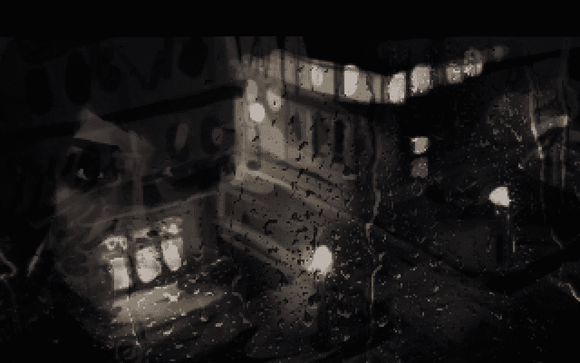
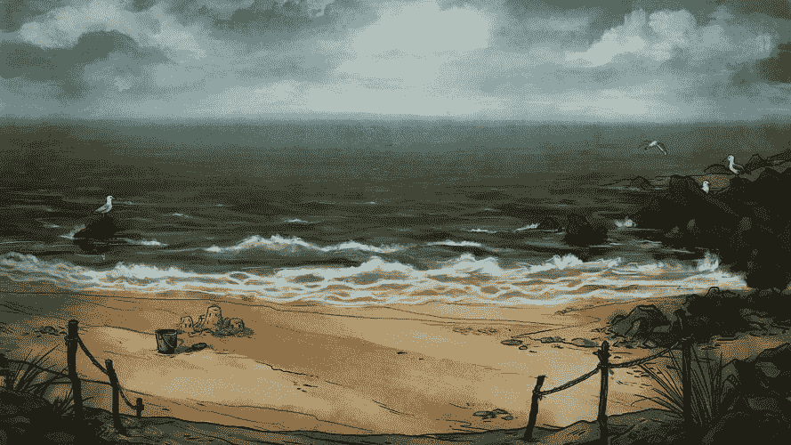

# 这是我的后背:成为一名游戏开发者几乎是我唯一能做的事情——多边形

> 原文：<https://www.polygon.com/2016/2/17/11035050/owl-cave-chronic-pain-game-development?utm_source=wanqu.co&utm_campaign=Wanqu+Daily&utm_medium=website>

独立大型发行商 [Mastertronic 于 2015 年 11 月底关门大吉](http://www.gamasutra.com/view/news/260473/UK_publisher_Mastertronic_declares_bankruptcy.php)。我的公司[猫头鹰山洞](http://owlcave.net/)和他们签订了我们两个游戏的合约。谢天谢地，这些游戏的版权已经回到了我们的工作室，但几个月的收入目前处于悬而未决的状态，很可能一去不复返。这是个坏消息，但这不是我们的末日。等待发现会发生什么并不容易。

你看，Owl Cave 不仅是我的职业和生活，而且在一个我很难找到固定工作的世界里，成为一名游戏开发者也是我有限的选择之一。作为一个残疾的开发者，在家工作是天赐之物，能够通过游戏开发来维持自己的经济是我的生命线，没有它我无法生活。我们不是成功者，也不是失败者。我们是一家相当成功的小公司，在这个行业中很少讨论这些。

我们的两款商业游戏 [*理查德&爱丽丝*](http://store.steampowered.com/app/279260/) 和 [*藏尸屋三部曲*](http://store.steampowered.com/app/288930/) 已经获得了一些好评和较小的点击游戏的稳定销售。无论如何，他们都不是独立电影的宠儿，但他们相处得很好。

我们已经做出行政决定，在 2016 年保持自助出版。没有观众的支持，我们不可能做到这一点，对此我们非常感激。一点一滴都有帮助，我们在此期间得到的任何帮助都非常感谢。每一笔销售、每一封鼓励的电子邮件以及每一次增强我们信号的尝试都给了我们急需的支持。

### 残疾发展

支持。这是我很难要求的东西，也是我不能没有的东西。我想大多数人都一样。

支持对我来说是一个私密的话题。我的脊椎在 13 岁左右开始弯曲。这是一种相当常见的畸形，但我确实跳过了“相当常见”的方面，直接进入了“我的医生所见过的最严重的独特情况之一。”

当我说它弯曲的时候，我的意思是它他妈的弯曲。它扭曲变形，给我带来了巨大的精神和身体上的痛苦。当我穿过城镇时，我不仅不得不忍受腰部火辣辣的疼痛，而且几乎每次我离开家时，人们都会辱骂我是“怪胎”，甚至更糟。那是 20 世纪 90 年代和 21 世纪初。我住在英国的一个小镇上。公众对明显畸形的反应并不好。

<picture class="c-picture" data-cid="site/picture_element-1668358324_4386_133000" data-cdata="{&quot;asset_id&quot;:6060457,&quot;ratio&quot;:&quot;*&quot;}"><source srcset="https://cdn.vox-cdn.com/thumbor/u3cf_yb5l0IPZhoqu_Z07M39dO8=/0x0:960x600/320x0/filters:focal(0x0:960x600):format(webp):no_upscale()/cdn.vox-cdn.com/uploads/chorus_asset/file/6060457/chtpolygon05.0.png 320w, https://cdn.vox-cdn.com/thumbor/r0Mib-0lmcyOhMDzGo74qpYJNNI=/0x0:960x600/520x0/filters:focal(0x0:960x600):format(webp):no_upscale()/cdn.vox-cdn.com/uploads/chorus_asset/file/6060457/chtpolygon05.0.png 520w, https://cdn.vox-cdn.com/thumbor/y_neZwuppGBTkeQjzm5tql8NpJo=/0x0:960x600/720x0/filters:focal(0x0:960x600):format(webp):no_upscale()/cdn.vox-cdn.com/uploads/chorus_asset/file/6060457/chtpolygon05.0.png 720w, https://cdn.vox-cdn.com/thumbor/unATNEgYbTmw4ND4uvJMmdr1pGw=/0x0:960x600/920x0/filters:focal(0x0:960x600):format(webp):no_upscale()/cdn.vox-cdn.com/uploads/chorus_asset/file/6060457/chtpolygon05.0.png 920w, https://cdn.vox-cdn.com/thumbor/hVzPtvDTy-9BG5EvmPvnuIA-7LI=/0x0:960x600/1120x0/filters:focal(0x0:960x600):format(webp):no_upscale()/cdn.vox-cdn.com/uploads/chorus_asset/file/6060457/chtpolygon05.0.png 1120w, https://cdn.vox-cdn.com/thumbor/ukpNG2pqgFnAgHT4CETSGrdnE-Y=/0x0:960x600/1320x0/filters:focal(0x0:960x600):format(webp):no_upscale()/cdn.vox-cdn.com/uploads/chorus_asset/file/6060457/chtpolygon05.0.png 1320w, https://cdn.vox-cdn.com/thumbor/PEKowMTYT5uGAn3rZ6Pe4APyJRo=/0x0:960x600/1520x0/filters:focal(0x0:960x600):format(webp):no_upscale()/cdn.vox-cdn.com/uploads/chorus_asset/file/6060457/chtpolygon05.0.png 1520w, https://cdn.vox-cdn.com/thumbor/4QlaPwzpHY7Yc491epdljkUoT8g=/0x0:960x600/1720x0/filters:focal(0x0:960x600):format(webp):no_upscale()/cdn.vox-cdn.com/uploads/chorus_asset/file/6060457/chtpolygon05.0.png 1720w, https://cdn.vox-cdn.com/thumbor/NDGLh78KphKanpz7rrMh3BunsBM=/0x0:960x600/1920x0/filters:focal(0x0:960x600):format(webp):no_upscale()/cdn.vox-cdn.com/uploads/chorus_asset/file/6060457/chtpolygon05.0.png 1920w" sizes="(min-width: 1221px) 846px, (min-width: 880px) calc(100vw - 334px), 100vw" type="image/webp"></picture>

由于我的情况的独特性，以及一些其他不愉快的因素，我无法为患有脊柱弯曲的青少年提供矫正手术，事实上，我被告知我永远无法在手术方面有太多的缓解。16 岁时，在经历了三年的地狱生活后，有人相当直白地告诉我，从现在开始，我的生活只会变得更糟。曲线会恶化，疼痛也会加剧。我也知道虐待会恶化。

当我 21 岁的时候，我计划结束我的生命。我以前曾试图自杀，但这次我决心坚持下去。随你怎么判断，但我的存在是一种慢性疼痛和近乎持续的情感折磨。我甚至接近我的父母，告诉他们我在考虑什么，也许希望我能得到他们的允许。当然，他们知道我的痛苦程度后，都崩溃了。这是任何父母都不应该面对的事情，也是我永远感激我们能够克服的事情。我们讨论了一下，达成了协议。

我向父母承诺，我会回到医院，希望奇迹或科学突破能带来治疗。相反，在一位新的专家的指导下，我发现我的诊断是错误的，一定程度的矫正手术是可能的。

在大约 18 个月的时间里，这比我想象的要好。我的脊椎和普通人一样直。疼痛已经完全消失了！我的生活和我所希望的一样接近正常。

但没有持续多久。

有一天，在一个市场的奶制品通道里，我脊椎里的金属棒突然折断了。这并不像听起来那么糟糕，因为这都是内在的，但仍然很糟糕。随着时间的推移，我的脊柱开始再次弯曲，在 2009 年，我进行了第二次手术。

有时我觉得自己像一块灾难磁铁

我经历的大规模脊柱手术会使我非常虚弱。第一次手术持续了 16 个小时，而第二次是两次手术，间隔一周，分别为 12 个小时和 3 个小时。我花了一周的时间把我的胸腔从体内分离出来。

是啊。

第二次手术在矫正方面更加成功，但可悲的是，疼痛——矫正手术并不能保证消除疼痛——又回来了，而且这些年来越来越严重。我现在忍受着慢性疼痛，它影响着我的生活。所以我与支持的关系是这样的，我一生都不得不依赖身体、药物、经济和情感上的支持。我发现后两个是最难要求的。

我一生都沉迷于电子游戏，它们成了我的避风港；充满力量、神秘和体能的小世界，这些是我永远无法亲身体验的。我清楚地记得在我生病的每个阶段我玩的游戏。可耻的是，我从未完成*一个* *链接到过去*或*T5】超时空触发器* ，因为在我脊椎骨折的医院病床上玩它们会产生不舒服的联想。

但是，有了如此强烈的依赖游戏的经历，我选择制作游戏有什么奇怪的吗？我和其他游戏玩家以无数种不为人知的方式依赖电子游戏，我喜欢通过创造自己的游戏来回馈媒体。我甚至制作了一个关于我脊椎状况的游戏。

然而，我的残疾确实严重影响了我作为开发人员的工作方式。我不能带我们的游戏去看演出，甚至不能参加社交活动。有时，我痛苦地意识到这是如何阻碍猫头鹰山洞的发展，以及我们因无法面对面地与社会行业互动而错过的机会。我曾经能够参加一些活动，但在 2014 年，我染上了一种不相关的疾病，永久性地损坏了我的右腿，现在，在我的综合残疾变得太多之前，我不能比街角的乐购走得更远。

有时候我觉得自己像一块灾难磁铁。

所以我不能做演讲或曝光，即使我的疼痛突然消失了，我也不确定我能做到。由于我的过去，我还患有边缘型人格障碍，这使得与人打交道和建立亲密关系成为一场噩梦。

BPD 意味着我的情绪倾向于极端和波动，经常以偶像化或诋毁我最亲近的人的形式出现，因此这种浪漫的关系甚至非常亲密的友谊往往是我努力穿越的雷区。我很好地控制了我的 BPD，但这种控制也带来了一定程度的牺牲；我避免约会，也避免亲密的友谊，我必须小心谨慎地处理。对其他人来说，可能是愉快的关系，如果不是简单的，也可能是令人筋疲力尽的。

作为一名职业生涯几乎完全存在于网络上的开发人员，意味着我可以围绕我的残疾和我的 PD 来安排我的生活，并允许我尽可能地“好”。

我的意思是，我经营着一个开发工作室，有两个商业游戏，还有三个正在开发中，所以尽管有各种各样的边缘化和缺点，我显然还能应付。慢性疼痛会让我想躺在床上休息几天，但我没有。拥有 BPD 会让我表现得像个可怕的人，但我尽力不去做。这些事情不一定会阻止我们创作我们引以为豪的作品。

<picture class="c-picture" data-cid="site/picture_element-1668358324_1527_133001" data-cdata="{&quot;asset_id&quot;:6060443,&quot;ratio&quot;:&quot;*&quot;}"><source srcset="https://cdn.vox-cdn.com/thumbor/DlnHszRJWG1Glu5EHl2yf5sIQf8=/0x0:889x500/320x0/filters:focal(0x0:889x500):format(webp):no_upscale()/cdn.vox-cdn.com/uploads/chorus_asset/file/6060443/newgamepolygon08EXCLUSIVEPLZUSE.0.jpg 320w, https://cdn.vox-cdn.com/thumbor/6_xf_2exySleC6I71FumJXrPYPg=/0x0:889x500/520x0/filters:focal(0x0:889x500):format(webp):no_upscale()/cdn.vox-cdn.com/uploads/chorus_asset/file/6060443/newgamepolygon08EXCLUSIVEPLZUSE.0.jpg 520w, https://cdn.vox-cdn.com/thumbor/ZGcZM_J7V_TSEsdlHE9z0LJ87nI=/0x0:889x500/720x0/filters:focal(0x0:889x500):format(webp):no_upscale()/cdn.vox-cdn.com/uploads/chorus_asset/file/6060443/newgamepolygon08EXCLUSIVEPLZUSE.0.jpg 720w, https://cdn.vox-cdn.com/thumbor/77xq7MKqAa9tG-yka9EGdjR2qnc=/0x0:889x500/920x0/filters:focal(0x0:889x500):format(webp):no_upscale()/cdn.vox-cdn.com/uploads/chorus_asset/file/6060443/newgamepolygon08EXCLUSIVEPLZUSE.0.jpg 920w, https://cdn.vox-cdn.com/thumbor/LdBsn0aqyVHWm_3d5IdS7gXVXjw=/0x0:889x500/1120x0/filters:focal(0x0:889x500):format(webp):no_upscale()/cdn.vox-cdn.com/uploads/chorus_asset/file/6060443/newgamepolygon08EXCLUSIVEPLZUSE.0.jpg 1120w, https://cdn.vox-cdn.com/thumbor/LK8riEPT-kujy831Bl5qXgpGkhA=/0x0:889x500/1320x0/filters:focal(0x0:889x500):format(webp):no_upscale()/cdn.vox-cdn.com/uploads/chorus_asset/file/6060443/newgamepolygon08EXCLUSIVEPLZUSE.0.jpg 1320w, https://cdn.vox-cdn.com/thumbor/lO4acnJz6H-QeTBlGgoGUWKYqFA=/0x0:889x500/1520x0/filters:focal(0x0:889x500):format(webp):no_upscale()/cdn.vox-cdn.com/uploads/chorus_asset/file/6060443/newgamepolygon08EXCLUSIVEPLZUSE.0.jpg 1520w, https://cdn.vox-cdn.com/thumbor/z0u3m8JS8tXJjUghEgW4johvoOI=/0x0:889x500/1720x0/filters:focal(0x0:889x500):format(webp):no_upscale()/cdn.vox-cdn.com/uploads/chorus_asset/file/6060443/newgamepolygon08EXCLUSIVEPLZUSE.0.jpg 1720w, https://cdn.vox-cdn.com/thumbor/B6u9NYPV9TeWPFA_i2YebtuBJqg=/0x0:889x500/1920x0/filters:focal(0x0:889x500):format(webp):no_upscale()/cdn.vox-cdn.com/uploads/chorus_asset/file/6060443/newgamepolygon08EXCLUSIVEPLZUSE.0.jpg 1920w" sizes="(min-width: 1221px) 846px, (min-width: 880px) calc(100vw - 334px), 100vw" type="image/webp"></picture>

是支持让我汲取自己的力量坚持下去。来自像刘易斯·登比这样的好人的支持，他帮助建立了猫头鹰山洞，并带我登上了理查德&爱丽丝的船。我在猫头鹰山洞的合作伙伴伊万·乌里扬诺夫，还有像本·钱德勒和杰克·德奎特这样的开发者，他们为我的游戏做出了巨大的贡献。我的父母一直都很支持我。我的朋友和同事们让这一切成为可能，他们鞭策我坚持下去，即使有时我天生就想放弃或推开别人。

我们的下一个游戏是一个手绘冒险游戏，它比前两个游戏大得多。这是一个关于故事和讲故事的游戏，一个怀疑但也相信自己的游戏。这是一个关于古怪的，有麻烦的人的游戏，因为这是我所知道的，也是我所是的。但他们也是克服逆境的人，就像我每天努力做的那样。我们向公众展示的第一张图片是上图。

这也是一个非常著名的经典鬼故事的改编，所以这是令人兴奋的。我希望你能加入我们今年的发布，如果你喜欢我们的工作，支持我们继续做我们正在做的事情。我希望反过来通过制作游戏，让和我有相似经历的人也能玩，我也能为其他需要的人提供支持。

奥利维亚·怀特(Olivia White)是 Owl Cave 的一员，Owl Cave 是一家小型独立开发工作室，致力于开发冒险游戏。她之前的游戏包括《理查德&《爱丽丝》和《藏尸屋》三部曲，这两部游戏都可以买到。她还涉足互动小说和数字故事，比如 LND 游戏，并兼职做一些游戏新闻。