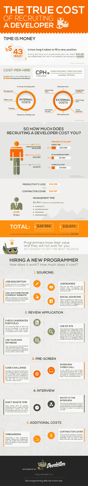

# 招聘一名开发人员的真实成本[信息图] - DevSkiller

> 原文：<https://devskiller.com/true-cost-of-recruiting-a-developer-infographic/?utm_source=wanqu.co&utm_campaign=Wanqu+Daily&utm_medium=website>

### 你有没有想过招聘一个新的程序员要花多少钱？这些数字可能会让你吃惊。

招聘开发人员最常见的费用是招聘代理费，但这只是一个开始。在人才短缺的 IT 世界，随着时间的推移，雇佣一名新的程序员(或任何技术人才)会增加成本和工作量。程序员越优秀，越贵。最好的就像超级明星有自己的经纪人。对大多数公司来说，员工流动是一个巨大的问题，长期雇佣几乎是不现实的。根据[2015 年招聘人员调查](http://www.socialtalent.co/blog/the-state-of-recruiting-in-2015-infographic) <u>，</u>员工平均任期在 6 年以下；30%的人在 1-3 年内换工作，29%的人在 4-6 年内换工作。Quarsh 的研究给出了更可怕的数字——20%的新员工在 12 个月内离职！

即使员工流动率很低，你也需要为招聘成本做好准备。这些研究表明，79%的员工会更新他们的简历，63%的人会更新他们的 LinkedIn 个人资料以防万一。你确定你的员工不会离开你吗？

请随意在你的网站上分享这张信息图，但请提及下面的文章，其中解释了所有的数据。

## “招聘开发人员的真实成本”背后的数据

## **时间就是金钱**T3】

这听起来很老套，但却是事实。你的位置空缺的时间越长，你损失的钱就越多。由于缺乏合格的程序员，这变得更加棘手。一个空缺的职位可能会让你一天花费超过 500 美元。招聘的平均时间各不相同，根据一些研究，招聘时间长达 95 天(T3)。由[德勤](http://www.bersin.com/uploadedFiles/042315-ta-factbook-wwb-final.pdf?aliId=70784193)进行的 2015 年人才招聘显示，每年填补一个职位空缺所需的时间都在增加，从 2011 年的 48 天增加到 2014 年的 52 天。DHI 招聘指标给出了最令人鼓舞的空缺持续时间——2015 年为 35.3 天。这意味着你可能会因为一个空缺而损失高达 17，650 美元(35.3 天 x 500 美元)。

程序员知道他们的价值，他们不会等你。你需要迅速行动来获得最好的人才。扩展的候选搜索并不等同于更有能力的程序员。恰恰相反，最好的候选人将会离开，留给你的是那些技能可能令你不满意的人。约翰·苏利文的研究显示，10%的应聘者在 10 天内被录用。缓慢的招聘导致缓慢的决策，这种组合会损害你雇主的品牌。招聘过程中的每一方都既紧张又兴奋。等待招聘结果的压力让人对招聘过程和公司本身产生负面的感觉。此外，这种缓慢对你的其他员工(因为他们正在做额外的工作来填补空缺)和消费者(空缺经常导致错误和延误)都有影响。这反过来意味着收入和生产力的巨大损失。

## 雇佣一名软件工程师需要花费 5 万美元

招聘一名新程序员的花费取决于:技能、职位类型、级别、市场需求、地理区域等等。然而，雇佣一名软件工程师的平均费用在 5 万美元左右。招聘一个在家工作的自由职业者的成本和在硅谷招聘一个全职程序员的成本是不一样的。新员工的平均沉没成本在 4325 美元(德勤 2015 年)到 41111 美元(牛津经济 2014 年 31808 美元)之间。对于一个工资为 51，676 美元(40，0 00 夸尔什)的职位，这个数字上升到 89，510 美元(69，285 夸尔什)。那么你怎么才能知道雇佣一个新的程序员要花多少钱呢？这并不容易，但是您可以使用每次雇佣成本(CPH)指标来估算成本:

[CPH](https://www.shrm.org/TemplatesTools/HRStandards/Documents/11-0096%20HR%20Standards%20Booklet_WEB_revised.pdf) =(外部成本+内部成本)/雇佣人数

外部成本是在您的实际位置之外发生的招聘费用。这些可能是广告费(扩大雇主品牌、发布职位)、咨询服务(法律、技术)、移民费用(当你在国外招聘时尤其重要，这是 it 招聘中非常流行的做法)、搬迁费、差旅费(对候选人和招聘人员而言)、技术费、第三方费用(招聘机构、猎头)等。

内部成本包括:内部招聘员工、管理、办公室工作、培训、临时员工费用等。

招聘需要外部和内部成本。如果你雇佣一家猎头公司或招聘机构，它会向你收取新员工年薪的 15-30%(外部成本)。如果招聘是由你的员工进行的，这个人投入到招聘中的时间就是你的内部成本(时薪 x 小时)。最流行的解决方案是混合解决方案。

## **以下是你需要支付的一些详细的外部/内部成本:**

### **1。采购**

第一步是找到你的候选人。让我们看看它会让你付出多少代价:

**职位描述**

它始于一份写得很好的合适的工作描述。你需要知道你在找谁，并以吸引人的方式写下描述。完成大约需要 1 小时，所以费用为 [$25](http://theundercoverrecruiter.comhic-what-is-the-real-cost-of-hiring/) 。

**工作板**

当你准备好职位描述后，你需要把它发布在一些招聘栏/网站上。完成一次发布可能需要 30 分钟，花费您大约。 [$12](http://theundercoverrecruiter.comhic-what-is-the-real-cost-of-hiring/) 。发帖的价格各不相同，你可以通过在一些程序员花时间的论坛上免费发帖来减少损失，但要准备好为在工作论坛上发帖付费。价格从 25 美元一张到几百美元不等。

**公司网站**

你的职业页面和公司网站是强大的雇主品牌工具，这在招聘中至关重要，因为 92%的 <u>的</u>员工表示，雇主品牌对他们考虑求职很重要。保持你的网站及时更新，信息丰富。即使你现在不招聘，网站也会扩大你的人才库。让它对用户友好，让[走向移动](https://www.cornerstoneondemand.com/rework/8-trends-will-transform-recruiting-2016)(根据 [Monster 的](http://www.monster.com/about/b/state-of-recruitment)研究，70%的人在找工作时使用移动设备)。创造非凡的求职体验，降低采购成本。

**社会采购**

Monster 的研究还显示，79%的求职者可能会在求职中使用社交媒体。从相关受众那里获得社会资源的关键是要知道程序员在哪里。除了查看最受欢迎的社交媒体，如脸书或 Twitter，首先关注技术论坛和 GitHub 或 StackOverflow 社区。一些 IT 公司雇佣 IT 资源或人才资源，其主要目的是吸引被动的候选人，包括使用社会资源。然而，在许多情况下，仍然是招聘人员处理社会采购。从社交媒体上寻找可能需要很长时间，所以设定一个截止日期(时间或候选人的数量)是个好主意。当你有 10 个小时的最后期限时，你要花费 250 美元。

### **2。审查申请**

在审核申请的过程中有两个类别——一组申请是对您的职位发布的回答，另一组是您在采购中找到的候选人。就科技招聘而言，成就比简历更重要。在你看他们的简历之前，检查候选人的投资组合、开源贡献和技术社区活动。对一名候选人的筛选至少需要大约 5-6 分钟，因此如果你有 100 名候选人，完成筛选需要 8 个多小时(8 小时 x[$ 25](http://theundercoverrecruiter.comhic-what-is-the-real-cost-of-hiring/)= 200 美元)。

使用申请人跟踪系统(ATS)可以节省您的时间，因为所有候选人的数据都在一个地方。另一方面，你需要为使用 ATS 付费，每个使用该系统的人每月大约要花费 60-99 美元。请注意，仅依赖 ATS 可能会导致错过那些简介中没有正确关键词的候选人。

如果你运行自己的候选人信息数据库，你需要考虑到它也会消耗你的时间和金钱。完成一个包含 100 名候选人的数据库可能需要 [6 个小时](http://www.bullhorn.com/blog/2014/08/inefficient-recruiting-processes-yield-downtime/)(6 小时 x 25 美元= 150 美元)。

### **3。预筛选**

### **a)面试—(视频)打电话/联系候选人**

要预先筛选候选人，你需要联系他们，无论你是打电话还是发邮件，都需要时间。程序员喜欢后者，但它必须是个性化的。如果你决定进行预筛选面试，请做好准备，每人需要 15 分钟以上的时间，所以给 16 名候选人打电话要花费你 [$100](http://theundercoverrecruiter.comhic-what-is-the-real-cost-of-hiring/) (加上沟通费)。

### **b)代码挑战**

使用编码测试是降低成本的方法，因为它可以让你跳过预先筛选面试，并缩短审查过程。在寻找过程中找到的候选人会被邀请参加一个测试，这有助于你找到最适合你职位的程序员。从 DevSkiller 客户的经验来看，你需要测试 8-15 名候选人才能雇佣一名程序员。这意味着每个新员工使用测试软件的成本大约是 140 美元。

### **4。面试**

测试后，你减少了你想亲自面试的候选人的数量。面试会占用你的员工(人力资源人员、经理、程序员)宝贵的时间。你需要让它尽可能的平滑。不要在谜题、白板测试、小测验上浪费时间。这一阶段包括邀请候选人参加面试(电话/电子邮件)、检查他们的推荐人和背景、为面试腾出时间、面试本身以及通知所有候选人他们的结果的费用。最近心理测试越来越受欢迎，所以如果你能胜任这类测试，招聘成本就会上升。

### **5。额外费用:**

还有更多的成本需要支付。如果空缺的职位需要不断的覆盖，你必须找到并支付临时员工。你需要考虑行政费用、法律费用等。

新程序员的入职需要培训和管理时间。最大的问题是新员工的工作效率更低，犯的错误更多。

研究表明，达到最佳生产率大约需要 29 周。生产率损失可能达到[34000 美元](http://www.insidehr.com.au/3-critical-steps-to-speeding-up-time-to-hire/)。

其他成本包括工资和福利，这对你的新程序员来说可能至关重要，并有助于你赢得最佳候选人。另外，不要忘记工作场所的整合——桌子、椅子、电脑、软件等的成本。 **T2】**

## **那么你要花多少钱？**T3】

让我们来估算一下，雇佣一名年薪 94，083 美元(这是根据 [PayScale](http://www.payscale.com/research/US/Job=Sr._Software_Engineer_%2F_Developer_%2F_Programmer/Salary) 估算的薪资中值)、雇佣时间约为 43 天(根据 Wanted Analytics)的高级软件开发人员可能需要多少成本。

平均代理费([新员工工资的 22%](http://www.quarsh.com/blog/our-opinion/the-true-cost-of-recruitment/) )为 20，698 美元，内部招聘( [12%](http://www.quarsh.com/blog/our-opinion/the-true-cost-of-recruitment/) )为 11，290 美元，混合解决方案( [17%](http://www.quarsh.com/blog/our-opinion/the-true-cost-of-recruitment/) )为 15，994 美元。这些数字是上文部分描述的外部和内部成本的总和。

此外，作为一家公司，在这种情况下，你将遭受总计 33，251 美元的生产率损失，或者你将获得承包商保险，这将花费你 22，167 美元。

你还必须考虑管理人员在招聘过程中花费的时间，审查简历，面试，如果工作机会被拒绝，还要重复这个过程。一个年薪 62，000 美元的经理(根据[薪级表](http://www.payscale.com/research/US/Job=Human_Resources_(HR)_Manager/Salary))花费 10 天的时间，你会损失 2，818 美元的时间和 8，454 美元的生产力损失。

这种情况下，内部招聘的总成本为 22，562 美元，如果通过代理机构招聘，则为 31，970 美元，如果加上生产力损失或承包商成本，这一数字甚至可能超过 60，000 美元！

如你所见，新程序员的成本很大程度上取决于你和你的行动。只要记住列出上面提到的所有超出个人招聘成本的职位。有一些不可避免的成本，但如果你创造了伟大的雇主品牌和工作场所(以避免人员流动)，不断充实你的人才库，并为下一次招聘做好准备，你就可以削减这些数字，聘用更好的候选人。