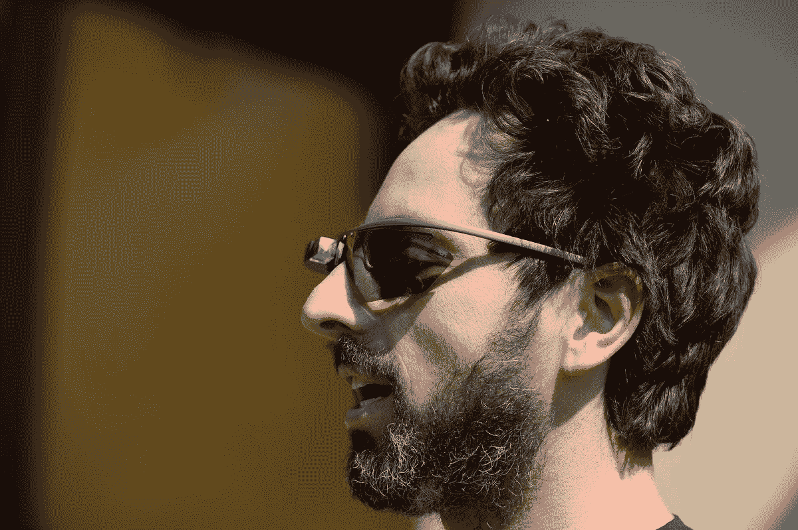
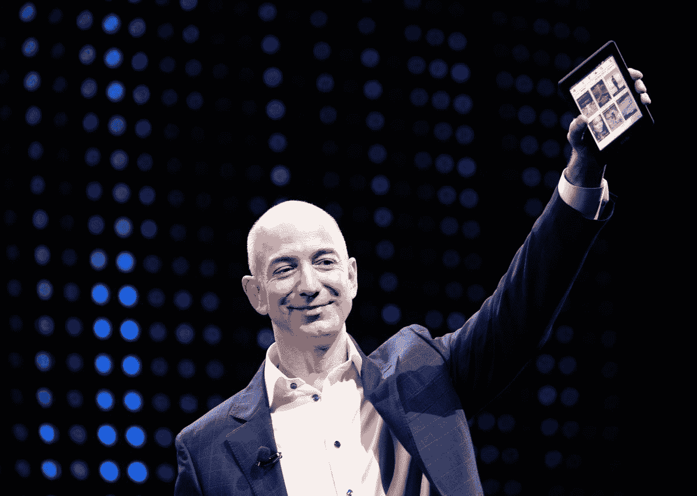
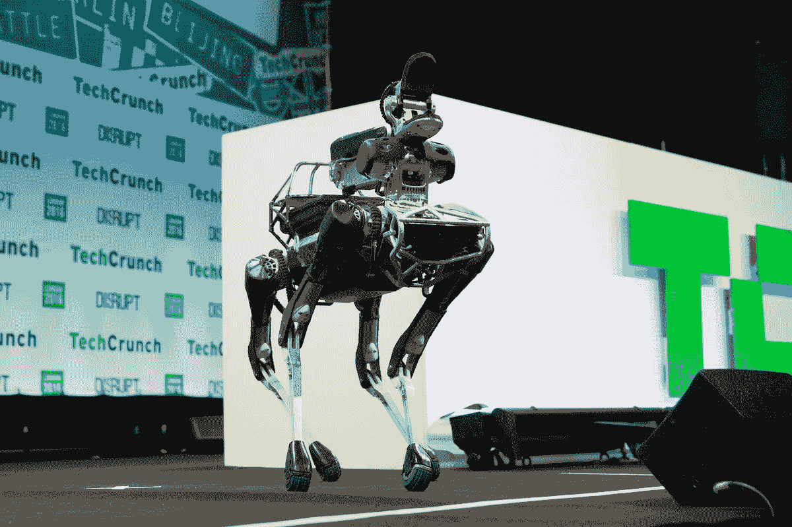
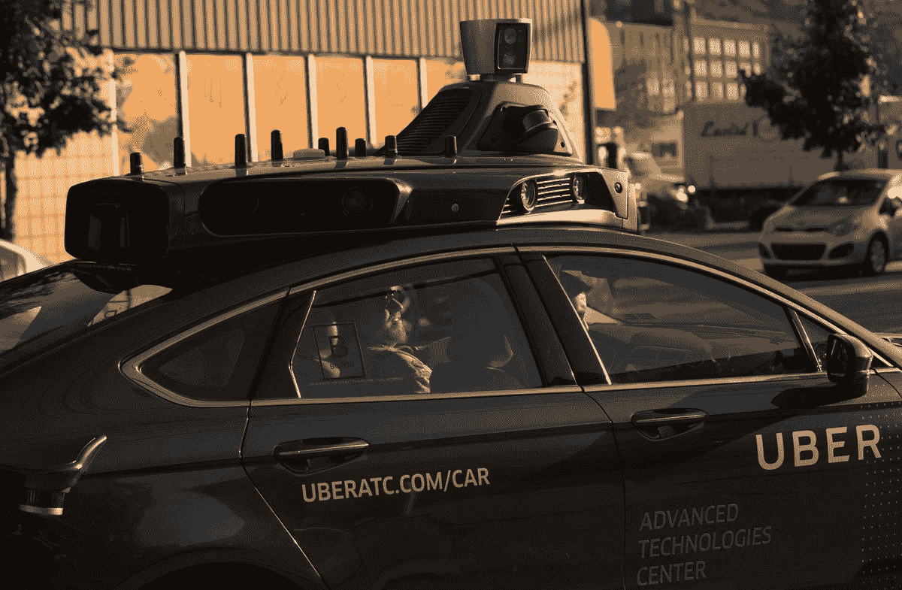

# 亚马逊如何以谷歌和苹果无法做到的方式创新——Vox

> 原文：<https://www.vox.com/new-money/2016/12/28/13889840/amazon-innovation-google-apple?utm_source=wanqu.co&utm_campaign=Wanqu+Daily&utm_medium=website>

亚马逊的声控扬声器 Echo 在这个假期大受欢迎。亚马逊对具体的销售数字保密，但该公司表示，其在假期期间销售的 Echo 设备是去年同期的九倍。

这是亚马逊开创一个新的产品类别，然后继续主导它的最新例子。凭借 Kindle 系列电子阅读器，亚马逊已经成为电子书市场的领导者。它主导了云计算市场的一个重要领域；亚马逊网络服务预计今年将为 T2 带来 120 亿美元的收入。

明年，亚马逊希望开始为实体零售做类似的事情。该公司最近推出了 Amazon Go T1，这是一家便利店，其无结账技术可能会彻底改变零售业。

简而言之，亚马逊在各种不同的产品类别中表现出了非凡的成功能力。这与大多数其他知名科技公司形成了鲜明对比，这些公司在一个领域确实很好——谷歌占主导地位的在线服务或苹果利润丰厚的硬件——但当对增长的追求将它们推出核心竞争力区时，它们就会陷入困境。

“大公司有创新的机会，”作家兼创业大师埃里克·里斯说。“但很少有大公司在这方面做得很好。亚马逊就是其中之一。”

亚马逊已经想出了如何将小公司的创业文化与大公司的金融资源结合起来。这使得它能够解决大多数其他公司无法解决的问题。

### 大多数科技公司都在舒适区之外苦苦挣扎

<picture class="c-picture" data-cid="site/picture_element-1668358377_1857_14841" data-cdata="{&quot;asset_id&quot;:7713625,&quot;ratio&quot;:&quot;*&quot;}"><source srcset="https://cdn.vox-cdn.com/thumbor/VegHaw1dshJi8KvRc7jTQs47-gI=/0x0:3000x1997/320x0/filters:focal(0x0:3000x1997):format(webp):no_upscale()/cdn.vox-cdn.com/uploads/chorus_asset/file/7713625/148238897.jpg 320w, https://cdn.vox-cdn.com/thumbor/S1cj9utW-iYyEHJZt9GBu8zRQsM=/0x0:3000x1997/520x0/filters:focal(0x0:3000x1997):format(webp):no_upscale()/cdn.vox-cdn.com/uploads/chorus_asset/file/7713625/148238897.jpg 520w, https://cdn.vox-cdn.com/thumbor/B7domI5_R5DHMW6vfQk9DYk3eOQ=/0x0:3000x1997/720x0/filters:focal(0x0:3000x1997):format(webp):no_upscale()/cdn.vox-cdn.com/uploads/chorus_asset/file/7713625/148238897.jpg 720w, https://cdn.vox-cdn.com/thumbor/ONKBiIvBFfHEShnyP0k4IfFw4c4=/0x0:3000x1997/920x0/filters:focal(0x0:3000x1997):format(webp):no_upscale()/cdn.vox-cdn.com/uploads/chorus_asset/file/7713625/148238897.jpg 920w, https://cdn.vox-cdn.com/thumbor/eLqYN78ND64Oa4Qc2kvhebBL5rk=/0x0:3000x1997/1120x0/filters:focal(0x0:3000x1997):format(webp):no_upscale()/cdn.vox-cdn.com/uploads/chorus_asset/file/7713625/148238897.jpg 1120w, https://cdn.vox-cdn.com/thumbor/hwz1WrrsC1LkTEzEUk2eYYSX_rA=/0x0:3000x1997/1320x0/filters:focal(0x0:3000x1997):format(webp):no_upscale()/cdn.vox-cdn.com/uploads/chorus_asset/file/7713625/148238897.jpg 1320w, https://cdn.vox-cdn.com/thumbor/TqYXazQmo9hxd3a_G1yQCgGYya8=/0x0:3000x1997/1520x0/filters:focal(0x0:3000x1997):format(webp):no_upscale()/cdn.vox-cdn.com/uploads/chorus_asset/file/7713625/148238897.jpg 1520w, https://cdn.vox-cdn.com/thumbor/0DWP1LgDe0jCaA2fJGc7iFRMbK8=/0x0:3000x1997/1720x0/filters:focal(0x0:3000x1997):format(webp):no_upscale()/cdn.vox-cdn.com/uploads/chorus_asset/file/7713625/148238897.jpg 1720w, https://cdn.vox-cdn.com/thumbor/hMZ8hgt8ULGIiYCAslc9adnS_G8=/0x0:3000x1997/1920x0/filters:focal(0x0:3000x1997):format(webp):no_upscale()/cdn.vox-cdn.com/uploads/chorus_asset/file/7713625/148238897.jpg 1920w" sizes="(min-width: 1221px) 846px, (min-width: 880px) calc(100vw - 334px), 100vw" type="image/webp">  </picture>   

Google co-founder Sergey Brin with an early prototype of Google Glass.

<cite>Photo by Kevork Djansezian/Getty Images</cite>

谷歌在 2000 年代创造或收购了一系列令人瞩目的热门产品，包括 Gmail、谷歌地图、谷歌文档、YouTube、Android 和 Chrome。这些产品有许多共同之处。大多数是在线服务，如谷歌最初的搜索引擎。两个主要的例外——Android 和 Chrome——是帮助人们访问谷歌在线服务的软件。

在 2010 年代，谷歌变得更加雄心勃勃，资助了一系列“登月计划”，旨在解决与该公司传统的在线服务重点相去甚远的重大技术问题。事实上，谷歌联合创始人拉里·佩奇(Larry Page)和谢尔盖·布林(Sergey Brin)对这一使命的感受如此强烈，以至于他们重组了谷歌，创建了一家名为 Alphabet 的新母公司，作为 moonshot 项目的保护伞。

但到目前为止，谷歌在这些努力上几乎没有什么表现。谷歌眼镜是一次失败。该公司在过去 6 年里开发了一些令人印象深刻的自动驾驶技术，但仍未将其转化为商业产品。谷歌在 2014 年收购了 Nest，但是[该公司一直在努力拓展智能恒温器之外的业务。谷歌在 2014 年收购了一些机器人初创公司，但](http://www.vox.com/2016/4/7/11378904/nest-tony-fadell-struggling)[还没有想好如何处置它们](https://www.technologyreview.com/s/601085/google-hasnt-given-up-on-robots/)，最终将其中一家挂牌出售。

这里的一个大问题似乎是，佩奇和他的公司过于专注于解决技术难题。例如，围绕一副眼镜创建一个新的计算机平台是一个艰难而有趣的技术挑战。但是解决了这个问题就能生产出可行的产品，这一点从来都不清楚。

谷歌最有希望的“登月计划”是其自动驾驶汽车项目，该项目被广泛认为是技术领导者。但是该项目的高级工程师已经对该公司缓慢的上市速度失去了耐心。一个由谷歌工程师组成的团队离开谷歌，成立了奥托公司，这是一家自动驾驶卡车公司，今年早些时候被优步收购。谷歌自动驾驶汽车项目的负责人克里斯·厄姆森[最近辞职创建了自己的自动驾驶汽车初创公司](http://www.recode.net/2016/12/10/13905292/google-car-chris-urmson-new-company)。

同样，机器人学也是计算机科学研究的一个重要领域。但是，人们从来不清楚谷歌会对一大批机器人创业公司做什么。当时的想法似乎是，谷歌将首先获得最优秀的人才，然后拿出一个赚钱的计划。

当然，谷歌的无人驾驶汽车项目或其他登月项目可能会产生惊人的商业成功，从而证明其他失败的代价是合理的。但至少到目前为止，谷歌向在线服务以外的市场扩张的努力还没有取得多少成果。

### 亚马逊专注于满足用户需求

<picture class="c-picture" data-cid="site/picture_element-1668358377_8318_14842" data-cdata="{&quot;asset_id&quot;:7713649,&quot;ratio&quot;:&quot;*&quot;}"><source srcset="https://cdn.vox-cdn.com/thumbor/uSYlSxxq3_bgSC1PaDeFfoI9Ftk=/0x0:3000x2137/320x0/filters:focal(0x0:3000x2137):format(webp):no_upscale()/cdn.vox-cdn.com/uploads/chorus_asset/file/7713649/151365077.jpg 320w, https://cdn.vox-cdn.com/thumbor/bTfVgs3_SVkCRML6ccKY0oS7XhE=/0x0:3000x2137/520x0/filters:focal(0x0:3000x2137):format(webp):no_upscale()/cdn.vox-cdn.com/uploads/chorus_asset/file/7713649/151365077.jpg 520w, https://cdn.vox-cdn.com/thumbor/pW3NXvdZ8PJQf3r-3YsELLrqyZI=/0x0:3000x2137/720x0/filters:focal(0x0:3000x2137):format(webp):no_upscale()/cdn.vox-cdn.com/uploads/chorus_asset/file/7713649/151365077.jpg 720w, https://cdn.vox-cdn.com/thumbor/gXMJ4caAaOBBl6nxTEmTRwuhB_I=/0x0:3000x2137/920x0/filters:focal(0x0:3000x2137):format(webp):no_upscale()/cdn.vox-cdn.com/uploads/chorus_asset/file/7713649/151365077.jpg 920w, https://cdn.vox-cdn.com/thumbor/qsdqyvSexwZysfoT1Pu2HBHBh1A=/0x0:3000x2137/1120x0/filters:focal(0x0:3000x2137):format(webp):no_upscale()/cdn.vox-cdn.com/uploads/chorus_asset/file/7713649/151365077.jpg 1120w, https://cdn.vox-cdn.com/thumbor/yvJkSXyZYGQoqwmXhvZPHh2pSOg=/0x0:3000x2137/1320x0/filters:focal(0x0:3000x2137):format(webp):no_upscale()/cdn.vox-cdn.com/uploads/chorus_asset/file/7713649/151365077.jpg 1320w, https://cdn.vox-cdn.com/thumbor/MdWSrEUAFnVBR5NUcnuN_9nrWZ8=/0x0:3000x2137/1520x0/filters:focal(0x0:3000x2137):format(webp):no_upscale()/cdn.vox-cdn.com/uploads/chorus_asset/file/7713649/151365077.jpg 1520w, https://cdn.vox-cdn.com/thumbor/22EZLKGH4p9lBtl8xOIYElPv4gE=/0x0:3000x2137/1720x0/filters:focal(0x0:3000x2137):format(webp):no_upscale()/cdn.vox-cdn.com/uploads/chorus_asset/file/7713649/151365077.jpg 1720w, https://cdn.vox-cdn.com/thumbor/ijasA6DKxlA4LyURIJYpbgjG9ng=/0x0:3000x2137/1920x0/filters:focal(0x0:3000x2137):format(webp):no_upscale()/cdn.vox-cdn.com/uploads/chorus_asset/file/7713649/151365077.jpg 1920w" sizes="(min-width: 1221px) 846px, (min-width: 880px) calc(100vw - 334px), 100vw" type="image/webp">  </picture>   

Jeff Bezos with a Kindle

<cite>Photo by David McNew/Getty Images</cite>

谷歌的方法——先解决技术难题，再考虑商业模式——植根于谷歌创始人拉里·佩奇和谢尔盖·布林的工程背景。相比之下，亚马逊首席执行官杰夫·贝索斯在创办亚马逊之前为几家华尔街公司工作了近十年——这一背景使他更加务实，更加专注于开发客户真正愿意购买的产品。

贝佐斯一直致力于在亚马逊创造一种乐于尝试的文化。

“我知道一些例子，一个随机的亚马逊工程师提到‘嘿，我在博客上看到一个想法，我们应该这么做，’”Eric Ries 说。”接下来他所知道的是，工程师被要求向执行委员会推销。杰夫·贝索斯当场决定。”

里斯说，成功的一个关键因素是实验从小规模开始，随着时间的推移而增长。在一家普通的公司，当首席执行官认可一个想法时，它就会成为整个公司的焦点，这就导致了在不成功的想法上浪费大量资源。相比之下，亚马逊创建了一个小团队来试验这个想法，并找出它是否可行。贝佐斯制定了著名的“双披萨团队”规则，该规则规定团队应该足够小，能够吃到两个披萨。

里斯说，新团队获得有限的资金和明确的里程碑；如果一个团队在较小的挑战中取得成功，它将获得更多的资源和更大的挑战。

但是亚马逊并没有在内部测试上花太多时间。一位工程师在 2011 年的一次史诗般的咆哮中写道“他们优先考虑尽早发布，而不是其他任何事情”,他将亚马逊的文化与其他科技公司进行了比较。尽早推出 Ries 所谓的“最低可行产品”,可以让亚马逊尽快了解一个在纸上听起来不错的想法在现实世界中是否是一个好主意。

当然，这种方法不是万无一失的；亚马逊经历了很多失败，比如其灾难性的进军智能手机市场。但通过尽快将产品送到付费客户手中，并认真对待他们的反馈，亚马逊避免了浪费数年时间开发不符合真正客户需求的产品。

这似乎是亚马逊对其新的便利店概念 Amazon Go 采取的方法。这是一种可以在许多不同类型的零售店中工作的技术，但亚马逊最初的方法是适度的:一个单一的、相对较小的便利店。媒体报道暗示亚马逊[计划开设 2000 家零售店](http://www.wsj.com/articles/amazon-grocery-store-concept-to-open-in-seattle-in-early-2017-1480959119)，但该公司[对此](http://www.theverge.com/2016/12/8/13883304/amazon-says-no-plans-2000-grocery-stores)提出异议。毕竟，亚马逊的方式不是开一家店，因为它有开 2000 家的计划。就是开一家店，如果第一家成功的话，再开上千家*。*

### 为什么大量资源通常不会带来创新

<picture class="c-picture" data-cid="site/picture_element-1668358377_6397_14843" data-cdata="{&quot;asset_id&quot;:7713727,&quot;ratio&quot;:&quot;*&quot;}"><source srcset="https://cdn.vox-cdn.com/thumbor/S_f5OML8yUCCJFphs7k_xsGsqs0=/0x0:4848x3228/320x0/filters:focal(0x0:4848x3228):format(webp):no_upscale()/cdn.vox-cdn.com/uploads/chorus_asset/file/7713727/627820168.jpg 320w, https://cdn.vox-cdn.com/thumbor/XK7bGld1uJPlUNf3ExtDsrFcEvg=/0x0:4848x3228/520x0/filters:focal(0x0:4848x3228):format(webp):no_upscale()/cdn.vox-cdn.com/uploads/chorus_asset/file/7713727/627820168.jpg 520w, https://cdn.vox-cdn.com/thumbor/IEz3P1gAYHNHOQ0pY_RwhPDZk54=/0x0:4848x3228/720x0/filters:focal(0x0:4848x3228):format(webp):no_upscale()/cdn.vox-cdn.com/uploads/chorus_asset/file/7713727/627820168.jpg 720w, https://cdn.vox-cdn.com/thumbor/jKqEkC-8r96Yftg3nLVBVnyjigE=/0x0:4848x3228/920x0/filters:focal(0x0:4848x3228):format(webp):no_upscale()/cdn.vox-cdn.com/uploads/chorus_asset/file/7713727/627820168.jpg 920w, https://cdn.vox-cdn.com/thumbor/qjekKkQoSFXY6g-jCXwVjwJWUYc=/0x0:4848x3228/1120x0/filters:focal(0x0:4848x3228):format(webp):no_upscale()/cdn.vox-cdn.com/uploads/chorus_asset/file/7713727/627820168.jpg 1120w, https://cdn.vox-cdn.com/thumbor/xpx-wKG2GIKN6efguOigc9QDQL8=/0x0:4848x3228/1320x0/filters:focal(0x0:4848x3228):format(webp):no_upscale()/cdn.vox-cdn.com/uploads/chorus_asset/file/7713727/627820168.jpg 1320w, https://cdn.vox-cdn.com/thumbor/rhbcHTyh9DpJRL_mzR5vfhcsiw4=/0x0:4848x3228/1520x0/filters:focal(0x0:4848x3228):format(webp):no_upscale()/cdn.vox-cdn.com/uploads/chorus_asset/file/7713727/627820168.jpg 1520w, https://cdn.vox-cdn.com/thumbor/jRY8UQ7FR8jway1r7DEA9pJEZO8=/0x0:4848x3228/1720x0/filters:focal(0x0:4848x3228):format(webp):no_upscale()/cdn.vox-cdn.com/uploads/chorus_asset/file/7713727/627820168.jpg 1720w, https://cdn.vox-cdn.com/thumbor/O5in1GvV8Yi2LL0OD7S_U7sArhQ=/0x0:4848x3228/1920x0/filters:focal(0x0:4848x3228):format(webp):no_upscale()/cdn.vox-cdn.com/uploads/chorus_asset/file/7713727/627820168.jpg 1920w" sizes="(min-width: 1221px) 846px, (min-width: 880px) calc(100vw - 334px), 100vw" type="image/webp">  </picture>   

Boston Dynamics, which builds robots like this one, is reportedly being put up for sale by Alphabet.

<cite>Photo by John Phillips/Getty Images for TechCrunch</cite>

从理论上来说，这种方法——尽量减少官僚主义，从小实验开始，如果成功就扩大它们——听起来太好了，以至于几乎是老生常谈。但是对于大公司来说，要做到这一点非常困难，尤其是当他们进入新市场的时候。

随着时间的推移，大公司发展出了针对他们最初成功的市场而优化的文化和流程。公司有一种在整个企业内建立统一标准的自然趋势。2010 年，当我在谷歌做工程实习生的时候，我花了很多时间学习如何使用该公司强大的专有软件工具套件。谷歌员工被期望在各种各样的项目中使用这些工具。这种方法在创建一种新的在线服务时非常有效，这种服务类似于早期的热门搜索或 Gmail。但是，如果谷歌团队试图建立一个与搜索引擎非常不同的东西，这些工具可能会成为一个障碍。

你可以对苹果公司提出类似的观点。该公司以其优雅的用户界面而闻名，这反映了设计师——而不是工程师或项目经理——在公司开发过程中的核心作用。这是开发像 iPhone 或 Apple Watch 这样的用户友好型产品的好方法，但它不一定适用于其他产品类别。苹果[奋斗了数年](http://www.vox.com/cards/apple/why-is-apple-so-bad-at-making-online-services)才使其 iCloud 服务(以及像 Mac 和 MobileMe)可靠。

相比之下，杰夫·贝索斯热衷于让团队彼此独立运作。团队在亚马逊使用什么技术并不重要，[公司的一名前工程师在 2011 年写道](https://plus.google.com/+RipRowan/posts/eVeouesvaVX)。贝佐斯明确反对你在谷歌和苹果等公司看到的那种标准化，鼓励团队使用最有意义的技术独立运作。

贝佐斯努力使亚马逊成为一个模块化、灵活的组织，公司范围内的政策最少。这使得亚马逊的内部文化有些混乱和割据。一个亚马逊项目的工程师不能像在谷歌或苹果那样轻易地跳到另一个项目。不同文化的团队之间的摩擦可以解释为什么有些人觉得亚马逊是一个压力很大的工作场所。

但这种混乱的文化也有利于创新。一个新团队可以使用最有意义的工具和流程，而不是感受到符合公司范围标准的压力。

### 亚马逊为下一个十年的创新做好了准备

<picture class="c-picture" data-cid="site/picture_element-1668358377_1461_14844" data-cdata="{&quot;asset_id&quot;:7713733,&quot;ratio&quot;:&quot;*&quot;}"><source srcset="https://cdn.vox-cdn.com/thumbor/X-r9ctcaY8MErXLhAEUwWAX-688=/0x0:4200x2748/320x0/filters:focal(0x0:4200x2748):format(webp):no_upscale()/cdn.vox-cdn.com/uploads/chorus_asset/file/7713733/609845734.jpg 320w, https://cdn.vox-cdn.com/thumbor/t24CS2iv6cIbp_7A1-bevgJ0_LE=/0x0:4200x2748/520x0/filters:focal(0x0:4200x2748):format(webp):no_upscale()/cdn.vox-cdn.com/uploads/chorus_asset/file/7713733/609845734.jpg 520w, https://cdn.vox-cdn.com/thumbor/RDuo19Fan4ilUS6npsAG5uhlOoU=/0x0:4200x2748/720x0/filters:focal(0x0:4200x2748):format(webp):no_upscale()/cdn.vox-cdn.com/uploads/chorus_asset/file/7713733/609845734.jpg 720w, https://cdn.vox-cdn.com/thumbor/4U_1RhMDfD060zsjC-mUC7dVD7M=/0x0:4200x2748/920x0/filters:focal(0x0:4200x2748):format(webp):no_upscale()/cdn.vox-cdn.com/uploads/chorus_asset/file/7713733/609845734.jpg 920w, https://cdn.vox-cdn.com/thumbor/l-ZuUVntfzilvBkevlNGCzaS-hs=/0x0:4200x2748/1120x0/filters:focal(0x0:4200x2748):format(webp):no_upscale()/cdn.vox-cdn.com/uploads/chorus_asset/file/7713733/609845734.jpg 1120w, https://cdn.vox-cdn.com/thumbor/I3LdqhFUvzZF6hUBzFh1YjMYlpM=/0x0:4200x2748/1320x0/filters:focal(0x0:4200x2748):format(webp):no_upscale()/cdn.vox-cdn.com/uploads/chorus_asset/file/7713733/609845734.jpg 1320w, https://cdn.vox-cdn.com/thumbor/xfELTDlt16EysMKBHvD96EtgSSY=/0x0:4200x2748/1520x0/filters:focal(0x0:4200x2748):format(webp):no_upscale()/cdn.vox-cdn.com/uploads/chorus_asset/file/7713733/609845734.jpg 1520w, https://cdn.vox-cdn.com/thumbor/I_74thhQYQbmfOVXMKspqmI0XBE=/0x0:4200x2748/1720x0/filters:focal(0x0:4200x2748):format(webp):no_upscale()/cdn.vox-cdn.com/uploads/chorus_asset/file/7713733/609845734.jpg 1720w, https://cdn.vox-cdn.com/thumbor/oqm-VGEwoueBYuLqIlRx-PJjc0A=/0x0:4200x2748/1920x0/filters:focal(0x0:4200x2748):format(webp):no_upscale()/cdn.vox-cdn.com/uploads/chorus_asset/file/7713733/609845734.jpg 1920w" sizes="(min-width: 1221px) 846px, (min-width: 880px) calc(100vw - 334px), 100vw" type="image/webp">  </picture>   <cite>Photo by Jeff Swensen/Getty Images</cite> 

亚马逊的组织选择意义重大的原因是，大公司有很多机会模仿初创公司的最佳特征。

Amazon Go 就是一个很好的例子。很难想象一个小的创业公司能做到这一点。让商店运转的技术——使用相机和其他传感器跟踪顾客的每一步，并在他从货架上拿走一件商品时立即检测到——是计算机科学的一项复杂成就，无疑需要数百万美元的开发成本。为了收回这些投资，亚马逊将不得不花费数年——甚至数百万年——在一个利润率并不丰厚的行业开店。这需要创业公司少有的雄厚财力和长远眼光。

早在 20 世纪 90 年代和 21 世纪初，高科技的前沿就在网络上。将一个网站从数百名用户扩展到数百万名用户在技术上具有挑战性，但这不一定需要庞大的团队或大量的物理基础设施。这就是为什么像谷歌和脸书这样的公司从一无所有成长为数十亿美元的公司。

相比之下，下一代创新可能与物理世界和传统行业联系更紧密:合租公寓、无人驾驶汽车、零售店、医疗创新等等。

谷歌、优步、特斯拉和传统汽车公司都在研究自动驾驶技术。为了在这个市场取得成功，公司必须将软件、硬件、复杂的地图和应对复杂监管问题的策略结合在一起——这种结合对于独立的初创公司来说可能太难管理了。

亚马逊和谷歌都在研究无人机送货技术，这种技术有类似的硬件、软件和监管挑战。这些公司现有的金融、技术和游说基础设施将让它们在这些市场中占据优势。

解决这个难题的一个方法是，大型科技公司在初创公司成长的早期收购它们。这使得初创公司的创新能够与大公司的资源相结合。优步[在自动驾驶卡车初创公司 Otto](http://www.theverge.com/2016/8/18/12533736/uber-otto-trucks-acquisition-anthony-levandoswski) 成立不到一年就收购了它。[今年 3 月，通用汽车为自动驾驶汽车初创公司 Cruise 支付了 10 亿美元](http://www.theverge.com/2016/3/11/11195808/gm-cruise-automation-self-driving-acquisition)。

但是，对于像谷歌或优步这样的大公司来说，收购快速增长的初创公司是保持领先地位的一种非常昂贵的方式。而且在很多情况下，这种策略甚至行不通。谷歌以 20 亿美元收购 Nest 本应加速该公司的增长，但结果却是该公司在字母表的保护伞下苦苦挣扎。

这就是亚马逊在内部培育创业项目上取得明显成功的重要原因。亚马逊不需要如此严重地依赖昂贵和高风险的收购，因为它已经在内部开发了一个培养创业项目的系统。随着技术侵入现实世界，这类创业项目将会有越来越多的机会。

**披露:**我的 [**哥哥**](https://twitter.com/startupandrew) 作品 [**在谷歌**](https://www.firebase.com/blog/2014-10-21-firebase-joins-google.html) 。

### 

**[帮助保持这样的文章免费](http://vox.com/pages/support-now?itm_campaign=Nov-2022-midterms&itm_medium=site&itm_source=article-footer%20)**

理解美国的政治领域可能会让人不知所措。这就是 Vox 的用武之地。我们的目标是给每一个想要的人提供研究驱动的、智能的、可访问的信息。

【读者礼物】通过帮助保持我们的工作自由来支持这一使命——无论我们是为意想不到的事件添加微妙的背景，还是解释我们的民主是如何走到这一步的。虽然我们致力于保持 Vox 免费，但我们独特的解释性新闻确实需要大量资源。单靠广告不足以支撑它。[今天就为 Vox 制作一份礼物，帮助所有人保持这样的免费工作。](http://vox.com/pages/support-now?itm_campaign=Nov-2022-midterms&itm_medium=site&itm_source=article-footer)

 [是的，我会给 250 美元/年](https://vox.memberful.com/checkout?plan=) 

是的，我会给 250 美元/年

我们接受信用卡、Apple Pay 和 T2 Google Pay。您也可以通过投稿

