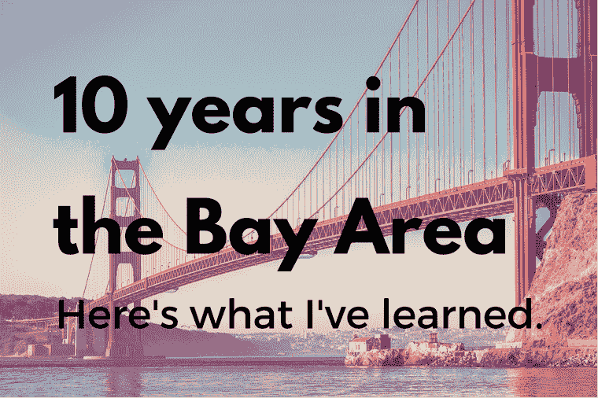

# 在湾区的 10 年——我在安德鲁森学到的

> 原文：<http://andrewchen.co/10-years/?utm_source=wanqu.co&utm_campaign=Wanqu+Daily&utm_medium=website>

2007 年 1 月
十年前的这个星期，我在 1 号高速公路上从西雅图驱车前往硅谷，开始了一份新工作和新生活。我还不到 24 岁，急于改变世界，渴望开始我在硅谷风险投资公司 MDV 的第一天，成为他们新的常驻企业家。那是 2007 年，iPhone 还没有发布，YCombinator 刚刚起步，MySpace 还比脸书大。人们谈论的奥巴马是谁？

那是很久以前的事了:)

十年后，世界变得不可思议的不同。我也不一样了，因为湾区从根本上深刻地改变了我。一路走来，有好的决定，也有很多坏的决定。我想分享一些高水平的观察/想法，主要集中在职业/专业方面，但也有一点私人的。

让我们把这篇文章献给所有在湾区开始工作的新人们。欢迎光临！

**人是秘方**
首先，旧金山湾区之所以对科技公司如此特别，是因为人。当我第一次来到这里时，我几乎不认识任何人，所以我在 2007 年有一个简单的目标:

> 每天都要认识 5 个新朋友。

在风险投资公司工作就是建立关系网，这很有帮助，所以我选择了积极的目标！我开始给我的技术朋友发电子邮件，向他们介绍开发酷产品的聪明人。在和他们喝咖啡的时候，我继续要求更多的介绍。我保持这种疯狂的速度 6 个月，这创造了一个不可思议的 SF 技术社区介绍。

几年后，虽然我不再是这本书的作者，但我仍在继续！这是最棒的学习方式之一。最重要的是，虽然这是从工作开始的，但我在 2007 年遇到的许多人现在都是亲密的朋友。

考虑长远
十年后，你在这里遇到的每个人都可能还在这里。这改变了职业动态，因此我们可以互相帮助，建立关系，付出真正的时间/努力，而不会觉得事情必须是事务性的。投资能在几年或几十年，而不是几个月内获得回报的活动开始变得有意义。

我的写作也是这种情况的一个缩影，在最初的几个月里，总共可能有几十个读者——大多数是朋友和家人，强行订阅！这是一个缓慢/稳定的斜坡，需要数千小时的努力和多年才能成长为真正的追随者。所以，对于那些正在努力为你的时事通讯或博客争取受众的人们，继续努力吧！值了。

你在科技领域积累的经验越多，就越容易变得消极，拒绝接受新想法。说“不，那永远不会成功”是很容易的，因为经验通常是对一切失败的概括！

然而，每隔几年，就会有一个新的周期——社交、智能手机、拼车——这是违反直觉的，也是巨大的，打破了先前的假设。我写过为什么我怀疑脸书会成为十亿美元的生意，以及为什么我错了。我在旧金山湾区的这些年里，这只是众多错误电话中的一个:)

保持开放的心态需要真正的努力，即使你学得更多，对自己的专业知识感到舒适。IDEO 的人有时会说“vuja de”，这是一个熟悉术语的变形:

> 似曾相识是当你看到一个新的东西，但感觉你以前已经见过它。
> 
> Vuja de 是指你已经看过某样东西一百万次了，但还是第一次看到它。

试图理解奇怪的新公司/新类别需要很大的开放性和谦逊，尤其是当有糟糕的历史数据时。比如在谷歌出现之前，搜索引擎是多么糟糕的行业。社交网络也是如此。或者说手机一直是下一个新事物，但实际上是永恒的蒸汽软件，直到 iPhone 出现。

**错过的机会**
你在湾区住得越久，错过的机会就越多。我遇到脸书创始团队时，他们只有 11 个人，当时我想，在决定它永远不会做大之前，我应该试着在那里找份工作。大错特错。我有朋友可能在优步的种子基金估值 400 万美元的时候投资了它，但因为它“只是一款打车应用”而放弃了——哎呀。一位早期的谷歌员工告诉我，有一个人作为首批十名员工之一加入了谷歌，但他在第一天就辞职了，放弃了价值 1B 美元的股票，因为创始人的怪癖让他很恼火。

这些错过的机会会奇怪地困扰着你，即使你知道得更多。

从局外人的角度来看，我认为创业是一种神奇而罕见的经历，你一生中只有几次机会。这是一种浪漫的想法，我坚持了很多年。但一旦你在湾区呆了几年，你很快就会意识到，创办一家公司并让投资者为你提供资金，实际上一点也不罕见。这是司空见惯的，因为实际上平庸的创业公司和科技公司比比皆是！不幸的是，自己创办一家平庸的公司非常容易。

比尔·戈斯曼，一位在旧金山和西雅图都生活过的长期导师，在早期给了我一些建议:

> 不要以为硅谷有更好的企业家。他们没有。但是他们有更多的人尝试。他们有更多蹩脚的公司和平庸的企业家，但他们也有更多伟大的公司和人。

对我来说，这意味着我在湾区的头几年都在努力获得“难得”的创业机会。随着时间的推移，我开始相信，真正罕见的事情是建立亚马逊、谷歌、脸书、优步类型的公司，这些公司每 5-10 年才会出现一次。

去年，我决定进入一家大公司，而不是继续平庸的工作。这是这些天我在优步的一个核心原因——有一个我多年后都会记得的特殊经历。

**为了又一个十年！**
最后，我想感谢过去几年一直在阅读的每一个人。正如我上面提到的，写作是一件非常令人满足的事情。我非常感谢您的参与——感谢您多年来的阅读和评论/反馈。

祝我新年快乐，也祝我在湾区多待几十年:)

**PS. Get new updates/analysis on tech and startups**

我写一份高质量的每周时事通讯，报道硅谷发生的事情，关注创业、营销和移动领域。

在本网站链接的“内容”(包括帖子、播客、视频)中或在社交媒体和其他平台(统称为“内容分发渠道”)中发表的观点是我自己的，并不是 AH Capital Management、l . l . c .(“a16z”)或其各自附属公司的观点。AH 资本管理公司是一家在证券交易委员会注册的投资顾问公司。注册为投资顾问并不意味着任何特殊技能或培训。这些帖子不针对任何投资者或潜在投资者，也不构成出售或购买任何证券的要约，不得用于或依赖于评估任何投资的价值。

内容不应被解释为或以任何方式依赖于投资、法律、税务或其他建议。您应该向您自己的顾问咨询有关任何投资的法律、商业、税务和其他相关事宜。这些材料中表达的任何预测、估计、预测、目标、前景和/或观点可能会在不通知的情况下发生变化，并且可能与他人表达的观点不同或相反。此处提供的任何图表仅供参考，在做出任何投资决策时不应依赖。此处包含的某些信息来自第三方来源。虽然这些信息来自据信可靠的来源，但我并未独立核实这些信息，也未对这些信息的持久准确性或其在特定情况下的适当性做出任何陈述。该内容仅在所示日期有效。

在任何情况下，本网站或相关内容分销渠道上提供的任何帖子或其他信息都不应被解释为 a16z 人员发起、讨论或提及的任何集合投资工具中的任何证券或权益的购买或销售要约。也不应被理解为提供投资咨询服务的要约；投资 a16z 管理的集合投资工具的要约将单独提出，并且仅通过特定集合投资工具的保密要约文件提出，这些文件应完整阅读，并且仅提供给符合联邦证券法规定的特定资格的人。这些投资者被定义为合格投资者和合格购买者，通常被认为有能力评估潜在投资和财务事项的优点和风险。不能保证 a16z 的投资目标会实现或投资策略会成功。对 a16z 管理的投资工具的任何投资都包含很高的风险，包括损失全部投资金额的风险。提及、提及或描述的任何投资或投资组合公司并不代表 a16z 管理的所有投资工具，也不能保证这些投资将会盈利，也不能保证将来进行的其他投资会有类似的特征或结果。a16z 管理的基金所做的投资清单可在 https://a16z.com/investments/.获得。该清单不包括发行人未允许 a16z 公开披露的投资以及对公开交易的数字资产的未宣布投资。Andreessen Horowitz 投资、集合投资工具或投资策略的过去结果不一定代表未来结果。请参见[https://a16z.com/disclosures](https://a16z.com/disclosures)了解更多重要信息。