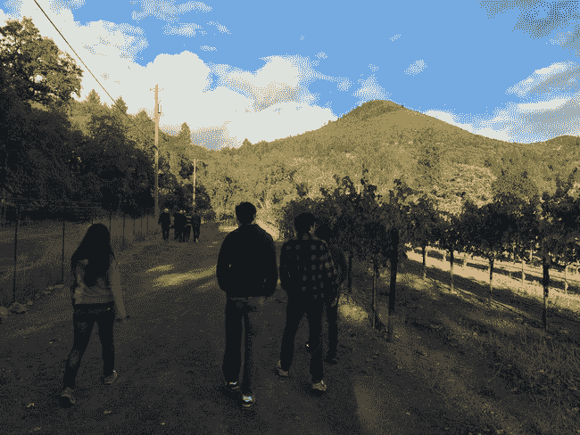
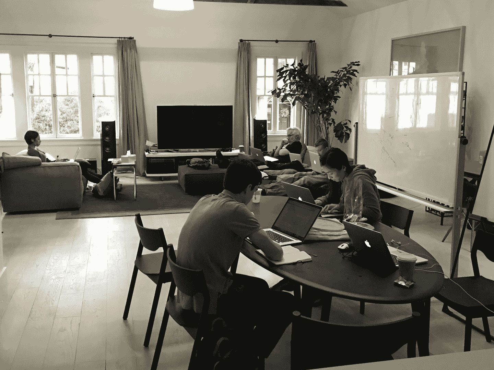
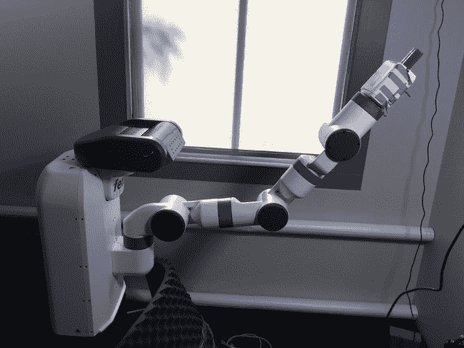
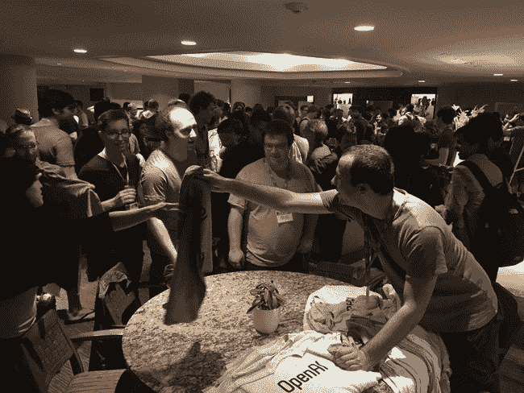
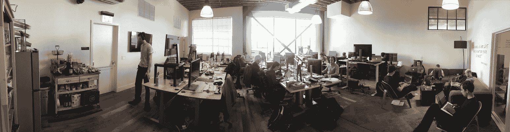
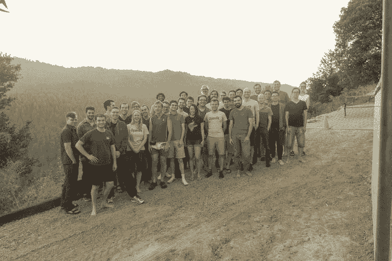

# #定义 CTO OpenAI

> 原文：<https://blog.gregbrockman.com/define-cto-openai?utm_source=wanqu.co&utm_campaign=Wanqu+Daily&utm_medium=website>

<time datetime="2017-01-09" class="article_time">January 9, 2017</time>

我写 [#define CTO](https://blog.gregbrockman.com/figuring-out-the-cto-role-at-stripe) 已经两年了，在那篇文章中，我记录了我对一个角色的追求，在这个角色中，我可以通过编写代码来产生可扩展的影响。我终于找到了那个角色，虽然不是通过寻找它——相反，我找到了一个对我来说比我在其中的角色更重要的问题，把合适的人聚集在一起，并发现我可以通过编写代码来最好地使他们有效。

# 队形 [#](#formation_1)

2015 年 8 月，OpenAI 只是一个在与**埃隆·马斯克**、**萨姆·奥特曼**、**伊利亚·苏茨基弗**、我和其他一些人的[晚餐](https://blog.gregbrockman.com/my-path-to-openai#the-dinner_1)上提出的想法。我们每个人都带着自己的想法来参加晚宴，但埃隆和萨姆有一个清晰的愿景，即在一个致力于造福人类的项目中构建安全的人工智能。我想尽我所能做出贡献。萨姆和我开始召集一个团队来把这个想法变成现实。

我们缺少一个核心要素:我们需要一个有远见的人工智能技术专家，我们可以跟随他的直觉和想法实现突破。

Ilya Sutskever 显然是这个世界上最好的人选。伊利亚最好被描述为通过机器学习(有时通过绘画)表达自己的艺术家。 [Geoff Hinton](http://www.cs.toronto.edu/%7Ehinton/) 曾经告诉我，引发计算机视觉深度学习革命的 [AlexNet](https://papers.nips.cc/paper/4824-imagenet-classification-with-deep-convolutional-neural-networks.pdf) ，是由于 [Alex Krizhevsky](http://www.cs.toronto.edu/%7Ekriz/) 的 GPU 编码技能和 Ilya 确信深度神经网络一定会在 [ImageNet](http://image-net.org/) 上获胜。(Geoff 很自豪贡献了一个管理绝招 [1](#fn1) 。)

我一直认为我只能和一个我已经认识多年的人共同创建一家公司。但是当伊利亚和我在八月下旬在山景城吃晚餐时，我知道这是可行的，尽管我们只是在七月相遇。伊利亚和我有一个极高带宽的互动。我不太了解机器学习研究，他也不太了解工程和团队建设，但我们每个人都对其他人的成就印象深刻，并希望相互学习。

我们的想法相辅相成。伊利亚认为顶级研究人员会希望在致力于为世界创造最佳结果的人工智能组织中工作，我一直认为将私营行业的资源与学术界的使命结合起来是解决其他棘手问题的方法。在没有干预的情况下，人工智能将像自动驾驶汽车一样发挥作用——一旦其潜力得到证明，合作的开始将伴随着技术竞赛。但人类水平的人工智能将是一项不同于任何其他技术的变革性技术，具有独特的风险和好处。在这里，我们看到了保持该领域合作的机会，并聚集了许多最好的研究人员，为历史上最重要的技术突破做出负责任的尝试。

伊利亚和我一起工作，直到启动定义该组织。我们讨论了战略(我们将致力于什么)、文化(我们希望雇佣什么样的人，同等重视工程和研究)和策略(举办一个每日阅读小组)。我们和艾伦·凯共进晚餐，他给我们讲述了施乐 PARC 公司建造 T2 奥拓 T3 的故事，以及用十年后价值 1000 美元的硬件“活在未来”的故事。事后，伊利亚恰如其分地总结了这顿饭:“我只理解了他说的 50%，但这一切都是那么鼓舞人心。”但那顿饭帮助我们验证了我们的许多假设，即怎样才能把工程和研究结合起来，成为一个有影响力的组织。

# 创始团队 [#](#founding-team_1)

因为伊利亚仍在谷歌，他无法帮助招聘。8 月到 11 月间，组建创始团队的工作落到了我的身上。我刚接触人工智能，不清楚如何找到并招募优秀的研究人员。我开始把注意力放在七月晚宴的参与者上，但是没能让任何人加入。我的下一步是通过我的关系网，依次向每个人征求推荐。这和我以前的招募方式不同。在创业公司，第一个挑战总是在使命中推销候选人，但在这里，使命立即引起了共鸣。挑战在于说服候选人相信这个尚未成形的组织。

该领域高层人员的密集网络帮了大忙。一个朋友把我介绍给安德烈·卡帕西和 T2，两人都很怀疑，因为我不是这个领域的人。约舒亚·本吉奥把我介绍给**杜尔克·金玛**，他暂时感兴趣。转折点是当一个朋友的朋友把我介绍给约翰·舒尔曼的时候——他立刻知道这个将学术界的开放性和使命与私营企业的资源结合起来的组织正是他所寻找的，并签了名。他的代言让安德烈和沃伊切赫备受关注。

雇佣工程师更容易。Trevor Blackwell 是一位机器人专家，也是 YC 的合伙人，他一直在和 Sam 谈论我们正在策划的这个疯狂的想法。 **Vicki Cheung** 在我们发起我们的赞助组织 [YC 研究](http://ycr.org/)后提出申请:我们甚至没有宣布我们正在研究人工智能，但她受到了 YC 研究的结构的启发，并兴奋地致力于任何需要的工作。

# 固化 [#](#solidifying_1)

到 11 月初，我们对创始团队有了强烈的感觉，但我们仍然需要让每个人都正式加入。在山姆的建议下，我们邀请了所有的候选人到场外。每个人都发自内心地点击，想法和愿景都在流动。(事实上，正是在这个地方，安德烈提出了最终成为[宇宙](https://universe.openai.com/)的想法。)我们的货车在回来的路上遇到了交通堵塞，但人们非常享受这次谈话，几乎没有注意到。

*在场外漫步。*
[T5】](https://svbtleusercontent.com/yzuhfxt0alhwrq.jpg)

我们向每一位与会者发出邀请，并将邀请的截止日期设为 12 月 1 日，这样我们就可以在 12 月初的 [NIPS](https://nips.cc/) 机器学习大会上发布。

就这样开始了“闭月”。萨姆、埃隆和我与每个潜在的团队成员聊了聊。我们的首要任务是让人们觉得这是真的发生了。每个候选人都接受了，除了一个决定完全放弃人工智能的工程师。

# 起转 [#](#spinup_1)

在《人月神话》中，弗雷德·布鲁克斯引用了罗伯特·海因莱茵的一个故事，讲述了一个到达月球 [2](#fn2) 的项目。该项目的总工程师经常被运营任务分心，例如关于卡车或电话的决定，直到他接受一份报告，其工作是从他的盘子中移除所有非技术任务。

这让我觉得这是运行人工智能项目的正确方式。技术领导应该在做实际技术工作的同时发号施令。我不知道什么时候会需要我的工程技能，与此同时，我决心尽一切努力把所有非研究任务从伊利亚的盘子里拿走。

1 月 4 日，团队来到我们的第一个办公室(我的公寓)开始工作。在讨论中，约翰和伊利亚准备在白板上写点什么，却发现我的公寓没有白板。我很快给他们准备了白板和其他他们需要的办公用品。

我们的第一间办公室，配有第一块白板。

在一月份剩下的时间里，我的职责是组织团队，帮助确定谁将做什么，以及我们想要完成什么。我们讨论了我们对研究人员的评价，用我们的结论来设计和运行一个采访过程。我们就我们的愿景、我们希望如何工作以及我们希望完成什么进行了交谈。Vicki 和我购买了服务器，创建了 Google Apps 账户，并对我们在 12 月份创建的 Kubernetes 集群进行了一些维护。

我把剩下的时间花在了阅读伊恩·古德菲勒(Ian Goodfellow)的深度学习(deep learning)[教材(T3)上。(这也是一种招聘策略，因为他对我的评论页面比他的官方评论页面更全面印象深刻。)](http://www.deeplearningbook.org/)

# 健身房 [#](#gym_1)

当一个新的数据集变得可用时，机器学习中的问题往往比当一个新的算法变得可用时更容易解决。Wojciech 建议建立一个图书馆来标准化[强化学习](http://karpathy.github.io/2016/05/31/rl/)环境(实际上是动态数据集)，现在叫做[体育馆](https://github.com/openai/gym)。这个代码库的质量很快成为我们迭代速度的最高位。在二月底，约翰和我讨论了公开发布需要多长时间。按照目前的轨迹，他认为这可能要持续到今年年底。

我们正在用机器学习训练一个[接](http://fetchrobotics.com/research/)的机器人。健身房支持控制[实体机器人](https://github.com/openai/rosbridge)以及模拟机器人。

突然间，工程成了研究进展的瓶颈。伊利亚和我交换了角色——他承担管理任务，这样我就可以专注于技术工作。在和约翰一起确定了工作范围后，我们知道我们可以在四月底建成图书馆。

在 Stripe，我发现了一种从无到有创建软件系统的可重复模式:一心一意专注于软件，排除所有干扰，从醒着一直工作到睡觉，这将激励其他人贡献他们最好的工作(重要的是，以输出质量而不是时间来衡量)。这是我感觉最有活力的时候:编码感觉就像变得真实的魔法，我能想象和描述的任何事情都成为可能。这种模式产生了 Stripe 的信用卡保险库(2010 年假期在我两周的家中建成)、信用卡授权流程(在三周内建成，而不是银行速度的 6-12 个月)，以及[夺旗](https://stripe.com/blog/ctf3-launch)比赛(通常是我工作的 3 周，加上其他人的总时间)。从战术上来说，我选择了一个“软”和一个“硬”的发布日期，间隔一两个星期；我从来没有过一个软的发布日期，但从来没有错过一个硬的。

这项工作带来了一个不熟悉的挑战:我不是领域专家。起初，这引起了很多摩擦。我会构建一个抽象来帮助 Wojciech 的工作流，而 John 会发现这妨碍了他的工作流。但是很快，我感觉到哪些选择会影响研究工作流程(比如人们如何记录指标)，哪些细节研究人员不会关心(比如人们如何记录视频)。在确定一个案例对研究是否重要之后，做出最佳选择需要一定的谦逊——我会给出五个可能的选择，而约翰会说其中四个不好。但是大部分的设计决策可以通过领域无关的软件工程直觉做出。

幸运的是，我不必单干。大约在发布前六周，曾和我一起在 Stripe 制作《CTF 3》的 Jonas Schneider 联系了我。没过几天，我们就在健身房合作了。他在德国，所以我们每天都要交接项目，日以继夜地工作。对一个已经建立了工作动力的人来说，有一种真正的魔力，如果我们从零开始，我们的密切合作就不会成功。

健身房开张后不久，在 ICLR 集会上分发 t 恤。
[T7】](https://svbtleusercontent.com/ebwnsziejle1q.jpg)

总的来说，机器学习系统可以被认为是机器学习的核心——通常是一种高级算法，需要伊恩书中的几章才能理解——周围是大量的软件工程。工程可以是围绕数据洗牌，提供围绕输入和输出的包装器，或者调度分布式代码，所有这些都作为黑盒与核心接口。当工程努力加上研究努力超过某个阈值时，机器学习就会取得进展。工程努力的每一个增量点(例如减少[宇宙](https://universe.openai.com/)延迟)都使我们的模型的问题逐渐变得更容易，并且有机会推动研究越过终点线。

# 宇宙 [#](#universe_1)

在 4 月份健身房启动后，Ilya 和我努力扩展我们的组织流程，在 Sam 和 Elon 每周访问期间的指导下定义我们的团队结构和目标。

在第一个实际办公室工作的团队。白板仍然存在，只是没有出现在这里。

我们的计划需要一个具有巨大多样性和复杂性的人工智能环境。Andrej 的建议是建立一个代理来控制网络浏览器，这看起来是一个正确的想法，但是他与 Selenium 发生了摩擦。我开始考虑利用 VNC 让代理从像素驱动整个桌面。

但是我们看到了这种方法的许多风险。例如，deep mind 2013 年的 [Atari 论文](https://www.cs.toronto.edu/%7Evmnih/docs/dqn.pdf)花了五十个小时从像素训练 Pong，我们的环境会比 Pong 更难。如果即使是小规模的实验也要花费我们几天的时间，那么我们永远不会取得进展。所以我们设定了一个内部目标，让代理在一小时内学会 Pong。(今天我们有了一个在十分钟内解决 Pong 的实现。)

和 Gym 一样，我专注于构建 VNC 系统，现在叫做[宇宙](https://universe.openai.com/)。与 Gym 不同，这个项目不是为了支持我们现有的研究风格，而是提出全新的问题。在这一点上，我们的每个团队都有领导，他们负责照顾他们的团队成员，我们的工程师之一，**唐杰**，已经带头招募。所以行政负担并没有完全落在伊利亚身上。这是幸运的，因为这让伊利亚可以为这个冒险项目的第一个版本制造代理。

从整个动作空间中随机抽样的宇宙代理(即它随机点击和按下按键)。见[宇宙发布贴](https://openai.com/blog/universe/#validating-infra)更多表现良好的代理人。

<video>您的浏览器不支持视频标签。</video>

Universe 是一个足够长的项目，我需要花时间来管理这个组织。我找到了一个适合我的平衡点。当我处于编码模式时，我是在时间块的基础上工作的:一个会议会消磨掉整个上午或下午的工作效率。如果我在上午和下午都有会议，我会因为晚上的高效编码而疲惫不堪。因此，我开始将我的会议限制在清晨或午饭后，任何一天的会议不超过三次，每隔一天的会议不超过一次。

构建 Universe 本身就是一项系统研究工作:虽然高级规范很简单(允许代理使用键盘/鼠标/屏幕)，但没有人尝试过构建类似的系统。VNC 早就允许人类控制一台远程机器，但没有解决方案可以通过编程一次控制几十台机器。当我们需要测量系统的端到端延迟时，Catherine Olsson 和我构建了一个系统，在图像中嵌入时间戳。有时挑战是非技术性的:当研究因有限的训练数据而受阻时，24 小时内**汤姆·布朗**就组建了一个承包商团队来玩游戏。或者有时它们只是模糊不清，比如当**乔纳森·格雷**注意到由于承包商的笔记本电脑 CPU 低，我们的承包商和人工智能之间的游戏动态可能会有所不同。有一天，我正在艰难地重新构建一些 JSON 基准规范，并意识到:我们需要重新构建这些规范，因为没有人曾经尝试在数千款游戏中对单个代理进行基准测试。在 OpenAI，即使是缓慢的工作也是基本的。

在接下来的几个月里，达里奥·阿莫代伊和 T2 领导了对宇宙的研究。他们都是夜猫子，很多个晚上我会和他们一起熬夜，解决他们遇到的任何问题。有时候我真希望我在床上，但是每个 bug 修复都让研究一次加快了几个小时。你的工作非常有说服力，允许研究人员提出人类从未提出过的问题。

*宇宙团队在我们现在的办公室开会。*

到发射时，宇宙团队已经增长到大约 20 人。它现在是一个旗舰项目，也是我们研究战略的核心部分(我们将很快准备好分享初步结果)。Universe 是一个例子，说明工程如何成为当今 ML 研究的瓶颈。这让我想知道为什么有那么几天我只需要读伊恩的书。

# 接下来是什么 [#](#what-comes-next_1)

我们现在是一个 40 人的组织，我们现在需要有人全职优化组织。自从 OpenAI 成立以来，我们一直在寻找合适的第一任经理。几个月前，山姆给我介绍了一位特别出色的工程执行人:**艾丽卡·莱因哈特**，她曾是行星实验室的产品工程总监，现在和他一起管理[voteplz.org](http://voteplz.org/)。在行星实验室，Erika 对端到端卫星成像系统有着最深刻的理解。她努力工作，把事情做好，被以前的同事一致描述为他们一起工作过的最聪明的人之一，并且非常受使命和影响的激励。所以萨姆和我启动了一个招募她的计划。

【2016 年 10 月初 OpenAI 团队闭关。
[T5】](https://svbtleusercontent.com/wfds31muayuq.jpg)

然而，最引人注目的宣传是在选举和宇宙发射之间，她来和我们一起工作。她发现自己的领导技能在这种环境下非常适用，就像我的工程技能一样。她告诉我，她确定自己想加入的那一刻是在第一次参议院关于人工智能的听证会上观看 [OpenAI 的证词](http://www.commerce.senate.gov/public/index.cfm/hearings?ID=042DC718-9250-44C0-9BFE-E0371AFAEBAB)——我们正处于一场重大技术变革的开端，做好这一点才是最重要的。

在 Stripe， [Marc Hedlund](https://blog.gregbrockman.com/figuring-out-the-cto-role-at-stripe#hiring-a-vp-engineering_1) 和我经常会遇到他在许多以前的组织中遇到的问题。他喜欢开玩笑说所有的公司都一样。有一个显著的事实:如果你缩小，他们都只是围绕一个目标组织起来的一群人。但是，每个组织都有一个与众不同的优势，这取决于它所解决的问题。

大多数创业公司创造一种技术，然后随着时间的推移进行运营和扩展。OpenAI 是一个创造新技术的工厂，这意味着我们必须构建公司来创造新的东西。我们有基础设施和大型代码库要维护，但它们通过软件工程和机器学习研究的结合来满足我们快速行动、创新和寻找新高度的需要。

OpenAI 是一个组织，CTO 的角色自然是我在这个世界上最爱的活动:编码。但即便如此，人仍然是我关注的焦点:到目前为止的旅程是一个社会故事，而不是一个技术故事。展望未来，这个角色是可持续的，因为我是一个神奇团队的一员，这个团队愿意共同处理海因莱茵短篇小说 [2](#fn2) 中的“卡车或电话”。我对伊利亚、萨姆、埃隆和其他所有让 OpenAI 实现的人感到无比的感激。

(顺便说一句，很有可能成为实现 OpenAI 的人之一——我们正在[招聘](https://jobs.lever.co/openai)。我们的工程项目千差万别，从基础设施/可靠性到抽象设计、分布式算法实施、数据可视化到仪表板创建。不需要机器学习背景。如果你对人工智能感兴趣，但还没准备好加入，看看我们的[研究请求](https://openai.com/requests-for-research/)。)

Eight hundred and forty-two

荣誉

Eight hundred and forty-two

荣誉

