# 如何命名你的品牌:顶级商业命名技巧和练习

> 原文：<https://99designs.com/blog/business/how-to-name-your-business/?utm_source=wanqu.co&utm_campaign=Wanqu+Daily&utm_medium=website>

当你在创业时，有很多决策要做。企业命名可能是你要做的第一个决定。你将如何称呼你的品牌？你将如何用一两句话来表达构成你品牌的一切？

企业名称是**而不是**走捷径的地方。想想看——你被品牌所吸引。古怪的品牌名称，已建立的品牌名称，外国品牌名称，简单的品牌名称。所有这些名字都有一个共同点:它们是*令人难忘的*品牌名称。

因此，当你为你的新公司打造完美的外观和感觉时，把注意力放在完美的名字上。这里有一些关于如何给你的企业命名的重要提示和练习，这样你的品牌名称就能在你的成功中发挥关键作用。

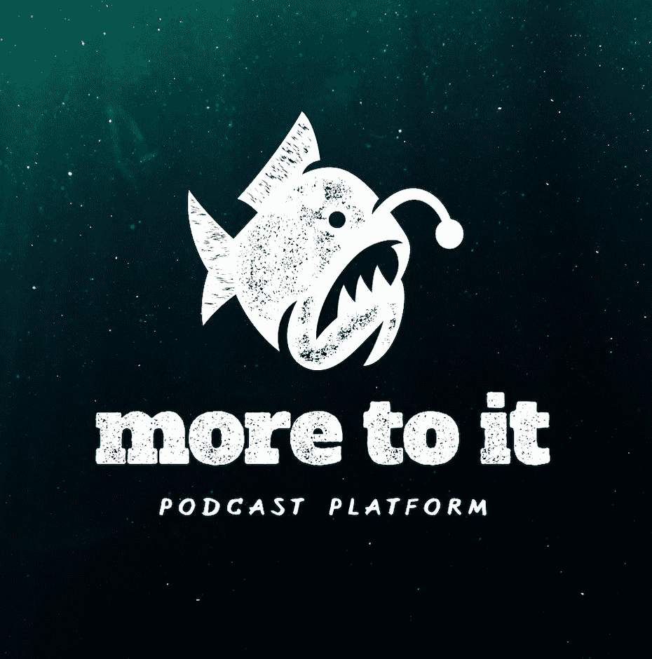

Logo design by [Sava Stoic](/profiles/savastoic)

## 为什么你的品牌名称如此重要？
—

你的企业名称就是你的身份。

你的企业不同于任何其他公司，即使有成百上千的其他企业提供与你完全一样的东西。

为什么？因为它是唯一一家由*你*经营的，也是唯一一家表达*你*独特品牌的。所以你的品牌名称需要反映这一点。

你的企业名称不仅会影响潜在客户对你品牌的看法，也会影响你所在行业的其他公司对你品牌的看法。这是你提供的一切和你的一切的简写——积极的*和消极的*。

Your business name shapes how the world sees your brand. Illustration by [OrangeCrush](/profiles/1193222)

这就是为什么你需要一个企业名称，它不仅要表达你的品牌形象，还要清晰响亮地向全世界展示。这是你品牌身份的一个关键部分，因为它不仅仅是人们会看到的资产，也是他们会听到的资产；它必须能传达你的品牌*和*很容易脱口而出。

## 企业命名考虑因素
—

说到企业命名，有很多要考虑的。在头脑风暴企业名称的想法时，请记住以下几点:

### 增长和旋转

随着你业务的增长，你的名字需要保持相关性。否则，你的企业可能会感到停滞不前，或者无法与客户沟通。

这就是为什么在你的企业名称中包含任何科技术语(贝尔电话，无线电小屋)会很棘手的原因之一——随着科技的进步，你转向新产品和服务，你的名字可能会过时。想想其他公司，如 Circuit City 和 Micro Center，是如何在他们的名字中使用不太具体但仍然科技化的术语的。

收购另一个品牌会让你在企业命名方面陷入一个棘手的境地。是不是简单的把被收购公司的资产换成自己的名字？把两个名字结合起来？在某些资产上留下旧名，以避免疏远长期粉丝？当 Lays 在 1989 年收购 Walkers 时，他们选择了第三种方案。

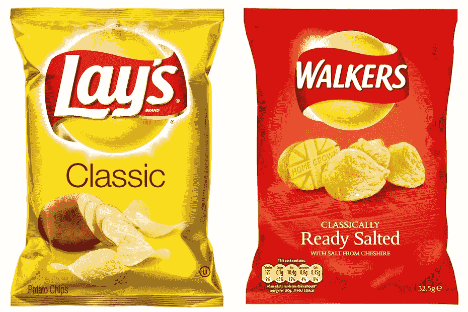

Via [Pop Sugar](https://www.popsugar.com/food/photo-gallery/43989250/image/43989257/Lay-Walkers)

使用你自己的名字或首字母是一种策略，可以让你的企业名称经久不衰。

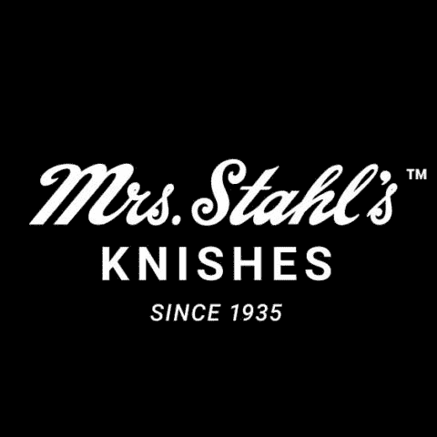

Logo design by [R28](/profiles/random28)

或者，你可以选择一个与你所在的行业或你提供的服务毫无关系的名字，比如苹果是一个科技品牌，与实际的苹果毫无关系。

### 使全球化

命名一个国际企业不同于命名一个只在一个国家经营的企业。当企业经营所在的国家讲不同的语言时(比如说，与在美国和英国经营公司相比)，企业命名可能更具挑战性。

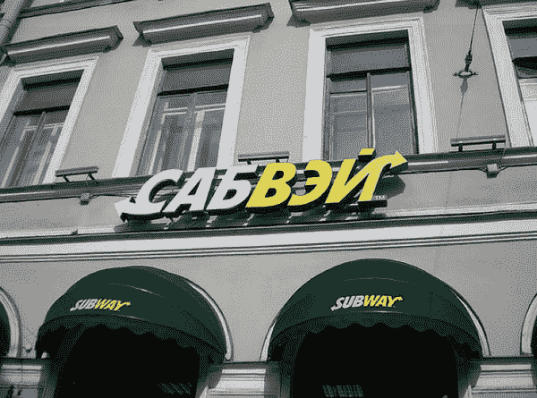

Via [Buzzfeed News](https://www.buzzfeednews.com/article/mjs538/subway-menus-and-restaurants-around-the-world)

当你考虑不同的企业命名想法时，研究每个提议的名称在你计划经营的国家将如何解释。在最好的情况下，它听起来就像一个外来的外来词。

但它也可能:

*   在另一种语言中听起来像一个不恰当的词
*   在另一种语言中是一个不恰当的词
*   对于说另一种语言的人来说很难或者不可能发音
*   与另一个已经注册的企业名称相同

如果你已经挑选了一个完美的企业名称，简单地改变它*不是*的一个选项，你可以翻译你的名字，甚至为外国市场重新命名品牌。

但是如果你还没有选择一个名字，而全球品牌化是你商业计划的一部分，那么让全球市场成为你商业命名过程的一部分——并确保你能保证在你计划进入的每个市场注册你选择的名字，因为:

### 注册和商标

你应该在你经营的每个国家注册你的企业名称，这可能是一个漫长、复杂和昂贵的过程。一旦你确定在每个国家注册你的企业名称没有问题，在你开始实际运作之前就开始这个过程。

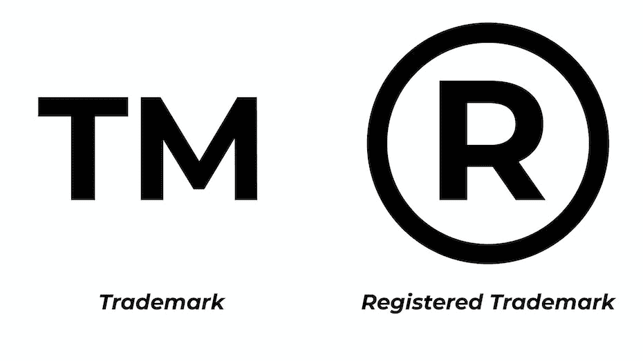

via [Northwest Registered Agent](https://www.northwestregisteredagent.com/blaugg-blog/should-you-have-a-registered-trademark)

当你研究你的名字的可用性时，用建议的名字搜索 URL。即使这个名字没有被注册商标，其他人可能已经拥有了你想要的域名(或类似的东西)。如果是这种情况，你有两个选择:选择另一个名称，或者看看你是否可以从其当前所有者那里购买该域名。

您也可以只使用您想要的名称，但使用另一个顶级域名(。net 而不是。com 等)，但我们不推荐这样做。大多数人都认可。com 作为“主要”顶级域名，所以这是他们搜索你的品牌时使用的地址。如果。如果链接到你品牌名称的网址不在你的网站上，你会错过很多生意。

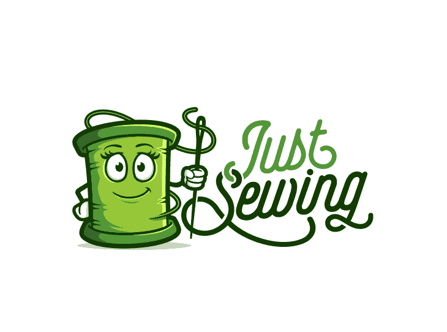

Logo design by [–Rogger–](/profiles/564414)

### 鹤立鸡群

你不想听起来和你所在领域的其他品牌太相似…但是你也需要你的观众知道你提供什么。

研究一下你所在行业的其他品牌是如何称呼自己的。这并不意味着你必须做别人正在做的事情，但它可以帮助你决定哪种类型的企业名称最适合你的品牌。

例如，有一个原因，为什么你不会发现许多律师事务所的名字很有趣，但你会发现很多独立精品店和糖果店。

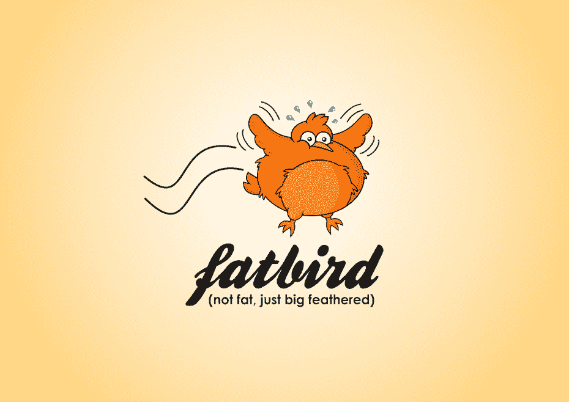

Logo design by [oink! design](/profiles/oinkoink)

选择一个与你所在行业的典型风格大相径庭的名字可以让你与众不同，但是要小心……它可能会吓跑潜在的客户。

用你所在行业的文化作为指南，告诉你哪种名字是合适的，最受客户欢迎。然后，集中精力找到你原来的、真实的名字。

#### 找一个独特的名字，但不要太奇怪

想想你经常接触的品牌的名字。他们如何适应适合行业但又不同(但不完全奇怪)的范式？

**看看一些顶级科技品牌使用的名字:**

*   微软
*   水平规ˌ水准仪(Level Gauge)
*   苹果
*   三星电子
*   索尼

微软听起来很高科技；LG、三星和索尼听起来像是人们的名字；苹果听起来很容易成为一家餐馆或农场。

**现在来看看几个顶级快餐品牌:**

*   麦当劳
*   汉堡王
*   地铁
*   星巴克
*   塔可钟

看看这些品牌名称中有多少直接提到了他们销售的产品？在很多情况下，一个品牌需要这种直接的参考来联系买家。这方面的一个例子是后来成为 Paypal 的 Cofinity。

其他品牌不需要让他们的产品显而易见，相反，尽管有现成的名字，也能立即与观众联系起来。这里有一个你不会觉得奇怪的词，因为它无处不在，但它是一个大多数人都不熟悉的随机词……而且它甚至拼写不正确:Google。

Logo design by [olimpio  ](/profiles/2116245)

## 如何想出一个企业名称
—

所以现在你知道当你探索品牌名称的想法时该做什么(和不该做什么),是时候开始有趣的部分了:想出你的企业名称！

拿出笔记本和笔(是的，你想手工头脑风暴……[研究表明这样你更有创造力](https://www.creativelive.com/blog/does-writing-by-hand-make-more-creative/))开始记下你想到的一切。

记下你的品牌的性格特征。你主张什么？你适合哪类顾客？当人们向他们的朋友推荐你时，你希望他们如何描述你的公司？

然后，写下所有你能想到的与你的业务和行业相关的词。大多数人是如何感知你的行业的？你的业务是服务于业内人士(这意味着你可以继续前进，并以你的名义使用行业术语)还是最终消费者(这意味着你可能不应该)？

在你的头脑风暴会议期间，确定哪种类型的企业名称是你的品牌的正确选择。使用你的名字或首字母是一个经典的举动，但这样做意味着你可能需要在你的标志中说明你做了什么。

另一个选择是使用一些随机的和你的行业无关的东西，但是就像使用你的名字一样，你需要通过你的标志或者标语来清楚地表明你在做什么。这样的名字的好处是，它们比与你的行业或产品直接相关的名字更容易注册商标。

但是如果你想为你的产品命名你的企业呢？做这件事也有不同的方法。也许一个双关语，愚蠢的名字对你的品牌来说是完美的，或者你最好用一些更直截了当的名字。

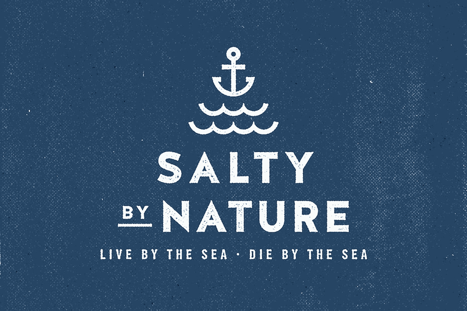

Logo design by [designbybruno](/profiles/designbybruno)

### 品牌命名练习:

*   **数量，而不是质量。**是的，你没看错。与生活中的大多数事情不同，这不是要马上确定一个完美的名字，而是要产生许多可以相互借鉴的想法。
*   团队合作让梦想成真。你当然可以自己进行大量的头脑风暴，但是新鲜的观点会非常有帮助和令人惊讶。所以，如果可以的话，把各种各样的人拉进来，创造一个集思广益的环境，让人们在分享疯狂的想法时感到舒服，而判断被推迟。
*   **获得视觉效果。正如汤姆和大卫·凯利在他们的书《创造性的自信》中所说，一个领导者应该毫不犹豫地伸手去拿一支记号笔。所以不要只是写，还要把自己的想法拟出来。素描不好；这不是艺术性的问题，而是要表达清楚。这些图像可以激发你的名字，作为一个奖励，现在你也有了公司标志的愿景。**
*   **玩游戏。仅仅坐下来用意识流的方式写一堆名字的头脑风暴会议不会持续很久。通过整合练习和挑战，让它变得有趣和更有成效。我们已经覆盖了你:看看我们下面的小册子，进行头脑风暴练习。**

我们刚刚寄给你一本小册子。

*   **迭代。**当然，创业公司的黄金法则在这里也适用。休息一会儿(或者散步或者小睡一会儿),然后一遍又一遍地进行头脑风暴练习。试着改变你的环境来促进不同的创造过程。如果这是一个团队的努力，尝试与不同的群体，如团队成员，朋友，未来的用户等。和不同的组大小。

### 如何为你的品牌选择合适的名字

以下是如何整理所有想法并选出最佳的一个:

*   首先，根据相似性(例如，相同的词根)将它们分组，并消除任何重复。
*   第二，删除那些语义过于复杂、拼写/输入起来非常麻烦的单词。相信我，你不会想错过销售机会，因为销售主管不会拼写你的公司名称，因此无法在网上联系到你。

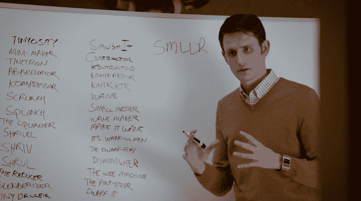

Chock-full of good ideas. Via [HBO](https://www.reddit.com/r/SiliconValleyHBO/comments/23jy7u/silicon_valley_1x03_articles_of_incorporation/).

*   第三，试着大声说出来。它们容易说吗？它们听起来好笑吗？不要成为硅谷的一群人，他们想出了 SMLLR，目标是“更小”，然后意识到它也可以被理解为“smeller”。
*   第四，和其他人一起测试这个；最好是不熟悉你工作的人。询问他们对这个名字的最初印象:听起来如何，感觉如何。看看这与您在流程开始时概述的公司价值观和使命有何不同。
*   最后，等一会儿，然后问人们他们记得你名单上的哪个名字。哪一个坚持了下来？他们将哪一个与您的业务联系得最紧密？

### 为你的企业命名的 3 个专家建议

我们向品牌命名专家和命名机构的创始人 Mark Leiblein 询问了他的三大品牌命名技巧，以下是他与我们分享的一些智慧:

> 如果你想让你的品牌名与众不同，你需要一个不太具描述性的名字。 —马克 莱布莱因,命名风暴的创始人
> 
> T11】

1.如果你想让你的品牌名与众不同，你需要一个不太具描述性的名字。否则，你只会与你所在行业的其他企业过于相似，具有相同的典型关键词。

2.不要小看找名字要花多少时间。一次头脑风暴是不够的。初创公司和创始人几乎总是需要几个星期或几个月的时间，直到他们找到并决定他们想要的名字。

3.绝不(！)问问别人喜欢你的哪个名字创意。那是因为你学到的都是他们的个人观点。假设你正在策划一个运动服装品牌。不要问某人是否喜欢一个名字，你可以问:“你认为这个名字表达活动吗？”或者“如果你在鞋架上看到什么名字，你会感到惊讶？”。

### 我应该使用在线名称生成器吗？

如何使用在线生成器来想出企业名称的想法？他们可以提供有用的起点，但你最好开发自己的企业名称，而不是让一个生成器为你创建它。

这也是为什么我们建议你与专业的平面设计师合作来创建你的标志，而不是使用在线生成器的原因:人情味是让它活起来的原因。一个生产商吐出的任何东西都会让人觉得很普通，这是你最不希望你的品牌成为的东西。

## 我可以更改我的企业名称吗？
—

是啊！

但是如果/当你这么做的时候，有很多事情需要考虑。改变你的企业名称是一项巨大的努力…而且你的企业越大，这项努力就越大。在你决定改变你的企业名称之前，仔细考虑*为什么*你想改变它。一般来说，重新命名企业是更大的品牌重塑的一部分，也是更大的改革的一部分，包括新的调色板和新的外观。

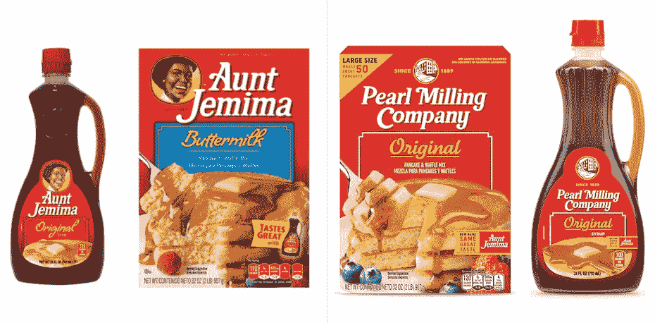

Via [People](https://people.com/food/aunt-jemima-reveals-new-name-and-logo-after-backlash-over-use-of-racially-insensitive-caricature/)

公司更名有多种原因，例如:

*   改变他们提供的产品或服务
*   更新以适应现代消费者的口味
*   远离他们不再持有的过去的偏见和联想
*   在新市场寻求成功。

此外，考虑一下你会从新名字中得到什么，以及你可能会失去什么。虽然你可能会获得新的观众，但你可能会疏远现有的观众。

仔细权衡更名会给你的企业带来多少好处，以及更名会在多大程度上减缓甚至破坏你的成功。然后，如果您决定继续更改名称，请确保在更名之前与您的受众就名称更改进行沟通，从而将潜在的负面影响降至最低。

我们刚刚寄给你一本小册子。

一些著名品牌更名包括:

*   火绒(最初是火柴盒)
*   亚马逊(原本无情)
*   谷歌(原 BackRub)
*   Twitter(原名 Odeo)
*   Instagram(最初为 Burbn)

在你决定企业更名是否值得之前，最后要考虑的是更名的成本。你需要注册一个新商标，这在美国要花几百美元，在其他国家也要花差不多的钱。不过，这只是与更改企业名称相关的一项费用。您还需要:

*   注册新的 URL
*   重新设计你的网站
*   随时随地更新您的信息:社交媒体、电子邮件模板、标牌、品牌赠品
*   重新设计你的标志(如果你的名字是标志的一部分)

虽然其中一些更新需要花钱，但其他的只是耗费时间和精力。将这些非货币费用计算到你的企业命名预算中，以此来确定重新命名你的品牌所需要的真实产出。

这意味着盘点你的品牌名称出现的所有地方:名片、官方账户、平面广告、网站、电子邮件签名、标牌、赠品……每一个都需要更新。也不是突然的——你需要发起一场运动，告诉全世界你已经改了名字，根据你实际销售的产品，你可能需要重新设计你的产品包装，在切换到只使用新名字的包装之前，显示两个名字的过渡设计。

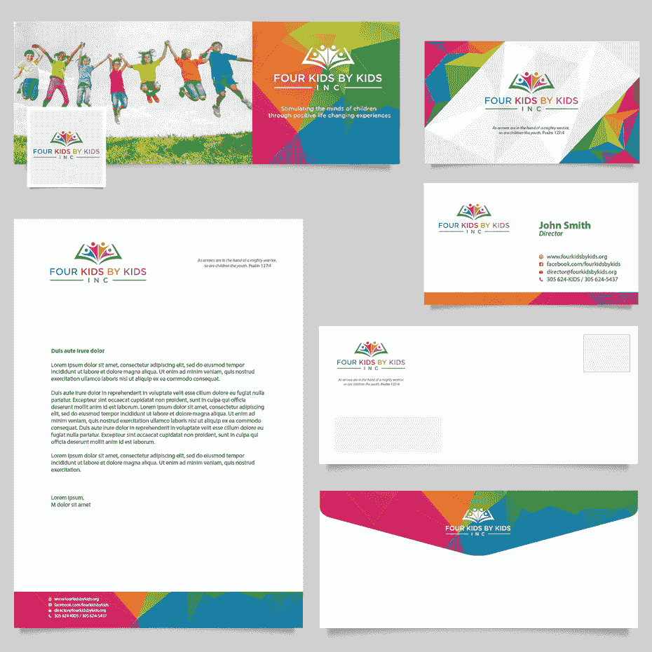

Brand identity design by [torvs](/profiles/torvs)

基本上，你的品牌越大，重塑品牌的成本就越高。

当达特桑在 20 世纪 80 年代更名为日产时，该公司花费了大约 5 亿美元来支付更名的所有费用，如达特桑经销商的新标志、特许经销商更名的法律费用、停止现有的达特桑广告活动和发起新的活动“The Name is Nissan”尽管更名，更名计划结束五年后进行的一项调查发现，大多数消费者仍然比日产更熟悉达特桑这个名字。

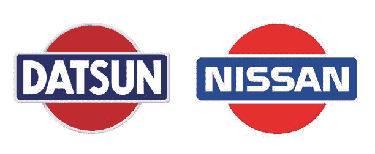

via [Namedroppings](https://namedropping.wordpress.com/tag/datsun/)

日产能以不同的方式处理品牌重塑并取得不同的结果吗？现在还不好说。但事实是:给你的公司重新命名并不是一件小事。

虽然一些品牌，如日产，通过大张旗鼓的宣传活动做到了这一点，但其他品牌却没有大张旗鼓。通常，这是因为他们重新命名是为了去除负面含义，就像菲利普·莫里斯公司在 2001 年为了保护他们拥有的品牌，比如卡夫，而将自己重新命名为奥驰亚。

## 获得一个名字，和一个伟大的标志启动！
—

说到品牌，你的企业名称是第一位的。但是品牌并没有就此结束。一旦你确定了完美的企业名称，是时候建立你的品牌标识了。查看我们的平面设计师社区，为您的新品牌设计找到完美的匹配。

##### 需要一个标志来搭配您的新品牌名称吗？

###### 我们才华横溢的设计师可以为您打造完美的设计。

*本文由 Anada Lakra 原创，发表于 2017 年。它已经更新了新的例子和信息。*