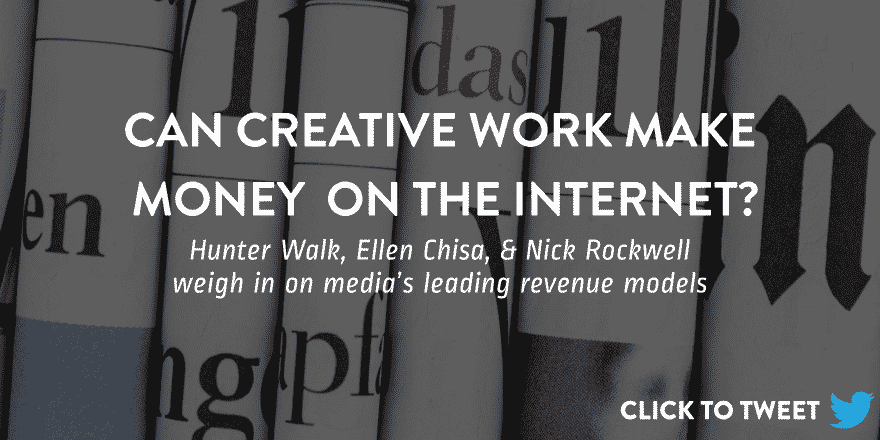
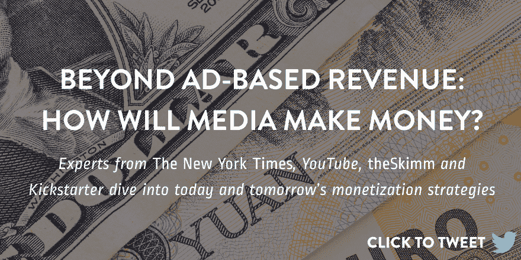
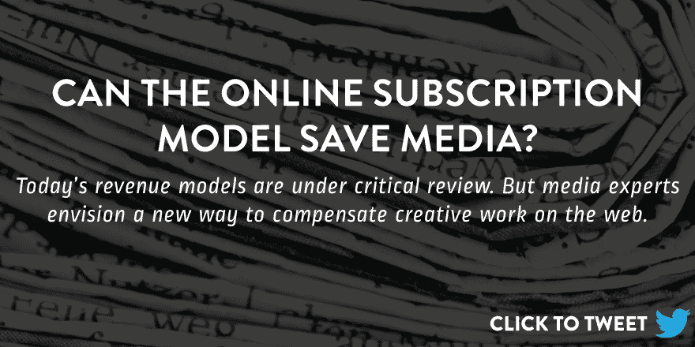

# 新媒体的专家收入模型

> 原文：<https://blog.mixpanel.com/2017/01/18/revenue-models-media/?utm_source=wanqu.co&utm_campaign=Wanqu+Daily&utm_medium=website>

从 2011 年开始， [媒介](https://medium.com/)，互联网自我出版的空白画布，已经赋予任何人和任何公司讲述故事的能力。凭借总计 1.32 亿美元的资金，它一直是新媒体的宠儿，拥有可访问、简单和高质量的内容。然而，尽管取得了显著的成功，Medium 在年初解雇了 50 名员工，因为其商业模式不赚钱。

为了应对裁员，Ev Williams [告诉 Re/code](http://www.recode.net/2017/1/4/14169348/medium-layoffs-ad-business-model-change) ，“我们正在转移我们的资源和注意力，为作家和创作者定义一种新的模式，根据他们为人们创造的价值给予奖励。现在确切地说这将会是什么样子还为时过早。”

这不是新消息。自从互联网出现以来，数字媒体公司一直在努力解决这个问题。事实上，补偿创意人员是一个古老的难题。你如何给创造性的或新闻性的工作分配货币价值？

在 *信号* 时，我们会见了不同行业的几位产品负责人，并在不同场合听到他们都有一个相似的趋势——技术平台有责任找出一种新的补偿模式。

我们的经济正在脱离基于广告的收入模式吗？未来是一个只面向创意者和消费者的订阅经济吗？或者在互联网上有另外一种补偿创造性工作的方法吗？

我们邀请风险投资、媒体和金融科技领域的专家来参与这个复杂的商业问题:我们如何将互联网上的创造性工作货币化？

## 首先，与专家组见面:

*   **亨特·沃克，** 家酿公司的联合创始人和风险投资人， *theSkimm 的种子阶段投资人，*YouTube 和林登实验室的前产品负责人(《第二人生》的创造者)
*   **艾伦·千纱，**Lola 的产品负责人，Kickstarter 的前项目经理
*   **尼克·洛克威尔、***《纽约时报》*

*T3】*

[T2】](https://twitter.com/home?status=Internet%20media%20products%20needs%20to%20rethink%20monetization.%20Here's%20what%20industry%20leaders%20say%3A%20%0Ahttp%3A//bit.ly/2k2Q2QR%0Apic.twitter.com/4k91KZuFDR)

## 读者、媒体和我们的经济是否超越了基于广告的收入模式？互联网上的内容是否过于饱和，以至于创意人员无法获得公平的报酬？

猎人漫步: 这……很复杂。我真的相信这是成为一名创造者的最佳时机。与历史上的任何时候相比，你有更多的工具，更直接的方式来接触观众，有更多的方式来谋生。但这也需要一套超越核心创造的技能。除了要有创造力，你还需要成为营销人员、企业家、社区领袖。伙计，那是个苦差事。

与此同时，新闻业等领域的创造性就业机会肯定会减少——如果你把“就业”定义为报酬丰厚、福利和稳定的全职工作的话。部分原因是中间商被去中介化；其中一部分来自技术辅助的生产率提高；这部分是因为支持新闻业的广告结构和支持音乐的商业系统的变化；正如你所注意到的，有些来自丰富的内容。

**艾伦·千纱** **:** 我不认为互联网对于公平薪酬已经太饱和了。我认为不同类型的内容需要不同的模式。我确实认为，对于质量足够高、能够以我们认为“公平”的方式得到补偿的内容，门槛可能会降低。没有人认为获得普利策奖的新闻和 clickbait 是一回事。

现在，我们有几种类型的收入模式:首先，有触及大量受众的内容，这可以通过广告来支撑。此外，一些高度集中的内容可以得到少数高付费客户的支持(例如:PhocusWright 的旅游行业趋势报告，金融行业的可比报告)。现在中间有一个缺口。

今天，有些内容受到人们的支持，但不值得一次性购买。我确实认为众筹是这一领域的一种模式，它适用于更大的项目，比如书籍。这还没有转化为博客或文章。

我是安·弗莱德曼 [tinyletter](https://tinyletter.com/) 的粉丝，在那里她每年收取 5 美元来获取她创作的饼状图。每当你阅读时事通讯时，这都是一个微妙的提醒，提醒你是否在经济上支持过她的工作。

尼克·洛克威尔 **:** 我认为单靠广告模式维持媒体业务是很难的。这对于大的和小的都是可行的，但是对于中的就很难了。订阅模式正在发生巨大的转变，这也很难，但至少更加一致。对于出版物和作家来说，报酬是不均衡的，所以不，这是不公平的，对每个人来说都很艰难。

## 如前所述，互联网应该如何确定其新的“价值”交换？用户应该负责赔偿艺人还是平台？

**行走:** 任何一个不主动思考如何补偿平台上创作者的平台，本身就有风险。光让这些创作者走了，去找第三方解决方案货币化是不够的。相反，你需要促进，甚至建立，货币化工具，广告商的需求，商业机会，等等。从一开始，这就是 YouTube 战略的核心，而且我认为这对它的持续增长起到了重要作用。

千纱: 我认为两者都会有。作为一个独立的创作者，我宁愿直接和我的观众一起创作。虽然它可能需要时间来建立，但与一个可以改变方向或离开的平台相比，它不太可能有风险。也就是说，当该平台有助于聚合这些个人贡献时，使用起来肯定很方便。

## 在你看来，无论是记者、艺术家还是数字创意人员，从互联网和创意人员的工作中赚钱的完美公式是什么？

**行走:** 没有完美的公式，也没有灵丹妙药。平台和消费者需要明白，如果他们不支持创作者，创作者就会消失。所以你需要用钱包投票，而不仅仅是注意力。我确实相信许多服务不敢要求消费者直接为内容付费，无论是传统方式(订阅)还是不太传统的方式(比如赞助)。

**千纱:** 我认为找到“完美公式”的最好方法是找出价值在哪里被创造，然后让创意人员获取部分价值。但是，我不知道我是否可以称之为“完美”的公式。

我们需要做的第一件事是摆脱这样一种观念，即如果艺术家的作品获得报酬，他们就没有诚信。艺术家需要为他们的工作获得报酬。之后我觉得就看情况了。

一个平台通过拥有受好评的作者和/或可用的好内容来获取一些价值。有了平台，艺术家就有了归宿，就能建立品牌。这很直接，也是过去的工作方式。

内容的个人消费者通过两种方式获取价值。一种方法是享受它，看着它，这基本上就是广告货币化。我更感兴趣的是，当个人将其他创造性工作整合到他们的思想中，并将其作为他们后来工作的许多输入之一。我希望有一种更好的方法来观察思想随时间的影响，这样我们就可以看到哪个产生了更多的价值。学术引用以这种方式工作，但是我们没有网络上那么强大的东西。

罗克韦尔 **:** 我认为纯订阅或会员制模式是最好的，但很少有人能做到。很难对广告模式说不，同时使用广告和订阅是可以的。光是模型就很辛苦了。

[T2】](https://twitter.com/home?status=Ads%20don't%20work%20for%20every%20media%20model.%20So%20where%20should%20product%20people%20look%20for%20inspiration?%0Ahttp%3A//bit.ly/2k2Q2QR%0Apic.twitter.com/53WaoPlwfx%20)

## 今天的互联网有哪些新的收入模式？

**步行:** 我对我们的投资 [theSkimm](http://www.theskimm.com/) 如何构建其收入结构印象深刻。TheSkimm 的使命是帮助你更聪明地看待你周围的世界。首先是免费的每日时事通讯(由品牌广告商赞助)，每天有数百万人阅读。接下来是订阅应用程序(每月 2.99 美元)，专注于你在不久的将来需要知道的事情。推出不到一年，收入就达到了七位数。接下来你会看到视频和商业中的一些其他模式，这些模式与他们的使命和价值观是一致的。没有什么灵丹妙药。

**千纱:** 完全同意亨特关于 TheSkimm 的说法。我订阅支持公司/时事通讯产品，尽管我阅读时事通讯的频率仍然高于使用预测应用程序的频率。另外，我想知道任何新的东西！我也喜欢上面提到的安·弗里德曼的方法，还有 Stratechery，纯订阅。

**罗克韦尔** **:** 我认为 在我们发现新的收入模式之前，我们需要首先专注于订阅。

## 当谈到他们的商业模式时，你期望从互联网上的媒体公司和社交网络看到什么样的转变？

**行走:** 下面是我的几个预测:

1.  越来越多的人认识到创作者需要获得报酬。例如，Vine 应该更早关注这个问题，如果 Instagram 没有考虑这个问题，我会感到惊讶。

2.  “真正的粉丝”可以通过更多方式直接支持他们的创作者——订阅时事通讯、品牌商务、类似 Patreon 的赞助和众筹。甚至是 altcoins！

3.  创作者的倦怠和平台想出办法来帮助解决不仅是作为创作者的金钱方面，而且是情感方面的问题。YouTube 认为这是在创作者之间创建社区，举办教育活动，通过奖励不同层次的用户来认可创作者的成功等等。

千纱: 我希望有更好的发现。现在很容易找到在媒体平台上已经很受欢迎的名人，或者找到你已经认识的人。对于利基创造者来说，中间没有太多空间——这也是我在商业模式中看到的差距。我不确定这是一个“预测”还是一个希望。我认为登陆将有助于增加参与度(和广告收入)，并创造另一个人们愿意付费的空间。

**罗克韦尔** **:** 社交网络做得很好——广告对他们很有帮助，在这种情况下，收取服务费可能非常危险。对于媒体来说，我认为他们的商业模式将越来越倾向于订阅，并且会有很多捆绑和聚合订阅的尝试。

## 你如何看待数据在未来帮助创造性工作获得更多报酬？

**沃克** **:** 我不认为数据本身对创造性工作有帮助，也不认为它有助于创作者从数据中获得洞察力。媒体公司需要帮助解释数据的含义，而不仅仅是展示一个仪表板。

在支付方面，也有一些初创公司——一些建立在区块链基础上，一些更传统的会计方式——开始尝试帮助创作者追踪资金，并尽快为他们的创作获得适当的报酬，无论他们去哪里旅行。

千纱: 我认为我们将会有“更好”的数据。Ev 在 Medium 早期提到过这一点——目标是给作者关于质量(阅读百分比和推荐)的想法，而不仅仅是页面浏览量的虚荣指标。我认为，随着企业使用更有意义的指标来跟踪他们的成功，这些将会传递给个体创造者。

**罗克韦尔** **:** 相对于今天来说不算多，但数据是一种记分方式。订阅业务需要有更长远的眼光。这种观点将为反对 clickbait 提供一些激励，这很好，并且应该奖励优质作品的创作者。

[T2】](https://twitter.com/home?status=Product%20builders%20in%20media,%20meet%20the%20new%20boss...same%20as%20the%20old%20boss?%20%20%0Ahttp%3A//bit.ly/2k2Q2QR%0Apic.twitter.com/IVqtWVL4ea)