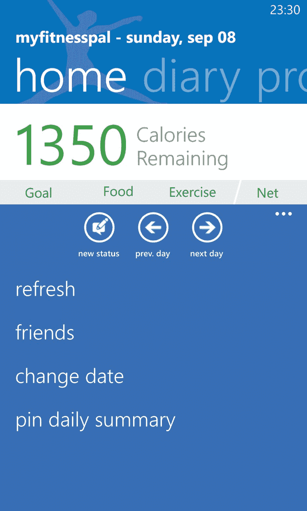
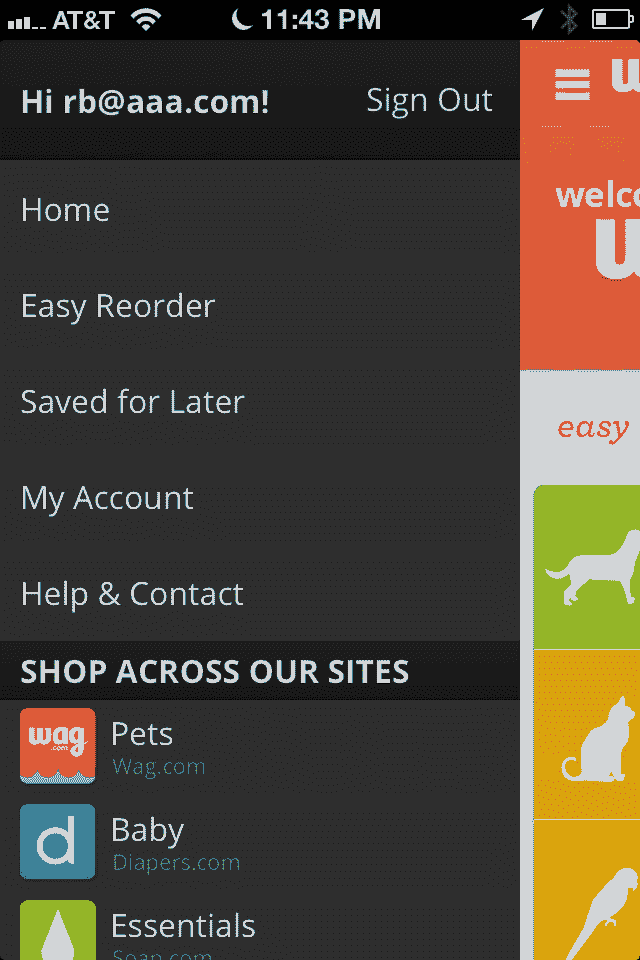

# 用户专业知识停滞在低水平

> 原文：<https://www.nngroup.com/articles/stagnating-expertise/?utm_source=wanqu.co&utm_campaign=Wanqu+Daily&utm_medium=website>

即使是计算机系统的长期用户通常也只知道和使用其可用命令和功能的一小部分。如果设计具有良好的可用性，人们在系统使用的早期就能很容易地学会一组核心特性。然后他们停滞不前**没有好到哪里去**。几十年过去了，即使是经常使用系统的用户每年也只能学到一两件新东西。

停滞不前的用户专业知识并不局限于任何特定的设计类别。在几十年的研究中，所有的用户界面都有记录。

## 旧的例子

一个早期的研究成果是 Steve Draper 在 1984 年发表的对 Unix 专家的研究。Draper 不仅发现成为一名熟练的 Unix 系统管理员至少需要 7 年时间，而且不同的 Unix 专家拥有不同的知识领域。这些超级极客并不知道所有的事情:每个 Unix 专家都走上了不同的知识获取之路，而在其他领域却不太熟练。

最近，在微软对将成为 Office 2007 的软件版本的早期可用性研究中，UX 团队要求客户提名他们希望添加到软件包中的新功能。绝大多数“新”功能请求是针对已经存在多年的东西的。结果，设计团队决定**在新的用户界面中强调可发现性**，因此[微软推出了功能区](http://www.nngroup.com/articles/rip-wysiwyg/ "R.I.P. WYSIWYG, article")。确保人们理解旧功能比添加新功能更重要。

事实上，Office 2007 的重新设计效果很好，人们现在使用了该软件包的更多功能。即便如此，大多数人仍然只使用一小部分可用功能。

## 新示例

我们最近对当前的移动应用程序进行了一系列可用性研究，以更新我们关于[移动&平板电脑应用程序设计](https://www.nngroup.com/courses/topic/mobile-and-tablet-design/ "Nielsen Norman Group: full-day training course at the Usability Week conference")的课程。令人吃惊的是，用户经常不知道他们经常使用的应用程序的基本功能。iPhone、Android 或 Windows Phone——都不重要；这个发现在我们测试的所有平台上都是一样的。

这项新研究的一个组成部分与我们典型的可用性研究略有不同:我们包括了一个“展示和讲述”部分，在这个部分中，我们要求用户向我们展示他们手机上的应用程序，并由 T2 告诉我们他们是如何使用它们的。有时，我们还要求参与者使用他们没有告诉我们的功能。在所有情况下，共同的反应是:*“哇，我不知道这个应用程序可以做到这一点。谢谢你给我看。*

(实际上，我们并没有向用户展示他们没有提到的功能，而是让他们执行一项任务，要求他们自己找到该功能。尽管如此，在某种程度上，我们把人们引向他们不会去寻找的东西，我们偏离了被认可的测试协议。在这种情况下，这样做很好，因为我们正在进行无数次的移动应用程序可用性研究，所以我们已经发现了所有的基本发现。但是如果你是第一次测试某个东西，一定要采取一种不那么直接的方法，以避免以最小的方式偏向用户。)

以下是一些基本移动应用功能的例子，尽管用户经常使用，但他们并没有发现这些功能:

美国银行(Bank of America)(iPhone):一个人经常使用这个应用程序来检查余额并确保支票已经结清，但不知道支票存款功能。当我们问的时候，她确实很容易就找到了；然而，在现实生活中，这个特性可能并不存在，因为用户并没有寻找它。

MyFitnessPal (Windows Phone):我们的测试参与者每天都使用这款应用进行节食。她提到，直到她的朋友告诉她，她才发现了许多功能(例如，她不知道她可以跟踪自己的体重)。在我们的测试中，她不知道如何访问前一天的信息，她经常忘记她可以水平滑动来查看更多功能。这种**缺乏功能可见性**是 Windows Phone 的常见问题，如这张截图所示:

*Windows Phone screenshot: Additional features are available through horizontal scrolling of the top menu, but mostly they're out of sight, out of mind relative to features that are clearly visible on the screen without further action.*

**Wag** (iPhone):一个人经常使用这个应用程序为她的狗订购物品。她不知道如何保存一个项目，也没有发现主页上有这个命令的菜单。可惜这个菜单只出现在首页；它会在其他页面上消失，使得该功能更难被发现。

 
**左:** *Wag 应用主页，菜单展开。*
**右:** *产品页面不进入菜单(除非你返回到顶部屏幕)。*

Zappos (Android):用户不知道如何将一个项目添加到收藏夹列表中。

**Weave** (newsreader，Windows Phone):一名测试用户每天用这款应用阅读新闻，但他没有意识到他可以添加另一份不在默认来源列表中的出版物。

**iMuscle** (iPhone):一个人经常用这个 app 浏览和看练习题。即便如此，他也不知道如何针对一组肌肉制定锻炼计划。此外，当我们询问时，他找不到不需要特殊设备的练习。

Hulu Plus(Android):用户通常在 Hulu 中找到并观看节目，但不知道如何将节目添加到他的队列中以供以后观看。

在所有这些案例中(以及我们测试的许多其他案例)，用户**并不知道仅仅是极简用例**之外的一点点特性。看新闻，是的。找其他新闻来源，没有。

因为许多应用程序有足够好的可用性，用户可以在提示后找到这些功能。然而，在现实世界中，没有一个友好的学习推动者不断地推动用户去寻找新的功能。在实验室之外，这些相当基本的功能很可能在未来几年的使用中仍未被发现。

## 为什么专业知识停滞不前

人们可以使用计算机系统多年，而不知道对他们非常有用的功能。即使对于人们赖以生存的生产力应用程序，如电子邮件、文字处理和电子表格，也是如此。在测试内部网的过程中，我们经常发现员工不知道关键的企业功能。

这似乎是一个悖论，因为如果用户愿意花一些时间浏览用户界面，他们将会获得巨大的收益——这可能需要几年的时间。投资回报率似乎很明确。

然而，尽管用户通过学习更多关于用户界面的知识可能会有一个*数学上*真实的 ROI，但是从*行为*的角度来看，ROI 可能不是那么清晰。问题是,**投资立即发生:**:用户必须承受导航用户界面晦涩部分的[交互成本](https://www.nngroup.com/articles/interaction-cost-definition/ "Definition of Interaction Cost, article")。相比之下，**的好处被推迟了**:当用户可能会使用新发现的功能时，他们只能在一些不确定的未来时刻以很小的增量意识到这一点。

标准经济学告诉我们如何计算一系列未来收益的 NPV(净现值):你把它们加起来，同时用一个适当的利率来贴现每一个收益，这个利率随着未来情况的发展而增加。

人类可能天生会对这些未来的小收益打一个大得惊人的折扣。在祖先的环境中，在一些不确定的未来事件对你有足够的好处之前，你就已经死了。

无论潜在的生物学是什么，这是一个基于 30 年研究的经验事实，即**用户狭隘地专注于现在的**。摆在他们面前的是他们所知道的一切。他们现在所做的才是最重要的。

人们不看手册。人们不会为了寻找简洁的功能而去探索整个用户界面。一旦人们学会了一种行之有效的方法，他们就不会去调查是否还有更好的方法。(也许你会做这些事情，但[你不是普通用户](https://www.nngroup.com/articles/bridging-the-designer-user-gap/ "Bridging the Designer-User Gap, article")。)

**学习是苦差事，用户不想干**。这就是为什么他们对你的设计了解得越少越好，然后多年都停留在低水平的专业知识上。学习曲线很快变平，此后几乎没有变化。

## 你能鼓励用户学习吗？

最重要的是，接受用户不愿意学习的事实。你可能认为你的网站或应用程序特别重要和有用。但对用户来说，这是他们必须处理的数百个问题之一。你的不太可能是第一个让所有用户都成为老练的专家并学习所有特性的用户界面。

尽管你永远无法解决用户专业技能停滞不前的问题，但有一些 T2 策略可以缓解这个问题:

*   **功能少**。每一个[额外的特征都使得其他特征更难被发现和学习。矛盾的是，通过提供更少的功能，你可能会发现人们使用更多的功能。](https://www.nngroup.com/articles/feature-richness-and-user-engagement/ "Feature Richness and User Engagement, article")
*   **可见特征**。不要让人去搜索关键特征。当然，你可以使用[渐进式披露](https://www.nngroup.com/articles/progressive-disclosure/ "Progressive Disclosure, article")来隐藏高级功能，但你必须为用户提供一种可见的方式来取消隐藏。
*   **可见的能指**。感知到的启示必须清楚地指出人们能做什么以及他们应该如何去做。T2 在网页上可视化链接的指南就是一个很好的例子。抵制[过于扁平的设计](https://www.nngroup.com/articles/windows-8-disappointing-usability/ "Windows 8 — Disappointing Usability for Both Novice and Power Users, article")，所有项目看起来都一样，没有任何东西可以点击。
*   **即时学习**。虽然用户不会阅读手册，但他们有时会阅读上下文中显示的小提示。
*   **发掘可教时刻**。[错误信息](https://www.nngroup.com/articles/error-message-guidelines/ "Error Message Guidelines, article")可以引导用户找到更好的方法来解决他们的问题。
*   **宽恕**。当用户可以轻松摆脱任何情况时，探索就更有可能。撤销(包括*返回*按钮)和清晰导航是必不可少的。相反，如果人们尝试了一个新功能却受到了伤害，你可以打赌他们不会再探索你的 UI 了。
*   **低承诺预览**。更宽容的是让用户在实际操作之前看到会发生什么(T2)。示例包括在[分面导航](https://www.nngroup.com/reports/ecommerce-ux-search-including-faceted-search/ "Research report: E-Commerce User Experience Design Guidelines Vol. 05: Search (Including Faceted Search)")中选择各种选项的项目计数，以及当鼠标悬停在 Microsoft Word 中的样式上时文档临时重新格式化的方式。
*   **简单易用**。越简单的东西，用户就越有可能有认知盈余来学习它，而不是花费他们的脑力来简单地操作 UI。

遵循这些原则，用户最终会知道并使用你的更多特性。因此，他们会从使用你的设计中获得更好的结果，并且会更喜欢它。每个人都受益。

### 参考

Stephen w . Draper(1984):《UNIX 中专业知识的本质》。) *[人机交互](http://dl.acm.org/citation.cfm?id=1456615)—INTERACT’84 会议论文集*(北荷兰:阿姆斯特丹)，第 465–471 页。

