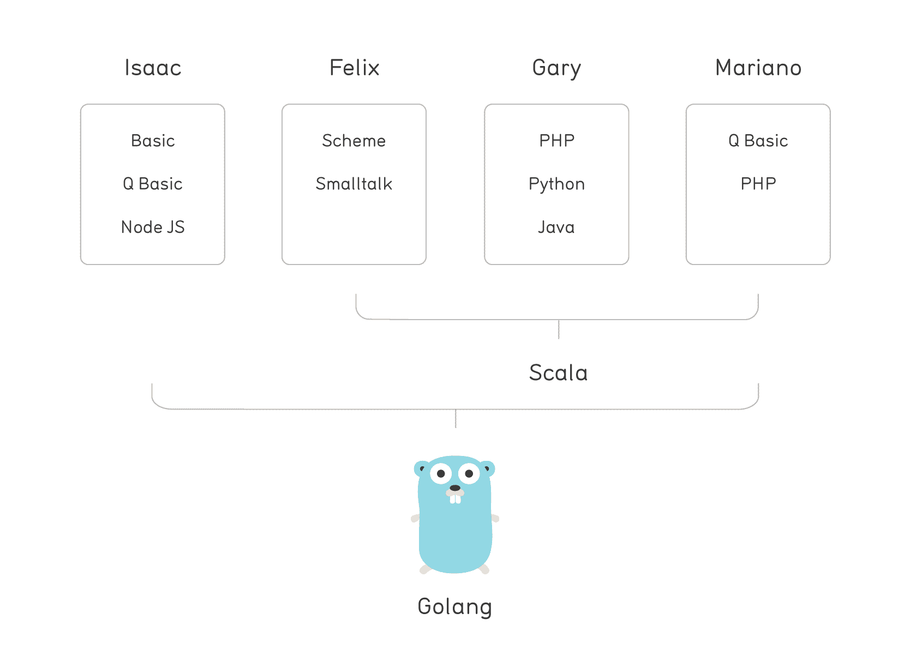
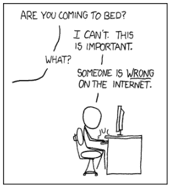
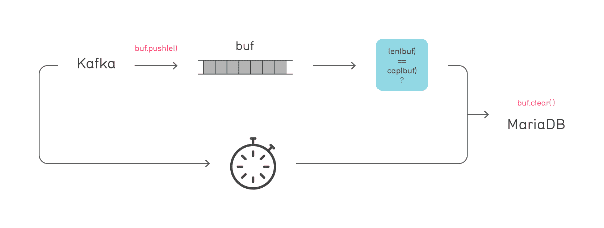
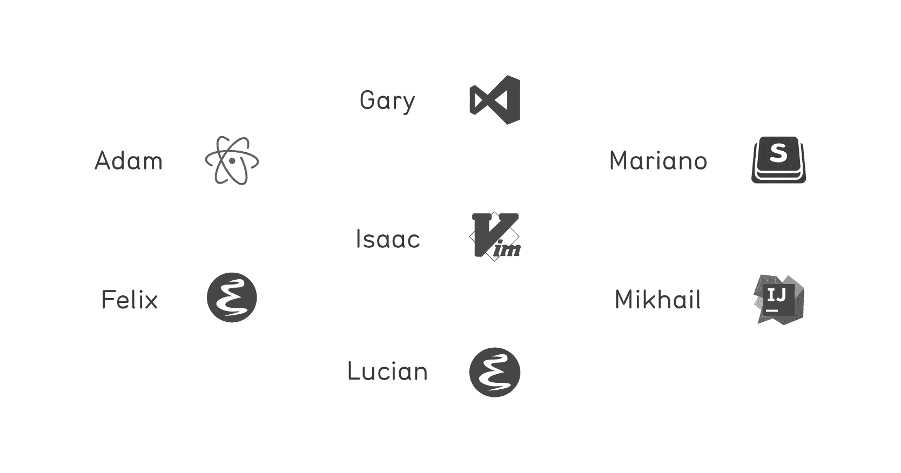

# 从 Scala 迁移到 Go，为什么我们不回去| Movio 博客

> 原文：<https://movio.co/blog/migrate-Scala-to-Go/?utm_source=wanqu.co&utm_campaign=Wanqu+Daily&utm_medium=website>

更新:
这篇博文自发表以来受到了很多关注，包括在黑客新闻、Golang 周刊和 Scala Times 上；谢谢大家！不幸的是，一些读者认为这是对 Scala 社区的攻击和/或有偏见的语言大战。这不是红队的意图。正如正文中所解释的，Movio 使用 Scala 一些小队使用 Scala 作为他们的主要语言。两年前我们主持了 Scala Downunder。在过去的 4 年里，Scala 社区教会了我们很多。Scala 和 Go 在 Movio 共存。

-

下面是我们为什么选择从 [Scala](https://www.scala-lang.org/) 迁移到 [Go](https://golang.org/) 的故事，并逐渐重写了我们 Scala Go 的部分代码库。作为一个整体，Movio 拥有更广泛和多样化的观点，因此本文中的“我们”仅代表 Movio Cinema 的红色小分队。Scala 仍然是 Movio 一些团队的主要语言。

### 我们最初为什么喜欢 Scala

是什么让 Scala 如此吸引人？如果你考虑我们的背景，这很容易解释。下面是我们中的一些人随着时间的推移最喜欢的语言:



如你所见，我们很大程度上来自于有状态的过程世界。

随着 Scala 的出现，函数式编程得到了大肆宣传，并真正得到了我们的认可。[纯函数](https://en.wikipedia.org/wiki/Pure_function)使得确定性测试变得容易，然后 [TDD](https://en.wikipedia.org/wiki/Test-driven_development) 变得流行起来，也谈到了我们的软件质量问题。

我想我第一次意识到拥有一个强类型系统的好处是在 Scala 中。就我个人而言，经历了无数的 PHP 无声错误和古怪的行为之后，我感到非常有信心，在类型检查和一些深思熟虑的测试的支持下，我的代码正在做它应该做的事情。最重要的是，它会在重构后继续做它应该做的事情，否则会破坏类型检查或测试。是的，Java 也给了你这一点，但是没有 FP 的美丽，也没有 EE 的所有包袱。

还有其他难以捉摸的特质让 Scala 对书呆子来说非常性感。它允许您创建自己的操作符或覆盖现有的操作符，本质上是带有非字母数字标识符的一元和二元函数。您还可以通过宏(由编译器调用的用户定义的函数)来扩展编译器，并通过隐式类来丰富第三方库，也称为“pimp my library”模式。

但是 Scala 并不是没有问题。

### 缓慢编译

Martin Odersky 承认并详细描述了 Scala 编译器缓慢的问题，这是一个持续受挫的原因。再加上一个巨大的庞然大物和带有复杂解析机制的复杂依赖树——在伟大的工程师照看它多年之后——在我们的一个核心模块中的模型类上添加一个属性仍然意味着喝咖啡休息一下，或者一场[剑战](https://xkcd.com/303/)。最重要的是，拥有可接受的编码反馈循环时间(即代码-测试-重构迭代之间的延迟)变得越来越少。

### 缓慢部署

缓慢的编译时间和庞大的整体意味着缓慢的 CI，反过来，冗长的部署。幸运的是，Movio Cinema 的 Blue Squad 的智能工程师能够在不同的节点上并行进行模块测试，将总体 CI 时间从一个多小时缩短到 20 分钟。这是一个巨大的成功，但仍然是敏捷部署的一个问题。

### 工具作业

IDE 支持很差。多个 Scala 版本项目(不同模块上的不同版本)的问题使得支持优化导入、非基于 grep 的跳转到定义等等变得不切实际。这意味着所有开源和社区驱动的 ide(例如 vim、Emacs、atom)都有不太理想的特性集。这种语言似乎太复杂了，无法制作工具！

即使是更雄心勃勃的 Scala 集成尝试也在多个项目构建中挣扎，最著名的是 Jetbrains 的 Intellij Scala 插件，跳转到定义将我们带到了过时的 jar 而不是修改后的文件。我们也看到过在使用高级语言特性的代码上不连续的高亮显示。

从好的一面来看，我们能够完全根据一个程序员笔记本风扇的响度来确定他是在使用 [IDEA](https://en.wikipedia.org/wiki/IntelliJ_IDEA) 还是 [sbt](http://www.scala-sbt.org/) 。在 MacBook Pro 上，这对于任何希望远离电源插座进行长时间编程的人来说都是一个真正的问题。

### 全球 Scala 社区(和非 Scala)的发展

对面向对象编程的批评已经在办公室徘徊了一段时间，但是直到有人分享了[劳伦斯·克鲁勃纳的博文](https://twitter.com/krubne)，它才成为主流。从那以后，提出替代非面向对象语言的想法变得更加容易。例如，在一个阶段，我们几个人在其他实验中学习 Haskell。

虽然是旧闻，但一旦我们的思维发生转变，2011 年著名的“Yammer 远离 Scala”[Coda Hale 发给 Scala 团队的电子邮件](https://codahale.com/downloads/email-to-donald.txt)开始变得有意义了。想想这句话:

“许多这种[复杂性]被认为是只有库作者才真正需要了解的东西，但当库的 API 将所有这些都提到顶端时(因为大多数这些功能都解决了调用点的具体问题)，工程师需要对这些库如何工作有一个准确的心理模型，否则他们会将代码片段作为功能的魔法护身符。”

从那以后，更大的玩家紧随其后，Twitter 和 LinkedIn 就是显著的例子。

以下是 Raffi Krikorian 在推特上的语录:

“在四年前，我会用不同的方式使用 Java，而不是使用 Scala 作为重写的一部分。[...]一个工程师要花两个月的时间才能完全有效率地编写 Scala 代码。”

Paul Phillips 离开 Scala 核心团队，以及[关于此事的长篇大论](https://www.youtube.com/watch?v=TS1lpKBMkgg)描绘了一幅令人不安的语言状态图——与我们之前的形象形成鲜明对比。

对于更多令人不安的文献，你可以在这个 JSON AST 辩论中找到 Scala 社区的所有先锋。阅读这篇文章时，我们有些人会有这样的感觉:

[T2】](https://xkcd.com/386/)

### 对替代品的需求

然而，在‘Go’成为焦点之前，对于我们来说，似乎没有真正的 Scala 替代品；根本没有提高门槛的合理选择。考虑一下 Coursera 博客文章'[中的这段话，为什么我们在 Coursera](https://building.coursera.org/blog/2014/02/18/why-we-love-scala-at-coursera/) 喜欢 Scala:

“我个人认为编译和重新加载的时间是可以接受的(不像 PHP 的编辑-测试循环那样严格，但是考虑到 Scala 的类型检查和其他优点，这是可以接受的)。”

另一个来自同一篇博文:

*“是的，scalac 很慢。另一方面，动态语言要求你不断地重新运行或测试你的代码，直到你解决了所有的类型错误、语法错误和空引用。我宁愿喝一口咖啡，而 scalac 为我做所有这些工作。”*

### 为什么“去”有意义

### 学起来很简单

我们中的一些人花了六个月的时间，包括一些非工作时间的 mooc，才能够相对舒适地使用 Scala。相比之下，我们在两周内学会了“Go”。事实上，大约 10 个月前，我第一次开始编写一些 Go 代码是在 T2 的一个代码务虚会上。我能够编写一个非常基本的[类似马里奥的平台游戏](https://github.com/MarianoGappa/gomario)！

我们还担心低级语言会迫使我们处理不必要的复杂性，这些复杂性被 Scala 中的高级抽象所隐藏，例如 [Futures](http://docs.scala-lang.org/overviews/core/futures.html) 隐藏线程。有趣的是，我们不得不回顾的是诸如[信号](https://en.wikipedia.org/wiki/Unix_signa)、[系统调用](https://en.wikipedia.org/wiki/System_call)和[互斥](https://en.wikipedia.org/wiki/Mutual_exclusion)之类的东西，这对所谓的全栈开发人员来说实际上并不是一件坏事！

有史以来第一次，当我们不确定某些东西是如何工作的时候，我们实际上阅读了语言规范。就是这么简单；规范是可读的！对于我一般大小的大脑来说，这实际上意味着很多。我对 Scala(和 Java)感到失望的部分原因是，由于它的复杂性，我觉得我永远无法获得给定问题领域的完整上下文。一个可接近的和完整的语言指南增强了我在遵循一段代码时做假设的信心，以及证明我的决策基本原理的信心。

### 更简单的代码可读性更强

没有 map，没有 flatMap，没有 fold，没有泛型，没有继承…我们会想念它们吗？也许我们做了，大约两个星期。

很难解释为什么不亲自“体验”就能获得表现力更好——这是双关语。然而，Golang 的技术主管 Russ Cox 在他 2015 年在 GopherCon 的主题演讲中的“Go Balance”部分做得很好。

事实证明，更大的灵活性导致开发人员编写了其他人难以理解的代码。很难决定一个人是应该为不够聪明理解不了逻辑而感到羞愧，还是对不必要的复杂性感到恼火。另一方面，在一些情况下，一个人会因为理解和应用对其他人来说很难的概念而感到“特别”。开发人员之间的这种聪明程度的差异对团队动态非常不利，而复杂性总是会导致这种情况。

就代码复杂性而言，这不仅仅是我们团队的情况；一些非常聪明的人已经把它发挥到了极致(并且还在继续发挥)。有趣的是，因为依赖地狱在 Scala-land(包括 Java-land)中无处不在，我们最终通过传递依赖使用了一些我们认为对我们的代码库来说太复杂的项目(例如 scalaz)。

考虑这些从我们一直使用(并继续维护)的一些 Scala 库中随机选择的例子:

[强语法](https://github.com/scalaz/scalaz/blob/series/7.3.x/core/src/main/scala/scalaz/syntax/StrongSyntax.scala)
(如果不是理论物理学家，这个文件的目的是什么？)

[内容类型](https://github.com/spray/spray/blob/master/spray-http/src/main/scala/spray/http/ContentType.scala)
(打破 Github 的棉绒)

[摘要表](https://github.com/slick/slick/blob/master/slick/src/main/scala/slick/lifted/AbstractTable.scala)
(你能给我解释一下外键的签名吗？)

当我们还在 Scala 幸福列车上的时候，我们怀着极大的好奇心阅读了[这篇文章](http://126kr.com/article/8sx2b2nrcc7)(最初在这里发布，但是网站现在关闭了)。今天，我发现自己完全同意这一点。

### 频道和 goroutines 让我们的工作变得简单多了

这不仅仅是因为与基于线程池的未来和承诺相比，通道和 goroutines 在资源方面更便宜，资源是内存和 CPU。它们在编码时也更容易推理。

为了澄清这一点，我认为这两种语言及其不同的方法基本上可以做相同的工作，并且您可以达到这样一个点，即您可以同样轻松地使用其中任何一种语言。也许让“Go”变得更简单的事实是，通常只有一套有限的工具可以使用，你可以重复使用并有机会掌握它们。对于 Scala，有太多的选项进化得太频繁(并被取代)以至于无法精通。

### 个案研究

最近，我们一直在努力解决一个问题，我们必须处理一些账单信息。

数据通过流传输，必须持久存储到 MariaDB 数据库中。由于高数据消耗率，直接持久化是不切实际的，我们必须缓冲和聚集，并在缓冲区满时或超时后持久化。



首先，我们犯了一个错误，让“持久化”函数[与](https://docs.oracle.com/javase/tutorial/essential/concurrency/syncmeth.html)同步。这保证了基于缓冲区满的调用不会与基于超时的调用同时运行。然而，因为流摘要和“持久化”函数确实并发运行并操纵缓冲区，所以我们必须进一步使这些函数彼此同步！

最后，我们求助于 [Actor 系统](http://doc.akka.io/docs/akka/current/general/actor-systems.html),因为我们在模块的依赖关系中有 Akka，它完成了工作。我们只需确保向缓冲区添加消息和清除缓冲区是由同一个参与者处理的，并且永远不会并发运行。这很好，但是要到达那里我们需要；学习 Actor 系统，教给新人，导入那些依赖项，在代码和配置文件中正确配置 Akka，等等。此外，流来自 Kafka 消费者，在我们的包装器中，我们需要为“未来”运行的每个消费的消息提供一个“摘要”函数。规避混合期货和演员的问题需要额外的挠头时间。

输入频道。

```
buffer := []kafkaMsg{}
bufferSize := 100
timeout := 100 * time.Millisecond

for {
  select {
    case kafkaMsg := <-channel:
      buffer = append(buffer, kafkaMsg)
      if len(buffer) >= bufferSize {
        persist()
      }
    case<-time.After(timeout):
      persist()
  }
}

func persist() {
      insert(buffer)
      buffer = buffer[:0]
} 
```

搞定；卡夫卡发送到一个频道。消耗流和持久化缓冲区从不同时运行，并且在没有接收到消息之后，计时器被重置为超时 100 毫秒。

延伸阅读；几个更能说明问题的渠道示例:

[具有有序输出的并行处理](https://gist.github.com/MarianoGappa/a50c4a8a302b8378c08c4b0d947f0a33)

[服务器端背压的简单策略](https://gist.github.com/MarianoGappa/00b8235deffab51271ea4177369cfe2e)

### 它编译速度快，运行速度快

围棋跑得非常快。

我们的 Go 微服务目前:

*   在 5 秒或更短时间内构建
*   1 或 2 秒内测试(包括集成测试)
*   在不到半分钟的时间内在我们的 CI 基础架构中运行(我们正在调查此事，因为这是不可接受的！)，输出 Docker 容器
*   在 10 秒或更短时间内部署(通过 Kubernetes)新容器(这里的关键因素是小图像)

我们每天与电脑斗争的一秒钟反馈循环让我们更有效率和快乐。

### 微服务万能药:从开发完成到在便宜的机器上部署不到一分钟

我们发现 Go 微服务非常适合分布式系统。

考虑它与需求的契合程度:

*   小型容器:我们的 Go docker 容器平均是 16.5MB，而 Scala 是 220MB
*   低内存占用:里程可能会有所不同；最近，我们在重写 Scala to Go 的一个至关重要的 s，以及从 4G 到 300M 的最坏情况使用方面取得了重大成功
*   快速启动和快速关闭:只是一个二进制；不需要启动虚拟机

对我们来说，更胖的 Scala 图像不仅意味着花在云账单上的钱更多，更重要的是容器编排延迟。在不同的 Kubernetes 节点上重新调度容器需要从注册表中提取映像；图像越大，花费的时间越多。更不用说，在我们的笔记本电脑上本地拉最新的图像！

### 最后但同样重要的是:工具

在红队，我们有非常多样的选择:



围棋和他们所有人都玩得很好！随着时间的推移，工具也在稳步改进，新的工具也经常被创造出来。

在我们小小的“Go”反叛中，我个人最喜欢的一项:有史以来第一次，我们制作了自己的工装！

以下是我们目前在工作中使用的一些开源项目:

[kt](https://github.com/fgeller/kt)

Kafka 工具，用于消费、生产和获取关于 Kafka 主题的信息；与 jq 配合得很好。

[kubi RR](https://github.com/mkokho/kubemrr)

Kubernetes 镜子；针对 kubectl 参数(例如 pod 名称)的 bash/zsh 自动补全。

[sql](https://github.com/MarianoGappa/sql)

MySQL 管道；向一个、多个或所有 MySQL 实例发送查询，本地或远程，或在 SSH 隧道后面，并方便地输出以供进一步处理。与[图](https://github.com/MarianoGappa/chart)很好地组合在一起；我们编写的另一个工具，用于快速特别制图。

[flowbro](https://github.com/MarianoGappa/flowbro)

基于 Kafka 的分布式系统的实时和事后可视化。

### 因此...去所有的地方？

没那么快。我们还没有足够的智慧去评论很多事情。Movio 的用例只是一长串多样需求的一个子集。

*   根据您的使用案例进行选择。例如，如果您主要关注数据科学，那么使用 Python 堆栈可能会更好
*   根据您所处的生态系统，您正在使用的库可能不存在，或者不如 Java 中的库成熟。例如，Kafka 的维护者正在用 Java 提供客户端库，Go 版本自然会落后于 JVM 版本
*   我们的微服务一般做一件微小的具体的事情；当我们达到一定的复杂程度时，我们通常会产生新的微服务。用 Go 提供的简单工具来表达复杂的逻辑可能很麻烦。到目前为止，这对我们来说还不是问题

Golang 当然很适合我们的阵容！看它如何为你“去”: P