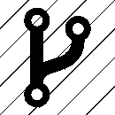

# CTO 到 VP 工程分叉|被 FA 及其他思考

> 原文：<https://beingfa.com/2016/12/13/the-cto-to-vp-engineering-fork/?utm_source=wanqu.co&utm_campaign=Wanqu+Daily&utm_medium=website>

【本博客最早发布于 2016 年，更新于 2018 年和 2020 年】

在每个规模化科技初创企业的生命中，都会有一个时候，工程团队开始显示出需要帮助的迹象。这些症状可能包括发布新产品/功能的速度损失、损耗或士气问题、脆弱的代码或缺乏创新。我经常听到 CEO 和创始人说“我们需要一个新的 CTO”或者“我们应该雇佣一个工程副总裁吗？”。但是这到底意味着什么呢？一个头衔是一回事，但治愈症状所需的技能是另一个挑战。

大多数科技创业公司都有人担任首席技术官——无论是联合创始人之一还是第一个高级雇员。首席技术官的[角色并不简单，随着公司规模的扩大，这个角色成为最终的](http://www.forbes.com/sites/laurencebradford/2016/11/28/5-key-skills-needed-to-succeed-as-a-cto/#b7571099a5be)是不合理的。在创业初期，首席技术官通常是所有技术事务的首席厨师和洗瓶工。她编写代码，充当事实上的 IT 人员和项目经理，与首席执行官一起会见客户，并帮助做出招聘决定。人们希望她精通技术，通常是某个领域的专家。向所有这些气缸开火可能会满足你公司的短期需求，但通常情况下，当你的首席技术官不再[擅长](https://beingfa.com/2015/01/24/just-be-excellent/)他们来你公司要做的事情的时候。

根据我的经验，随着公司的发展，首席技术官通常会有两种类型:

**布道者**——你产品的无耻推销者，这位 CTO 在路上会见潜在客户、现有客户和合作伙伴，推销你的产品。与此同时，他们正在收集对您的产品、其痛点的宝贵见解，并了解它与竞争对手相比如何。他们关注行业趋势和你的产品所属的生态系统。他们是客户的最终代言人，非常清楚产品的优先顺序。他们为“设定了远景。产品的下一步”和长期路线图。他们可能曾经是一名程序员，了解你的技术架构的基础。他们可以与您所在领域的其他技术领导者正面交锋，并在技术会议上代表您的公司。他们也倾向于吸引工程人才。

这位首席技术官与首席执行官、销售和营销主管携手合作，为公司制定战略，从市场方向到业务运营和规模。他们精通财务，能够自如地向董事会汇报并与之合作。

**专家** —通常是领域专家或技术大师，这位首席技术官带领您的工程团队，确保您的产品能够大规模运行。他们可能编码，参加代码评审，指导初级工程师。他们要么设计您的底层架构，要么至少引导对话并签署提议的计划。他们也是人才磁铁，吸引希望从这位首席技术官的经验中学习的高级工程师。他们可能是开源社区的主要贡献者，在申请专利、发表技术论文和在技术和学术会议上发言方面很有建树。虽然他们喜欢与客户会面，并重视从这些会面中获得的洞察力，但他们更喜欢与客户团队的技术成员进行更亲密的会面和白板会议，以集思广益的方式解决问题，而不是“销售”您的产品。

这位首席技术官与销售和支持团队密切合作，通常将公司战略和增长讨论留给首席执行官和组织的其他领导人。他们对公司应该何去何从有自己的看法，而且他们不怕分享，但他们把细节留给“管理层”。

在上述两种情况下，这类 CTO 中很少有人同时也是执行大师。这就是为什么需要一个工程副总裁(VPE)的时候了。虽然 VPE 通常可以充当客户的代言人、技术专家和/或在技术论坛上代表公司，但 VPE 的重点是 GSD。工程副总裁与首席技术官的主要区别在于:

*   **以流程为导向** —围绕优先级、速度、质量和满足最后期限进行高度组织。他们有很强的项目管理和沟通技巧。
*   **擅长招聘**——模式匹配技能不仅适用于技术专家，也适用于具有合作精神和使命感的人。知道如何识别首席工程师和渴望学习的工程师，知道什么时候说“不”,即使简历看起来很棒。成为团队的一员对成功至关重要。
*   **擅长发展他们的团队**——这不仅仅是从 10 人发展到 40 人或 100 多名工程师。这是关于职业发展的。他们有着将初级工程师带入组织并将他们培养成技术领导者和领域专家的记录。他们以前的工程师跟随他们从一家公司到另一家公司，因为和他们一起工作很愉快。他们知道如何玩得开心，也知道如何适当地推动团队在紧急情况下赶上最后期限，而不是让他们筋疲力尽。
*   **挑战现状**——他们不仅会继续打造联合创始人开创的东西，还会质疑**什么**和**如何**。他们了解技术债务对产品长期可扩展性的影响。他们也知道如何在不影响公司发展的情况下调整流程。他们有动力提供客户不仅需要，而且喜欢的产品和功能。他们与项目经理同事合作得很好，并且都尊重和欣赏来自外部工程(销售、支持、首席技术官……)的意见。
*   **不怕弄脏自己的手** —他们领导/参加代码评审，在紧急情况下可以编写代码，喜欢摆弄竞争对手的产品以了解自己产品的优势/挑战，欣赏消灭错误的艺术。当有截止日期时，他们会早来晚走——即使只是为了确保工程师得到食物和咖啡。
*   **战略思考者** —虽然工程副总裁可能不会参与决定公司的长期战略，但他们是讨论的一部分。他们理解上市时间与质量之间的权衡，重视让 [MVP](https://leanstack.com/minimum-viable-product/) 尽早获得客户反馈的需要。他们可能会推动一个产品、功能或挤出时间来弥补[的技术债务](https://hackernoon.com/there-are-3-main-types-of-technical-debt-heres-how-to-manage-them-4a3328a4c50c)，但也尊重路线图的更大愿景，并知道何时放弃不是优先事项的东西——事实上，真正优秀的 VPE 为了速度和 GSD，比首席技术官或首席执行官可能喜欢的更快地杀死东西。

当你决定是时候放弃技术领导的角色，同时拥有一名首席技术官和一名 VPE 时，寻找一个渴望建立合作关系的人，他更喜欢依靠 GSD 和成长中的团队，并且重视你的首席技术官的技术领导能力、愿景和布道。那个人可能是你的工程组织中的一个强有力的领导者，或者你必须为这个职位招聘。如果从公司外部招聘，要警惕那些在公司寻求 VPE 职位的职业首席技术官——他们可能会说他们愿意负责 GSD，但可能很难与你的首席技术官合作。寻找他们过去作为经理或技术领导的工程领导角色的例子。他们以前的员工有没有跟着他们去过不同的公司？还要寻找可衡量的成就，如提高的速度、质量改进或招聘/团队发展指标。这些迹象表明，你已经有了一个坚定的 VPE 候选人。

有时候，创始人首席技术官需要进行大量的自我反省，才能意识到他们在 VPE 这类活动中没有很好地为公司服务。我见过很多首席技术官担心，有了 VPE，他们不知道自己在公司的下一步是什么。我也见过首席技术官在与伟大的 VPE 合作时表现出色，他们可以协同制定愿景和执行战略。类似地，我看到过一些公司在他们当前的工程主管还没有准备好或者对这个角色不感兴趣的时候(对内或者对外)引进了一个伟大的 CTO。这对工程主管来说是一个很好的指导机会，并且/或者让他们继续关注 GSD。

还有一点需要考虑(2020 年新增):无论首席技术官与布道者或专家的关系更密切，他们也可以成为副总裁(工程、产品、设计等)的伟大领导者。).他们可以将这些团队“粘合”在一起，以确保产品的愿景和执行能够很好地配合。这些 CTO 也可以作为其他团队的桥梁——与支持、销售、营销等部门建立健康的工作关系..然而，并不是每个 CTO 都是(或想成为)伟大的人/团队领导者，即使是在更高和更具战略意义的层面。在这种情况下，副总裁最好向首席执行官或首席运营官汇报。当组织以这种方式设计时，首席技术官通常会直接向首席执行官报告，如果需要/愿望出现，仍然可以有一个由个人贡献者(架构师、科学家、小型首席技术官)组成的团队向他们报告。

你和 CTO 一起奋斗到 VPE 分叉了吗？在评论中分享你的经验吧！

### 像这样:

像 装...

### *相关*