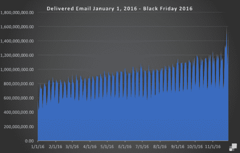
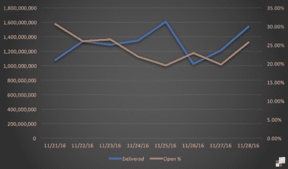
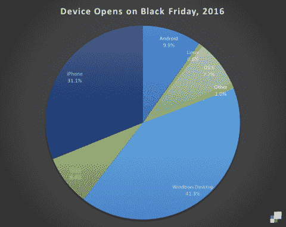
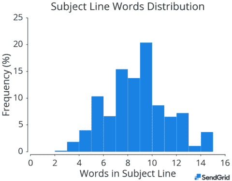
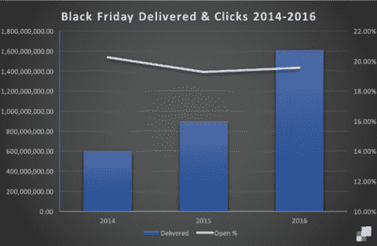

# 黑色星期五和网络星期一的数字

> 原文：<https://sendgrid.com/blog/black-friday-cyber-monday-by-the-numbers/?utm_source=wanqu.co&utm_campaign=Wanqu+Daily&utm_medium=website>

大规模谈论电子邮件可能会很尴尬；大多数人从最终用户的角度和使用网络邮件或桌面邮件客户端的体验来看待电子邮件。这不是我对大规模电子邮件的看法。

我是这样看待扩展电子邮件的:发送一封电子邮件很容易，甚至是微不足道的。发送 10 封电子邮件也很简单，你只需将 10 个电子邮件地址放入“收件人”、“抄送”或“密件抄送”行。发送 100 封电子邮件是乏味的，但也很容易实现。发 1000 封邮件呢？1,000,000?100,000,000?16 亿呢？达到规模意味着对你从来不知道存在的问题进行排序；发送 16 亿封电子邮件很难，但这就是 SendGrid 在黑色星期五所做的。

## 向右上方！

[

<noscript></noscript>](https://sendgrid.com/wp-content/uploads/2016/12/BFCM1.png) 

在这一年的大部分时间里，我们每天都会发送超过 10 亿封电子邮件。电子邮件没有萎缩，恰恰相反，如果你看看那些经常宣布发送量里程碑的邮件发送者，你会发现电子邮件正在增长，因为它是一个主要的收入来源。

## 假日周末

深入挖掘数据，我们看到了一个可能在整个行业重复出现的趋势:一周内的高交易量，周末有所缓解。然而，黑色星期五是一个巨大的数据高峰，在周末有持续的成交量；没有一个节日像黑色星期五一样产生如此多的电子邮件流量。

[

<noscript></noscript>](https://sendgrid.com/wp-content/uploads/2016/12/BFCM2.png) 

即使是网络星期一，虽然很接近，也没有超过感恩节后一天的巨大销量。零售自然是这一数量的主要驱动力；[电子邮件一直在帮助推动网上和店内销售](http://www.dmnews.com/marketing-strategy/email-drives-27-percent-of-black-fridays-online-sales/article/385985/)——人们在购物假期的前一天就做好了准备，期待以各种可以想象的形式和通过各种渠道节省开支。

开盘利率仍然很高，但似乎因交易量和周五人们最有可能逢低买入的事实而有所下降。无论打开率下降的实际原因是什么，它们都反弹并开始攀升，以应对在线购物活动和持续打开率超过 20%的假定店内活动。(要查看您的打开率比较，请参考我们的 [*全球电子邮件基准报告*](https://sendgrid.com/marketing/guide-2018-global-email-benchmark-report/) 。)

## 移动电话继续独占鳌头

还记得那个移动引爆点吗？它来了又去，只是我们生活的新现实。根据我们的数据，移动设备的开放率不到 50%，但像 Litmus 这样定期跟踪设备开放率的公司认为苹果和安卓设备的开放率约为 54%。有趣的是，windows 的排名远高于我个人的预期。有人可能会说，Windows Surface 等设备卖得很好，正在推动使用 Windows 操作系统的平台和设备的复兴。

我们在 11 月的第一周对 870 万封打开的电子邮件进行了类似的分析，发现桌面和移动邮件处于白热化状态。这里的一大要点是，要在当今多平台和多设备的世界中取得成功，您必须设计良好、响应迅速的模板，无论在何种设备上打开电子邮件，这些模板都将提供一致的体验。

[

<noscript></noscript>](https://sendgrid.com/wp-content/uploads/2016/12/BFCM3.png) 

## 比你能摇动棍子的更多的数据！

我们的大数据团队在假日周末之前提供的其他有趣见解包括行为见解，如:**移动用户很快打开电子邮件**。移动打开的延迟中值比桌面打开的稍短。这是有道理的，我们在旅途中，我们的收件箱在我们的口袋或钱包里，鉴于人们经常在手机上查看电子邮件，电子邮件正在成为一种近乎实时的通信渠道。Gmail 的邮件应用程序仍然是消费者使用的[十大应用程序之一](http://www.nielsen.com/us/en/insights/news/2015/tops-of-2015-digital.html)，在移动世界中电子邮件收费最高。

[

<noscript></noscript>](https://sendgrid.com/wp-content/uploads/2016/12/BFCM4.png) 

主题将永远是围绕电子邮件营销饮水机辩论和讨论的来源。根据我们 11 月初的分析，我们发现 **9 个单词的主题行似乎最受欢迎，但 2-4 个单词的参与度最高**，例如，更多人打开主题行较短的电子邮件。也许较短主题的作者已经掌握了简洁的精髓，并且用一层厚重的精髓来应用它，不管是什么原因，开门见山似乎就能做到！

[

<noscript></noscript>](https://sendgrid.com/wp-content/uploads/2016/12/BFCM5.png) 

我们还基于 80，000 个英语主题行构建了一个单词云。吸收一下这个…这是发生在收件箱里的感官轰炸。如果你是一个邮件发送者，你就是这个组织的一部分，但是每一个电子邮件营销者也是消费者。你从这件事中学到了什么？

[

<noscript></noscript>](https://sendgrid.com/wp-content/uploads/2016/12/BFCM6.png) 

## 在数据中寻找模式

关于数据的事情是，你需要大量的数据来进行有意义的观察，并识别暗示驱动它们的潜在人类行为的模式。我们的数据飞速增长，如今我们发送的电子邮件是两年前黑色星期五的 3 倍，这意味着我们能够发现更多模式和见解，帮助我们的客户更好地与他们的客户互动。

[

<noscript></noscript>](https://sendgrid.com/wp-content/uploads/2016/12/BFCM7.png) 

在 SendGrid，我们为我们所取得的成就感到自豪——充满叙事和行为模式的大规模。帮助我们帮助您，[告诉我们](https://twitter.com/SendGrid?ref_src=twsrc%5Egoogle%7Ctwcamp%5Eserp%7Ctwgr%5Eauthor)哪些可能是有意义的发现，我们将与我们的大数据团队坐下来，看看我们能否从我们庞大的数据驱动的词汇中梳理出这个故事。与此同时，请查看我们的 [*全球电子邮件基准报告*](https://sendgrid.com/marketing/guide-2018-global-email-benchmark-report/) ，该报告分析了从 300 亿封电子邮件到超过 15 亿收件人的趋势。