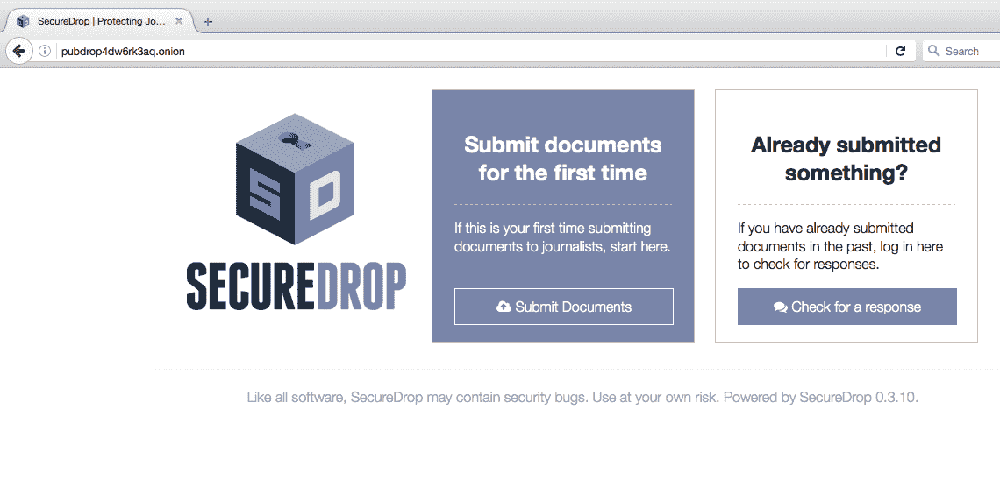
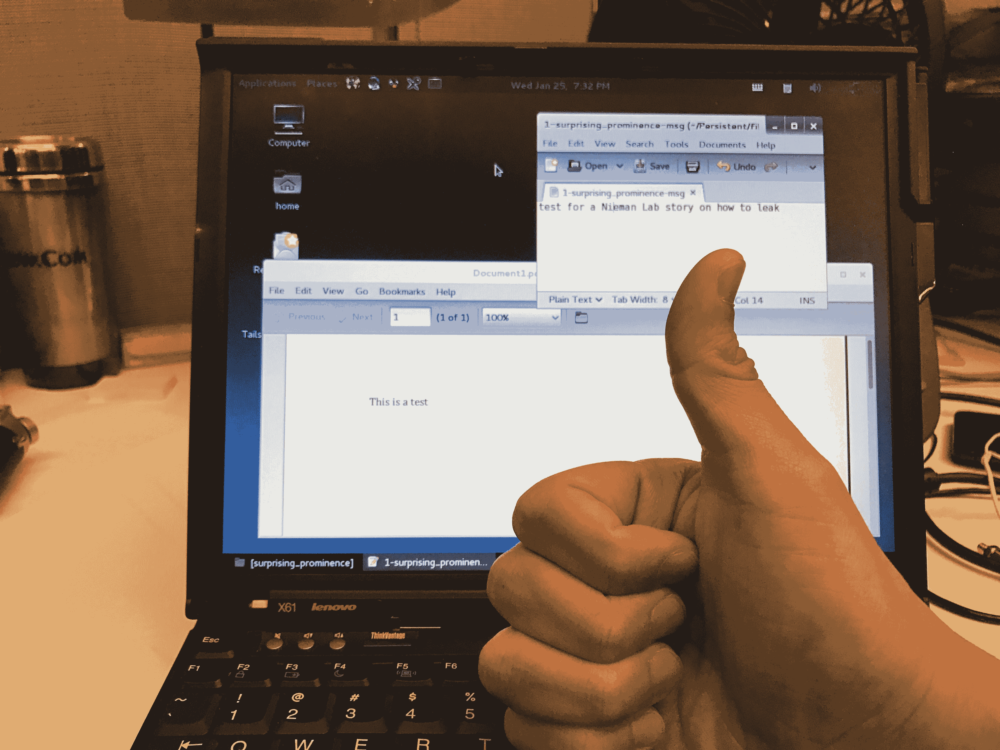
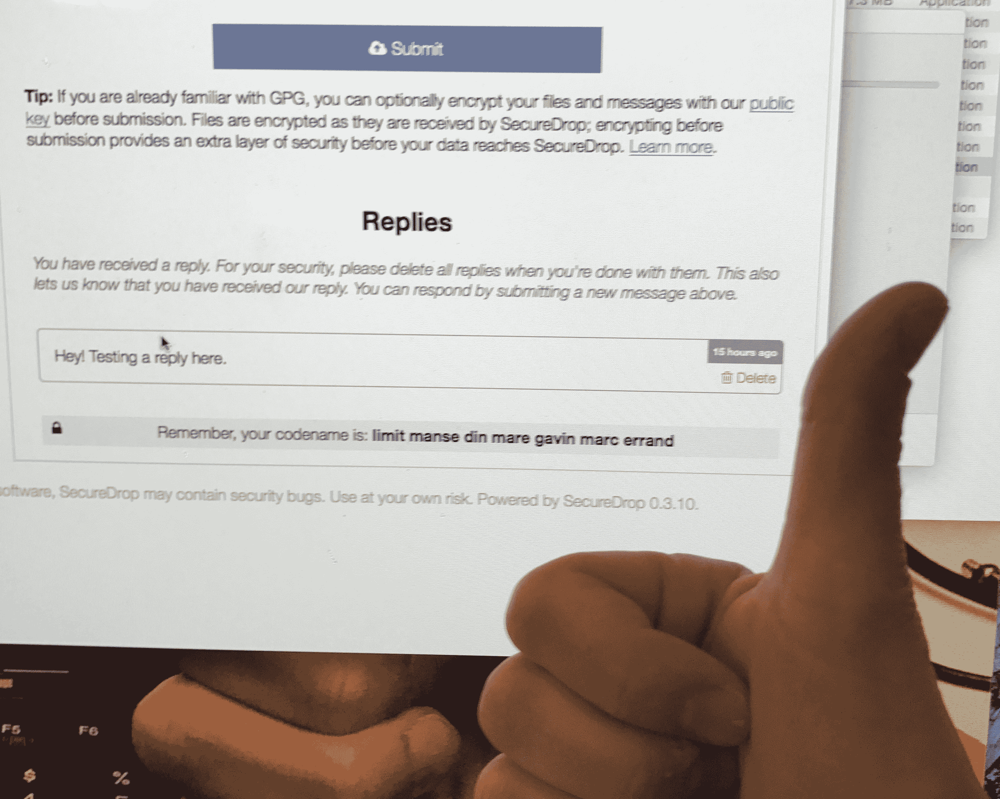

# 将信息安全地泄露给一些美国顶级新闻机构有多容易？这个简单|尼曼新闻实验室

> 原文：<http://www.niemanlab.org/2017/01/how-easy-is-it-to-securely-leak-information-to-some-of-americas-top-news-organizations-this-easy/?utm_source=wanqu.co&utm_campaign=Wanqu+Daily&utm_medium=website>

特朗普政府在上任的第一个星期，就开始限制一些联邦机构与公众沟通的方式，包括媒体。虽然至少一些限制[似乎已经放松](https://www.buzzfeed.com/dinograndoni/trump-agriculture-department)，新政府对媒体的立场非常明确。[“这里的媒体是反对党”，](https://www.nytimes.com/2017/01/26/business/media/stephen-bannon-trump-news-media.html?_r=0)白宫首席策略师和[纽约时报的长期读者](https://twitter.com/maxwelltani/status/824715133842812929)史蒂夫·班农周四说，并补充说媒体应该“保持沉默”一段时间。

本周的事件和新的不确定性气氛促使许多新闻机构提醒读者，他们已经准备好并愿意接受泄露，通过普通邮件，也通过安全工具如 [SecureDrop](https://securedrop.org/) 在线，这是由新闻自由基金会维护的加密匿名通信软件。

我想看看使用 SecureDrop 到底有多简单，这是我以前从未做过的。我得到了 ProPublica 的帮助:我告诉他们我会给他们发一份文件(一份单页的 PDF 文件，上面写着“这是一项测试”)，并请他们确认收到了。如果你真的泄露了什么，并且想保持匿名，这不是你应该做的，但是我很想看看另一边的情况。这

[full instructions](https://docs.securedrop.org/en/latest/source.html)

使用 SecureDrop 的来源在 SecureDrop 网站上，但本质上，这是我所做的——也是你需要做的。

1.在这里下载 Tor 浏览器[。像在电脑上安装任何应用程序一样安装它。](https://www.torproject.org/)

2.打开 Tor。就像使用任何互联网浏览器一样。我主要对它的慢感到惊讶——但这是一个特性，而不是一个错误:“Tor 永远不会像闪电一样快。Tor [在其网站](https://www.torproject.org/docs/faq)上解释道:“你的流量在世界各地志愿者的电脑中来回穿梭，一些瓶颈和网络延迟将一直存在。

3.粘贴你想要到达的新闻机构的 SecureDrop 地址(这些都列在下面，以**结尾)。Tor 地址栏的洋葱**。您将看到发送文档或检查已发送文档状态的选项。

4.您将获得一个秘密代号，作为您的 SecureDrop 登录名。把它写在纸上。“保护你的代号的最好方法是记住它，”SecureDrop 建议。“如果你不能马上记住它，我们建议一开始就把它写下来并保存在一个安全的地方，随着时间的推移逐渐努力记住它。一旦你记住了，你就应该销毁书面副本。”

5.选择要从您的计算机上传的文件，或键入一条消息。

6.你可以通过将 Tor 浏览器重定向到新闻组织的 SecureDrop 地址，然后输入你写下的秘密代码名，来检查对你的消息的回复。

ProPublica 的 Mike Tigas 证实 ProPublica 已经收到了我的测试。这是他们那边的情况——注意，ProPublica 只把我看作一个代号:“令人惊讶的突出”

我使用在步骤 4 中分配给我的七个单词的代号重新登录，看到了我在 ProPublica 的回复。

就是这样。这比我想象的要容易得多。泄密者不应该使用他们的工作电脑，而应该使用公共 wifi，“比如星巴克、酒店或任何开放互联网供公众使用的地方。”当然，仅仅使用 Tor 和 SecureDrop 并不是一个完美的安全解决方案:如果你从雇主的一台电脑上做这件事，它可能会注意到 Tor 网络被访问，即使它看不到你发送的任何内容。尽可能谨慎和理智地远离您可能连接的设备和网络位置。

你可能还想看加拿大《环球邮报》的视频，来直观地展示上述步骤。

下面是新闻机构名单，以及如何向他们泄密。官方的 SecureDrop 目录是[这里是](https://securedrop.org/directory)，建议你“比较。将组织登录页上提供的洋葱地址添加到此列表中的相应条目，并在继续之前验证地址是否匹配。这提供了一个强大的防御层，可以抵御某些类型的攻击，这些攻击可能会诱使您访问伪装成合法实例的恶意 SecureDrop 实例。”

《卫报》还指出:“我们建议你在上传时不要直接从登录页面跳转到 SecureDrop 网站，尤其是在可能被监控的商业网络上。最佳做法是记下 Tor url，稍后从另一台机器上传您的内容。”

### 公之于众

**泄密登陆页面【针对常规浏览器】:**[https://securedrop.propublica.org/](https://securedrop.propublica.org/)
T5】Tor 内地址:pubdrop 4d w6 rk 3 AQ . onion
**邮寄地址:** ProPublica，155 Avenue of the Americas，13th floor，New York，NY 10013-1507

### 《纽约时报》

**泄密登陆页面:**【https://www.nytimes.com/newsgraphics/2016/news-tips/】
**Tor 中的地址:**nytimes 2 tsqtnxek . onion
**邮寄地址:**纽约第八大道 620 号纽约时报，NY 10018
**WhatsApp 及信号:** 1-646-951-4771
**邮箱:**tips@nytimes.com，PGP 指纹:44b 6 64

### 华盛顿邮报

**泄密登陆页面:**【https://www.washingtonpost.com/securedrop/】T2。参见“[以下是如何将政府文件泄露给邮报的方法。](https://www.washingtonpost.com/news/politics/wp/2017/01/25/heres-how-to-leak-government-documents-to-the-post/)"
**Tor 地址:**vbmwh 445 KF 3fs 2v 4 . onion
**邮寄地址:**华盛顿邮报，DC 华盛顿西北 K 街 1301 号，邮编 20071

### BuzzFeed

**泄密登陆页面:**[https://contact.buzzfeed.com/](https://contact.buzzfeed.com/)
T5】Tor 中的地址:6 CWS 3r cwn 7 aom 44 r . onion
**邮寄地址:** BuzzFeed News NY，转交 Mark Schoofs，调查&项目编辑，纽约州纽约市 BuzzFeed Newsroom 东 111 街，邮编 10003
信号: 1-646-379-1975

### Gizmodo 媒体集团

**泄密登陆页面:**[https://tellontrump.com](https://tellontrump.com/)
T5】Tor 中的地址:gmg 7 JL 25 ony 5 G7 ws . onion
**邮寄地址:**纽约西 17 街 2 号 2 楼 Gizmodo Media Group 特别项目服务台 10011
**电话，WhatsApp，信号:** 1-917-999-6143

### 美联社

**泄密登陆页面:**[https://www.ap.org/tips/](https://www.ap.org/tips/)
T5】Tor 中的地址:3 expgpdnrrzezf 7 r . onion
**邮寄地址:**美联社，转交泰德·布里斯，调查编辑，1100 13th Street NW，Suite 500，Washington，DC 20005
**电话，WhatsApp，信号:** 1-202-556-1927

### 《卫报》

**泄密登陆页面:**[https://securedrop.theguardian.com/](https://securedrop.theguardian.com/)
T5】Tor 中的地址:33 y6 fjyhs 3 phzfjj . onion
**邮寄地址:** The Guardian(美国总部)，222 百老汇，22 楼和 23 楼，纽约州 10038

### 《纽约人》

**泄密登陆页面:**[http://projects.newyorker.com/strongbox/](http://projects.newyorker.com/strongbox/)
T5】Tor 地址:strngbxhwyuu 37 a 3 . onion
**邮寄地址:**纽约世界贸易中心 1 号《纽约客》，纽约州 10007

### 截击

**泄密登陆页面:**[https://theintercept.com/leak/](https://theintercept.com/leak/)
T5】Tor 地址:y 6 xjgkgwj 47 us 5 ca . onion
**邮寄地址:** The Intercept，邮政信箱 65679，华盛顿，DC 20035 或 The Intercept，114 Fifth Avenue，18th floor，New York，NY 10011

### 副的

**泄密登陆页面:**[https://news.vice.com/securedrop/](https://news.vice.com/securedrop/)
T5】Tor 中的地址: cxoqh6bd23xa6yiz.onion

### 环球邮报

**泄密登陆页面:**
**Tor 中的地址:**n 572 ltg4 NLD 3 bsz . onion