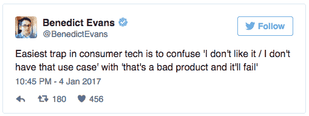

# 坏产品谬论:不要把“我不喜欢它”和“这是个坏产品，它会失败”混为一谈

> 原文：<http://andrewchen.co/bad-product-fallacy/?utm_source=wanqu.co&utm_campaign=Wanqu+Daily&utm_medium=website>

a16z 的本尼迪克特·埃文斯最近在推特上写道:

这条微博里有太多的真相。它引起了如此多的共鸣，我认为它值得一个名字:

> 坏产品谬论
> 你个人的使用案例和观点是产品未来成功的糟糕预测。

我在湾区已经呆了 10 年了，没有什么比预测一个产品是否会成功更让人难受的了。弄错了这一点会伤害自我，有时还会损害支票簿——问问那些拒绝脸书、谷歌、优步等公司的投资者就知道了！就我个人而言，我完全错过了[脸书的潜力](http://andrewchen.co/why-i-doubted-facebook-could-build-a-billion-dollar-business-and-what-i-learned-from-being-horribly-wrong/)，这只是这些年来许多糟糕预测中的一个。

坏产品谬论的发生是因为产品的轨迹发展很快——毕竟它只是软件——随着时间的推移，一组简单的功能可以快速成长为一个丰富、复杂的平台。

让我们来看看“劣质产品谬论”的一些评论根源:

**一切从一个玩具开始** 坏产品谬论的第一个也是研究得最透彻的根本原因来自破坏性创新理论。许多产品在成功之前看起来像玩具。仅以 Instagram 为例——它最初只是一个照片过滤器应用程序，现在是世界上最大的媒体资产之一。或者个人电脑，最初是为业余爱好者设计的，因为它们功能不足，对商业应用没有用处。

哈佛大学的克莱顿·克里斯滕森(Clayton Christensen)将这一现象作为颠覆性创新理论进行了广泛研究，这一现象在简介中得到了很好的总结:

> 颠覆性技术被视为玩具，因为当它们首次推出时，它们“未能满足”用户需求。第一部电话只能传送一两英里的声音。当时领先的电信公司西联公司放弃了购买这款手机，因为他们看不到这款手机对他们的主要客户——企业和铁路有什么用处。
> 
> *–a16z 大奖赛的克里斯·迪克森*

现在你知道你可能会落入这个陷阱:如果你第一次使用一个新产品，然后说，“嗯，就这些吗？”那你可能只是在喘气。或者，即使底层技术正在以极快的速度升级，你还是会抱怨缺乏功能。

只需等待几年——到那时，产品将有如此大的改进，以至于您会意识到您完全弄错了。

**摩尔定律适用于一切**
颠覆性创新的反面是，产品可以以超高的价格开始，但随后价格迅速下跌，从而在一个大型的主流市场取得成功。iPhone 是一个经典的例子，但是特斯拉、优步和其他公司也在实现这个目标。有时会有一种摩尔定律效应，随着时间的推移，东西变得越来越好，越来越便宜。

再来看 iPhone，经典的例子。史蒂夫·鲍尔默做了一个非常糟糕的预测——当被问及新设备时，他笑了！不是威胁！相反，他解释了为什么 iPhone 会失败:

> 500 美元？全额补贴？有计划吗？我说这是世界上最贵的手机。而且它对商务客户没有吸引力，因为它没有键盘。这使得它不是一个很好的电子邮件机器。
> 
> *——苹果手机上的微软史蒂夫·鲍尔默*

很有趣，对吧？后知后觉是 20/20。或者说到手机，这里有另一个有趣的例子，但是是关于手机的:

> 在 20 世纪 80 年代早期，美国电话电报公司要求麦肯锡估计在世纪之交世界上将有多少移动电话在使用。该咨询公司指出了新设备的所有问题——手机重得离谱，电池不断耗尽，覆盖范围不均衡，每分钟费用过高——并得出结论，总市场将约为 90 万部。当时，这促使美国电话电报公司退出市场，尽管后来改变了主意。
> 
> *—《经济学人》，1999 年 10 月*

但是当然，手机作为奢侈品很快就被修复了。通过降低每分钟的成本和解决其他技术问题，手机已经成为世界上最普遍的计算设备。

以下是你如何知道自己将要犯下这种劣质产品谬误的方法:如果你尝试一种产品并问“为什么有人会花这么多钱买它？”然后你需要考虑如果服务/产品变得非常非常便宜会发生什么。或者如果事实证明消费者不介意价格。思考这些趋势可以改变游戏。

当我看到早年的优步时，我自己也怀念这里。当优步第一次出现时，我想，哇，为什么会有人需要一个叫豪华轿车的应用程序呢？这是一个喜欢幻想的人的问题。但是，当然，如果你能把价格从豪华轿车降到出租车，那么比出租车还便宜，有一天比拥有一辆汽车还便宜——这可能是一个万亿美元的公司。事实证明，随着时间的推移，运输成本存在某种摩尔定律效应，现在我正在那里工作:)

有些产品是从销售邮票、硬币和漫画书开始的
市场有自己的这种谬论，因为它们通常从买家/卖家聚集的垂直利基市场开始，慢慢地需要发展到新的垂直市场。如果这些最初的利基市场不适合你，那么你可能会错过这个市场的潜力，即使它最终会成长为你也会发现有用的领域。

这方面的经典例子是易贝:Bessemer Ventures 有机会投资，但当时市场上有很多收藏品。以下是他们的评价:

> “邮票？硬币？漫画书？你一定是在开玩笑，”考恩想。"简单的传球"
> 
> *–Bessemer Venture Partners，反投资组合页面*

当然，易贝继续增加许多新的垂直行业，从汽车到电子产品等等，最终给他们的原始投资者带来了 700 倍的回报。

这里的棘手之处在于，你可能不想购买处于市场初始垂直领域的产品，这意味着该产品不适合你的用例，或者你不会喜欢它。然而，如果你等待几年，市场可能最终会发展成你所关心的产品类别。

**社交网络和内容平台需要密度、渗透率才能变得有用**
最后，让我们看看社交/交流/UGC 网络，它们也有自己的问题。这些平台可能非常棘手，因为与市场类似，随着网络的形成，它们需要时间来成熟。

经常被引用的数字社区 1/9/90 规则从根本上推动了这种动态:

> 1%规则表明，在互联网上创建内容的人数大约占实际浏览该内容的人数的 1%。例如，对于每个在论坛上发帖的人来说，通常大约有 99 个其他人正在查看该论坛但没有发帖。(维基百科)

这意味着，与市场类似，你需要在每一个内容垂直领域的内容创造者和消费者之间保持适当的平衡，才能拥有一个正常运转的网络。如果像 Snapchat 这样的社交通讯产品只有在你有 5 个以上的朋友使用时才有用，如果核心市场是青少年而不是 40 岁的风险投资家，你自然会误解它。如果你在 1990 年尝试使用互联网，你可能已经决定它永远不会工作，因为它都是学术研究人员。

今天，你可能会对 VR 持怀疑态度，因为它主要是游戏，而你真正想使用的应用程序还没有开发出来。但是等着瞧吧，一旦内容创建者、消费者、开发者和其他参与者的正确动态出现在桌面上，一切都可能会水落石出。

与市场类似，社交网络、通信工具和用户生成的内容平台都需要足够数量的创造者和消费者才能运转。有时候，这是从一个利基市场开始的——比如大学生或旧金山的技术人员。但是，如果一个产品能够锁定最初的垂直市场，并开始触及其他垂直市场，它可能会走向主流成功。不要过早下判断！

**避免劣质产品谬误** 最后，我们都喜欢用自己的个人判断来迅速对产品说是或不是。但是坏产品谬论说我们自己的观点是成功的可怕预测，因为技术变化如此之快。

因此，我留给你几个问题，当你在看新产品时可以问:

*   如果它看起来像一个玩具，如果它在最初的观众中获得成功，然后开始添加更多的功能，会发生什么？
*   **如果看起来像奢侈品**，如果变得便宜很多会怎么样？还是好得多，价格一样？
*   **如果一个市场不卖你想买的任何东西**，当它开始供应你觉得有价值的产品和服务时会发生什么？
*   如果你的朋友中没有人使用社交产品，当他们赢得了一个利基市场，最终你所有的朋友都在使用它，会发生什么？

很难问这些问题，因为它们大多暗示着产品创新的非线性轨迹。然而，技术很少是直线发展的——它们是指数增长的，无论是在效用、性价比还是网络效应方面。问自己上述问题，以保持中心，如果你用它来寻找下一个优步或脸书，给我(和本！)大喊一声:)

**PS. Get new updates/analysis on tech and startups**

我写一份高质量的每周时事通讯，报道硅谷发生的事情，关注创业、营销和移动领域。

在本网站链接的“内容”(包括帖子、播客、视频)中或在社交媒体和其他平台(统称为“内容分发渠道”)中发表的观点是我自己的，并不是 AH Capital Management、l . l . c .(“a16z”)或其各自附属公司的观点。AH 资本管理公司是一家在证券交易委员会注册的投资顾问公司。注册为投资顾问并不意味着任何特殊技能或培训。这些帖子不针对任何投资者或潜在投资者，也不构成出售或购买任何证券的要约，不得用于或依赖于评估任何投资的价值。

内容不应被解释为或以任何方式依赖于投资、法律、税务或其他建议。您应该向您自己的顾问咨询有关任何投资的法律、商业、税务和其他相关事宜。这些材料中表达的任何预测、估计、预测、目标、前景和/或观点可能会在不通知的情况下发生变化，并且可能与他人表达的观点不同或相反。此处提供的任何图表仅供参考，在做出任何投资决策时不应依赖。此处包含的某些信息来自第三方来源。虽然这些信息来自据信可靠的来源，但我并未独立核实这些信息，也未对这些信息的持久准确性或其在特定情况下的适当性做出任何陈述。该内容仅在所示日期有效。

在任何情况下，本网站或相关内容分销渠道上提供的任何帖子或其他信息都不应被解释为 a16z 人员发起、讨论或提及的任何集合投资工具中的任何证券或权益的购买或销售要约。也不应被理解为提供投资咨询服务的要约；投资 a16z 管理的集合投资工具的要约将单独提出，并且仅通过特定集合投资工具的保密要约文件提出，这些文件应完整阅读，并且仅提供给符合联邦证券法规定的特定资格的人。这些投资者被定义为合格投资者和合格购买者，通常被认为有能力评估潜在投资和财务事项的优点和风险。不能保证 a16z 的投资目标会实现或投资策略会成功。对 a16z 管理的投资工具的任何投资都包含很高的风险，包括损失全部投资金额的风险。提及、提及或描述的任何投资或投资组合公司并不代表 a16z 管理的所有投资工具，也不能保证这些投资将会盈利，也不能保证将来进行的其他投资会有类似的特征或结果。a16z 管理的基金所做的投资清单可在 https://a16z.com/investments/.获得。该清单不包括发行人未允许 a16z 公开披露的投资以及对公开交易的数字资产的未宣布投资。Andreessen Horowitz 投资、集合投资工具或投资策略的过去结果不一定代表未来结果。请参见[https://a16z.com/disclosures](https://a16z.com/disclosures)了解更多重要信息。