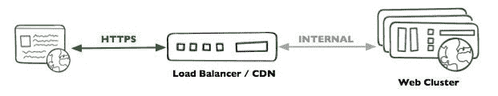
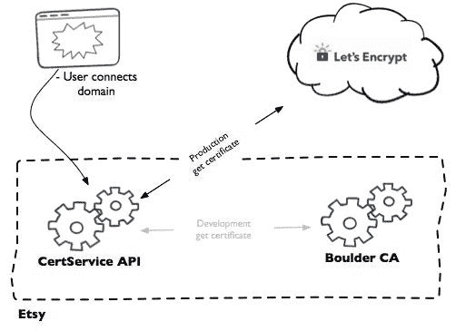
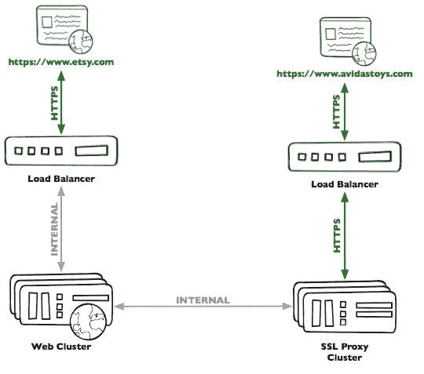
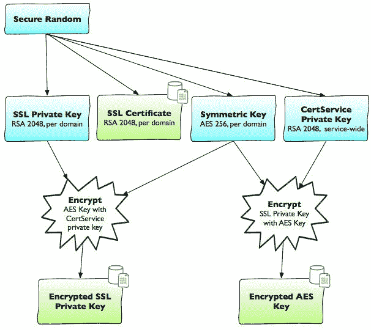
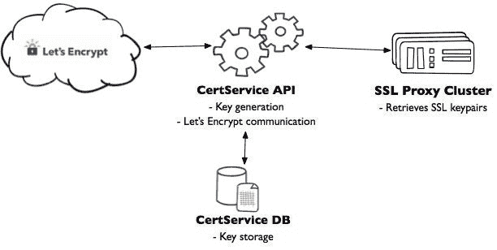

# Etsy 工程| Etsy 如何管理模式上自定义域的 HTTPS 和 SSL 证书

> 原文：<https://codeascraft.com/2017/01/31/how-etsy-manages-https-and-ssl-certificates-for-custom-domains-on-pattern/?utm_source=wanqu.co&utm_campaign=Wanqu+Daily&utm_medium=website>

作者:安迪·雅科·明克，奥马尔·艾哈迈德

2016 年 4 月，Etsy 推出了新产品 Pattern，让 Etsy 卖家能够创建自己的托管电子商务网站。凭借简单的设置体验、现代时尚的主题和客人结账，卖家可以在 Etsy.com 零售市场之外销售和管理他们的品牌标识，同时利用 Etsy 的所有电子商务工具。

将自定义域指向模式站点的能力是一个特别受欢迎的特性；许多模式站点使用自己的域名，或者直接在模式仪表板上注册，或者从第三方注册商链接到模式。

在发布时，带有自定义域的模式商店通过 HTTP 提供服务，而检出和其他安全操作通过与 Etsy.com 的安全连接进行。尽管这个模型并不理想；谷歌对使用 SSL 的网页排名略高，并计划提高使用 SSL 的网站的排名。这对我们的卖家来说是一大优势。另外，现在是 2017 年——如果可以的话，我们不想在无聊的旧 HTTP 上提供页面……我们真的真的很喜欢绿色的小锁图标。


在本帖中，我们将探讨在构建一个旨在为数十万个域名提供 HTTPS 流量服务的系统时，你会遇到的一些有趣的挑战。

## 如何去 HTTPS

首先，让我们谈谈 HTTPS 是如何工作的，以及我们如何为单个域设置它。

让我们不要谈论太多关于 HTTPS 是如何工作的，因为那会花很长时间。非常简单:HTTPS 指的是 SSL 上的 HTTP，SSL 指的是 TLS。所有这些都是您的网站与客户安全通信的一种方式。当客户端第一次开始与您的站点通信时，您向他们提供一个证书，客户端验证您的证书来自可信的证书颁发机构。(这是一个严重的过度简化，这里有一个[非常有趣的帖子，有更多的细节](http://www.moserware.com/2009/06/first-few-milliseconds-of-https.html)。)

简单地说，如果您想要 HTTPS，您需要一个证书，如果您想要一个证书，您需要从证书颁发机构获得一个证书。直到最近，这是你不得不打开钱包的时候。有几个认证机构，每个都有一系列令人困惑的选项和昂贵的追加销售。

[T2】](http://i.etsystatic.com/inv/1bc9bb/3444012578/inv_fullxfull.3444012578_rxsm6kcc.jpg?version=0)

你挑一个你觉得合适的，拿出你的信用卡，最后你得到一个有效期一到三年的证书。一些 CA 提供 API，但是三年是一个相对长的时间，所以你可以手工完成。另外，谁知道哪个 SSL 定价矩阵中的哪个单元格能让您访问 API 呢？

从这里开始，如果您管理有限数量的域，通常您要做的是将您的证书和私钥上传到您的负载平衡器(或 CDN ),它会为您处理 TLS 终止。客户端使用您的域的公共证书通过 HTTPS 与您的负载平衡器通信，您的负载平衡器向您的应用程序发出内部请求。

[T2】](http://i.etsystatic.com/inv/1992b4/3491680541/inv_fullxfull.3491680541_livpg914.jpg?version=0)

就是这样！您的客户端在地址栏中有绿色的小挂锁，您的应用程序像以前一样提供有效负载。

## 更多的证书，更多的问题

如果您的应用程序由少数顶级域提供服务，手动颁发证书就足够了。如果你需要很多很多顶级域名的证书，这是行不通的。我们提到过这种模式每月 15 美元的合理价格吗？对我们来说，一个真正的底线要求是，我们不能为一个证书支付比某人支付一年的模式更多的费用。我们当然没有时间手工签发所有这些证书。

直到最近，我们在这一点上唯一的选择是 1)与提供 API 访问的大认证机构之一达成协议，或者 2)成为我们自己的认证机构。这两个都是昂贵的选项(我们不喜欢昂贵的选项)。

### 让我们加密救援

幸运的是，2016 年 4 月，包括 Mozilla 基金会和电子前沿基金会创始人在内的互联网安全研究小组(ISRG)推出了一个名为 [Let's Encrypt](https://letsencrypt.org/) 的新认证机构。

ISRG 还设计了一个通信协议，即自动证书管理环境(ACME ),它涵盖了 TLS 终止证书的颁发和更新过程。Let's Encrypt 免费提供服务，并且只通过实现 ACME 协议的 API 提供服务。(你可以在这里阅读更多细节。)

这对我们的项目来说很棒:我们找到了一个我们觉得非常好的认证机构，因为它实现了一个自由发布的协议，所以有很好的开源库可以与之交互。

### 建立证书发行

现在我们有了一个获得证书的好方法，让我们重新审视一下我们的问题:

1.  我们有大量的自定义域附加到现有的模式网站；我们需要为所有这些生成证书。
2.  我们有新模式网站的新域名注册的持续流；我们需要在滚动的基础上获得新的证书。
3.  让我们加密持续 90 天的证书；我们需要相当频繁地更新我们的 SSL 证书。

所有这些问题现在都可以解决了！我们为 PHP 选择了一个开源的 ACME 客户端库，名为[acmehph](https://github.com/acmephp)。让我们使用开放协议加密的另一个令人兴奋的事情是，有开源服务器实现以及客户端实现。因此，我们能够建立一个名为[博尔德](https://github.com/letsencrypt/boulder)的内部等效物，在我们的私有网络中进行开发和测试，而不用担心速率限制。

[T2】](http://i.etsystatic.com/inv/f5f65a/3444012734/inv_fullxfull.3444012734_5ity837u.jpg?version=0)

我们构建的服务用于处理这个 ACME 逻辑，存储我们收到的证书，并跟踪我们拥有证书的域，我们将其命名为 CertService。你看，这是一种处理证书的服务。CertService 与 Let's Encrypt 通信，还为其他内部 Etsy 服务公开了一个 API。我们将在这篇文章的后面更详细地讨论这个问题。

## 大量域名的 TLS 终止

既然我们已经构建了一个可以颁发证书的服务，我们需要一个放置证书的地方，并且我们需要使用它们为 HTTPS 模式定制域的请求进行 TLS 终止。

我们为*.etsy.com 处理这一问题的方法是，将我们的证书直接放在我们的负载平衡器上，然后交给我们的 CDN。在规划这个项目时，我们考虑了成千上万个证书，每个证书都有 90 天的有效期。如果我们在颁发和更新我们的证书方面做得很好，那么我们的负载平衡器和 CDN 每天会有数千次写入操作。这不是我们能接受的比率；负载均衡器和 CDN 配置更改是相对高风险的操作。

相反，我们创建了一个代理服务器池，并使用我们的负载平衡器将 HTTPS 流量分配给它们。代理主机处理客户端 SSL 终止，并代理对我们的 web 服务器的内部请求，就像 www.etsy.com 的负载平衡器一样。

[T2】](http://i.etsystatic.com/inv/ebefb6/3491680639/inv_fullxfull.3491680639_kdb5kbb4.jpg?version=0)

我们的代理主机运行 Apache，我们利用 mod_ssl 和 mod_proxy 来完成 TLS 终止和代理请求。为了保留客户端 IP 地址，我们在负载平衡器上使用了代理协议，在代理主机上使用了 mod_proxy_protocol。我们还使用 mod_macro 来避免为成千上万的域编写成千上万的虚拟主机声明。总的来说，它看起来像这样:

```
ProxyPass               /  https://internal-web-vip/
ProxyPassReverse        /  https://internal-web-vip/

    ProxyProtocol On
    ServerName $domain
    SSLEngine on
    SSLCertificateFile      $domain.crt
    SSLCertificateKeyFile   $domain.key
    SSLCertificateChainFile lets-encrypt-cross-signed.pem

Use VHost custom-domain-1.com
...
Use VHost custom-domain-n.com
```

为了将所有这些连接在一起，我们的代理主机定期向 CertService 查询最近修改的定制域的列表。然后，每个主机 1)从 CertService 获取新证书，2)将它们写入磁盘，3)重新生成如上所示的配置，4)正常重启 Apache。

这些重启在我们的代理池中是交错的，所以除了一台主机之外，所有主机都是可用的，并且在任何给定的时间接收来自负载均衡器的请求(交叉手指)。

### 我们如何安全地存储大量证书？

既然我们已经知道了如何通过 LetsEncrypt 以编程方式请求和更新 SSL 证书，我们需要以安全的方式存储这些证书。为此，我们需要做出一些保证:

1.  私钥存储在与其他类型的数据分开的数据库中
2.  静态加密的私钥永远不会以明文形式离开 CertService
3.  SSL 密钥对生成和 LetsEncrypt 通信只发生在可信主机上
4.  私钥只能由 SSL 终端主机检索

保证#1 是显而易见的。如果攻击者要破坏包含数千个明文 SSL 私钥的数据存储，他们将能够截获发送到数千个自定义域的关键数据。由于安全性意味着提高攻击者的成本——也就是说，使攻击者更难成功——我们采用了许多技术来保护我们的密钥。我们的第一层防御是在基础设施层面:私钥存储在远离网络其余部分的 MySQL 数据库中。我们使用 iptables 来限制谁可以连接到 MySQL 服务器，鉴于 CertService 是唯一需要访问的客户端，范围确实很窄。这极大地减少了攻击面，尤其是在攻击者试图从网络上另一台受损的服务器进行攻击的情况下。Iptables 还用于锁定谁可以与 CertService API 通信；在安全认证方案的基础上增加对连接性的限制使得检索证书更加困难。这解决了保证#4。

既然我们已经锁定了对数据库的访问，我们需要确保它们被加密存储。为此，我们利用了一种称为混合密码系统的概念。简而言之，混合密码系统结合了非对称(公钥密码)和对称密码系统。如果您熟悉 SSL，我们在这里处理加密的大部分方式类似于会话密钥。

在这个过程的开始，我们有两段数据:SSL 私钥和它对应的公钥——证书。我们并不特别关心证书，因为根据定义，它是公共的。我们首先生成一个特定于域的 AES-256 密钥，并加密 SSL 私钥。这只是从技术上解决了磁盘上没有明文的问题；加密的 SSL 私钥存储在 AES 密钥旁边，AES 密钥可用于加密和解密。能够窃取加密密钥的攻击者也能够窃取 AES 密钥。为了解决这个问题，我们用 CertService 公钥加密 AES 密钥。现在我们有了一个加密的 SSL 私钥(用 AES-256 密钥加密)和一个加密的 AES 密钥(用 CertService 的 RSA-2048 公钥加密)。现在，不仅密钥真正加密存储在磁盘上，它们在 CertService 上也根本无法解密。这意味着如果攻击者要破坏 CertService 的认证方案，他们最多会收到一个加密的 SSL 私钥；他们仍然需要 CertService 私钥——仅在 SSL 终端主机上可用——来解密它。现在我们已经完全解决了保证#2。

[T2】](http://i.etsystatic.com/inv/375882/3444012822/inv_fullxfull.3444012822_pv14rko8.jpg?version=0)

剩下的唯一保证就是#3。如果密钥生成遭到破坏，攻击者将能够在私钥被加密和存储之前获取它们。如果 LetsEncrypt 通信遭到破坏，攻击者可以使用我们的密钥为我们已经授权的域生成证书(他们可以在技术上授权新的域，但这将非常困难)，甚至撤销证书。这两种情况都会使整个系统变得不可信。相反，我们将这种功能局限于 CertService，并将其公开为 API 这样，如果处理模式请求的 web 服务器被侵入，攻击者将无法影响关键的 LetsEncrypt 流。

[T2】](http://i.etsystatic.com/inv/f36d70/3444012910/inv_fullxfull.3444012910_q127g54a.jpg?version=0)

我们的延伸目标之一是考虑部署[HSM](https://en.wikipedia.org/wiki/Hardware_security_module)。如果底层软件中有错误，整个系统的完整性可能会受到损害，从而使我们试图保持的任何保证无效。虽然漏洞是不可避免的，但将关键的加密功能转移到安全的硬件中会减轻它们的影响。

没有一个密码系统是完美的，但是我们已经达到了显著增加攻击者成本的目标。除此之外，我们还为密码系统添加了通常基于主机的警报和监控功能。因此，攻击者不仅要通过几道关卡才能获得这些 SSL 密钥对，还必须在不被发现的情况下完成。

## 在构建之后

所有这些都完成后，我们就有了一个系统来颁发大量的证书，安全地存储这些数据，并使用它来终止 TLS 请求。此时，Etsy 引入了第三方安全公司来进行一轮渗透测试。这个过程最终没有发现任何实质性的安全缺陷，这让我们对我们的系统更有信心。

一旦我们获得了足够的信心，我们将启用 HSTS。这应该是任何 SSL 部署的最终目标，因为它迫使浏览器对所有未来的通信使用加密。没有它，降级攻击可能被用来拦截流量和劫持会话 cookies。

每个模式站点和链接的域现在都有一个有效的证书存储在我们的系统中，并准备好方便安全的请求。此功能在整个模式中推广，所有模式流量现在都通过 HTTPS 推送！

(这个项目是模式团队的 Ram Nadella、Andy Yaco-Mink 和 Nick Steele 合作完成的；安保部的奥马尔和肯·李。还有运营部的威尔·加莱戈。非常感谢丹尼斯·奥尔瓦尼、基尤尔·戈万德和迈克·阿德勒的帮助。)