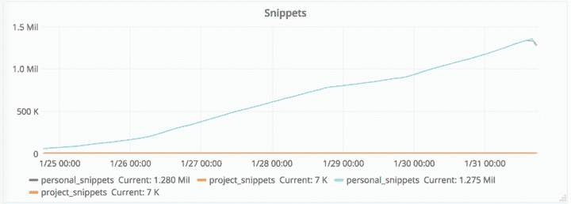
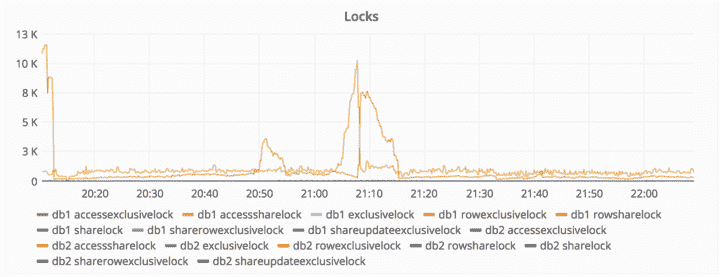
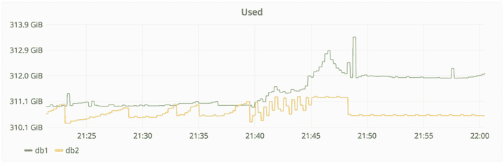
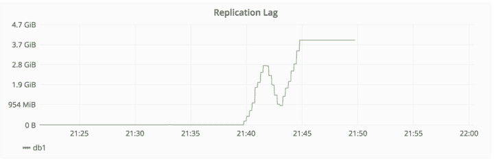
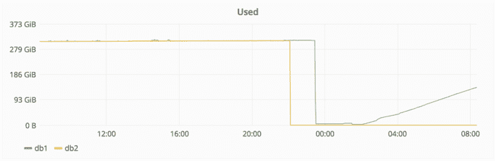

# GitLab.com 数据库事件| GitLab

> 原文：<https://about.gitlab.com/2017/02/01/gitlab-dot-com-database-incident/?utm_source=wanqu.co&utm_campaign=Wanqu+Daily&utm_medium=website>

更新:请看[我们对此事件的事后分析](/blog/2017/02/10/postmortem-of-database-outage-of-january-31/)

昨天，我们的一个数据库发生了严重事故。我们丢失了六个小时的数据库数据(问题、合并请求、用户、评论、片段等)。)对 GitLab.com 来说。Git/wiki 存储库和自管理安装不受影响。丢失生产数据是不可接受的，几天后我们将发布一个帖子，解释为什么会发生这种情况，并列出我们将采取的措施，以防止这种情况再次发生。

***UTC 时间下午 6:14 更新:GitLab.com 重新上线***

在撰写本文时，我们正在从数据库的一个六小时前的备份中恢复数据。这意味着从世界协调时下午 5:20 到世界协调时下午 11:25 之间来自数据库的任何数据(项目、问题、合并请求、用户、评论、片段等。)在 GitLab.com 再次出现时已经丢失了。

Git 数据(存储库和维基)和 GitLab 的自管理实例不受影响。

请阅读下面的事件摘要。也欢迎您查看我们的活动尸检文件。

## 第一起事件

在世界协调时 2017 年 1 月 31 日下午 6 点，我们检测到垃圾邮件发送者正在通过创建片段来攻击数据库，使其不稳定。然后，我们开始排除故障，以了解问题是什么以及如何解决。

在 UTC 时间 2017/01/31 晚上 9 点，这种情况升级，导致数据库上的写操作被锁定，从而导致一些宕机。

### 采取的行动

*   我们根据 IP 地址阻止了垃圾邮件发送者
*   我们删除了一个使用存储库作为某种形式的 CDN 的用户，导致 47 000 个 IP 使用同一个帐户登录(导致高数据库负载)
*   我们删除了发送垃圾邮件的用户(通过创建片段)

## 另一起事件

在 UTC 时间 2017/01/31 晚上 10 点，由于数据库复制落后太多，我们收到了寻呼，实际上已经停止。发生这种情况是因为辅助数据库没有及时处理的写操作出现峰值。

### 采取的行动

*   尝试修复`db2`，在这一点上它落后了大约 4 GB
*   `db2.cluster`拒绝复制，`/var/opt/gitlab/postgresql/data`被擦除以确保干净的复制
*   `db2.cluster`拒绝连接`db1`，抱怨`max_wal_senders`太低。该设置用于限制`WAL (= replication)`客户端的数量
*   *队员 1* 在`db1`上将`max_wal_senders`调整到`32`，重启 PostgreSQL
*   PostgreSQL 抱怨打开了太多的信号量，拒绝启动
*   *Team-member-1* 从`8000`调整`max_connections`到`2000`，PostgreSQL 再次启动(尽管`8000`已经用了快一年)
*   仍然拒绝复制，尽管它不再抱怨连接；相反，它只是挂在那里，什么也不做
*   此时，挫败感开始出现。今晚早些时候 *team-member-1* 明确提到他将在时间不早时(当地时间 23:00 左右)结束工作，但由于突然出现的复制问题，他没有这样做。

## 第三起事件

在世界协调时 2017/01/31 晚上 1 1 点左右，*团队成员-1* 认为`pg_basebackup`可能由于 PostgreSQL 数据目录存在而拒绝工作(尽管是空的)，决定移除该目录。一两秒钟后，他注意到他在`db1.cluster.gitlab.com`而不是`db2.cluster.gitlab.com`上运行它。

世界协调时 2017/01/31 晚上 11:27，*团队成员-1* -终止移除，但为时已晚。在大约 300 GB 的空间中，只剩下大约 4.5 GB。

我们不得不让 GitLab.com 下台，并在推特上分享了这些信息:

## 遇到的问题

*   默认情况下，LVM 快照每 24 小时拍摄一次。 *Team-member-1* 碰巧在断电前六小时手动运行了一个，因为他正在为数据库进行负载平衡。
*   常规备份似乎也是每 24 小时才进行一次，尽管 *team-member-1* 还没有弄清楚它们存储在哪里。根据*团队成员-2* 的说法，这些似乎不起作用，产生的文件只有几个字节大小。
*   *Team-member-3* :看起来`pg_dump`可能会失败，因为运行的是 PostgreSQL 9.2 二进制文件，而不是 9.6 二进制文件。发生这种情况是因为如果 data/PG_VERSION 设置为 9.6，omnibus 只使用 Pg 9.6，但是在 workers 上这个文件不存在。结果它默认为 9.2，无声无息地失败了。结果没有产生 SQL 转储。Fog gem 可能清除了较旧的备份。
*   Azure 中的磁盘快照为 NFS 服务器启用，但不为数据库服务器启用。
*   一旦将数据同步到 staging，同步过程就会删除 webhooks。除非我们能够从过去 24 小时的常规备份中提取这些信息，否则它们将会丢失
*   复制过程非常脆弱，容易出错，依赖于一些随机的 shell 脚本，并且没有很好的文档记录
*   我们对 S3 的备份显然也不起作用:桶是空的
*   换句话说，在部署的五种备份/复制技术中，没有一种能够可靠地工作，也没有一种是预先设置好的。我们最终恢复了 6 小时前的备份。
*   pg_basebackup 将静默等待主服务器启动复制过程，根据另一位生产工程师的说法，这可能需要 10 分钟。这可能导致人们认为这个过程不知何故被卡住了。使用“strace”运行流程并不能提供有用的信息。

## 恢复

我们正在通过使用临时数据库中的数据库备份来进行恢复。

*   2017/02/01 00:36 -备份`db1.staging.gitlab.com`数据
*   2017/02/01 00:55 -在`db1.cluster.gitlab.com`上挂载`db1.staging.gitlab.com`
*   将数据从暂存`/var/opt/gitlab/postgresql/data/`复制到生产`/var/opt/gitlab/postgresql/data/`
*   2017/02/01 01:05 - `nfs-share01`服务器被征用为`/var/opt/gitlab/db-meltdown`中的临时存储位置
*   2017/02/01 01:18 -剩余生产数据的副本，包括记录为`20170131-db-meltodwn-backup.tar.gz`的`pg_xlog`

下图显示了数据删除和随后复制的时间。

[此外，我们要感谢所有人通过#hugops](https://twitter.com/i/moments/826818668948549632) 在 Twitter 和其他地方给予我们的大力支持

