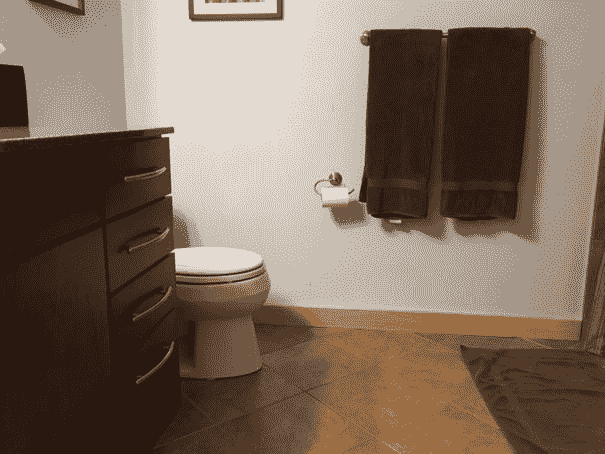
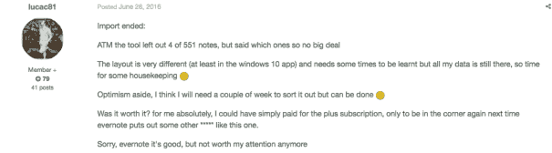

# 如果你很便宜，那你就要花更多的钱

> 原文：<https://chrisreining.com/cheap/?utm_source=wanqu.co&utm_campaign=Wanqu+Daily&utm_medium=website>

我要去买新的浴巾，因为自从你可以在网上买东西后，我就在网上买东西，所以我有一个恶心的习惯，就是搜索 Gmail 来了解东西能用多久，以及我花了多少钱。

我肯定你想知道我的修复五金毛巾已经用了 11 年，售价 60 美元。我觉得它们看起来还是新的。

当我年轻的时候，我会买任何最便宜的东西，因为我没有很多钱。即使我有钱，我也会认为花 30 美元买一条毛巾的人是愚蠢的。我的意思是，你可以在亚马逊上花 20 美元买一整套。

但是我刚刚看了关于它们的评论，人们说它们一洗就碎了。所以，问题就变成了，“是买一套 20 美元、每年都要更换的毛巾便宜，还是买一套 60 美元、能用十年的便宜？”

好吧。所以买 20 美元一套的人会在同一时间段内花 200 美元。或者，换句话说，买昂贵电视机的人最终节省了 140 美元。

这是我的毛巾理论:前期花费 3 倍，长期节省 7 倍。

这很难，因为我们喜欢买便宜的东西。但在 Reddit 上，我发现人们在谈论他们曾经很便宜的东西，但在购买了昂贵的版本后，他们就不会再回去了。他们在说刀、牛仔裤、床单、内衣、帕尔马干酪(绝对是帕尔马干酪)。

关于买贵的版本还有另外一件事。你节省时间。因为买便宜的意味着你会买更多。就像你每年都要更换的毛巾一样，你要多买 9 条。

如果我们假设你把你的时间价值定为 25 美元/小时，你每年花 30 分钟更换一个廉价版本的东西，那你的时间就是 112.50 美元(9 x 0.5 小时 x 25 美元/小时)。这时候你可以用其他的方式，比如[提升自己](https://chrisreining.com/get-a-raise/)。

我注意到我们沉迷于东西的价格，却不珍惜我们的时间。比如 Evernote 最近提高了价格。所以 Evernote 是我回到纸上记笔记之前一直在用的这个记笔记 app(我用的是[这些笔记本](http://amzn.to/2gCsqgE))。

不管怎样，他们的付费订阅从每年 50 美元涨到了 70 美元，人们完全疯了。我正在浏览[的 5000 条评论](https://discussion.evernote.com/topic/97314-changes-to-evernotes-pricing-plans/)，看到了这条评论。

从 Evernote 转到微软的 OneNote，这个人需要两周时间。这意味着他们要花费 2，000 美元的时间(80 小时 x 25 美元/小时)。这意味着他们需要几十年的时间才能实现收支平衡。

看，我完全赞成省钱。但我不赞成省钱，因为从长远来看，这会让你花更多的钱。或者当它花费了你更多的时间。

我认为这是我仍在学习的东西。因为就在最近，我去一家沙龙理发，然后他们把价格提高到 60 美元，我觉得太贵了，因为这里是中西部，而不是纽约，那里的人要花 800 美元。

所以我开始上职业学院。是的，学生们正在学习如何理发，所以他们让你签署一份弃权书，因为他们可能会摘下你的耳朵，但他们只收 8 美元。

我坐在那里，花了他们一个半小时，我没有得到我要求的发型，尽管只有 8 美元，我意识到这是浪费我的时间。我回到沙龙，愉快地支付了他们的价格。

这里的教训是？当你在昂贵的版本上花更多的钱或者花更多的钱来节省时间时，你实际上是在省钱。因为如果你很便宜，你就要花更多的钱。