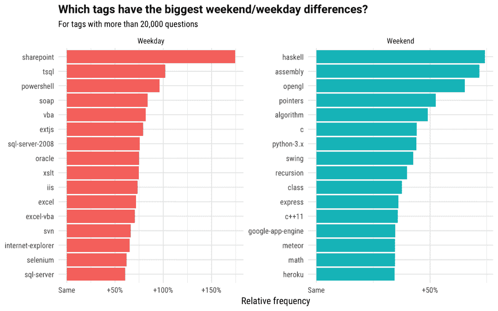
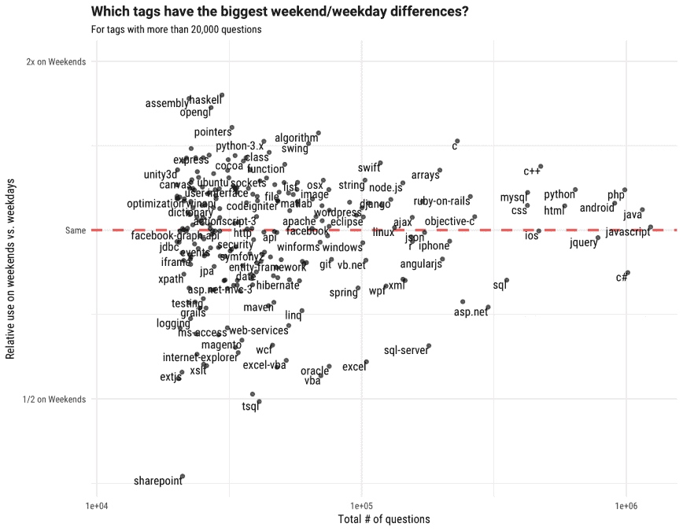
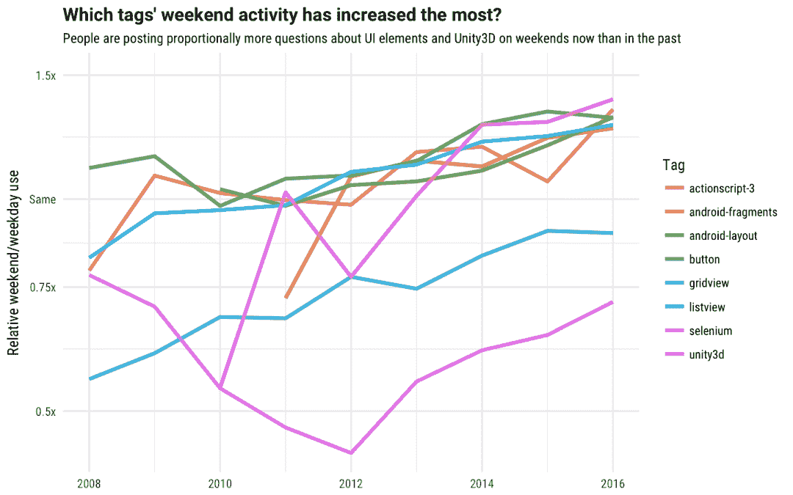

# 周末用的最多的编程语言是什么？-堆栈溢出博客

> 原文：<https://stackoverflow.blog/2017/02/What-Programming-Languages-Weekends/?utm_source=wanqu.co&utm_campaign=Wanqu+Daily&utm_medium=website>

对我来说，周末大部分时间都是和家人在一起，休闲阅读，从事我参与的开源项目。这些周末项目与我在 Stack Overflow 的日常工作重叠，但并不完全相同。许多开发人员为了学习或职业发展(或者仅仅是为了好玩)而修补辅助项目。)在 Stack Overflow，我们支持从专业人员到业余爱好者的所有类型的技术。每当人们在工作时，我们都可以回答他们的问题。但是，相对于工作日，什么语言在周末更容易被问到呢？

让我们使用 Kaggle 上的公共 [StackLite 数据集](https://www.kaggle.com/stackoverflow/stacklite)来探索工作日和周末发布的问题之间的差异。任何人都可以分析该数据集；您可以使用 Kaggle 内核开始解决您自己的关于堆栈溢出问题和标签的问题。

对于此分析，我们将使用未删除的问题和 10，000 多个问题上使用的标签。我们使用 UTC 日期来定义周末，对于所有用户来说，这可能不会与周末完全重叠。总体而言，这包括工作日的 10，451，274 个问题和周末的 2，132，073 个问题。数量上的差异主要是由于人们在工作日的工作中大量使用堆栈溢出，我们在发布的问题和我们网站的流量中都看到了这种模式。

因为这种工作日/周末的模式，我们对标签在周末是否比工作日更忙不感兴趣；基本上所有的标签在工作日都比较忙。相反，让我们探索一下哪些标签在周末问题中比在工作日问题中占的份额更大，反之亦然。

哪些问题标签相对频率差异最大？

 

为了更好地解释这一点，我们来看一些数字。编程语言 Haskell 占该数据集中周末问题的 0.365%，但仅占工作日问题的 0.21%，显示出它在周末异常受欢迎。Sharepoint 占周末问题的 0.0683%，占工作日问题的 0.188%，表明它在工作日更常用。

函数式编程语言 Haskell 引领了周末转移技术，这让我非常高兴，因为这基本上就是我:

 

我没学过哈斯克尔。但是值得称赞的是，你们所有人都在利用周末来这样做！现在享受这个关于 Haskell 的笑话吧，Haskell 是一种在学者和数学家中很流行的语言，但通常不在公司环境中使用。

再来做一些其他的观察！

*   我们看到周末流行一些底层技术，比如 C，C++，指针，汇编，还有和数学相关的标签，比如算法，递归，当然还有数学。
*   Heroku 和 Meteor 是经常用于快速原型制作的应用程序平台，这可能表明它们正被用于周末爱好者项目。
*   许多工作日转移的技术都与微软有关，包括与 Excel、SQL Server、VBA 和 T-SQL 相关的标签。其他包括 Oracle 等企业技术。

我们也可以通过比较问题的总数和相对频率来可视化这些关系。

 

图中更靠右的标签(JavaScript、Java、C#、PHP 等。)有更多关于它们的问题，并且更靠左的标签有更少关于它们的问题。出现在虚线附近的标签具有与工作日问题大约相等的周末问题份额，而离虚线最远的标签表现出最大的周末/工作日差异。

我们可以再次看到，大多数工作日转移的流行标签都与微软相关(C#、ASP.NET、SQL Server、Excel、VBA)，许多周末转移的标签包括 C 和 C++等技术，以及 Swift 和 Node.js 等新语言

## 周末工作

我们还可以使用这个数据集来检查开发人员如何随着时间的推移改变他们使用这些技术的方式。我们可以使用建模来找到其周末比例(在周末问的问题的百分比)随着时间的推移变化最大的标签。对于超过 20，000 个问题的标签，与过去相比，现在哪些问题在周末发布的较少？

 

我们在这里看到像 Ruby on Rails 和 Scala 这样的标签，几年前开发人员在周末以较高的比率使用，但现在在周末以较低的比率使用，在工作日则更多。这些技术在过去更多是面向周末的，但是现在成比例地成为更多开发人员工作日工作生活的一部分。这些年来，版本控制系统 SVN 在周末的使用也减少了；最有可能的是 GitHub(2008 年推出)的出现导致更少的人使用 SVN 来管理个人周末项目的代码。

 

如果我们寻找在周末活动中增加最多的标签，我们会看到游戏引擎 Unity3D，以及许多用于构建移动应用程序的标签。与前几年相比，现在开发者在周末设计了更多的游戏和应用。度过周末的好方法！

我们使用[可公开访问的数据](https://www.kaggle.com/stackoverflow/stacklite)来做这个分析，并期待看到我们社区中的其他开发者通过探索我们提供的数据产品可能会发现什么。

你在周末选择语言时会遵循这些模式吗？您可以通过在 C++ 中查找[作业或者在堆栈溢出作业中查找](https://stackoverflow.com/jobs/developer-jobs-using-c++?utm_source=so-owned&utm_medium=blog&utm_campaign=dev-c4al&utm_content=c4al-link) [Node.js](https://stackoverflow.com/jobs/developer-jobs-using-nodejs?utm_source=so-owned&utm_medium=blog&utm_campaign=dev-c4al&utm_content=c4al-link) 来跳转到工作日使用。