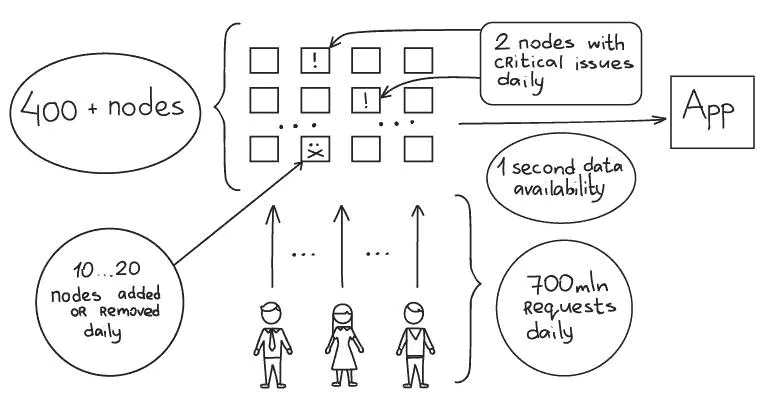
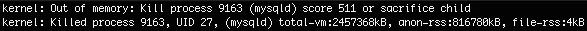
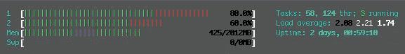
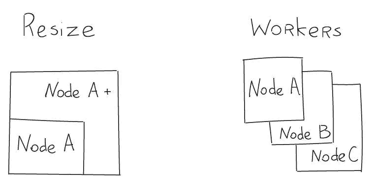
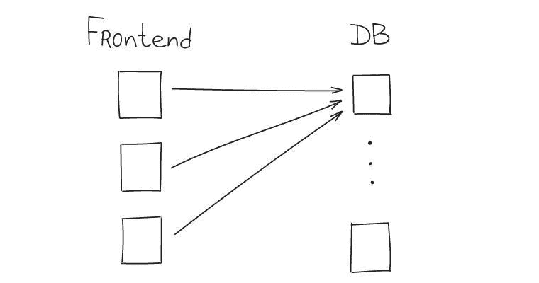
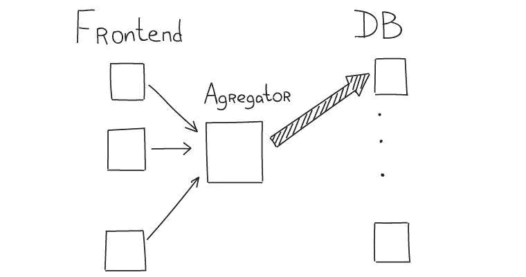
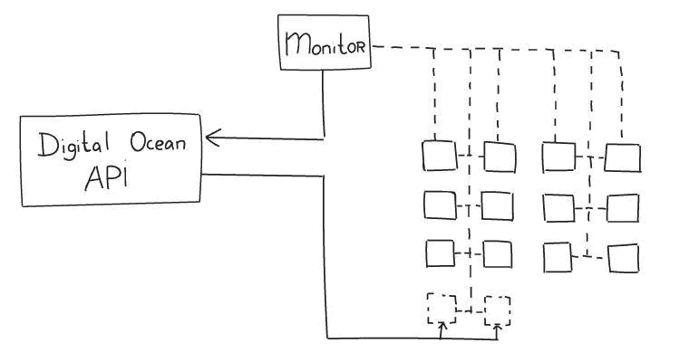
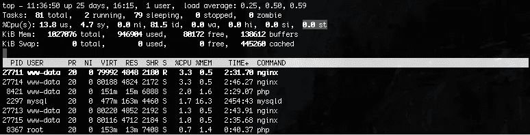
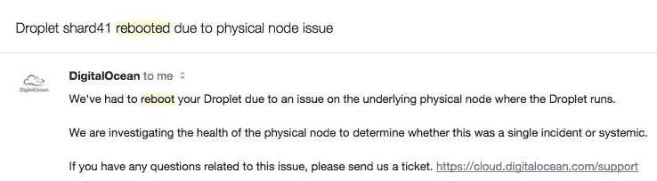

# 客户- io

> 原文：<https://www.digitalocean.com/customers/io/?utm_source=wanqu.co&utm_campaign=Wanqu+Daily&utm_medium=website>

# 在数字海洋上扩展到数十亿

## 我们是谁

我们是一个 15 人的年轻团队。我们正在开发一种工具来检测业务指标行为的关键变化。我们系统的关键特征是所有数据都以非抽样形式收集，所有指标都实时检查偏差，以自动通知客户重要的变化。

从技术上来说——即使对于小项目来说，这也是一个大数字。我们每天处理 200 亿个事件。应该从多种来源收集数据，并不断检查异常情况。单个客户端事件可以导致十几个其他事件被存储和处理(例如，某个度量的不同片段和交集)。

我们希望分享我们在 DigitalOcean 基础设施上，在短短 6 个月内将我们的应用程序扩展到每天 7 亿次请求的经验。

## 我们的数字

*   400 多个节点
*   6 个月内每天从 0 到 7 亿次请求
*   每天收集 200 亿个事件
*   每天添加或删除 10 - 20 个节点
*   每天有 2 个节点遇到关键问题
*   技术:nginx、Nodejs、Python、PHP、r、Mysql、Redis、Memcache

## 为什么是云

我们的项目还很年轻，但发展很快。从一开始，我们就需要一个特殊的平台来确保以后架构不会阻碍我们。一切都必须通过大量的试验和修改来快速完成。专用服务器是不可能的，因为它们太慢太复杂。

我们知道我们很快就会面临可扩展性问题，所以我们决定从一开始就建立一个以增长为中心的系统。这对我们意味着什么:

*   没有强大的服务器配置。我们甚至为微型节点使用数据库分片等技术。
*   所有节点都应该至少有一个备份。如果一个倒下了，另一个还在上升。
*   我们应该能够非常快速地添加节点。有时候每一分钟都很重要。

在可伸缩性方面，专用服务器的架构与云系统没有太大区别。它们都包括多节点、冗余、自动故障转移、分片和平衡。但从项目一开始就依赖高性能硬件，到后来肯定会成为问题。许多系统组件将需要彻底改变。从一开始就对相同的组件使用小节点有助于创建可伸缩的体系结构。这可能是一个更复杂的方法，但它肯定要快得多。

如果我们改用功能强大的专用服务器，我们的开支可以减少 30%。但是在这种情况下，我们将不得不为硬件故障付费并雇佣一名系统管理员(是的，我们现在没有！)来处理这些东西。

## 为什么选择数字海洋

亚马逊网络服务是创业公司的热门解决方案。不仅仅是云节点，而是整个基础设施。但是，我们有一些特定的要求:

*   带有简单 API 的简单系统。亚马逊绝不简单。
*   最小的配置，最低的成本。对于同样的配置，我们将不得不向亚马逊支付几乎 3 倍的费用。
*   简单计费。在使用亚马逊 S3 之前，试着算出它的价格吧！

我们仍然使用一些亚马逊服务(例如，Route 53)，但我们 95%的系统都使用 DigitalOcean 节点。

所以数字海洋来了。

## 挑战

随着项目的快速发展，我们面临着几个挑战，我们希望与数字海洋的读者分享。

### 配置

我们系统的核心基于 1GB x 1 个核心的小节点。然而，我们从一开始就花了很多心思来选择合适的配置。有一段时间，我们使用最小的 0.5GB x 1-core 计划来创建所有节点。然而，问题是大部分资源都被操作系统利用了，几乎没有为 MySQL 这样要求苛刻的服务留下任何资源。

目前，我们已决定使用以下配置:

*   前端— 2GB x 2 内核
*   数据存储— 1GB x 1 内核
*   人工智能节点(r 和 python–异常检测子系统)— 2GB x 2 内核

### 互换

所有数字海洋节点都禁用了交换。这非常方便，因为它确保服务以最高的性能工作。然而，在增长的第二个月(当我们有几十个节点时),我们经历了不断的问题，因为一些进程被系统杀死了。有时是 MySQL:

当我们开始启用交换时，我们很快就吃了苦头—一些节点开始执行速度慢了 10 倍。最后，我们禁用了几乎所有节点的交换，并决定水平扩展。现在，节点的数量正在稳步增加，并且只对其中的一部分启用了交换。

SWAP 仅用于具有辅助功能的服务器，不会给用户带来任何明显的应用程序性能问题。例如，在文本重建索引过程中，全文搜索节点可能会进入交换状态，这会降低操作速度，但这对用户来说并不重要。

### 调整大小

调整大小是一个强大而酷的功能。但是你应该小心使用它。每调整一个节点的大小，增长问题只是推迟了。改变服务器性能只能解决今天的问题。可扩展的解决方案只能通过添加新节点并在它们之间分配负载来创建。Resize 更多的是一种例外，但有时也可以作为一种应急措施。

### 节点间的通信

节点之间的通信仍然是我们最大的挑战。不用说，通信要用专网。

我们的一些节点位于不同的数据中心，并通过互联网进行通信。流量限制和安全要求要求我们使用 SSL 和 GZIP 数据压缩来提高效率。

### 多对一请求

当几个节点向单个节点发送请求时，基于小节点的体系结构会带来另一个问题。在增长过程中，发送节点的数量不断增加，接收节点的负载也不断增加。

目前，我们将此解决方案用于前端和数据库。我们使用一致的散列来确定数据节点，因此我们在一些数据库上获得了高负载峰值:

我们通过创建具有聚合和代理请求的简单功能的中间节点来解决这个问题。这减少了数据库节点上的负载:

### 故障切换

接下来是令人敬畏的数字海洋 API。我们对所有节点使用以下方法:

*   我们自己的脚本和收集的持续可用性和负载监控。
*   出现故障时，该节点会自动从工作节点池中删除。
*   如果出现高负载峰值，将通过 DigitalOcean API 创建新节点，并将其添加到工作池中。

### 安全性

每个数字海洋节点都有一个外部 IP 地址，可通过互联网访问。为了确保不同节点和客户端之间的通信安全，我们只使用 SSL。此外，服务访问在硬件级别受到限制；只接受来自白名单中的 IP 地址的连接。

### 共享资源

起初，我们担心节点性能很难预测，因为不可能预测它们共享的物理环境负载。我们跟踪被盗 CPU 指示器:

并且几乎总是具有罕见峰的可接受值。

### 基础物理学

事实证明，数字海洋非常适合这个问题。只有 1%的节点从一开始就经历了重启。

然而，您应该为节点重启做好准备。在任何情况下，如果你正在创建一个稳定的系统，这是绝对必要的。

## 结果

尽管有人认为云服务只适合小项目和初创公司，但我们决定使用 DigitalOcean 推出我们的服务。目前，我们对所选择的方法感到满意，因为它允许对负载增长做出快速响应，甚至在几个小时内增加两倍。

给我们写信，我们会很高兴听到你的评论并分享我们的经验。