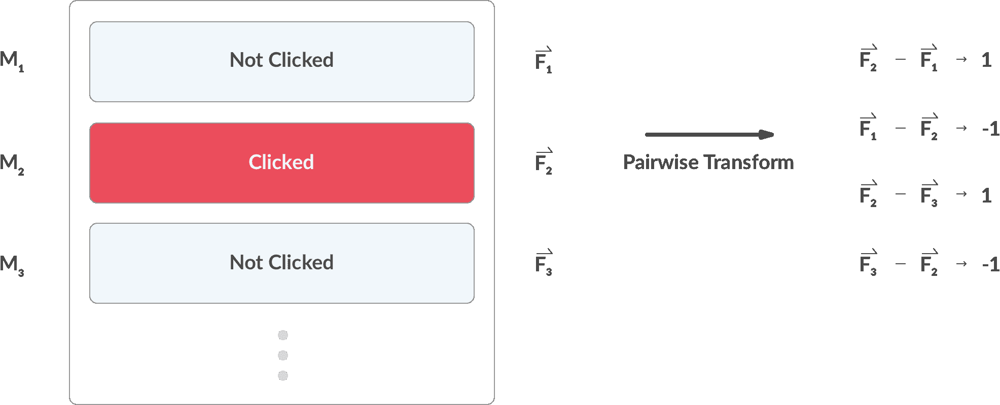
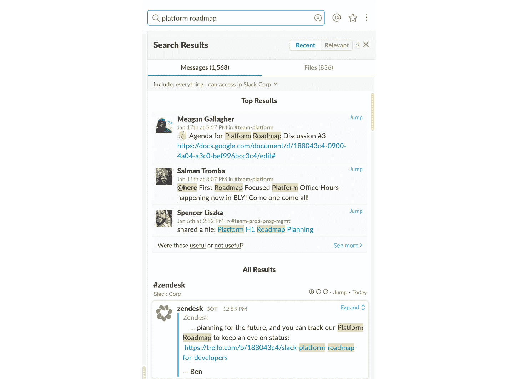

# 搜索松弛-松弛工程

> 原文：<https://slack.engineering/search-at-slack-431f8c80619e?utm_source=wanqu.co&utm_campaign=Wanqu+Daily&utm_medium=website>

平均来说，一个知识工作者一天中有 20%的时间用于寻找完成工作所需的信息。如果你考虑一个典型的工作周，这意味着**一整天**都被用于这项任务！

为了帮助我们的用户在一天中找到更多的时间，搜索、学习和情报团队着手提高 Slack 搜索结果的质量。我们建立了一个新的个性化相关性排序和一个名为 *Top Results* 的新搜索部分，它在一个视图中显示个性化和最近的结果。

## 一个独特的搜索问题

Slack 内部搜索和网络搜索有很大不同。每个 Slack 用户都可以访问一组独特的文档，并且相关的内容经常变化。相比之下，在网络搜索中，对“王子”、“强力球”或“精灵宝可梦 Go”的查询每天可以获得数百万次点击，而在一个松散团队中的查询很少重复。

尽管 Slack search 缺乏在网络搜索引擎中有效使用的聚合搜索数据，但它确实受益于其他一些优势:

*   我们更了解用户与 Slack 中其他用户、通道、消息和 UI 元素的交互历史。
*   不像网络搜索引擎，我们不必处理垃圾邮件或搜索引擎优化游戏。
*   虽然文本语料库的总大小很大，但每个团队的语料库相对较小，因此允许我们在排名期间对每个消息投入更多的计算资源。
*   我们不仅控制搜索界面，还控制目标文档的表示和结构。

Recent and Relevant toggles in Slack

## 相关和最近的搜索

Slack 提供了两种搜索策略:*最近*和*相关*。*最近的*搜索找到符合所有条件的消息，并按时间倒序显示。如果用户试图回忆刚刚发生的事情， *Recent* 是一个有用的结果展示。

*相关*搜索放宽了年龄限制，并考虑了文档的 [Lucene 得分](http://lucene.apache.org/core/3_0_3/api/core/org/apache/lucene/search/Similarity.html)——它与查询词的匹配程度(Solr 在 Slack 支持搜索)。使用了大约 17%的时间，*相关*搜索的表现略差于*最近*根据我们测量的搜索质量指标:每次搜索的点击量和搜索结果点击率在前几名的位置。我们认识到*相关*搜索可以受益于使用用户与频道和其他用户的交互历史——他们的“工作图”

作为一个激励的例子，假设你正在搜索“路线图”。您很可能在寻找团队的路线图。如果你的团队成员在你经常阅读和撰写消息的渠道中分享了包含“路线图”一词的文档，这个搜索结果应该比另一个团队的 2017 年路线图更相关。

通过将用户的工作图整合到*相关的*搜索中，我们看到导致点击的搜索增加了 9%,位置 1 的点击增加了 27%。

## 学习排名

我们的团队相信，加入额外的特征——例如搜索者与结果作者的密切关系和在渠道中的参与度，以及消息本身的某些特征——将提高与*相关的*搜索的结果排名。为了实现这一点，我们决定采用一种两阶段的方法:我们将利用 Solr 的自定义排序功能来检索一组消息，这些消息仅根据 Solr 易于计算的精选的几个特性进行排序，然后根据完整的特性集在应用层对这些消息进行重新排序，并进行适当的加权。

在建立模型来确定这些权重时，我们的第一个任务是建立一个带标签的训练集。由于 Slack 中搜索的独特性质，我们不能依赖使用重复查询结果的点击性能来判断相关性的技术。我们也知道文档的相关性会随着时间而变化。因此，我们专注于一种标记策略，这种策略使用被称为[成对转换](http://www.cs.cornell.edu/people/tj/publications/joachims_02c.pdf)的点击来判断单次搜索中文档的相对相关性。这里有一个例子:

Illustration of the pairwise transform

如果一个查询显示了 M1、M2 和 M3，搜索者点击了 M2，那么 M2 一定有什么与众不同的地方使它比 M1 更好。因为 M2 是比 M1 更好的结果，所以相应特征向量 F2-F1 中的差异应该捕获该差异，并且该值的差异被给予正标签。相反，F1-F2 被赋予负标签。为成对转换选择对有几种策略，我们在选择一种之前尝试了几种。我们最终将位置 *n* 处的每次点击与位置 *n* -1 处的消息和位置 *n* +1 处的消息配对。

## 克服点击位置偏差

我们努力解决的一个问题是人们倾向于点击搜索结果列表顶部的消息——位置 *n* 的消息比位置 *n* +1 的消息被点击的可能性平均高 30%。因为消息的位置是它是否被点击的一个很强的指示器，我们发现我们最初的模型正在学习重建列表的原始顺序。为了抵消这种影响，我们通过对列表中较低位置的结果进行重复采样，使点击量按位置分布更加均匀。

此外，通过将位置 *n* 处的每个点击与位置 *n* -1 处的消息和位置 *n* +1 处的消息配对，我们确保了我们的训练示例将包含相同数量的在较低和较高位置具有点击的消息对。我们认识到这有些不合理，因为用户可能甚至没有看到位置 *n* +1 处的消息。目前，这是一个可以接受的折衷方案，我们正在积极寻求解决这个问题的其他方法。

## 训练模型和结果

使用这个数据集，我们使用 SparkML 的内置 SVM 算法训练了一个模型。该模型确定以下信号最重要:

*   邮件的年龄
*   消息相对于查询的 Lucene 分数
*   搜索者对消息作者的*亲和力*(我们将一个用户对另一个用户的*亲和力*定义为该用户阅读另一个用户消息的倾向——另一篇文章的主题！)
*   搜索者的 DM 频道与消息作者的[优先级分数](/personalized-channel-recommendations-in-slack)
*   搜索者对消息出现的频道的优先级分数
*   消息作者是否与搜索者相同
*   信息是否被钉住、标上星号或有表情符号反应
*   搜索者点击该消息出现的频道中的其他消息的倾向
*   消息内容的各个方面，如字数、是否存在换行符、表情符号和格式。

值得注意的是，除了 Lucene 的“匹配”分数，我们还没有在我们的模型中加入消息本身的任何其他语义特征。

## 衡量我们的进步

我们的团队在 11 月 30 日向 50%的用户发布了我们针对*相关*排序的机器学习重排序器。对于我们的顶线指标，我们查看了前 1、2 和 5 名搜索结果中的每个用户的会话数、每个会话的搜索数、每次搜索的点击数和点击率。如前所述，我们看到了相对于现有的*相关*搜索的显著进步——点击搜索增加了 9%,在获得至少一次点击的搜索中，第 1 位的点击增加了 27%。

Top Results for the query “platform roadmap”

## 把所有的放在一起

我们希望确保我们的用户可以更快地找到他们想要的东西，而不必担心按相关性或新近性排序。新的*顶级结果*模块通过在普通*最近*结果之上显示来自*相关*搜索的前 3 条消息来解决这个问题。

每次您运行*最近*搜索时，我们也会并行运行*相关*搜索。我们根据一些简单的启发，比如结果的多样性和数量，来决定是否显示*顶级结果*部分。我们的初步实验结果显示，每个用户的搜索会话显著增加，每个搜索的点击量增加，每个会话的搜索量减少，这表明 *Top Results* 模块正在帮助用户更快地找到他们正在寻找的内容。

## 未来的工作

*顶级搜索结果*只是让 Slack 中的搜索变得更好的真正令人兴奋的机会的开始。想象一下，搜索“401k matching ”,您不仅会收到相关的消息或文件，还会得到一个人力资源部门人员的列表，或者一个您可以找到所需信息的查询渠道列表，甚至还有一个与该主题相关的常见问题列表，其中包含每个问题的回答渠道的链接。为了减少这 20%的信息搜索时间，让 Slack 的用户拥有更愉快、更高效的体验，我们还有很多工作要做。

*如果您想帮助我们应对数据驱动的产品开发挑战，并帮助数百万人的工作生活变得更简单、更愉快、更高效，请查看我们的* [*SLI 职位空缺*](https://slack.com/jobs/dept/engineering) *。*