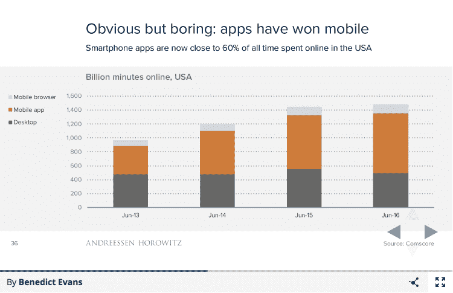

# 为什么图像识别、语音界面和机器学习会改变你的主屏幕

> 原文：<https://taylordavidson.com/2017/mobile-interfaces?utm_source=wanqu.co&utm_campaign=Wanqu+Daily&utm_medium=website>

观察、互动和理解世界的新技术——图像识别、语音界面和机器学习——将如何改变移动操作系统...还有你的主屏幕。

一年前，我重组了手机主屏幕上的应用程序布局，做了一些看起来有点极端的事情。我把几乎所有的应用程序都放在一个文件夹里，然后把那个文件夹放在最下面的抽屉里。除了文件夹中的前几个屏幕之外，这些应用程序基本上是按照它们应用程序徽标的主色来组织的，而不是按照它们的用途来组织的。出于渴望的原因，我在主屏幕上留下了几个应用程序，以提醒自己每天使用它们，在过去的一年里，我已经改变了主屏幕上的这几个应用程序，以调整我想要在日常生活中强调的内容。

那么…我如何使用我的手机？我要么:

*   打开主文件夹，使用第一个屏幕上的应用程序
*   通过下拉并使用搜索栏来搜索应用程序-或地址，或联系人等。-那是我想要的
*   向右滑动到“通知”标签，使用一个推荐的应用程序或一个小工具

我不是通过从精心设计的主屏幕上选择应用程序来使用我的手机，而是主要使用搜索和一个通过算法为我创建的“主屏幕”。也就是说，目前，这种转变的悲哀之处在于它可能不是有效的选择——至少现在不是。通过算法创建的主屏幕，即“Siri 建议的应用程序”，目前(iOS 10)只是基于我最近使用的应用程序或我的位置，传递使用存储在我的设备和应用程序中的更深层的上下文数据，关于我在哪里或我可能想完成什么，限制了这种方法的真正实用性。

但没有理由认为这一定是最终结果。改进应用建议算法，使用额外的上下文来确定我想要完成什么，以及我可能想要使用什么应用，这可能是改变我们使用移动设备的方式的起点，从寻找应用到完成任务。听起来很简单，但这是一个意义深远的转变，数十亿美元的收入悬而未决。操作系统有能力控制人们使用移动设备的方式，并且它们有可能改变我们在移动设备上完成事情的方式，通过设置规则、功能和技术，使它们自己和第三方服务能够向人们提供产品和服务。

这就是为什么移动仍然很有趣。尽管移动已经从创建阶段进入部署阶段，而且每个人都对移动之后的事情更感兴趣——下一个创新平台将创造新的创新和财富——移动仍然很重要。机器学习、人工智能、虚拟现实、增强现实、语音和图像识别，这些新技术和平台正在创造新产品、新可能性、新财富，所有这些都将利用移动部署。尽管应用程序赢得了…

[T2】](http://ben-evans.com/benedictevans/2016/12/8/mobile-is-eating-the-world)

…他们面临着战略压力。苹果和谷歌有战略和商业动机来改变他们的移动操作系统的工作方式，以从移动领域的下一波创新中获利，这在很大程度上取决于部署这些信息捕捉和处理的新技术。操作系统将控制如何获取和处理信息:如何部署信息将取决于应用程序。到目前为止，品牌一直是企业在移动领域获胜的战略有力手段，但它们并不能让企业免于新用户体验的破坏。今天的赢家不一定是明天的赢家。

今天的手机被你所知道和喜欢(和讨厌)的应用程序所主宰，但是操作系统将会改变手机的制胜之道。

* * *

《快速公司》在 2015 年 12 月写了一篇文章，名为[为什么伟大的应用解绑趋势已经陷入困境](http://www.fastcompany.com/3054603/why-the-great-app-unbundling-trend-is-already-in-trouble)，在我对《快速公司》的采访中，我试图解释为什么来自主要参与者的许多单一用途应用表现不佳:

> 戴维森说:“大多数非捆绑应用不是因为人们需要它们而开发的。”。“它们的建立是因为它们是由企业原因驱动的，而不是由用户驱动的。”
> 
> 戴维森认为这仅仅是开始。随着扩展和深度链接的兴起，应用程序将变得更善于相互交流，而不需要专门为此编写代码。这意味着分拆的另一个主要动机——能够在同一家公司的多个应用程序之间传递用户——将变得不那么明显。
> 
> “苹果和谷歌。。。戴维森说:“他们改变了人们与应用程序联系的规则，这意味着在许多方面，非捆绑销售的核心理念不那么受欢迎了。”

这篇文章是在 Dropbox 宣布 Mailbox 和 Carousel 夕阳西下后不久写的，当然，在文章发布后的第二天，Evernote 宣布他们关闭了一些单一用途的应用程序，这是火上浇油。大约在这个时候，这重新点燃了过去几年关于应用星座、应用分拆和应用未来的讨论。但从那以后，这种对话就消失了。为什么？

也许问题在于我们如何使用手机。过去一个月你下载了多少新应用？可能是零，如果你像 65%的人一样。许多人将应用繁荣称为[而非](https://www.recode.net/2016/6/8/11883518/app-boom-over-snapchat-uber)，虽然我们可能在移动设备上花费 85%的时间使用一个应用，但其中 84%的时间只花在五个应用上。虽然这“五个应用”因人而异，新应用的机会仍然存在——Snap 不是大多数应用使用研究中的应用之一，但现在接近 1.5 亿月用户和首次公开募股——对大多数人来说，我们的使用相当集中，我们选择在一小部分应用上花费时间。

但是，为什么呢？是因为我们没有精神上的时间和空间来发现新的应用程序，还是因为我们不灵活或无法改变我们的日常生活来使用新的应用程序，这反映了人类行为的一些基本特征？或者它反映了在当前消费技术阶段的赢家的推动下，花在网络上的时间更加集中？还是因为 app discover 流程让寻找新应用变得太难了？或者，访问和使用应用程序的基本方式迫使我们每天只使用几个应用程序？

我听到并阅读了所有这些论点，我认为所有这些都在应用程序的昏厥中发挥了作用。我们已经过了这样一个阶段，即引入一个新的应用程序，使现有的事情做得更好，是一种获胜的方式；不，如果你今天想在移动领域胜出，你需要创造一种新的*行为*。

这就是人们经常忘记的 MySpace、Twitter、脸书、Instagram、Snap、亚马逊:每一个都成功了，因为他们推广了一种新的用户行为。让人们能够做一些根本不同的事情——发推特、与朋友分享、制作(和分享)更好的照片、分享临时照片、网上购物——是你进入他人生活并成为这五个应用之一的方式。

这就是为什么每个人都担心接下来会发生什么。今天，移动领域的许多赢家最初是为基于桌面的互联网而构建的(不包括最新的赢家 Snap)，但[计算模式已经转移到仅移动和移动本地](http://ben-evans.com/benedictevans/2016/12/8/mobile-is-eating-the-world)。移动带来了非常不同的与世界互动的方式——与桌面模式不同的传感器、屏幕、输入和界面——随着技术赋予我们观察、构建和理解世界的新能力——由图像识别、机器学习、[语音交互](https://backchannel.com/voice-is-the-next-big-platform-and-alexa-will-own-it-c2cf13fab911)驱动，移动可以做什么、如何做以及人们如何完成事情正处于变革的风口浪尖。很明显，为什么今天的赢家正在对算法智能、机器学习、语音和图像识别进行投资:跟上不断变化的计算范式，或者退出前五名。风险不在于有人创建了一个新的社交网络应用程序:风险在于有人利用这些新技术来观察、理解和创造我们周围的世界，这创造了一种他们根本无法做到的新行为。

本·汤普森在他的 [Exponent 播客](http://exponent.fm/episode-102-snakes-and-ladders/)中讨论了这一点，指出 Snap 如何让人们做一些新的事情——分享消失的照片——并利用这一点提升到更完整的用户和媒体体验。脸书无法复制 Snap，因为他们的文化、产品以及存在背后的原因与 Snap 背后的理念截然相反。我们赢的原因也是我们输的原因。

* * *

有趣的是，我在 2013 年[到 2014 年](/2013)[所写的许多关于移动设备的东西——解绑、深度链接、应用程序扩展——背后很少有真正的影响。前提是，应用程序中最有趣的事情不是关于应用程序，而是关于操作系统，以及 iOS 和 Android 如何有潜力改变我们使用应用程序的方式。但我们还没有看到操作系统或应用程序开发商推动我们使用移动设备的方式发生任何根本性转变。但我仍然相信这就是机会所在。](/2014)

苹果和谷歌有战略动机来重新连接他们的移动设备与世界的接口。语音界面、图像识别和机器学习正处于手机、汽车和家庭大规模部署的风口浪尖，有了这些，苹果和谷歌终于有动力利用这些使能技术让应用开发者不仅能开发新应用，还能开发新行为。

退一步说:2014 年，我对应用程序扩展特别感兴趣，注意到它们如何能够实现向轻量级、非捆绑应用程序发展的反趋势，认为[“如果你构建轻量级扩展，你可以构建重型应用程序”](/2014/unbundling)。但这从未发生过。应用程序扩展的使用已经变得很少，对于希望利用新机会的开发者来说，风险很高。第三方键盘刚出现时令人兴奋，但在采用和开发过程中遭遇了困难，因为发现、安装和使用过程对用户来说过于繁琐。[照片编辑扩展](/2014/capture)很少被使用，并且已经从少数采用它们的照片应用中消失了。苹果从未致力于应用程序扩展，也从未对其他操作系统进行必要的改变，直到 iOS 10 和 [iMessage 应用程序扩展](http://www.macworld.com/article/3086855/software/forget-the-stickers-ios-10-turned-imessage-into-a-platform-and-thats-more-important.html)，它们才基本消失。

如今，苹果和谷歌面临着不同的压力，也面临着新的机遇。这些新的界面和理解技术——语音界面、图像识别和机器学习——都可以内置到设备和操作系统中，以实现他们自己和第三方开发者更好的产品和服务。

双方都朝着这个方向迈出了一小步。苹果[将机器学习和算法智能引入 iPhone](https://backchannel.com/an-exclusive-look-at-how-ai-and-machine-learning-work-at-apple-8dbfb131932b#.h44930mck) ，首先专注于支持 Siri、widgets 和它们自己的应用程序:

> 如果你是一名 iPhone 用户，你会发现苹果的人工智能，而不仅仅是 Siri 在判断你向她提出什么要求方面的敏锐度有所提高。当手机识别出一个不在你的联系人列表中的来电者(但最近给你发了邮件)时，你就会看到它。或者当你在屏幕上滑动鼠标，得到你最有可能下一个打开的应用程序列表时。或者当你得到一个约会的提醒，而你却没有时间把它放进你的日历里。或者在你输入之前，弹出你预订的酒店的地图位置。或者当手机告诉你你把车停在哪里，尽管你从来没有问过。这些都是苹果采用深度学习和神经网络而变得可能或大大增强的技术。

苹果采取了严格的措施来保护人们的隐私，这可能会阻碍他们在机器学习方面的努力。而且这些能力还没有提供给第三方开发者。谷歌也采取了类似的“美国优先”策略，特别是谷歌助手仅针对其 Pixel 手机推出，而不针对其 Android 操作系统。从产品和技术的角度来看，这是有意义的。构建核心界面和理解技术，并与您自己的团队合作，将它们用于您的产品。但从战略上来说，在某个时候，开放并允许第三方开发者将它们用于自己的应用程序的压力将会到来。苹果和谷歌将无法解决应用程序开发人员今天努力解决的所有问题，他们如何开放这些新界面和理解技术将决定新的移动计算方法如何演变。

那时我们的主屏幕将会改变。届时，我们的五大应用将会发生变化。现在我们只是在屏幕上推动像素，重新组织我们如何获得帮助我们完成事情的应用程序。但是，一旦移动设备完全接受语音交互、图像识别和机器学习，我们的行为将会适应，我们的使用模式和偏好将会改变。更好的“推荐应用”屏幕将是一个开始，使用更多的上下文数据来猜测我想要完成什么，但更长期的变化将是更深层次的东西。

没有理由认为我们目前对手机的使用是最终状态。谷歌眼镜(Google Glass)和 Snap 的眼镜(Spectacles)是替代移动技术的愿景，我们对技术的使用不再是低头在小设备上打字。苹果的 AirPods 和 Watch 是利用手机进行内容和通信的方法，但不是将手机作为主要的直接访问方法。2016 年，机器人作为一种使用互联网的新方式受到了很多关注，虽然成功的机器人的例子很少，但原因不是因为对话机器人作为信息接口的想法，而是因为使机器人成功的底层技术——特别是机器学习、语音接口、算法智能——本身是原始的。

当然，今天的热门产品——亚马逊的 Alexa——不是手机，也不是移动设备。Google Home 和其他语音操作的“计算机”将有助于转变为一种新的计算范式，人们必须相信，从这些设备中吸取的经验教训以及为它们开发的技术将会进入移动设备。

今天的电话不一定是明天的电话。今天使用手机的主要方法——低头在明亮的小屏幕上打字——不一定会成为未来。这就是当今技术的潜力，不是把我们从手机中解放出来，而是重新定义我们使用手机的方式。这是一个任何今天的赢家都不能错过的机会。