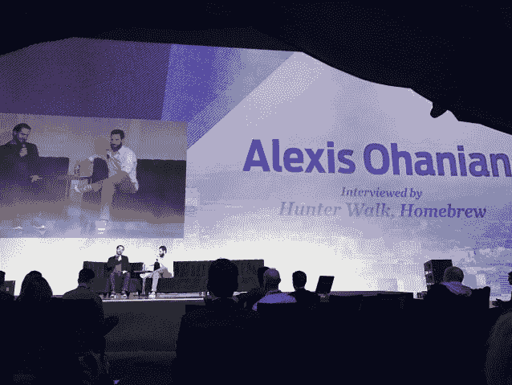

# 为什么许多公司错误地认为网络钓鱼和骚扰对商业有益

> 原文：<https://hunterwalk.com/2017/02/07/why-many-companies-mistakingly-think-trolls-harassment-is-good-for-business/?utm_source=wanqu.co&utm_campaign=Wanqu+Daily&utm_medium=website>

<noscript></noscript>

现场麦克风。在上周的[前沿峰会](http://summit.upfront.com/)上，他们给了我一个现场麦克风，让我采访 Reddit 的[亚历克西斯·奥哈尼安](https://twitter.com/alexisohanian)。我们的讨论持续了大约 20 分钟，但这段时间足以涵盖他的[关于移民的公开信](http://fortune.com/2017/02/01/reddit-trump-travel-ban-letter-goes-viral/)，Reddit 的社区标准，他对科技在政治中的作用的感受，以及他现在拥有的[机会](http://www.cnn.com/2016/12/29/entertainment/serena-williams-engaged-alexis-ohanian/)，如果他愿意的话，他不仅仅是“科技名人”。但是我在笔记本上写下了一个问题，我们没有时间讨论——亚历克西斯是否认为我们衡量社交产品成功的方式无意中导致了对社区安全的忽视。

社交、内容、社区产品的标准 KPI 是什么？最常见的每日仪表盘是 DAU/MAU、页面浏览量、浏览量、会话时长、点击量、每日访问量、参与度的组合。这些更复杂的衍生物是与保留相关的。

这些措施主要告诉我们什么？优化点击、访问、帖子和网站时间=好。但是，当这些指标导致我们更多的参与，却更少的快乐时，会发生什么呢？

在过去的几个月里，与简单的“喜欢”或阅读相比，分歧和火药味十足的战争似乎更能产生现场互动。你的朋友们争先恐后地指责那个刚刚对你发推特的混蛋，当它减少到每日图表时，看起来确实是一个很大的活动。让你去 WTF 的仇恨分享帖子看起来确实像病毒一样。看起来很像一个成功的产品。

但是这让你感觉很好吗？这会让你对刚刚体验的产品有更好或更坏的看法吗？它会增加你的 NPS 吗？巨魔和骚扰推动短期参与，即使它们是长期的毒药。

几个月前，我有机会与脸书的新闻产品经理交谈。那是“趋势”感觉非常像 TMZ 的时候(它已经在许多方面有所改进)。我告诉他们，我经常点击那个板块，但它总是让我因为阅读了一些名人八卦或煽动性标题而感到内疚和糟糕。我点击的次数越来越多，直到有一天我完全不再点击那个部分。我不再看它。我希望有一个[x]可以用来关闭该部分。那是脸书一直放在我面前的一块糖。一开始，我责怪自己吃了它，但你知道吗，过了一会儿，脸书也该受责备了。他们不关心我的健康吗？他们不想给我最好的吗？那就别再给我糖果了。

我的猜测是，最好的产品设计师会开始越来越多地考虑产品功能的情感影响，而不仅仅是“用户交互了吗”这种生硬的工具下一代用户测量工具将使用机器学习来告诉我们什么时候有人有“高参与度，但低质量”的体验，并试图在他们放弃之前挽救他们。因为今天我只是看起来像一个高度参与的用户，直到有一天我不再来了。

### 像这样:

像 装...

