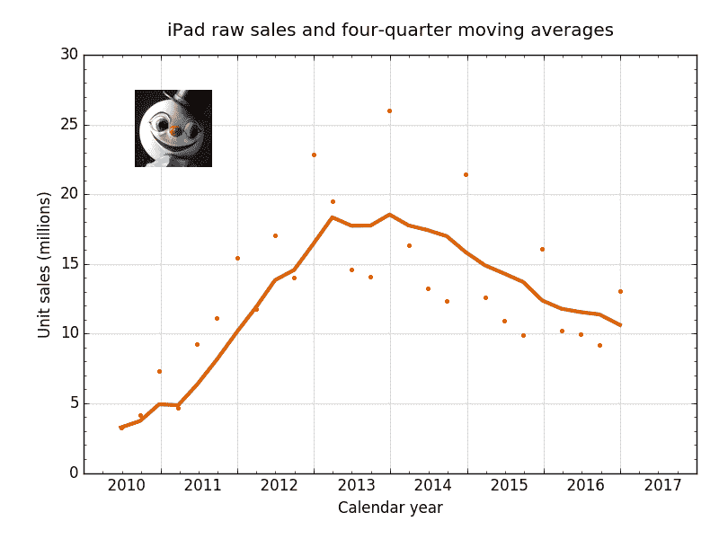

# iPad 和 Mac——早年——所有这些

> 原文：<https://leancrew.com/all-this/2017/02/ipad-and-mac-the-early-years/?utm_source=wanqu.co&utm_campaign=Wanqu+Daily&utm_medium=website>

[下一帖](https://leancrew.com/all-this/2017/02/mixing-methods/) [上一帖](https://leancrew.com/all-this/2017/02/quarters/)

2017 年 2 月 5 日下午 4:49 Drang 博士

每当苹果宣布 iPad 的销售数据呈下降趋势时——也就是说，过去几年的每个季度——人们都会上网试图解释原因。苹果爱好者的普遍解释是，iPad 如此之好，以至于不需要经常更换。这导致了最初几年的销售泡沫和此后的下滑。

虽然这确实有些道理，但我不认为它讲述了全部的故事。它所做的一切导致了另一个问题:为什么人们对四年前的 iPads 感到满意？在我看来，大卫·斯帕克斯已经给出了这个问题的最佳答案。

> 在我看来，问题是用户没有更努力地推动 iPad 为他们做更多的工作，这自然会导致用户想要购买更新、更快、更好的 iPad。简单地说，我认为问题在于软件。
> 
> …
> 
> 在去年的 iPad Pro 发布会上，苹果大谈 iPad 如何强大到足以取代 PC 笔记本电脑。我相信对很多人来说这可能是真的。但是由于软件的限制，它还没有完全实现。
> 
> …
> 
> 如果苹果希望看到 iPad 销量的增长，我认为答案是让它们更有用，并把消息传出去。苹果应该认真对待给 iOS 添加功能，让用户更高效地完成工作。

换句话说——大卫不会这么粗鲁地使用这些词——*是软件的问题，笨蛋*。

我有一台 9.7 英寸的 iPad Pro。这是一台很好的机器，我一直带着它出差，以代替我的旧 MacBook Air。对许多事情来说，这完全没问题，但当我真的需要完成工作时，我会带上空气。这当然不是因为 Air 的硬件更强大。以下是我在两款设备上运行 Geekbench 4 CPU 测试( [Mac](https://browser.geekbench.com/) ， [iPad](https://geo.itunes.apple.com/us/app/geekbench-4/id1130770356?mt=8&uo=4&at=10l4Fv) )得到的结果:

| 设备 | 单核的 | 多核 |
| :-- | :-: | :-: |
| 2010 年 Macbook Air | One thousand three hundred and fifty-five | Two thousand two hundred and ninety-one |
| 9.7 英寸 iPad Pro | Two thousand nine hundred and seven | Four thousand seven hundred and thirty-seven |

毫无疑问，我在直播中效率更高的一个重要原因是熟悉感。随着我越来越多地使用 iPad，我将学会如何更有效地使用它。但大卫的观点仍然成立:iPad 上的生产力工具根本达不到 Mac 的标准。[社论](https://geo.itunes.apple.com/us/app/editorial/id673907758?mt=8&uo=4&at=10l4Fv)是没有 [BBEdit](http://barebones.com/bbedit) 。而且没有任何一个[工作流](https://geo.itunes.apple.com/us/app/workflow-powerful-automation/id915249334?mt=8&uo=4&at=10l4Fv)和 [x-callback-urls](http://x-callback-url.com/) 的组合可以和 shell 脚本、【AppleScript】、[键盘大师](https://www.keyboardmaestro.com/)、 [Hazel](https://www.noodlesoft.com/) 等相比。

让我感到惊讶的是，iPad 软件在推出后的 7 年里进步如此之慢。我一直认为 iPad 是史蒂夫·乔布斯关于电脑应该是什么样的概念的典范，是 1984 年如果有硬件的话 Mac 应该是什么样的。但是想想 Mac 在它七岁的时候能做什么:

*   你可以在上面编写真正的麦金塔程序，既有像 THINK (née Lightspeed) [C](https://en.wikipedia.org/wiki/THINK_C) 和 [Pascal](http://wiki.freepascal.org/THINK_Pascal) 这样的第三方开发软件，也有苹果的[麦金塔程序员工作室](https://en.wikipedia.org/wiki/Macintosh_Programmer's_Workshop)。您可能不关心编写原生应用程序，但是这样做的能力带来了许多您关心的其他能力，比如将来自多个来源的文档整合在一起。
*   你有一个成熟的多任务环境 [1](#fn:pre) 在 [MultiFinder](https://en.wikipedia.org/wiki/MultiFinder) 中，基本上可以运行在 Mac 上的所有应用。
*   您(以及您的所有应用程序)可以访问真正的分层文件系统。
*   在 HyperCard 中，你拥有许多人仍然认为是最好的个人软件开发工具包。

这些在 1991 年并不新鲜，它们在 1987 年左右就已经存在了。

相比之下，iPad 有拆分视图，这仍然没有被一些应用程序采用；iCloud Drive，很多人因为 iCloud 的不可靠历史而害怕；还有 [Swift Playgrounds](http://www.apple.com/swift/playgrounds/) ，这对学习编程来说可能非常好，但没有用于真正的应用程序或个人生产力。

iPad 最大的问题是苹果不愿意让它成为自己的东西。iOS 的开发是由 iPhone 推动的，它可能不应该有普通电脑的工具。但是，如果要实现苹果公司成为笔记本电脑替代品的承诺，iPad 至少需要其中一些工具。与 iPhone 捆绑在一起会阻碍它的发展。

我对苹果公司的财务状况本身不感兴趣。我只关心它影响苹果给我提供好的计算设备的程度。我希望我的 iPad 取代我的 MacBook Air 成为我的主要家用电脑。但这不会发生，除非苹果给它(和我)工具让它接管。

[下一帖](https://leancrew.com/all-this/2017/02/mixing-methods/) [上一帖](https://leancrew.com/all-this/2017/02/quarters/)