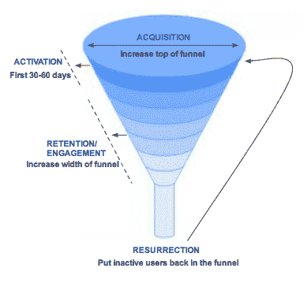

# 十几堂关于成长的课——25iq

> 原文：<https://25iq.com/2017/02/10/a-dozen-lessons-on-growth/?utm_source=wanqu.co&utm_campaign=Wanqu+Daily&utm_medium=website>

1.  成长团队有“衡量、理解和改善产品和业务内外用户流量的责任。这就是成长的作用。”“顾名思义，财务团队衡量、了解并改善企业的资本流入和流出。这很重要，因为它有助于各种极其重要的商业决策。财务运用其知识来帮助企业运营。有趣的是，每家公司——当然还有财务团队——最终都意识到，最大化收入潜力的最大杠杆是用户数量。”安迪·约翰**——财富前线(前脸书、推特、Quora)产品副总裁。** **T6】**

每个企业都必须实现一系列目标才能取得成功:

1.  衡量财务指标，
2.  营销产品，
3.  优化产品以促进业务增长。

这篇文章是关于第三个目标的，这显然可以为企业带来巨大的积极影响。为了说明成长型团队的价值，截至上个季度末，脸书拥有 12.3 亿日活跃用户(DAU)和 18.6 亿月活跃用户(MAU)。这些数字代表了惊人的增长。人们很容易忘记，就在不久前，脸书用户的总数似乎还处于平稳状态。脸书增长副总裁 Alex Schultz 回忆道:

“[脸书增长到]5000 万，然后我们碰壁了。当我们撞上那堵砖墙的时候，脸书内部正在提出许多存在性的问题，是否有任何社交网络能够拥有超过 1 亿的用户。现在听起来很蠢，但在当时，还没有人做到过。每个人都挖掘了 5000 万到 1 亿用户，我们担心这是不可能的。这是成长团队成立的时间点；风险投资公司 Social Capital 的创始人 Chamath Palihapitiya 将我们聚集在一起。

小型财富管理公司需要成长。Twitter 需要成长。上周末，我写了一篇关于每个人如何大便的文章，嗯，每个人都需要成长。尤其是每个人都有奶头和肚脐。增长会产生问题，但它们是高质量的问题。

产品的每个方面都有可能帮助企业发展。或者不是。通过选择产品来创造增长的机会几乎是无限的，因为一个产品不可能在技术上是中性的。例如，你不能设计中性的汽车、中性的建筑或中性的软件。在创造和提供产品时必须做出选择，这些选择可以以积极或消极的方式影响增长。

2.  **“我见过的创业公司的头号问题是，他们实际上没有符合*市场需求的*，尽管他们认为他们有。”亚历克斯** **舒尔茨**

Y Combinator 的杰西卡·利文斯顿(Jessica Livingston)就任何企业的增长驱动力提出了一个关键观点，她说:“我们的座右铭是制造人们想要的东西。如果你创造了一些东西却没有人使用，你就死定了。如果人们不喜欢你的产品，你做的其他事情都没用。”心理否认可能非常强大。非常想要某样东西的人经常假装他们创造了人们想买的东西，但没有证据表明这是事实，因为现实太可怕了，无法想象。例如，一个面临投资者压力、种子资金即将告罄的团队可以说服自己，它创造了一种消费者想要的产品，尽管一个十岁的孩子知道这种产品是垃圾。

马克·安德森写道:“*产品* */* *市场**fi****t***【这】意味着处于一个好的市场，拥有能够满足该市场需求的产品。”在*产品市场适合度*被企业发现之前，这个过程应该代表企业中每个人几乎全部的关注点。Andy Rachleff 阐述道:

“一个*价值假设*是试图阐明一个关键假设，这个假设是为什么客户可能会使用你的产品的基础。确定一个令人信服的*价值假设*就是我所说的寻找*产品/市场契合度*。一个*价值假设*提出了吸引顾客购买你的产品所需的特征和商业模式。”

“一个*增长假设*代表了你关于如何扩大吸引到你的产品或服务的顾客数量的最佳想法。[什么是]经济高效地获取客户的最佳方式？不幸的是，许多人错误地追求增长假设，而不是价值假设。”

Chamath Palihapitiya 认为*价值假设*是由*核心产品价值*驱动的，核心产品价值是:*市场对产品的期望 Chamath 认为“*核心产品价值*难以捉摸，大多数产品都没有。”*

 *3.  **“一旦你理解了*核心产品 va* lue，你就可以创建循环来一次又一次地展示它。你必须从‘人们来这里是为了做什么？’开始向后看他们想要的*啊哈时刻*是什么？尽可能快地给他们。“查马斯·帕里哈皮提亚。** 

查马斯说，除了(1)找到适合的*产品市场和(2)确定*核心产品价值之外，*企业还必须(3)确定 *A-ha 时刻(*有时也称为*神奇时刻)*，这是基于对产品的积极体验。“啊哈时刻”代表了一个建立增长假说的机会。在当前例子的背景下，思考 Chamath 所说的关于*啊哈时刻*的经历是有益的。Snap 的 IPO 文件列出了他们认为的核心产品价值:“Snapchat 是一款相机应用，旨在帮助人们通过短视频和图像进行交流。”和脸书一样，看到你的朋友在使用 Snap 的服务，并且能够和他们聊天、给他们讲故事，这种体验是一种非常开心的时刻。潜在客户越早到达那个“啊哈时刻”对企业越有利，因为在此之前的每一分钟都会增加这个人不再成为客户的可能性。将一系列 *A-ha 时刻*作为反馈循环的一部分的企业将“尽早并经常”向其客户展示*核心产品价值*，从而推动增长。*

4.  “扎克会说‘你真的认为如果没有人有朋友，他们会活跃在脸书吗？“你疯了吗，”“亚历克斯·舒尔茨。

鉴于“哈哈时刻”的重要性，脸书曾指导员工将注意力集中在让用户在特定的天数内尽可能多地拥有特定数量的好友上。其他啊哈时刻包括在 Twitter 上获得赞或转发，或者找到你想买的产品。经历啊哈时刻的人更有可能变得投入并保持投入。Richard Price 在此总结了一些行业参与度指标:

Greylock 的风险投资人、Twitter 前增长主管乔希·埃尔曼(Josh Elman)表示，Twitter 参与度的领先指标与脸书的指标有关:用户关注一定数量的人，而这些人当中一定比例的人又会关注用户。

埃利奥尔·施穆克曾说过，LinkedIn 的领先参与度指标也类似于脸书的指标:用户在 Y 天内建立了 X 个联系。他没说 X 和 Y 是什么。

领先指标度量的特征

各种领先指标分为三类:

*   网络密度:在一段时间内建立的朋友或关注关系
*   添加的内容:添加到 Dropbox 文件夹的文件
*   访问频率:第一天保留”

Chamath 谈到了他的成长团队是如何发现“10 天 7 个朋友”领先指标的。他说，他们观察了参与的用户群和没有参与的用户群，出现的模式是，参与的用户群在注册后的 10 天内至少结识了 7 个朋友。

5.  **“了解真实的*核心产品价值*让你可以设计必要的实验，这样你就可以真正隔离因果关系。举个例子，在脸书，我们很早就能确定的一件事是，你在给定时间内拥有的朋友数量与流失可能性之间的关键联系。知道了这一点，我们可以做很多事情让新用户快速进入他们的*啊哈时刻*。然而，很明显，这要求我们首先相当确定地知道*啊哈时刻*是什么。”查马斯·帕利哈皮蒂亚。** 

创新和最佳实践是通过企业家的实验发现的，他们试图建立自己企业的进化适应性。作为这种试验的一部分，具有更大适应性的产品和服务生存下来，而其他不太适合的产品和服务死亡。当企业家创建或改变企业时，他们实际上是在这个进化系统中进行实验。今天有所不同的是，现有的工具和系统使得实验比以往任何时候都更加便宜和快捷。从来没有像现在这样有可能对如此多的事情知道这么多。诀窍是能够使用这些工具来分离信号和噪音。

6.  “如果你能比别人做更多的实验，如果你能渴望成长，如果你能为每一个额外的用户而战斗和牺牲，如果你能熬夜来获得这些额外的用户，运行这些实验，获得数据，并一遍又一遍地重复，你会成长得更快。”“初创公司只有这么多机会对产品进行实验，而且他们还受到银行存款的时间限制。也就是说，你需要进行重要的实验。”"当你使用更小的样本时，重要的实验必须考虑得非常周到."亚历克斯·舒尔茨。

企业家在寻找更好的产品和服务时，会进行“演绎修补”。Eric Ries 是这样描述这个过程的:“学习如何建立一个可持续发展的企业是实验的结果[它遵循]一个三步过程。构建、测量、学习。”为了举例说明，Snap S1 描述了其如何通过“构建、测量和学习”流程进行实验，以提升其核心产品价值:

“我们看到很多人对我们制作的创意工具感兴趣，比如绘画和字幕，我们认为人们可能想购买更多的方式来表达自己。为了测试这个假设，我们建立了一个镜片商店，除了我们已经提供的免费镜片之外，用户还可以在那里购买新的镜片。结果令人失望。只有少部分人想买镜片，使用镜片的人减少了。几个星期后，我们摆脱了镜头商店，免费提供所有的镜头。几乎就在同时，我们的社区开始更多地使用镜头，并制作更多的快照发送给他们的朋友，并添加到他们的故事中。” **T2】**

7.  **“基本增长方程:漏斗顶端(A) x 神奇时刻(B) =可持续增长(C)。”安迪·约翰通灵查马斯。**

Greylock Partners 的 Chris McCann 描述了寻求成长的人常犯的一个错误:“大多数成长型专业人士进入一家新公司后，马上开始在 A)漏斗的顶端工作。这样做的问题是，如果你没有真正理解 B)和 C ),那么你从根本上是在把人放进一个漏桶里。他认为，漏斗的顶端是“各种机制，你可以在这些机制中推动你的产品的流量和转化(搜索引擎优化，付费收购，SEM，社交等)。).“神奇或*啊哈时刻*是一种*引人入胜的体验，它创造了顾客第一次体验到的最初情感反应。"*

 *Chamath 和曾经为他工作过的人通常会谈到一个客户获取流程，该流程包含以下要素:

**采集**

*   人们想要完成什么(什么是*核心产品价值*)？
*   让人们快速体验服务的最好方法是什么？

**激活**

*   什么是*啊哈时刻*？
*   你如何让人们尽可能快地达到这一点？

**订婚**

*   企业如何向客户交付尽可能多的核心产品价值？

只有在这三个目标实现后，才应该使用方法来使服务更真实地病毒化。

Andy Johns 解释道:“增长被分解为几个基本问题:(1)我如何提高获得率，即获得更多的注册？(2)在最初的“N”天里，我能做些什么来尽快激活尽可能多的用户？(3)吸引和留住员工的杠杆是什么，我如何拉动它们？(4)我如何将被搅动的用户带回系统，让他们从死亡中“复活”

8.  “尽你所能消除流动中的摩擦，去做吧。”” **消除摩擦和杜平用户之间真的只有一线之隔。欺骗用户伤害用户。增加摩擦伤害用户。”亚历克斯·舒尔茨**

如果不必要的摩擦阻碍人们到达那个*啊哈时刻*,成长团队就没有做好他们的工作。成长团队的一个重要目标就是消除客户获取过程中任何不必要的摩擦。如有疑问，请删除客户为达到“啊哈时刻”而必须采取的步骤。如何在几秒钟内以几乎没有摩擦的方式给潜在客户带来高可用性体验？程露露写下了以下内容

“你如何评估不同的注册流程，并决定在哪里分配时间和资源？

第一步是了解为你的产品带来新用户的各种渠道。根据以下 4 点确定每一项的转换率并进行优先排序:

建立优势比改善劣势更容易。

同样，让一个活跃的用户做更多的事情比让一个不活跃的用户做任何事情都要容易。例如，LinkedIn 向网站的活跃用户(20%的点击率)而不是非活跃用户(5%的点击率)发送“谁查看了你的个人资料”的电子邮件。

欲望——摩擦=转化。减少摩擦比创造欲望要容易得多。

套用 10%法则:假设你能提高每个渠道 10%的转化率，你从每个流量中获得多少增量用户？

在您找到一个有效的流程后，运行 A/B 测试来优化它。拥有一个 A/B 测试框架可以帮助你做出明智的决定，并且它培养了一种文化，在这种文化中，数据胜过意见，并且鼓励快速迭代。但是要记住，A/B 测试只会让你达到局部最大值，而不是突破性的改变。"

9.  想想你的产品的神奇时刻是什么，尽可能快地让人们与它联系起来，因为这样你就可以在蓝线渐近的地方向上移动，如果你能把人们与让他们留在你的网站上的东西联系起来，你就可以很容易地从 60%的保留率上升到 70%。”亚历克斯·舒尔茨。

不失去客户是一种被严重低估的业务增长方式。风险投资家汤姆·通古兹用一个例子描述了留住人才的重要性:

“客户流失是业务的一个限制因素。就像小说一样，在某种程度上，客户流失会阻碍业务增长。为了维持现有客户群的订阅收入，需要越来越多的现金。一个 2000 万美元的 ARR 企业每年失去 50%的客户，每年必须替换价值 1000 万美元的客户才能实现 0%的增长。假设 18 个月收回投资，那就是 1500 万美元的销售和营销支出。这意味着该业务将不断筹资。”

10.  “关注短期优化永远不会奏效。” **Chamath Palihapitiya**

如果你没有发现*核心产品价值*，再多的增长也救不了你。在*产品市场适合度*存在之前，通过“黑客”吸引的客户无论如何都会离开。不言而喻，在没有*产品市场契合度*的情况下，试图让一款产品“病毒式传播”是不明智的，因为病毒式传播的结果是你的产品很烂，这就像是自我注射毒药。亚历克斯·舒尔茨认为:“那些用户将不再信任你。”举个例子，Twitter 容忍滥用来保持高 MAU 和 DAU 是典型的短期优化。无论如何，这种方法不会长期有效，因为它会对员工的忠诚度产生负面影响。Twitter 终于开始对这一系列问题采取更长远的态度。

11.  “大多数人在想到成长时，他们认为这是一件令人费解的事情，你试图在人们身上产生这些额外的正常行为。不是这样的。它是关于对产品价值和消费者行为的非常简单优雅的理解。”Chamath Palihapitiya

基于对消费者行为的深刻理解来创建一个流程，要比依靠一些技巧或黑客好得多，因为前者是可持续的，而后者不仅是短暂的，而且会破坏客户的良好意愿。更好地理解消费者行为的好资源包括行为经济学方面的书籍，如*影响力、*思考快慢和*行为不端。*如果你不熟悉互惠和社会证明等概念，你就不会理解一些最重要的增长驱动力。

12.  “保持是成长中最重要的一件事。”“留住人才是我们(在脸书)关注的第一件事。你不能欺骗用户这样做。”“留住人才来自于一个伟大的想法，一个支持这个想法的伟大产品，以及一个伟大的*产品/市场契合度*。”“我们看一个产品是否有很好的保留，是看安装它的用户是否真的会长期使用它，当你在群体的基础上标准化时，我认为这是一个非常好的方法来看你的产品，并说‘好吧，我得到的第一个 100，第一个 1000，第一个 10000 人，第一个 10000 人，他们会长期保留吗？“有一点是千真万确的，那就是，如果你看这条‘每月活跃百分比’对‘从收购开始的天数’的曲线，如果你最终得到一条接近平行于 X 轴的线的保留曲线，你就有了一个可行的企业，你就有了针对某个市场子集的*产品市场适合度*。但是你看到的大多数公司都在上升，我们已经讨论过包装和病毒传播以及所有这些东西，他们的保留曲线向轴倾斜，最终，与 X 轴相交。“亚历克斯·舒尔茨。

用不到 3500 字的篇幅写这样一个话题总是一个挑战。我试图在笔记中包含更多的资源，供那些想深入了解的人参考。由于我已经写了一篇关于减少客户流失的重要性的帖子，这篇帖子已经有大约 3300 字，所以我将以那篇帖子的链接结束，这样你就不会流失:[https://25iq . com/2017/01/27/every one-poops-and-has-customer-churn-and-a-十二-notes/](https://25iq.com/2017/01/27/everyone-poops-and-has-customer-churn-and-a-dozen-notes/)

**备注:** 

snap S-1[https://www . sec . gov/Archives/Edgar/data/1564408/000119312517029199/d 270216 ds 1 . htm](https://www.sec.gov/Archives/edgar/data/1564408/000119312517029199/d270216ds1.htm)

汤姆·东格斯:[http://tomtunguz.com/churn-or-growth/](http://tomtunguz.com/churn-or-growth/)

安迪·约翰斯:[http://first round . com/review/integrated-growth-frameworks-from-my-years-at-Facebook-Twitter-and-wealth front/](http://firstround.com/review/indispensable-growth-frameworks-from-my-years-at-facebook-twitter-and-wealthfront/)

Andy Johns:[https://www . index ventures . com/news-room/index-insight/growth-101-wealth front % E2 % 80% 99s-Andy-Johns-on-how-to-build-and-test-a-sustainable](https://www.indexventures.com/news-room/index-insight/growth-101-wealthfront%E2%80%99s-andy-johns-on-how-to-build-and-test-a-sustainable)

安迪·约翰斯:[https://news . greylock . com/building-a-growth-model-for-your-company-a7a 82 c 55782 e # . d 3d tvv 5 JT](https://news.greylock.com/building-a-growth-model-for-your-company-a7a82c55782e#.d3dtvv5jt)

亚历克斯·舒尔茨:[http://startupclass.samaltman.com/courses/lec06/](http://startupclass.samaltman.com/courses/lec06/)

亚历克斯·舒尔茨:[http://venturebeat . com/2014/08/06/Facebook-growth-chief-you-lose-users-if-you-try-to-trick-them/](http://venturebeat.com/2014/08/06/facebook-growth-chief-you-lose-users-if-you-try-to-trick-them/)

彼得·泰尔:[http://Blake masters . com/post/22405055017/Peter-thiels-cs 183-startup-class-9-notes-essay](http://blakemasters.com/post/22405055017/peter-thiels-cs183-startup-class-9-notes-essay)

亚当·伯克[http://venturebeat . com/2016/11/19/what-the-heck-a-growth-team/](http://venturebeat.com/2016/11/19/what-the-heck-is-a-growth-team/)

我在 Chamath Palihapitiya 上的博文[https://25iq . com/2016/04/02/a-十二件我从 chamath-palihapitiya 学到的关于投资和商业的事情/](https://25iq.com/2016/04/02/a-dozen-things-ive-learned-from-chamath-palihapitiya-about-investing-and-business/)

幻灯片:[http://www . slide share . net/growth hacker conference/how-we-put-the-path-to-10 亿-users](http://www.slideshare.net/growthhackersconference/how-we-put-facebook-on-the-path-to-1-billion-users)

Chamath Palihapitiya 的天才文字稿:[http://genius . com/Chamath-Palihapitiya-how-we-put-the-path-to-10 亿-users-annotated](http://genius.com/Chamath-palihapitiya-how-we-put-facebook-on-the-path-to-1-billion-users-annotated)

查马斯的采访:[https://www.youtube.com/watch?v=ZlYln36BRpo](https://www.youtube.com/watch?v=ZlYln36BRpo)

TechCrunch 采访:[https://www.youtube.com/watch?v=59uTUpO8Dzw](https://www.youtube.com/watch?v=59uTUpO8Dzw)

StartupGrind 面试:[https://www.youtube.com/watch?v=ncjum-bkW98](https://www.youtube.com/watch?v=ncjum-bkW98)

Quora 上的 chamath Palihapitiya:[https://www . Quora . com/What-some-s-decisions-take-by-the-Growth-team-at-脸书帮助脸书达到 5 亿用户的决策](https://www.quora.com/What-are-some-decisions-taken-by-the-Growth-team-at-Facebook-that-helped-Facebook-reach-500-million-users)

连线文章:[http://www . wired . co . uk/magazine/archive/2014/09/features/growth-hacking](http://www.wired.co.uk/magazine/archive/2014/09/features/growth-hacking)

名利场面试:[http://www . vanity Fair . com/news/2016/03/chamath-palihapitiya-interview-says-start-ups-most-crap？mbid=social_twitter](http://www.vanityfair.com/news/2016/03/chamath-palihapitiya-interview-says-start-ups-are-mostly-crap?mbid=social_twitter)

赛米尔·沙阿对查马斯·帕利哈皮蒂亚的采访:[http://blog . semi Shah . com/2015/09/17/抄本-Chamath-at-strictly VCS-insider-series/](http://blog.semilshah.com/2015/09/17/transcript-chamath-at-strictlyvcs-insider-series/)

每个公司都需要一个成长经理:[https://HBR . org/2016/02/every-Company-need-a-Growth-Manager](https://hbr.org/2016/02/every-company-needs-a-growth-manager)

理查德·普莱斯:[http://www . richardprice . io/post/34652740246/growth-hacking-leading-indicators-of-engaged](http://www.richardprice.io/post/34652740246/growth-hacking-leading-indicators-of-engaged)

戴夫·麦克卢尔[http://500 hats . type pad . com/500 blogs/2007/06/internet-market . html](http://500hats.typepad.com/500blogs/2007/06/internet-market.html)

克里斯·麦肯[http://www.greylock.com/building-growth-model-company/](http://www.greylock.com/building-growth-model-company/)

LuLu Cheng[https://www . quora . com/What-are-the-most-interest-takes-from-the-Growth-Hackers-Conference-举办于 2012 年 10 月 26 日](https://www.quora.com/What-were-the-most-interesting-takeaways-from-the-Growth-Hackers-Conference-held-on-October-26th-2012)

Andy Rachleff[https://www . fast company . com/3014841/why-you-should-find-product-market-fit before-sniffing-around for venture-money](https://www.fastcompany.com/3014841/why-you-should-find-product-market-fit-before-sniffing-around-for-venture-money)

### 像这样:

像 装...

类别:[未分类的](https://25iq.com/category/uncategorized/)**