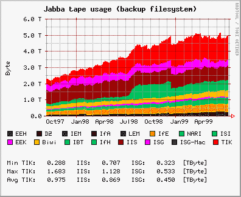

# PostgreSQL 够好吗？

> 原文：<https://renesd.blogspot.com/2017/02/is-postgresql-good-enough.html?utm_source=wanqu.co&utm_campaign=Wanqu+Daily&utm_medium=website>

tldr; you can do jobs, queues, real time change feeds, time series, object store, document store, full text search with PostgreSQL. How to, pros/cons, rough performance and complexity levels are all discussed. Many sources and relevant documentation is linked to.

> *你的数据库第一。但是 PostgreSQL 能第二吗？*T3】

如今，Web/app 项目通常有许多分布式部分。团队使用合适的工具来完成工作并不罕见。正确的工具通常类似于下面的选择。

*   Redis 用于排队和缓存。
*   弹性搜索的搜索，和日志存储。
*   时间序列的 Influxdb 或 RRD。
*   对象商店的 S3。
*   PostgreSQL 用于带有约束的关系数据，并通过模式进行验证。
*   工作队列中的芹菜。
*   Kafka 用于队列或流处理的缓冲区。
*   使用 PostgreSQL 进行异常日志记录(可能使用 Sentry)
*   KDB 用于对列导向数据进行低延迟分析。
*   Mongo/ZODB 用于存储文档 JSON(或 mangodb 用于/dev/null 替换)
*   嵌入式 SQLite。
*   用于图形数据库的 Neo4j。
*   为您的实时数据重新思考数据库，当数据改变，其他部分'反应'。
*   ...

对于所有不同的节点，这很容易每月花费数千美元，需要大量的运营知识和支持，并消耗大量电力。从头开始设置这一切可能会花费开发人员一到四周的时间，这取决于他们是否已经了解各种堆栈。也许您需要支持十个节点。

仅使用 PostgreSQL 能否获得运营优势？特别是在开始的时候，当你的系统不是很大，你的团队规模很小，你的要求不是很极端的时候？只需一个系统来设置、监控、备份、安装、升级等。

这篇文章是我帮助人们回答这个问题的一个小小的尝试...

> ### PostgreSQL 够好吗？

对于各种不同的用例，它能“足够好”吗？还是我需要从另一个工具箱里拿东西？

每个项目都是不同的，通常需求也是不同的。所以这个问题本身没有限定词是不可能回答的。世界上数以百万计的网站和应用程序只有很少的用户(每月不到数千人)，他们有时可能需要以 100 倍于正常速度的速度处理突发流量。他们可能需要交互式或软实时性能要求的查询和报告。对于每一个用例，每一组需求，都很难确定地回答这个问题。我将给出一些粗略的数字，并指出每个部分的案例研究和外部基准。

大多数网站和应用程序不需要一个月处理 1000 万访问者，或在 95%的可用性足够时拥有 99.999%的可用性，每天接收 5000 万个度量行，或每秒处理 400，000 个作业，或以亚毫秒级响应时间查询超过 TB 的数据。

### 工具选择。

随着时间的推移，我使用了许多不同的数据库。CDB，弹性搜索，Redis，SAP(是 DB 还是 COBOL？)，BSDDB/GDBM，SQLite...甚至写了一些现成系统无法满足的需求，我们不得不自己制作(实时计算机视觉处理来自网络的 GB/秒)。通常 PostgreSQL 根本无法完成手头的工作(或者 mysql 已经安装，并且客户坚持)。但是有时 PostgreSQL 并不是这项工作的最佳工具。

| [T2】](https://3.bp.blogspot.com/-_J-ydlWVQhU/WKFl8u1aDSI/AAAAAAAAA5M/MTrSVZ4c6UImT4qfHJ8Vwt2h6kgwjfxMgCLcB/s1600/underhill_atc_img_1197.jpg) |
| 工具箱 |

最近我读了一本关于工具的书。木工工具，不是编程工具。这本书的全部哲学在这里传达得有点多了...但是

[The Anarchist's Tool Chest](https://lostartpress.com/products/the-anarchists-tool-chest)

几乎都是关于工具选择的(这也是一本非常好看的书，闻起来也不错)。它教的一课是关于什么时候选择一个平面(你知道剥木头的事情)。有几十种不同的类型适合特定的情况。也有一些非常好的通用飞机，如果你选择几架好的，你可以做很多事情。也许不是这项工作的最佳工具，但至少你的工具箱里会有空间放它们。另一方面，也有瑞士军刀，以及 teevee 广告上的 200 合 1 工具。

***I'm pretty sure PostgreSQL is some combination of a minimal tool choice and the swiss army knife tool choice in the shape of a big blue solid elephant***

。

> *" PostgreSQL 是一个大象大小的工具箱，可以装下**很多**工具。**T9】*

### 包括电池吗？

PostgreSQL 提供了完全可用性的所有部分吗？通常部件是内置的，但可能有点复杂，但不是所有部件都是内置的。但幸运的是，有一些好的库使这些特性更有用(“

*for humans*

").

对于初学者，我将链接到 PostgreSQL 文档。我还将链接到已经使用 PostgreSQL 的系统(队列、时间序列、图表、列存储、文档数据库)，您可能会根据需要使用这些系统。本文将倾向于 python 堆栈，但是在 node/ruby/perl/java 领域中肯定有替代方案。如果没有，我已经列出了 PostgreSQL 部分和其他开源实现，这样您就可以推出自己的实现了。

通过学习少量的 PostgreSQL 命令，您自己就有可能使用“足够好”的实现。您可能会惊讶地发现，通过将这些技术结合在一起，您还可以实现其他什么东西。

### 任务或作业队列。

PostgeSQL 的最新版本支持一些有效和正确的队列技术。

首先是监听/通知。你可以

[LISTEN](https://www.postgresql.org/docs/9.6/static/sql-listen.html)

事件，并让客户端

[NOTIFY](https://www.postgresql.org/docs/9.6/static/sql-notify.html)

当它们发生时。因此，您的队列工作人员不必一直轮询数据库。当事情发生时，他们可以得到通知。

最近在 9.5 中增加了

[SKIP LOCKED](https://www.postgresql.org/docs/current/static/sql-select.html#SQL-FOR-UPDATE-SHARE)

将子句锁定到 PostgreSQL SELECT，可以在有多个写线程和读线程时高效地写入队列。这也意味着队列实现可能是正确的[

[2](http://blog.2ndquadrant.com/what-is-select-skip-locked-for-in-postgresql-9-5/)

].

最后 9.6 看到了大量的

[VACUUM performance enhancements](https://www.postgresql.org/about/news/1703/)

帮助解决排队问题。

包括电池吗？

~~A very popular job and task system is [celery](http://www.celeryproject.org/). It can support various SQL backends, including PostgreSQL through sqlalchemy and the Django ORM.~~

[ED:芹菜 4.0 版没有 pg 支持]

一个更新更小的系统叫做

[pq](https://pypi.python.org/pypi/pq)

。它在某种程度上模仿了 redis python“rq”队列 API。然而，使用 pq，您可以拥有一个事务性队列。如果您想确保其他事情已提交并且您的工作在队列中，这是很好的。有了独立的系统，这就有点难以保证了。

够快吗？pq 在其文档中指出，每个内核每秒可以完成 1000 个任务...但在我的笔记本电脑上，它在 2000 左右。在说话”

[Can elephants queue?](https://www.pgcon.org/2016/schedule/attachments/414_queues-pgcon-2016.pdf)

“每秒 10，000 条消息被提到有八个客户端。

多读书。

1.  [http://www . cyber tec . at/skip-locked-one-of-my favorite-9-5-features/](http://www.cybertec.at/skip-locked-one-of-my-favorite-9-5-features/)
2.  [http://blog . 2nd quadrant . com/what-is-select-skip-locked-for-in-PostgreSQL-9-5/](http://blog.2ndquadrant.com/what-is-select-skip-locked-for-in-postgresql-9-5/)
3.  [https://www . pgcon . org/2016/schedule/track/Applications/929 . en . html](https://www.pgcon.org/2016/schedule/track/Applications/929.en.html)

### 全文搜索。

> *全文搜索* *— 搜索文档的全文，而不仅仅是元数据。*

PostgreSQL 拥有

[full text search](https://en.wikipedia.org/wiki/Full-text_search)

作为一个独立的扩展，现在它是内置的。最近，它得到了一些改进，我认为现在可以了”

*good enough*

“用于许多用途。

9.6 中最大的改进是短语搜索。所以如果我搜索“红色锤子”，我会得到两者都有的东西——不是红色的东西，而是锤子。它还可以返回第一个单词是红色的文档，然后五个单词后出现 hammer。

弹性搜索做的另一件重要事情是自动为所有字段创建索引。你添加一个文档，然后你可以搜索它。这就是你需要做的。PostgreSQL 比这更需要手工操作。您需要告诉它要索引哪些字段，并在发生变化时使用触发器更新索引(参见

[triggers for automatic updates](https://www.postgresql.org/docs/9.6/static/textsearch-features.html#TEXTSEARCH-UPDATE-TRIGGERS)

).但是有一些图书馆使事情变得容易得多。其中一个是

[sqlalchemy_searchable](https://sqlalchemy-searchable.readthedocs.io/)

。然而，我不知道这里有什么像弹性搜索这样简单和自动的东西。

*   那么[刻面搜索](https://en.wikipedia.org/wiki/Faceted_search)呢？如今，快速完成并不困难。[ [6](http://akorotkov.github.io/blog/2016/06/17/faceted-search/) ][ [7](http://stackoverflow.com/questions/10875674/any-reason-not-use-postgresqls-built-in-full-text-search-on-heroku)
*   索引上的子串搜索怎么样(快速 LIKE)？使用三元模型索引可以使它变得更快。[ [8](https://about.gitlab.com/2016/03/18/fast-search-using-postgresql-trigram-indexes/) ][ [9](http://blog.scoutapp.com/articles/2016/07/12/how-to-make-text-searches-in-postgresql-faster-with-trigram-similarity)
*   词干？是的。[ [11](http://rachbelaid.com/postgres-full-text-search-is-good-enough/)
*   你是说“模糊匹配支持”吗？是的。[ [11](http://rachbelaid.com/postgres-full-text-search-is-good-enough/)
*   口音支持？(我的名字叫 René，最后一个é破坏了很多数据库)。是的。[ [11](http://rachbelaid.com/postgres-full-text-search-is-good-enough/)
*   多国语言？是的。[ [11](http://rachbelaid.com/postgres-full-text-search-is-good-enough/)
*   需要时进行正则表达式搜索？是的。[ [13](https://www.postgresql.org/docs/9.6/static/functions-matching.html)

如果您的主数据存储是 PostgreSQL，并且您将数据导出到 Elasticsearch(您不应该使用 elastic search 作为主存储，因为它有时仍然会崩溃)，那么这也是您需要做的额外工作。使用弹性搜索，如果你想让搜索更好的工作，你还需要手动设置不同字段的权重。所以最后的工作量是一样的。

使用正确的库，我认为使用 PostgreSQL 总的来说工作量是相似的。Elasticsearch 最初还是比较容易的。公平地说，Lucene(elastic search 基于它)是一个更先进的文本搜索系统。

速度呢？它们是索引搜索，返回速度很快——正如设计的那样。在[

[1](https://blog.lateral.io/2015/05/full-text-search-in-milliseconds-with-postgresql/)

]他们提到 1-2 百万文档速度还可以。他们还提到了 50 毫秒的搜索时间。如果您不想将搜索负载放在主数据库上，也可以为读取查询制作副本。另一份报告显示搜索时间为 15 毫秒[

[10](https://github.com/codeforamerica/ohana-api/issues/139)

].请注意，在同一作者硬件上进行搜索，弹性搜索通常需要 3-5 毫秒。还要注意，新的

[asyncpg](https://github.com/MagicStack/asyncpg)

PostgreSQL 驱动程序为类似这样的一般查询提供了显著的延迟改进(35 毫秒对 2 毫秒)[

[14](https://magic.io/blog/asyncpg-1m-rows-from-postgres-to-python/report.html)

].

混合搜索(关系搜索结合全文搜索)是 PostgreSQL 使之变得非常简单的另一件事。假设你想问“给我所有公司的员工写的研究论文，栈溢出答案，github repos 写的文本‘深度学习’,作者住在柏林 50 公里以内。PostgreSQL 可以相当高效地完成这些连接。

PostgreSQL 的另一个巨大优势是可以保持搜索索引同步。搜索索引可以在同一事务中更新。所以你的数据是一致的，而不是过时的。对于某些应用程序来说，返回最新的数据可能非常重要。

一次搜索多种人类自然语言怎么样？PostgreSQL 允许您有效地连接多语言搜索结果。所以如果你把“红锤子”输入一个德国硬件网站搜索引擎，其实可以得到一些结果。

任何想要更多深入信息的人都应该阅读或观看这个 FTS 演示

[[15](https://www.pgcon.org/2016/schedule/events/926.en.html)]

从去年开始。作者是一些在实现方面做了大量工作的人，他们谈到了 9.6 的改进、当前的问题以及我们可能期望在 10 版本中看到的东西。还有一篇博文

[[16](https://postgrespro.com/blog/pgsql/111866)]

关于 9.6 中各种改进的更多细节

to FTS. 您可以在以下网址看到 RUM 索引扩展(它的排名更快)

[https://github.com/postgrespro/rum](https://github.com/postgrespro/rum)

多读书。

1.  [https://blog . lateral . io/2015/05/full-text-search-in-milliseconds-with-PostgreSQL/](https://blog.lateral.io/2015/05/full-text-search-in-milliseconds-with-postgresql/)
2.  [https://Billy fung . com/writing/2017/01/postgres-9-6-phrase-search/](https://billyfung.com/writing/2017/01/postgres-9-6-phrase-search/)
3.  [https://www . PostgreSQL . org/docs/9.6/static/functions-text search . html](https://www.postgresql.org/docs/9.6/static/functions-textsearch.html)
4.  [http://www . postgresonline . com/journal/archives/368-PostgreSQL-9.6-phrase-text-searching-how-far-apart-can-you-go . html](http://www.postgresonline.com/journal/archives/368-PostgreSQL-9.6-phrase-text-searching-how-far-apart-can-you-go.html)
5.  [https://sqlalchemy-searchable.readthedocs.io/](https://sqlalchemy-searchable.readthedocs.io/)
6.  [http://akorotkov.github.io/blog/2016/06/17/faceted-search/](http://akorotkov.github.io/blog/2016/06/17/faceted-search/)
7.  [http://stack overflow . com/questions/10875674/any-reason-not-use-PostgreSQL-built-in-full-text-search-on-heroku](http://stackoverflow.com/questions/10875674/any-reason-not-use-postgresqls-built-in-full-text-search-on-heroku)
8.  [https://about . git lab . com/2016/03/18/fast-search-using-PostgreSQL-trigram-indexes/](https://about.gitlab.com/2016/03/18/fast-search-using-postgresql-trigram-indexes/)
9.  [http://blog . scout app . com/articles/2016/07/12/how-to-make-text-searches-in-PostgreSQL-faster-with-trigram-similarity](http://blog.scoutapp.com/articles/2016/07/12/how-to-make-text-searches-in-postgresql-faster-with-trigram-similarity)
10.  [https://github.com/codeforamerica/ohana-api/issues/139](https://github.com/codeforamerica/ohana-api/issues/139)
11.  [http://rachbelaid . com/postgres-full-text-search-is-good-found/](http://rachbelaid.com/postgres-full-text-search-is-good-enough/)
12.  [https://www . compose . com/articles/indexing-for-full-text-search-in-PostgreSQL/](https://www.compose.com/articles/indexing-for-full-text-search-in-postgresql/)
13.  [https://www . PostgreSQL . org/docs/9.6/static/functions-matching . html](https://www.postgresql.org/docs/9.6/static/functions-matching.html)
14.  [https://magic . io/blog/asyncpg-1m-rows-from-postgres-to-python/report . html](https://magic.io/blog/asyncpg-1m-rows-from-postgres-to-python/report.html)
15.  https://www.pgcon.org/2016/schedule/events/926.en.html
16.  [https://postgrespro.com/blog/pgsql/111866](https://postgrespro.com/blog/pgsql/111866)T2】

### 时间序列。

> 带时间戳的数据点。*T9】*

时间序列数据库大量用于监控。要么用于监控服务器指标(如 cpu 负载)，要么用于监控传感器和所有其他方式的东西。也许是传感器数据，或者你能想到的任何其他物联网应用。

| [T2】](https://upload.wikimedia.org/wikipedia/commons/7/76/Rrddemo.png) |
| 90 年代末的 RRDtool。 |

要高效地查询一整月甚至一年的数据，您需要将值聚合到更小的桶中。分钟、小时、天或月大小的桶。一些数据以如此高的频率被记录，以至于进行合计(总和，总计，...)需要相当长的时间。

[Round robin databases](https://en.wikipedia.org/wiki/RRDtool)

甚至不要存储所有的原始数据，而是将东西放入一个循环缓冲区的时间桶中。这节省了大量的磁盘空间。

时间序列数据库做的另一件事是接受大量这种类型的数据。为了有效地接收大量数据，可以使用 COPY IN 之类的东西，而不是大量的单独插入，或者使用 SQL 数据数组。将来(PostgreSQL 10)，您应该能够使用逻辑复制来拥有多个数据收集器。

[Materialized views](https://www.postgresql.org/docs/9.6/static/rules-materializedviews.html)

拥有内部数据结构的不同视图会很方便。让事情更容易查询。

[date_trunc](https://www.postgresql.org/docs/9.6/static/functions-datetime.html#FUNCTIONS-DATETIME-TABLE)

可用于将时间戳截断成您想要的存储桶大小。例如

SELECT date_trunc('hour', timestamp) as timestamp

。

[Array functions](https://www.postgresql.org/docs/9.6/static/functions-array.html)

，二进制类型可用于以紧凑的形式存储大块数据，以便以后处理。很多时间序列数据库不需要知道最新的结果，有些时滞就足够好了。

A

[BRIN](https://www.postgresql.org/docs/9.6/static/brin-intro.html)

索引(9.5 中的新特性)对于时间查询非常有用。在用 BRIN 索引的字段上选择两次要快得多。“我们设法将最佳情况下的时间缩短了 2.6 倍，将最差情况下的时间缩短了 30 倍”[

[7](http://dev.sortable.com/brin-indexes-in-postgres-9.5/)

].只要大致按时间顺序输入行[

[6](http://dba.stackexchange.com/questions/130819/postgresql-9-5-brin-index-dramatically-slower-than-expected)

].如果由于某种原因它们没有，您可以使用

[CLUSTER](https://www.postgresql.org/docs/current/static/sql-cluster.html)

然而，通常时间序列数据是按时间排序的。

Monasca 可以提供 graphana 和 API，Monasca 查询 PostgreSQL。grapha 中仍然没有对 PostgreSQL 的直接支持，但是这项工作已经进行了一段时间。参见

[pull request in grafana](https://github.com/grafana/grafana/pull/5364)

。

PostgreSQL 中使用时间序列的另一个项目是

[Tgres](https://github.com/tgres/tgres)

。它与 statsd、用于输入的 graphite text 兼容，并提供了足够的 Graphite HTTP API 来与 Grafana 一起使用。作者还写博客[

[1](https://grisha.org/blog/)

]大量关于用于时间序列数据库的不同优化方法。

请看史蒂文·辛普森在 fosdem 会议上的演讲

[infrastructure monitoring with PostgreSQL](https://fosdem.org/2017/schedule/event/postgresql_infrastructure_monitoring/)

。在这篇文章中，他谈到了使用 PostgreSQL 来监控和记录一个 100 个节点的系统。

在一篇旧的“grisha”博客文章中[

[5](https://grisha.org/blog/2016/11/08/load-testing-tgres/)

]，他说“我在 2010 年的笔记本电脑上能够支持 6K 系列每秒约 6K 数据点的负载”。

我们能把数据放入

***dataframe***

易于分析的结构？当然，如果您使用 sqlalchemy 和 pandas 数据帧，您可以像这样加载数据帧...

> ```
> df = pd.read_sql(query.statement, query.session.bind)
> ```

这让你可以对你的数据释放一些非常强大的统计数据和机器学习工具。(还有一个

[to_sql](http://pandas.pydata.org/pandas-docs/stable/generated/pandas.DataFrame.to_sql.html)

).

多读点书。

1.  [https://grisha . org/blog/2016/12/16/storing-time-series-in-PostgreSQL-part-ii/](https://grisha.org/blog/2016/12/16/storing-time-series-in-postgresql-part-ii/)
2.  [https://www . PostgreSQL . org/docs/9.6/static/parallel-plans . html](https://www.postgresql.org/docs/9.6/static/parallel-plans.html)
3.  [http://blog.2ndquadrant.com/parallel-aggregate/](http://blog.2ndquadrant.com/parallel-aggregate/)
4.  [https://Mike . depalatis . net/using-postgres-as-a-time-series-database . html](https://mike.depalatis.net/using-postgres-as-a-time-series-database.html)
5.  [https://grisha.org/blog/2016/11/08/load-testing-tgres/](https://grisha.org/blog/2016/11/08/load-testing-tgres/)
6.  [http://DBA . stack exchange . com/questions/130819/PostgreSQL-9-5-Brin-index-大幅低于预期](http://dba.stackexchange.com/questions/130819/postgresql-9-5-brin-index-dramatically-slower-than-expected)
7.  [http://dev.sortable.com/brin-indexes-in-postgres-9.5/](http://dev.sortable.com/brin-indexes-in-postgres-9.5/)

### 二进制数据的对象存储。

> 永远不要在你的数据库中存储图片！*T9】*

我相信你已经听过很多次了。但是，如果您的图像是您最重要的数据呢？当然，他们应该得到比文件系统更好的东西吗？如果需要从多个 web 应用程序服务器访问它们，该怎么办？这个问题的解决方案通常是将东西存储在一些基于云的存储中，比如 S3。

[BYTEA](https://www.postgresql.org/docs/9.6/static/datatype-binary.html)

PostgreSQL 中二进制数据的类型(如果大小小于 1GB)。

> 创建表文件(
> id 序列主键，
> 文件名文本不为空，
> 数据字节不为空
> )

但是，请注意，BYTEA 并不真正支持所有 PostgreSQL 驱动程序的文件流。它需要完全在内存中。

然而，许多图像的大小只有 200KB 或高达 10MB。这应该没问题，即使你每天添加数百张图片。三年前的笔记本电脑性能指标评测...用 python 和 psycopg2 保存 2500 张 1MB 的 iPhone 大小的图片，只需要使用单核，大约需要 1 分 45 秒。(那是 2.5GB 的数据)。通过使用复制到二进制文件，速度可以提高 3 倍[

[1](http://stackoverflow.com/questions/8144002/use-binary-copy-table-from-with-psycopg2/8150329#8150329)

]，但是这对于许多用途来说已经足够快了。

如果你需要非常大的对象，那么 PostgreSQL 有一种叫做“

[Large Objects](https://www.postgresql.org/docs/9.6/static/largeobjects.html)

".但是，如果没有额外的配置，一些备份工具不支持这些功能。

***Batteries included?***

python SQL 库(psycopg2 和

[sqlalchemy](http://www.sqlalchemy.org/)

)内置了对 BYTEA 的支持。

但是，如何轻松地将文件从数据库复制到数据库中呢？我做了一个

[image save and get gist](https://gist.github.com/illume/8aa7c2d03273da846bf4361236a4f3f9)

这里用 45 行 python 脚本保存和获取文件。当您使用 ORM 时，这甚至更容易，因为数据只是一个属性(

open('bla.png').write(image.data)

).

将千兆字节的二进制数据放入 PostgreSQL 中需要考虑的一个相当重要的事情是，它会影响其他数据的备份/恢复速度。如果您有一个热备盘副本，有时间点恢复(使用 WALL-e、pgbarman)，使用逻辑复制，或者决定恢复选择性表，这就不是一个问题。

***How about speed?***

我发现将二进制数据放入 PostgreSQL 比放入 S3 更快。尤其是在低 CPU 客户端(IoT)上，在客户端将数据发送到 S3 之前，您必须对数据进行完整的校验和检查。这也取决于你使用的 S3 的地理位置，以及你的网络连接。

S3 还提供了其他优势和功能(如内置复制，这是一项托管服务)。但是对于存储一点点二进制数据，我认为 PostgreSQL 已经足够好了。当然，如果你想要一个非常简单的高度持久的全球分布式对象存储，那么像 S3 这样的东西是首选。

多读书。

1.  [http://stack overflow . com/questions/8144002/use-binary-copy-table-from-with-psycopg 2/8150329 # 8150329](http://stackoverflow.com/questions/8144002/use-binary-copy-table-from-with-psycopg2/8150329#8150329)

### 实时、发布订阅、更改订阅源、反应式。

更改订阅源是一种可以收听更改的订阅源。公共订阅(或

[Publish–subscribe pattern](https://en.wikipedia.org/wiki/Publish%E2%80%93subscribe_pattern)

)，可以用

[LISTEN](https://www.postgresql.org/docs/9.6/static/sql-listen.html)

/

[NOTIFY](https://www.postgresql.org/docs/9.6/static/sql-notify.html)

和

[TRIGGER](https://www.postgresql.org/docs/9.6/static/sql-createtrigger.html)

。

| [T2】](https://images-na.ssl-images-amazon.cimg/I/51JN65AE3YL._SY300_.jpg) |
| 实现邮件功能。 |

如果你在你的网站或应用程序上实现“软实时”功能，这是非常有趣的。如果您的数据发生问题，您的应用程序可以“立即”知道。Websockets 是 web 技术的名称，它使这一功能表现良好，然而 HTTP2 也允许服务器推送，在这两者之前，各种其他系统已经使用了很长时间。假设你正在制作一个聊天信息网站，你想制作一个“你有邮件了！”声音。您的应用程序可以监听 PostgreSQL，当一些数据被更改时，触发器可以发送一个 NOTIFY 事件，PostgreSQL 将该事件传递给您的应用程序，然后您的应用程序可以将该事件推送到 web 浏览器。

遗憾的是，PostgreSQL 不能给你硬实时保证。因此，定制高端视频处理和存储系统，或专门定制的高速金融产品都不是 PostgreSQL 适合的领域。

它的表现如何？在队列部分，我提到了一台旧笔记本电脑上每个内核有数千个事件。

延迟问题是

[query planner and optimizer](https://www.postgresql.org/docs/9.6/static/planner-optimizer.html)

，以及

[VACUUM](https://www.postgresql.org/docs/9.6/static/sql-vacuum.html)

，以及

[ANALYZE](https://www.postgresql.org/docs/9.6/static/sql-analyze.html)

。

查询计划器有点神奇，但也有点烦人。它可以自动尝试并找出为您查询数据的最佳方式。然而，它不会自动创建它认为合适的索引。根据环境因素，如 CPU、IO、各种表中的数据以及收集的其他统计数据，它可以改变搜索数据的方式。这比必须手动编写查询，然后在每次模式、主机或数据量发生变化时更新它们要好得多。

但有时它会出错，当您有性能需求时，这是不可接受的。William Stein(来自 Sage Math project)写道，有些查询有时会很慢

[7](http://blog.sagemath.com/2017/02/09/rethinkdb-vs-postgres.html)

].这是在将他的 web 应用移植到使用 PostgreSQL 而不是 rethinkdb(TLDR；端口是可能的并且结果更快)。解决方案通常是监视那些缓慢的查询，并尝试强制查询规划器遵循您知道的快速路径。或者添加/删除或调整查询可能使用或可能不使用的索引。布雷迪·霍尔特写了一篇关于“

[Performance Tuning Queries in PostgreSQL](https://www.geekytidbits.com/performance-tuning-postgres/)

".

稍后，我将讨论列数据库的主题，以及在金融和分析产品中流行的对这类数据的“实时”查询(pg 还没有内置任何东西，但是有扩展)。

[VACUUM](https://www.postgresql.org/docs/9.6/static/sql-vacuum.html) [ANALYZE](https://www.postgresql.org/docs/9.6/static/sql-analyze.html)

是一个清理数据的过程。这是一个垃圾收集器(真空)与统计学家(分析)的结合。似乎 PostgreSQL 的每个版本都提高了各种极端情况下的性能。过去必须手动运行，现在

[automatic VACUUM](https://www.postgresql.org/docs/9.6/static/routine-vacuuming.html)

是一件事。更多的事情可以同时进行，并且它可以避免在更多的情况下读取所有的数据。然而，有时，像所有垃圾收集器一样，它会暂停。从好的方面来说，它可以使你的数据更小，并告诉自己如何进行更快的查询。如果你需要的话，你可以关掉自动吸尘，更多的是手动操作。此外，您可以只做分析部分来收集统计数据，这比 VACUUM 运行得快得多。

为了获得 python 和 PostgreSQL 更好的延迟，有

[asyncpg](https://github.com/MagicStack/asyncpg)

由 magicstack。它使用异步网络模型(python 3.5+)和二进制 PostgreSQL 协议。这可以有 2 毫秒的查询时间，甚至比 golang 和 nodejs 还要快。它还可以让您每秒从 PostgreSQL 读取一百万行到 python 每核[

[8](https://magic.io/blog/asyncpg-1m-rows-from-postgres-to-python/)

].内存分配减少了，上下文切换也减少了——这两者都会导致延迟。

出于这些原因，我认为对于许多软实时应用来说，这已经“足够好”了，在这些应用中，偶尔的时间预算失败并不是世界末日。如果您在真实数据上对您的查询进行负载测试(并且针对比您拥有的更多的数据)，那么您可以相当肯定它在大多数时候都可以正常工作。选择适当的客户端驱动程序也可以显著改善延迟。

多读书。

1.  [http://blog . sage math . com/2017/02/09/rethink db-vs-postgres . html](http://blog.sagemath.com/2017/02/09/rethinkdb-vs-postgres.html)
2.  [https://almighty couch . org/blog/real time-change feeds-PostgreSQL-notify/](https://almightycouch.org/blog/realtime-changefeeds-postgresql-notify/)
3.  [https://blog . and yet . com/2015/04/06/postgres-pubsub-with-JSON/](https://blog.andyet.com/2015/04/06/postgres-pubsub-with-json/)
4.  [https://github.com/klaemo/postgres-triggers](https://github.com/klaemo/postgres-triggers)
5.  [https://www . confluent . io/blog/bottled-water-real-time-integration-of-PostgreSQL-and-Kafka/](https://www.confluent.io/blog/bottled-water-real-time-integration-of-postgresql-and-kafka/)
6.  [https://www.geekytidbits.com/performance-tuning-postgres/](https://www.geekytidbits.com/performance-tuning-postgres/)
7.  [http://blog . sage math . com/2017/02/09/rethink db-vs-postgres . html](http://blog.sagemath.com/2017/02/09/rethinkdb-vs-postgres.html)
8.  [https://magic . io/blog/asyncpg-1m-rows-from-postgres-to-python/](https://magic.io/blog/asyncpg-1m-rows-from-postgres-to-python/)

### 日志存储和处理

能够将日志放在一个中心位置进行查询和统计非常有帮助。但是浏览日志也是如此。对它们进行关系查询甚至全文查询就更好了。

rsyslog 允许您轻松地将日志发送到 PostgeSQL 数据库[

[1](http://www.rsyslog.com/doc/v8-stable/tutorials/database.html)

].您对它进行了设置，使它将日志存储在文件中，但也将它们发送到您的数据库。这意味着如果数据库关闭一段时间，日志仍然存在。rsyslog 文档中有一节是关于在 rsyslog 端使用缓冲进行高速日志记录的[

[4](http://www.rsyslog.com/doc/v8-stable/tutorials/high_database_rate.html)

].

systemd 是更现代的日志记录系统，它允许使用

[systemd-journal-remote](https://www.freedesktop.org/software/systemd/man/systemd-journal-remote.html)

。它在 HTTPS 上空发送 JSON 线路。您可以用 systemd 接收数据(将其用作缓冲区),然后通过高速复制将数据传输到 PostgreSQL。另一种选择是使用 systemd 支持将日志发送到传统的 syslog，如 rsyslog，它可以将日志发送到 PostgreSQL。

你经常想整理你的日志。

[SELECT regex matches](https://www.postgresql.org/docs/9.6/static/functions-matching.html)

可用于类似 grep/grok 的功能。它还可以用来将日志解析成更容易查询的表格格式。

触发器可用于在每次插入日志条目时解析数据。或者你可以使用

[MATERIALIZED VIEWs](https://www.postgresql.org/docs/9.6/static/sql-creatematerializedview.html)

如果不需要经常刷新信息。

**Is it fast enough?**

请看史蒂文·辛普森在 fosdem 会议上的演讲

[infrastructure monitoring with PostgreSQL](https://fosdem.org/2017/schedule/event/postgresql_infrastructure_monitoring/)

。在这篇文章中，他谈到了使用 PostgreSQL 来监控和记录一个 100 个节点的系统。一台旧笔记本电脑上的 PostgreSQL 可以以每秒几十万条消息的速度轻松接收。

[Citusdata](https://www.citusdata.com/)

是一个构建在 PostgreSQL 之上的核心解决方案(对它有贡献！).它被用于处理数十亿个事件，并被互联网上一些最大的公司使用(例如，有 5%的互联网流量使用它进行日志记录的 Cloudflare)。因此 PostgreSQL 也可以向上扩展(使用核心外扩展)。

**Batteries included?**

在本文的 timeseries 数据库部分，我提到您可以使用

[grafana](http://grafana.org/)

用 PostgreSQL(费点力气)。您可以将它用于仪表板和警报(以及其他事情)。然而，我不知道有任何真正好的系统(Sentry，Datadog，elkstack)有一流的 PostgreSQL 支持。

将日志放在那里的一个好处是，您可以非常容易地编写自定义查询。想知道每秒有多少来自 App server 1 的请求，并将其链接到您的慢速查询日志吗？这只是一个普通的 SQL 查询，您不需要让人浏览日志...可以使用普通的 SQL 工具。当您将这一功能与现有的 SQL 分析工具相结合时，这是非常好的。

我觉得对于很多小用途来说已经足够好了。如果您有超过 100 个节点，或者正在处理大量事件，这可能不是最佳解决方案(除非您有一个非常强大的 PostgreSQL 集群)。这确实需要更多的工作，而且这不是人们最常走的路。不过，它确实让您可以将所有 SQL 分析工具与最好的指标和警报系统一起使用。

多读书。

1.  [http://www . rsyslog . com/doc/V8-stable/tutorials/database . html](http://www.rsyslog.com/doc/v8-stable/tutorials/database.html)
2.  [https://www . PostgreSQL . org/docs/9.6/static/plpgsql-trigger . html](https://www.postgresql.org/docs/9.6/static/plpgsql-trigger.html)
3.  [https://www . PostgreSQL . org/docs/9.6/static/functions-matching . html](https://www.postgresql.org/docs/9.6/static/functions-matching.html)
4.  [http://www . rsyslog . com/doc/V8-stable/tutorials/high _ database _ rate . html](http://www.rsyslog.com/doc/v8-stable/tutorials/high_database_rate.html)

### 收集数据的队列

当您遇到流量突发时，最好快速持久化数据，以便您可以排队等待处理。也许你通常每天只有 100 个访问者，但是当一些新闻报道出来或者你的网站在广播中被提及时(或者可能是垃圾邮件发送者的攻击)，这就是突发流量。

系统喜欢存储数据，供以后处理

[Kafka](https://kafka.apache.org/)

擅长于。

使用 COPY 命令，而不是大量的单独插入，可以为缓冲数据提供非常好的加速。如果您对数据进行一些处理，或者有约束和索引，所有这些都会降低速度。因此，您可以将它放在一个普通的表中，然后像处理队列一样处理数据。

许多关于日志存储和排队的注意事项在这里都适用。我猜你开始看到一种模式了？我们已经能够使用一些构件来实现高效的模式，这些模式允许我们使用 PostgreSQL，而这在过去可能需要专门的数据库。

将数据从 python 导入 PostgreSQL 最快的方法？看到这个回答[

[1](http://stackoverflow.com/questions/8144002/use-binary-copy-table-from-with-psycopg2/8150329#8150329)

]哪里

[COPY](https://www.postgresql.org/docs/9.6/static/sql-copy.html) {table} FROM STDIN WITH BINARY

被证明是最快的方法。

多读书。

### 高可用性、弹性。

> “数据库会一直为您服务吗？会和你一起成长吗？”

为了让事情快速进行，有许多地方提供 PostgreSQL 即服务[

[3](https://www.heroku.com/postgres)

][

[4](http://crunchydata.com/)

][

[5](https://2ndquadrant.com/en/)

][

[6](https://www.citusdata.com/)

][

[7](https://www.enterprisedb.com/)

][

[8](https://aws.amazon.com/rds/postgresql/)

].因此，您可以让他们为您设置复制、监控、扩展、备份和软件更新。

这

[Recovery Point Objective (RPO)](https://en.wikipedia.org/wiki/Recovery_point_objective)

，以及

[Recovery Time Objective (RTO)](https://en.wikipedia.org/wiki/Recovery_time_objective)

每个项目都不一样。并非所有项目都需要极高的可用性。对一些人来说，几个小时甚至一个星期后恢复是可以的。其他项目每次停机时间不能超过几分钟或几秒钟。我认为对于许多非关键网站来说，热备用和异地备份就足够了。

我强烈推荐贡纳·布鲁斯的这个演讲——”

[An overview of PostgreSQL's backup, archiving, and replication](https://fosdem.org/2017/schedule/event/postgresql_backup/)

".然而，你可能想用你最喜欢的声音编辑器(如 Audacity)对声音进行预处理，以消除反馈噪音。然而，幻灯片在那里，没有破坏耳朵的反馈声音。

通过使用热备用辅助复制，您可以快速从主数据库进行故障转移。因此您可以在几分钟或几秒钟内完成备份。通过使用 pgbarman 或 wall-e，您可以获得数据库的时间点恢复异地备份。为了使管理副本更容易，像 repmgr 这样的工具可以派上用场。

使用 PostgreSQL 实现真正的高可用性目前有点困难，并且需要非核心解决方案。然而，在 10.0 版本中应该更容易。

[Patroni](https://github.com/zalando/patroni)

是一个有趣的系统，它可以帮助您在 AWS 上部署高可用性集群

[Spilo](https://github.com/zalando/spilo)

用于生产)，工作正在进行中，以便它可以在 Kubernetes 集群上工作。Spilo 目前正在生产中使用，可以执行各种管理任务，如自动扩展、备份、故障时的节点替换。它可以与最少三个节点一起工作。

如您所见，有多个系统和多个供应商帮助您扩展 PostgreSQL。在低端，您可以以每月几美分的价格将数据库备份到 S3，并以每月 5 美元的价格获得一个热备份副本。您还可以将单个节点一直扩展到具有 24TB 存储、32 个内核和 244GB 内存的机器。这与拥有数千个节点的 casandra 装置不在同一范围内，但仍是相当可观的范围。

多读书。

1.  [https://Edward Samuel . WordPress . com/2016/04/28/setup-PostgreSQL-9-5-master-slave-replication-using-rep mgr/](https://edwardsamuel.wordpress.com/2016/04/28/set-up-postgresql-9-5-master-slave-replication-using-repmgr/)
2.  [https://fosdem.org/2017/schedule/event/postgresql_backup/](https://fosdem.org/2017/schedule/event/postgresql_backup/)
3.  [https://www.heroku.com/postgres](https://www.heroku.com/postgres)
4.  [http://crunchydata.com/](http://crunchydata.com/)
5.  [https://2nd quadrant . com/en/](https://2ndquadrant.com/en/)
6.  [https://www.citusdata.com/](https://www.citusdata.com/)
7.  [https://www.enterprisedb.com/](https://www.enterprisedb.com/)
8.  [https://aws.amazon.com/rds/postgresql/](https://aws.amazon.com/rds/postgresql/)

### 列存储、图形数据库、其他数据库，...终于结束了？

这篇文章已经太长了...因此，我将快速浏览这两个主题。

**Graph databases**

像 Neo4j 允许你做复杂的图形查询。边、节点和层次。如何在 PostgreSQL 中做到这一点？对数据进行反规范化，并使用路径 like 属性和 LIKE。因此，要在图中找到东西，比如说所有的孩子，可以预先计算字符串中的路径，而不是使用外键进行复杂的递归查询和连接。

> SELECT * FROM path LIKE/parenta/child 2/child 3% '；

然后，您不需要超级复杂的查询来从 parent_id、child _ ids 等获取图结构。(还记得之前如何为快速点赞放置三元模型索引吗？)您还可以在这个路径上使用其他模式匹配查询，来做一些事情，比如查找有一个孩子的所有 3 级以上的父级。

用快速赞标记数据也变得非常容易。只需将标签存储在逗号分隔的字段中，并对其使用索引。

**[Column stores](https://en.wikipedia.org/wiki/Column-oriented_DBMS)**

数据存储在列布局中，而不是行中。通常用于实时分析工作负载。其中最古老和最好的是

[Kdb+](https://en.wikipedia.org/wiki/Kdb%2B)

。谷歌做了一个，

[Druid](http://druid.io/)

是另一个流行的，也有大量的自定义图形。

但是 PostgreSQL 不是以基于行的格式存储所有内容吗？是的，它是。但是，有一个开源扩展，叫做

[cstore_fdw](https://citusdata.github.io/cstore_fdw/)

Citus Data 是 PostgreSQL 的一个面向列的存储。

那么有多快呢？Mark Litwintschik 写了一系列文章，他用

[PostgreSQL](http://tech.marksblogg.com/billion-nyc-taxi-rides-postgresql.html)

并且随着

[kdb+](http://tech.marksblogg.com/billion-nyc-taxi-kdb.html)

和各种其他系统。如果没有 cstore_fdw 或并行工作器，PostgreSQL 需要 3.5 小时才能完成一个查询。用 4 个平行工人，减少到 1 小时 1 分钟。使用 cstore_fdw 花费了 2 分 32 秒。速度真快！

### 结束了。

抱歉，过了这么久。但可能会更久。这不是我的错...

|  |
| PostgreSQL 就像一个巨大的工具箱。 |

希望下一次您想使用 PostgreSQL 处理关系数据之外的事情时，所有这些单词都有所帮助。此外，我希望您可以看到，用一个数据库系统取代 10 个数据库系统是可能的，这样做您可以获得显著的运营优势。

Any corrections or suggestions? Please leave a comment, or see you on twitter [@renedudfield](https://twitter.com/renedudfield) There was discussion on [hn](https://news.ycombinator.com/item?id=13641377) and [python reddit](https://www.reddit.com/r/Python/comments/5ttjhh/is_postgresql_good_enough/).