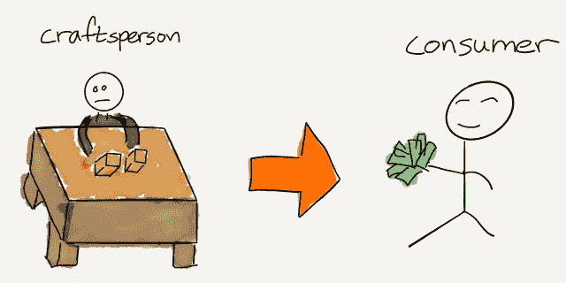
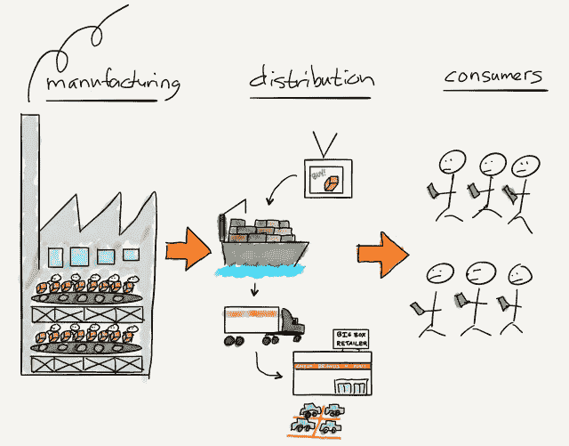
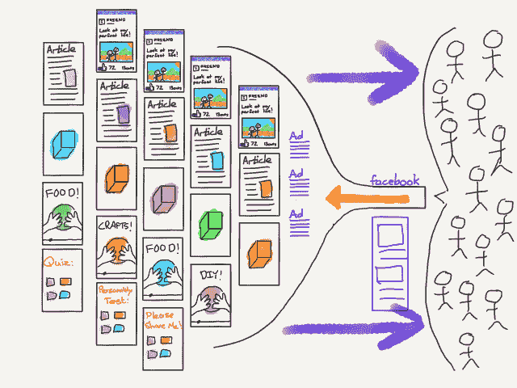

# 宣言和垄断——本·汤普森的战略

> 原文：<https://stratechery.com/2017/manifestos-and-monopolies/?utm_source=wanqu.co&utm_campaign=Wanqu+Daily&utm_medium=website>

很有可能，根据最近的猜测，脸书首席执行官马克·扎克伯格正准备竞选总统。也有可能脸书正处于失败的边缘，“就像 MySpace 一样”。当我在这里的时候，可能有不明飞行物存在。不过，我对此表示怀疑。

事实是，脸书是科技行业——甚至可以说是全世界——有史以来最强大的公司之一。没错，脸书上发布的所有内容都是免费的，无论是个人还是专业内容创作者； [1](#fn1-2457 "Plus, of course, the content Facebook pays for to seed initiatives like live video and dedicated content for <a href="https://stratechery.com/2017/snap-s-1-follow-up-facebooks-earnings-hedging-the-future-of-advertising/">the new video tab</a> ") 诚然，脸书在经济价值的产生方面并不真正不可替代； [2](#fn2-2457 "To be clear, economic value is generated on Facebook, but the role Facebook plays, whether that be advertising, small business sites, buy-and-sell groups, etc., could be done by alternatives") 说到交流，的确有各种各样的选择。然而，要将这些事实作为脸书脆弱的证据，需要一种日益陈旧的世界观。

从生产开始:人类历史上肯定有一个时期，经济实力是通过控制资源和生产稀缺商品获得的:

[T2】](https://i0.wp.com/stratechery.com/wp-content/uploads/2017/02/FullSizeRender.jpg?ssl=1)

然而，对于大多数产品来说，一个多世纪以来情况并非如此；首先是工业革命，然后是流水线生产方式的出现，导致了产品的丰富。新的经济力量来源变成了分销:将大规模生产的产品送到有购买倾向的客户面前的能力:

[T2】](https://i0.wp.com/stratechery.com/wp-content/uploads/2017/02/FullSizeRender-2.jpg?ssl=1)

今天[互联网的根本影响](https://stratechery.com/2016/the-state-of-technology-at-the-end-of-2016/)是使发行本身成为一种廉价商品——或者就数字内容而言，完全免费。推而广之，这就是为什么我[一直认为](https://stratechery.com/2013/friction/)互联网革命与工业革命一样重要:它正在改变经济价值产生的方式和地点，从而改变权力的归属:

[T2】](https://i0.wp.com/stratechery.com/wp-content/uploads/2017/02/IMG_0138.png?ssl=1)

在这个勇敢的新世界里，力量不是来自生产，不是来自分配，而是来自控制消费:所有市场都将是需求驱动的；它们已经达到的程度是 T2 数字化程度的函数。

这就是为什么大多数脸书失败原教旨主义者如此严重地忽略了一点:公司为其内容免费并不是一个弱点，而是内容(以及越来越多的商品)的供应是无限的，因此毫无价值的基本现实的反映；公司对于产品分销的重要性并不是衡量其经济重要性的标准，而是反映了分销不再是一个区分因素。最后，在其他平台上交流是可能的，这一事实忽略了在脸书交流总是最容易的，因为他们拥有社交图谱。再加上控制消费就是控制数十亿个人消费者的事实，在所有条件相同的情况下，所有人都会选择简单的选择，你就会开始意识到脸书是多么占主导地位。

鉴于这一现实，扎克伯格为什么想当总统？他不仅是脸书的首席执行官，也是最大的股东，不对任何人负责。他的权力和影响力比任何一位受制于政治现实和制衡的总统都要大，此外，正如扎克伯格上周明确表示的那样，他关注的不仅仅是一个国家，而是整个世界。

#### 脸书不安了

关于脸书比大多数人意识到的更强大的论点在战略上并不新鲜；2015 年，我写了《脸书时代》,就脸书被低估的程度提出了类似的观点，尤其是在硅谷。作为一名分析师，我不禁被深深打动:我写的关于脸书的正面文章可能比任何其他公司都多，坦率地说，我将继续这样做。

然而，如果你采取一种军事类型的方法来分析——根据能力而不是意图来评估脸书——出于完全相同的原因，这家公司相当可怕。去年在[选民决定](https://stratechery.com/2016/the-voters-decide/)我写道:

> 考虑到他们在用户眼中的影响力，如果脸书愿意，它可能成为世界上最强大的政治力量。当然，直到这种干预被揭露，这个严重背叛信任的服务将失去大量用户，从而失去其在广告领域有利可图的特权地位，导致市场价值暴跌。简而言之，除了推动更深层次参与的内容之外，没有任何激励让脸书明确偏爱任何类型的内容；所有证据表明，这正是这项服务的作用。

去年 5 月，脸书涉嫌篡改趋势话题框引起的轰动——以及脸书对甚至是明显偏见的暗示的过度反应——似乎证实了脸书的动机是这样的，该公司永远不会变得公开政治化。可以肯定的是，算法是由人类编写的，这意味着它们总是会有隐含的偏见，专注于参与也有其自身的危害，特别是创造了[过滤泡沫](https://stratechery.com/2016/the-real-problem-with-facebook-and-the-news/)和[假新闻](https://stratechery.com/2016/fake-news/)，但我一直认为脸书为明确的政治目的所做的使用是最大的危险。

这就是为什么我读扎克伯格的宣言[建立一个全球社区](https://www.facebook.com/notes/3707971095882612/)时如此震惊。扎克伯格不仅给出了他对世界如何变化的观点——至少顺便承认，脸书对参与的关注可能导致了过滤泡沫和假新闻等事情——而且首次明确承诺脸书将以符合扎克伯格个人世界观的方式在实现这种变化中发挥核心作用。扎克伯格写道:

> 此时此刻，我们世界各地的许多人都在思考如何才能产生最积极的影响。我想起了我最喜欢的一句关于技术的话:“我们总是高估我们在两年内可以做的事情，而低估我们在十年内可以做的事情。”我们可能没有能力立即创造出我们想要的世界，但是我们可以从今天开始为长期目标而努力。在这种时候，我们脸书能做的最重要的事情是发展社会基础设施，让人们有能力建立一个为我们所有人服务的全球社区。
> 
> 在过去的十年里，脸书专注于联系朋友和家人。有了这个基础，我们的下一个重点将是发展社区的社会基础设施——支持我们，保护我们的安全，为我们提供信息，促进公民参与，以及包容所有人。

这一切听起来都很好，考虑到扎克伯格对维系社会的机构解体的描述，甚至是有益的。我们甚至可以说，正如工业革命将政治权力从地方性的领地和城市转移到了中央集权的民族国家，互联网革命或许也需要政治权力向全球性实体转移。这似乎是扎克伯格的立场:

> 我们现在最大的机遇是全球性的——比如传播繁荣和自由，促进和平和理解，让人们摆脱贫困，以及加速科学发展。我们面临的最大挑战也需要全球性的应对措施——比如终结恐怖主义、应对气候变化和预防流行病。现在的进步要求人类不仅作为城市或国家团结起来，而且作为一个全球社区团结起来。

只有一个问题:首先，扎克伯格可能是错的；同样合理的说法是，互联网革命的最终结果是将权力移交给更小、反应更灵敏的自我选择的实体。此外，即使扎克伯格是对的，还有人相信由一个不负责任的全能人士运营的私人公司出于销售广告的目的跟踪你的一举一动是全球治理应该采取的最佳形式吗？

#### 垄断的成本

我对扎克伯格宣言根深蒂固的怀疑与脸书或扎克伯格无关；我怀疑我们在更多的政治目标上达成了一致。相反，我的不安来自于我坚信中央集权既低效又危险:没有一个人或一家公司能够独自为所有人找到最佳解决方案，历史上充斥着中央计划者表面上出于好意(至少在他们自己的头脑中)行事却导致最可怕后果的例子；这些后果有时表现为经济和人道主义的公开成本，有时这些成本是放弃的机会和创新。通常都是。

当谈到机会成本时，脸书对社会来说已经是个问题。虽然互联网——确切地说，是分销瓶颈的消除——是新闻业困境的原因，但脸书——T2——吞噬了出版业的所有利润。推特，一个我认为是 T4 独特而重要的服务，被脸书压扁了。我怀疑该公司为生存而挣扎是该服务无法发展或处理滥用的根源。甚至由多年来最有远见的产品人领导的 Snapchat 也对其长期生存能力提出了严重质疑。脸书太占优势了:它的网络效应太强，它关于互联网上每个用户的数据对广告商来说太有吸引力了。其它消费者服务企业需要成为有生命力的实体。 [3](#fn3-2457 "Social networks <a href="https://stratechery.com/2014/ello-consumer-friendly-business-models/">must be free</a> ")

我不一定嫉妒脸书的这种统治地位；正如我上面提到的，我自己也从记录它中受益。扎克伯格发现了一个市场机会，并以卓越的执行力无情地利用了这个机会，他谦逊地在必要时收购(T1)公司，大胆地模仿(T3)T2 公司，并在持续的质疑声中获得了应有的收益。此外，正如我所指出的，只要脸书受利润最大化激励的支配，我就愿意容忍公司意想不到的后果:任何打破公司统治的必要措施，特别是由政府发起的措施，都将产生它们自己意想不到的后果。此外，正如我们在 IBM 和 Windows 身上看到的，市场在摧毁它们所促成的基于生态系统的垄断方面远比政府更有效——部分原因是追求利润最大化战略是[颠覆的关键因素](https://hbr.org/1995/01/disruptive-technologies-catching-the-wave)。

然而，这就是为什么对我来说这个宣言越界了:反对蜘蛛侠，脸书的强大并不意味着巨大的责任；所说的权力应该包括拒绝使用它，不管目标是多么无私，除此之外，我们其余的人有责任采取相反的行动。

#### 限制脸书

当然，指出脸书统治地位的问题是一回事，但提出应对策略又是另一回事；太多的解决方案——包括要求扎克伯格利用脸书达到政治目的——不太关心权力的滥用，而更关心为“正确”的事业确保权力。从另一方面来说，正如我去年在《T2 反垄断和聚合》一文中所解释的，传统的反垄断对受聚合理论管辖的公司来说是否可行还不清楚:

> 简而言之，聚集理论是关于商业如何在一个零分配成本和零交易成本的世界中运作；通过提供卓越的体验，消费者被吸引到聚合器，聚合器吸引模块化供应商，模块化供应商改善体验，从而吸引更多消费者，进而吸引更多供应商进入上述良性循环…
> 
> 聚合理论的第一个关键反垄断含义是，由于这些良性循环，大的变得更大；事实上，在所有条件都相同的情况下，聚合理论所涵盖的市场均衡状态就是垄断:一个聚合者抓住了所有的消费者和所有的供应商。
> 
> 然而，这种垄断与过去的垄断有很大不同:聚合者不再通过控制供应(如石油)或分销(如铁路)或基础设施(如电话线)来限制消费者的选择；相反，消费者可以自行选择聚合平台，因为这是一种更好的体验。

脸书是一个特别棘手的案例，因为该公司有多重局限:一方面，根据聚合理论，脸书已经完全模块化和商品化了内容供应商，他们迫切希望获得脸书的庞大用户群；这是一个双边市场，供应商完全无能为力。但由于脸书的网络效应，用户也是如此:任何社交网络的首要特征是你的朋友或家人是否在使用它，每个人都使用脸书(即使他们也使用另一个社交网络)。

为此，脸书不应被允许购买另一个基于网络的应用程序；我会更进一步，让一个社交网络收购另一个社交网络看起来是反竞争的。网络效应太强大了，不允许把它们结合起来。例如，如果脸书没有 Instagram 或 WhatsApp，当前的环境会大不相同(如果脸书输掉反垄断诉讼，补救措施几乎肯定是剥离 Instagram 和 WhatsApp)。

其次，所有的社交网络都应该支持社交图的可移植性——将你的好友列表从一个网络导出到另一个网络的能力。Instagram 又是一个完美的例子:这个曾经的照片过滤应用通过批量导入你的 Twitter 社交图，在 Twitter 的背后推出了它的网络。而且，在被脸书收购后，Instagram 通过不断引入你的脸书网络加速了它的增长。今天，所有的社交网络早就不可能做到这一点，让竞争对手更难出现。

第三，应认真关注脸书对个人的数据收集。一般来说，我对广告，甚至是数据收集没有任何问题，但脸书是如此普及，以至于个人几乎不可能以任何有意义的方式退出，这进一步巩固了脸书在数字广告领域日益增长的主导地位。 [4](#fn4-2457 "Google is a separate topic")

* * *

任何读过 Stratechery 一段时间的人都知道，我对监管持极大的保留意见；收益很容易衡量，但机会成本是无形的，而且往往要大得多。不过，这也是我对脸书的统治地位感到担忧的原因:社交网络的统治地位存在巨大的机会成本。即便如此，我对任何形式的干预都非常担心，这让我想起了扎克伯格的宣言:脸书拥有如此大的权力已经够糟糕的了，但扎克伯格可能利用这种权力达到政治目的的建议将不作为的成本从机会成本提高到了公开成本。

此外，我的提议符合扎克伯格宣称的目标:如果这位脸书首席执行官真的想培育新型社区，那么他应该释放出最能构建这些不同社区可能需要的工具的力量。当然，这就是市场，而脸书的社交图谱是关键。扎克伯格相信脸书可以独自做到这一点，这足以证明对扎克伯格来说，拯救世界充其量只是拯救脸书的第二名；我们最不需要的是不负责任的领导人，他们将个人利益置于他们声称要治理的人之上。

### *相关*