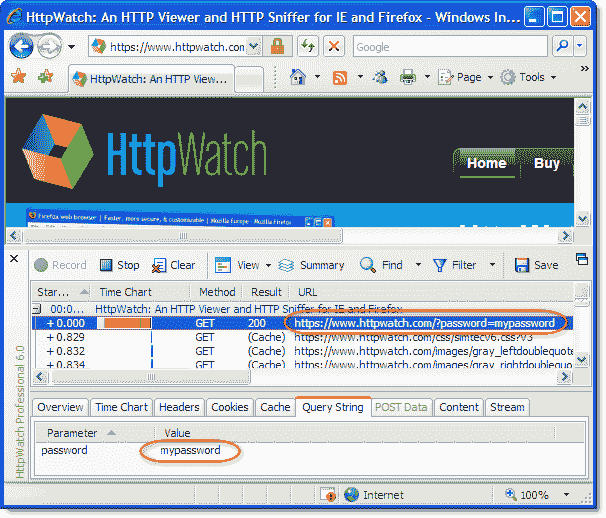
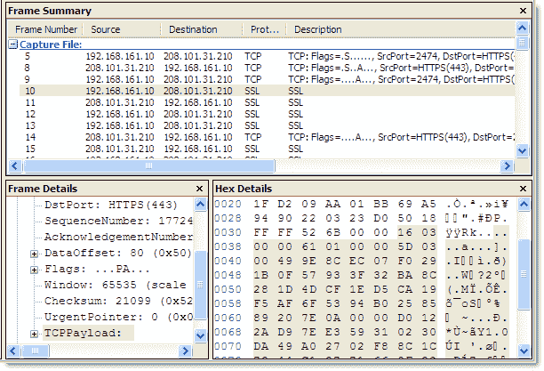
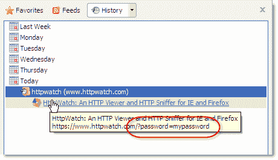
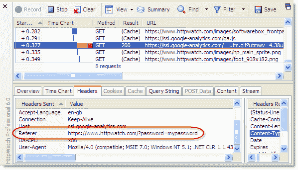
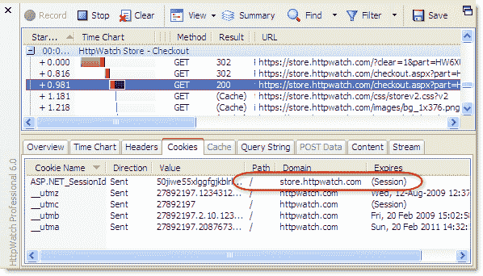

# HTTPS 上的查询字符串有多安全？| HttpWatch BlogHttpWatch 博客

> 原文：<https://blog.httpwatch.com/2009/02/20/how-secure-are-query-strings-over-https/?utm_source=wanqu.co&utm_campaign=Wanqu+Daily&utm_medium=website>

我们听到的一个常见问题是“可以在 URL 中安全地传递参数以保护网站吗？”当客户在 HttpWatch 中查看了一个 HTTPS 请求，并想知道还有谁可以查看该数据时，通常会出现这个问题。

例如，让我们假设使用以下安全 URL 在[查询字符串](http://en.wikipedia.org/wiki/Query_string "Query String")参数中传递密码:

`https://www.httpwatch.com/?password=mypassword`

HttpWatch 能够显示安全请求的内容，因为它与浏览器集成在一起，可以在数据被用于 HTTPS 请求的 [SSL](http://en.wikipedia.org/wiki/Transport_Layer_Security) 连接加密之前查看数据:

如果你查看网络嗅探器，比如[网络监视器](http://www.microsoft.com/DOWNLOADS/details.aspx?FamilyID=f4db40af-1e08-4a21-a26b-ec2f4dc4190d&displaylang=en "Microsoft Network Monitor")，在相同的请求下，你只会看到加密数据来回传输。数据包跟踪中没有可见的 URL、标头或内容:

只要满足以下条件，您就可以相信 HTTPS 请求是安全的:

*   未忽略任何 SSL 证书警告
*   web 服务器用来启动 SSL 连接的私钥在 web 服务器本身之外是不可用的。

因此，在网络级别，URL 参数是安全的，但基于 URL 的数据可能会以其他方式泄漏:

1.  **URLs are stored in web server logs** – typically the whole URL of each request is stored in a server log. This means that any sensitive data in the URL (e.g. a password) is being saved in clear text on the server. Here’s the entry that was stored in the httpwatch.com server log when a query string was used to send a password over HTTPS:

     `2009-02-20 10:18:27 W3SVC4326 WWW 208.101.31.210 GET /Default.htm password=mypassword 443 ...` 

    人们普遍认为[存储明文密码从来都不是一个好主意](http://www.codinghorror.com/blog/archives/000953.html)即使是在服务器上。

2.  **URLs are stored in the browser history** – browsers save URL parameters in their history even if the secure pages themselves are not cached. Here’s the IE history displaying the URL
    parameter:

    

    如果用户创建书签，查询字符串参数也将被存储。

3.  **URL 在 Referrer 头中传递**–如果安全页面使用资源，如 javascript、图像或分析服务，则 URL 在每个嵌入式请求的 Referrer 请求头中传递。有时，查询字符串参数可能被传送到第三方站点并由第三方站点存储。在 HttpWatch 中，您可以看到我们的密码查询字符串参数被发送到 Google Analytics:
    

### 结论

解决这个问题需要两步:

*   只有在绝对必要的情况下才传递敏感数据。一旦用户通过身份验证，最好用一个具有有限生存期的会话 ID 来标识他们。
*   使用非持久的会话级 cookies 来保存会话 id 和其他私有数据。

使用会话级 cookies 携带此信息的优势在于:

*   它们不存储在浏览器的历史记录或磁盘上
*   它们通常不存储在服务器日志中
*   它们不会被传递给图像或 javascript 库等嵌入式资源
*   它们仅适用于为其颁发证书的域和路径

下面是一个 ASP.NET 会话 cookie 的示例，它在我们的在线商店中用于识别用户身份:

请注意，cookie 仅限于域 store.httpwatch.com，并且在浏览器会话结束时过期(即，它没有存储到磁盘)。

当然，您可以在 HTTPS 中使用查询字符串参数，但是不要将它们用于任何可能带来安全问题的地方。例如，您可以安全地使用它们来识别零件号或显示类型，如“accountview”或“printpage”，但不要将它们用于密码、信用卡号或其他不应公开的信息。

您可以检查我们新的 SSL 测试工具的 SSL/TLS 配置

[SSLRobot](https://sslrobot.io)

。它还会查找您的站点使用的证书、密码和协议的潜在问题。

[Try it now for free!](https://sslrobot.io)