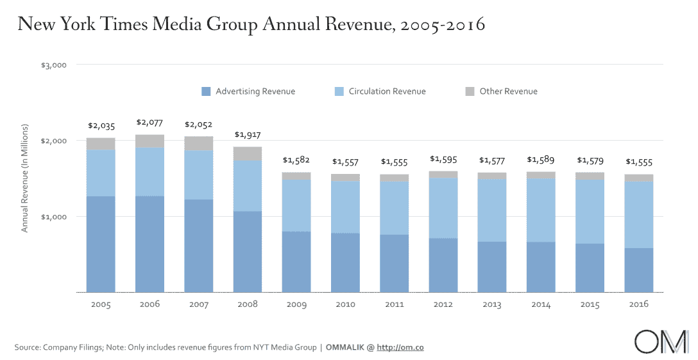
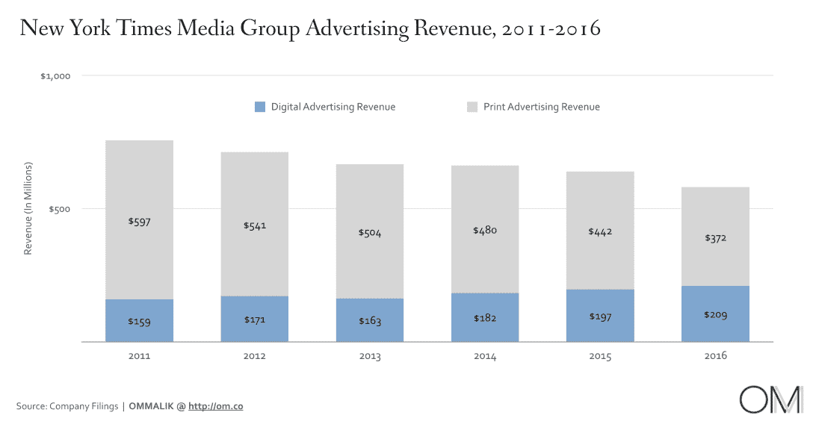
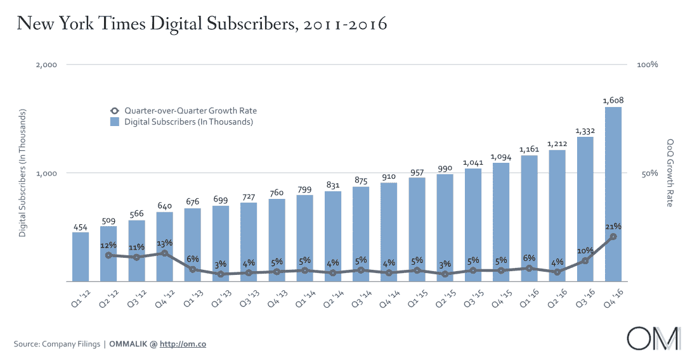

# 《纽约时报》到底做得怎么样？-在我的 Om 上

> 原文：<https://om.co/2017/02/20/how-is-the-new-york-times-really-doing/?utm_source=wanqu.co&utm_campaign=Wanqu+Daily&utm_medium=website>

《连线》杂志最近发表了《与时俱进》，这是一篇关于《纽约时报》及其缓慢而痛苦地向数字出版物转型的故事。加布里埃尔·斯奈德(Gabriel Snyder，顺便说一下，他是我最喜欢的作家之一)在他的深度特写中写道:“这是为了将时报的数字订阅转化为一个价值 10 亿美元的业务的主要引擎，即使印刷机永远停止，它也可以支付在 174 个国家派驻记者的费用，”这是值得一读的。

读完这篇文章后，我想让我们看看《纽约时报》到底是怎么做的——通过数字。在 Nima Wedlake 的帮助下，我得出了该公司取得进展的数据，以了解它距离转型为十亿美元的数字业务还有多远。看一看:

<noscript>T3】</noscript>

*   该公司报告 2016 年收入近 16 亿美元，与前几年显著一致。但在表面之下，随着其印刷广告业务的收入持续下降，收入构成正在发生巨大变化。

<noscript>T3】</noscript>

*   2016 年，平面广告收入同比下降 7000 万美元，至 3.72 亿美元。
*   数字广告收入虽然在《纽约时报》的收入中占了很大一部分，但其增长不足以抵消消失的平面广告收入。**2016 年数字广告总收入为 2.09 亿美元，仅比上年增长 6%**。

<noscript>T3】</noscript>

*   《纽约时报》的主要收入来源是其数字订阅业务，该业务在 2016 年增加了超过 50 万付费订户。
*   部分由于对总统大选的兴趣，该报在第四季度增加了 276，000 名新的数字订户，这是自 2011 年(付费模式推出的那一年)以来最大的单个季度增长。
*   该公司**希望到 2020 年数字总收入增长到 8 亿美元(2016 年接近 5 亿美元)**。
*   订阅业务的增长是时代焦点和文化向数字化转变的副产品。Beta Group 是该公司的内部数字团队，可以自由地尝试新的模式来接触并最终货币化其读者群。
*   10 月，该公司以 3000 万美元收购了广受欢迎的产品评论网站 Wirecutter。在第四季度，时报报道其“其他收入”类别(包括由 Wirecutter 产生的附属收入)增长超过 16%。

**最终想法**:

*   《纽约时报》的数字化成功取决于两大驱动因素:来自 Wirecutter 和数字订阅等服务的联盟收入。广告可能是一个很好的短期创可贴，但公司需要专注于如何更积极地摆脱它。
*   《纽约时报》需要简化他们的注册体验，让人们更容易支付订阅费用。截至目前，它就像你在一块玻璃上挠指甲时听到的声音。
*   此外，该公司应该为 Wirecutter 找到更多的垂直市场，从而增加利润丰厚的代销商收入流。
*   数字订阅业务的成功可能是一个更广泛趋势的副产品——消费者越来越愿意为数字内容付费。以下是付费用户总数的一些服务:网飞(9300 万)、Spotify(4000 万)、Apple Music(2000 万)、Hulu(1200 万)和 HBO NOW(200 万)。

*纽约时报大楼特辑照片，[维基百科](https://en.wikipedia.org/wiki/The_New_York_Times_Building)提供，T3。*