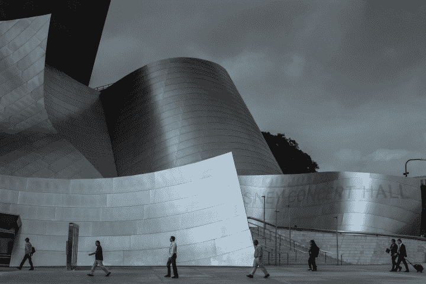

# 硅谷啦啦地-知乎

> 原文：<https://zhuanlan.zhihu.com/p/25519805?utm_source=wanqu.co&utm_campaign=Wanqu+Daily&utm_medium=website>

这个人参加了旧金山市中心的 UI 设计训练营。他拥有常春藤盟校的硕士学位。但作为一名中国留学生，他找不到一份全职建筑师的工作。他想在硅谷碰碰运气，嗯，做“一点点”pivot，成为一名 UI 设计师。

这个女孩是东湾一所公立学校的英语文学专业学生。她的所有同学都把计算机科学作为他们的辅修专业，他们正在海湾周围的软件公司寻找暑期实习机会。她不喜欢流行的观点，即编程是硅谷唯一真正的工作。她想成为一名出版作家。毕业后，她在奥克兰当地一家出版社做无薪实习生。

他们两个在一个周五的晚上在旧金山唐人街的一家四川餐馆相遇。挤满了人。

那家伙上完课去那里吃外卖。他突然意识到这是周五晚上，他的白人室友通常的接客之夜。他不想在一个尴尬的时间回去，目睹他再次对另一个女孩练习同样的技巧。所以他决定留下来。

侍者安排他坐在她的桌子上。她不介意。她甚至没有把目光从推特上移开。

他坐下来，把他的 Mac 放在窄桌上。一个奇怪的商标贴纸引起了她的注意。它来自一家炙手可热的新公司，镇上的每个记者都在追逐它。她问他是否在那里工作。他说没有。相反，他是从一个合作空间的每周招聘会上拿到的。

他们边吃晚饭边聊，甚至在去地铁站的路上聊得更多。他们在许多问题上有共鸣，比如在高成本的硅谷生存是多么的不可能，以及一个非程序员在这里找工作所经历的艰辛。当谈到建筑学校时，他停不下来，给她讲了加州案例研究屋的故事。

他们朝相反的方向乘火车。在火车上，他们查看了彼此的投资组合网站。他们在短信中开始了浪漫的关系。

她给了他一张 48 号码头最热门的年度创业项目的门票。每个人都为新的冒险而疯狂，他们也沉浸在高昂的情绪中。这家奇怪标志的初创公司赢得了顶级风投的投资。他们两个和创业团队一起参加了庆功宴。偷偷溜上屋顶，他们亲吻俯瞰海湾。

在接下来的几个月里，他们的爱情开花结果了。他们几乎形影不离。即使他们被困在 101 号公路上，他们也很开心，抓住每一个可以亲热的时刻。

他完成了 UI 设计训练营，并成功地在怪异标志的创业公司找到了一份工作。他在营销团队做设计师，年薪 79k。她在考虑去爱荷华州参加一个创意写作项目。但是她的父母，一对在弗里蒙特经营一家杂货店的广东夫妇，不希望她在远离玉米田的地方。她一直在努力写出有意义的作品，感觉自己的职业生涯陷入了低谷。

他们下一次约会时，在一家奶茶店里，他告诉她，“你不需要另一个学位来写作。你可以在这里找到一份朝九晚五的工作，然后在晚上写作。”但他真正的意图是和她在一起。

她正在浏览她的脸书，突然注意到她的时间线中弹出了一个定向广告。他抱怨的是他的设计，但还是做了。这是一个明亮的彩色平面用户界面横幅，上面有一个巨大的行动号召按钮。他与营销经理争论，因为他认为这显然是丑陋的，但经理坚持认为更大的按钮会带来更好的回报。

她痛苦地背对着他。“那么，你的建筑梦想呢？我不想只是为了生存而忘记自己是谁！”

他看见她头也不回地坐在优步上离开了。

…

两年后，她回到了加州大学，获得了文学硕士学位。她和父母住在一起，在母校找了一份教新生的讲师工作。她不时为初创公司撰写新闻稿，她能够认识许多高科技业内人士。

在科技新闻中，她读到了那个奇怪标志的公司正准备首次公开募股。她想了一会儿他，主要是想他可能真的很幸运，可以用他的股票很快在半岛买一套公寓。

她和一群创业者朋友去了洛杉矶市区的一个大型派对。他们在一位投资者的顶层公寓里享用了许多高级酒，并在洛杉矶过夜。

她醒来时看到大白天的城市。她周围都是高楼大厦，与她在海湾地区的屎坑相比，看起来超级现代。她坐在迪斯尼音乐厅的楼梯上，而她的朋友们正在参观弗兰克·盖里的宏伟作品。她想起以前他跟她开玩笑说的一句话:“所有现代建筑都在漏水，不管它们看起来多么雄伟。”

<noscript></noscript>

“反正洛杉矶也不会下雨，”她心想。然后，她立刻看到了他。

在她去了爱荷华后，他也离开了硅谷。他没有拿到 H1b 签证，只好辞职回国。他在北京的一家明星建筑公司工作，似乎广告创意工作从未影响他的生活。

建筑师是一个缓慢的工作，需要很多年来培养。然而，好的一面是，在中国，他有更多的机会，因为每天都有新的建筑在建造。在北京期间，他将自己公司的一位合伙人写的一部建筑杰作翻译成了中文。他和这位普利兹克建筑奖获得者一起在世界各大城市巡回售书。

他和她同时看到了对方。他们渴望地盯着对方的眼睛，但没有说一句话。她戴上墨镜，击退了 SoCal 热情的阳光，转身离去。他去查看他的停车计时器。慢慢走开，他回头，却发现了她的后脑勺。

他们再也没有见过面。