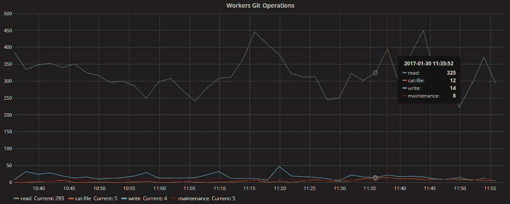

# 为什么我们不离开云计算| GitLab

> 原文：<https://about.gitlab.com/2017/03/02/why-we-are-not-leaving-the-cloud/?utm_source=wanqu.co&utm_campaign=Wanqu+Daily&utm_medium=website>

在 2016 年底，我们说我们将[离开云计算，转向裸机](/blog/2016/11/10/why-choose-bare-metal/)，并分享了我们的[硬件提案](https://news.ycombinator.com/item?id=13153031)。2016 年 12 月，在收到数百封充满建议和警告的评论和电子邮件后，[希德和团队决定](https://gitlab.com/gitlab-com/infrastructure/issues/727#note_20044060)让 GitLab.com 继续留在云中。帖子的其余部分总结了我们收到的一些很好的社区支持和反馈，并以我们如何致力于让 GitLab.com 在云中变得快速和稳定结束。我们的决定不仅仅是基于下面的内容，但是我们想给你一个公开分享的有趣事情的总结。

## 让我们从成本的话题开始

> 当我在 Koding 时，我们从 AWS 到裸机进行了类似的转移。费用惊人。大约每月 2 万美元，而在 AWS 中这要花费 20 万美元。我一直在说，一旦达到一定规模，AWS 就不再有意义。 *[Geraint - GitLab 博客:走向裸机](/blog/2016/11/10/why-choose-bare-metal/#comment-2999631471)*

> 我们在纽约市托管了 140 台服务器，已经有 10 年左右的时间了，而且托管数量还在不断增加，合同没有给我们提供在需要时添加机柜的灵活性。我们基本上不得不取消以前的合同，签订新合同，支付升级费用，支付机柜安装费用等。在某个时候，当我们在支付每月 14K 美元的托管费用方面遇到财务困难时，我们决定将所有服务器从纽约市转移到爱沙尼亚的塔林，在那里我们建立了自己的小型数据中心。因此，我们能够削减 10 倍的托管费用。 *[Dmitri - GitLab 博客:拟购买服务器](/blog/2016/12/11/proposed-server-purchase-for-gitlab-com/#comment-3049071074)*

不仅仅是拥有和更新硬件的成本，还有随之而来的其他一切——daenney

> 不仅仅是拥有和更新硬件的成本，还有随之而来的一切。设计您的网络，性能调整和调试一切。突然，您遇到了容量问题，现在您不太可能有备用的 100 台服务器，或者能够在 200 万台内启动它们，这是什么情况？自动缩放？ *[丹妮-黑客新闻:拟购买服务器](https://news.ycombinator.com/item?id=13153296)*

> 应用程序架构远比云和裸机更重要。与云实例相比，使用更多裸机硬件来解决问题更容易，也更具成本效益。对于一些人来说，这确实使裸机成为更好的选择。 *[mohctp -黑客新闻:拟购买服务器](https://news.ycombinator.com/item?id=13162964)*

> 转移到自己的硬件几乎肯定会提高性能，减少意外停机时间，并大幅削减成本。包括雇佣更多的工程师，你可能会预计总成本大约是前 24 个月在云服务上花费的 40-50%。如果您的硬件生命周期是 36-48 个月，那么超过 24 个月，您将会看到大量节省。 *[bobf - Hacker 新闻:拟购买服务器](https://news.ycombinator.com/item?id=13153413)*

> 我认为他们会低估 GitLab 的长期成本。当第一次停机后，他们需要付费让某人从他们的 DC 24/7/365 开车 30 分钟，当他们意识到他们需要多少备用硬件时，等等。 *[manacit - Hacker 新闻:拟购买服务器](https://news.ycombinator.com/item?id=13154057)*

## 性能呢？

> 云服务提供商对其客户的最大责任是安全性、耐用性、可用性和性能——按此顺序排列。你们大大低估了做好前三件事的复杂性。 *[mritun - Hacker 新闻:拟购买服务器](https://news.ycombinator.com/item?id=13155809)*

> 谷歌很少有团队在专用机器上运行。无论是基础设施的规模还是团队的规模，这些公司都是庞大的。我不是说一定要选择云提供商，我只是重申你最好确定你需要这样做。 *[boulos -黑客新闻:裸机](https://news.ycombinator.com/item?id=12941210)*

部署自己系统的公司不需要共享，他们可以根据自己的需求进行优化——taneq

> 然而，作为一个云提供商，你试图为一组客户提供共享资源。运行自己系统的公司不需要共享，他们可以根据自己的需求进行优化。 *[taneq - Hacker 新闻:去裸机](https://news.ycombinator.com/item?id=12940925)*

> 我的想法是，弹性和从硬件故障中恢复，以及迁移和多数据中心高可用性将成为关注点。从云到裸机的迁移为您带来了性能和简单性，但却没有为您提供从网络中断和硬件故障中恢复的多种方法。*[wpostma-git lab 博客:走向裸机](/blog/2016/11/10/why-choose-bare-metal/#comment-3001348957)*

> 听起来好像他们没有为云设计，现在正在经历后果。云具有与数据中心不同的权衡和性能特征。如果你有这样的打算，那很好。您的软件将因此变得健壮。如果你假设数据中心的特征，你可能会遇到问题。 *[wandernotlost -黑客新闻:去裸机](https://news.ycombinator.com/item?id=12940082)*

让 GitLab.com 成为一个“吃你自己的狗粮”的大环境是有意义的

> 让 GitLab.com 成为一个“吃你自己的狗粮”的大环境是有道理的。如果他们的内部运行的客户有性能问题，他们不能只是说:GitLab.com 使用完全不同的架构，所以你只能靠自己了。他们需要 GitLab.com 尽可能接近标准产品。 *[twaleson 上黑客新闻:去裸机](https://news.ycombinator.com/item?id=12940462)*

> 由于性能的原因，他们正在从云转移到裸机，同时使用一堆众所周知缓慢而浪费的软件。在做出这样的改变之前，我会优化我的堆栈。构建您自己的机架不会带来商业价值，而且这是一个非常容易出错的过程(曾经有过这样的经历)。 *[StreamBright -黑客新闻:拟购买服务器](https://news.ycombinator.com/item?id=13153866)*

## 关于我们储物方案的建议

> _ _ 不要检查储物件。__ 32 台文件服务器，容量为 96TB？与联网相同的问题。你的失败领域是什么？维护能运行这个东西的 fte 要花多少钱？* [Spooky23 -黑客新闻:拟购买服务器](https://news.ycombinator.com/item?id=13153860) - *Spooky23 确实警告过我们“我现在是个暴躁的老人了”。*

> 我认为当你转用这种硬件时，IOPS 可能会下降很多。您将看到这个 CephFS 群集中有大约 60 个 7200 RPM 驱动器。计算一下，如果您假设这些驱动器中的每一个都可以进行 100 次读取和 100 次写入 IOPS，并且您正在进行 3 倍的写入复制(加上日志写入)，那么您将无法接近您想要的数字。 *[尼古拉斯 GitLab 博客:提议购买服务器](/blog/2016/12/11/proposed-server-purchase-for-gitlab-com/#comment-3047537669)*

> 我认为 GitLab 的工作负载大部分是随机的，这对更大的驱动器来说是个问题。固态硬盘是一个很好的想法，但我只见过有 2 到 3 层时使用的 8TB 驱动器；8TB 驱动器位于底部。我不确定将单个 SSD 用作 24TBs 和 8TB 磁盘的缓存驱动器会有多有效。 *[lykron - Hacker 新闻:拟购买服务器](https://news.ycombinator.com/item?id=13153333)*

## 我们选择的 8TB 驱动器

> 如果您追求性能，请不要购买 8TB 驱动器。根据我的经验，5TB 以上的驱动器没有很好的响应时间。我没有确切的数字，但我用 5TB 和 2TB 磁盘构建了一个 10 磁盘 RAID6 阵列，2TB 磁盘的响应速度更快。 *[lykron - Hacker 新闻:拟购买服务器](https://news.ycombinator.com/item?id=13153196)*

> 只是一些简单的笔记。我有运行大约 300TB 可用 Ceph 存储的经验。远离 8TB 驱动器。你为什么用胖双胞胎？老实说，那能给你带来什么？您需要更多的磁盘轴，更少的内核和内存。根据您当前的配置，您每个机架单元能获得什么？ *[halbritt - Hacker 新闻:拟购买服务器](https://news.ycombinator.com/item?id=13153786)*

## 对我们网络提案的反馈

> _ _ 不要妨碍网络。__ 您是否有在 super micro SDN 上运行相同或相似工作负载的经验？你打电话的时候，你的超级微 VAR 的 CEO 会在凌晨 2 点接电话吗？* [Spooky23 -黑客新闻:提议购买服务器](https://news.ycombinator.com/item?id=13153860)T3】

> 我不会使用 10GBase-T，因为它是为桌面使用而设计的。我建议理想的是 25G SFP28 (AOC-MH25G-m2S2TM)但是 10G SFP+ (AOC-MTG-i4S)也可以。交换机的速度和类型需要与网卡匹配(您链接的 SFP+交换机与您建议的 10GBase-T 网卡不兼容)。 *[wmf -黑客新闻:拟购买服务器](https://news.ycombinator.com/item?id=13153678)*

> 我没有看到提到它，但是你对网络战略有什么计划。您是否计划运行双栈 IPv4/IPv6？仅 IPv4？内部 IPv6 只有 NAT64 才能公网的东西？希望 IPv6 出现在堆栈中的某个地方。看到大玩家还没用，很难过。 *[tomschlick - Hacker 新闻:拟购买服务器](https://news.ycombinator.com/item?id=13153922)*

> 不要陷入到处扩展 VLANs 的陷阱。你肯定应该在不同的路由器之间路由(而不是交换)。
> 
> "我们应该为 Ceph 流量建立一个单独的网络吗？"是的，如果您希望您的 Ceph 集群在重建期间保持可用。Ceph 将在任何类型的重建事件中跟踪内部网络。*[device null——黑客新闻:拟购买服务器](https://news.ycombinator.com/item?id=13153339)*

> 我领导的技术运营团队将我们的基础架构从公共云(约 400 个实例)迁移到私有云(约 55 台物理服务器)，最后迁移到 Kubernetes (6 台物理服务器)。我们实际上运行 Kubernetes 和 OpenStack 的混合，将应用程序和服务放在 Kubernetes 中，将所有数据存储放在 OpenStack 中。我已经用 Ceph 做了大量的测试，虽然它增加了灵活性，但是您将无法触及数据库使用的裸机本地磁盘的 I/O 性能。对于存储，我喜欢保持简单。我依赖运行在标准可靠的文件系统(ext4 和 ZFS)上的 Linux 操作系统，并在软件层建立冗余。 *[Chris - GitLab 博客:提议购买服务器](/blog/2016/12/11/proposed-server-purchase-for-gitlab-com/#comment-3047381500)*

> 我们在裸机上有过 Ceph 和 Gluster 的灾难性经历。我认为这比云本身更能说明分布式文件系统的不成熟(和困难)。***[coding horor-Hacker News:打算裸机](https://news.ycombinator.com/item?id=12940042)***

> 您需要确保您可以构建的架构不会免除您运行 CephFS 集群的责任。CephFS 很酷，但是它现在是一个单点故障，并且带有大量的警告。如果您删除它所创建的抽象层，并编写您的应用程序来处理某种分布式存储系统，性能和稳定性将会大大提高。 *[Nicholas - GitLab 博客:提议购买服务器](/blog/2016/12/11/proposed-server-purchase-for-gitlab-com/#comment-3047478761)*

对 Ceph 炒作要非常非常小心–第二部分

> 非常非常小心 Ceph 炒作。Ceph 擅长冗余和吞吐量，但不擅长 IOPS，而 Rados IOPS 很差。我们无法在包含 120 个固态硬盘的 120 OSD 集群中获得超过 60k 的随机读写 IOPS。 *[late2part - GitLab 博客:拟购买服务器](https://news.ycombinator.com/item?id=13154620)*

> 如果你正在使用 CephFS，而其他人都想使用其他云存储解决方案，这实际上会使你与用户脱节，并为拥有工具和经验的竞争对手提供空间来扩展云存储。 *[Rapzid -黑客新闻:裸机](https://news.ycombinator.com/item?id=12946174)*

> 你的核心竞争力是代码，而不是基础设施，所以在你的团队和组织中努力构建所有这些新的能力将会付出你无法预料的代价。查看云和钢铁的总拥有成本并不像比较托管成本、硬件和设施那么简单。 *[ninjakeyboard -黑客新闻:拟购买服务器](https://news.ycombinator.com/item?id=13153779)*

你的核心竞争力是代码，而不是基础设施

> 我想说的另一个转向金属的问题是你会失去支持。云供应商拥有完整的团队、网络、系统、数据中心等。由你支配，这包括在你支付的价格中。您确定您已经准备好调试网络问题、云供应商级别的系统问题了吗？这是一项艰巨的工作。 *[l1x - GitLab 博客:拟购买服务器](/blog/2016/12/11/proposed-server-purchase-for-gitlab-com/#comment-3047353138)*

> 我认为你低估了运行自己的基础设施所需的人数。您需要能够配置网络设备的人员、在数据中心更换故障网卡/驱动器的人员、管理供应商关系的人员以及进行容量规划的人员。 *[黑客新闻:提议购买服务器](https://news.ycombinator.com/item?id=13153644)*

## 让我们完全放弃 x86 吧

为什么要将自己与英特尔服务器捆绑在一起？MBH

> 为什么要将自己与英特尔服务器捆绑在一起？CPU 到内存的最大带宽是 68 GB/s。这对于快速处理数据来说太可怕了。IBM 的 POWER8 系统有 230 GB/s CPU-内存带宽的服务器，其他的有 320 GB/s 的服务器…
> 
> …power 8 CPU 的架构与英特尔不同:PPC64，因此您可能需要重新编译一些东西，或者使用一些英特尔系统来处理只能在 x86_64 上运行的工作负载。 *[MBH - GitLab 博客:拟购买服务器](/blog/2016/12/11/proposed-server-purchase-for-gitlab-com/#comment-3053432409)*

## 我们都有自己的看法

> 我只构建过桌面机器，这个顶部的评论与大多数帮助我构建桌面类型的帖子惊人地相似。当然，我敢肯定，随着你的深入挖掘，原因可能会有很大不同，但我自己对一个合适的服务器构建一无所知，这在某种程度上是令人放心的看到电源和冷却在顶部！ *[大卫布伦特-黑客新闻:拟购买服务器](https://news.ycombinator.com/item?id=13154202)*

## 我们后退一步，使用一个无聊的解决方案

我们希望智能扩展，构建优秀的软件；我们不想成为一家基础设施公司。我们欣然接受并对解决在云上扩展 GitLab.com 的挑战感到兴奋，因为为我们解决这个问题也为世界上使用 GitLab 的最大企业解决了这个问题。

大多数令人头疼的伸缩问题都是因为 Git 的读取量很大:查看下面的 Git 读/写性能图表，您可以看到，大约每 300 次读取，我们就有 10 次写入。我们试图通过在云中运行 CephFS 来解决这个问题，但这违背了我们使用最简单、最无聊的解决方案来解决问题的价值观。

## 我们怎样才能回到基础呢？

1.  我们将所有存储分散到[多个 NFS 碎片](https://gitlab.com/gitlab-com/infrastructure/issues/711)中，[从堆栈中删除了 CephFS](https://gitlab.com/gitlab-com/infrastructure/issues/817) 。
2.  我们创建了 [Gitaly](https://gitlab.com/gitlab-org/gitaly) ,这样我们就可以停止依赖 NFS 进行水平扩展，并通过缓存加快 Git 访问。

Gitaly 将作为整个堆栈中所有 Git 访问的单一接口。使用 Gitaly，gitrpc 通过网络传输，并且可以在本地访问磁盘。而不是通过网络进行所有的磁盘访问。它还将用于改善我们对 Git 资源使用的监控，以做出更好的决策；目前，我们只是抽样过程。

我们希望社区能以他们之前挑战我们的热情来挑战我们对 Gitaly 的使用。你认为软件架构怎么样？像这样的缓存层可以扩展吗？什么警钟被敲响？我们迫不及待地想听到您的反馈！

我们要感谢我们的社区、客户、团队和董事会的大力支持——你们让 GitLab 成为了一款不可思议的产品。

