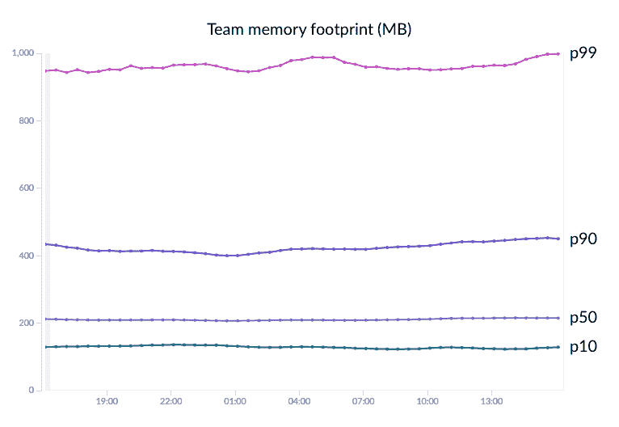
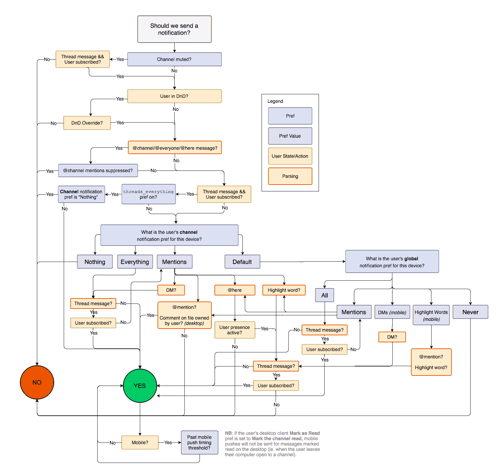
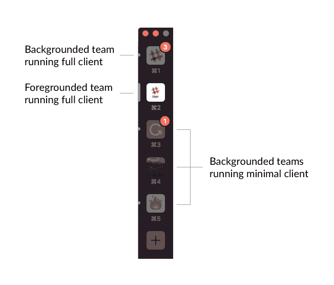
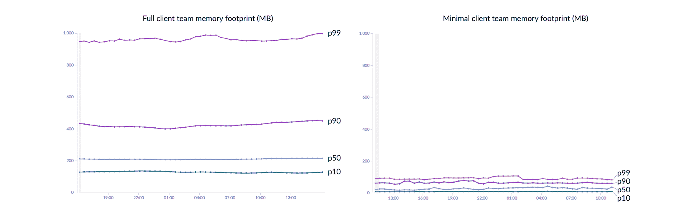

# 减少 Slack 的内存占用——Slack 工程

> 原文：<https://slack.engineering/reducing-slacks-memory-footprint-4480fec7e8eb?utm_source=wanqu.co&utm_campaign=Wanqu+Daily&utm_medium=website>

我们的桌面应用程序是我们提供的使用最广泛、功能最强大的 Slack 客户端。对于我们的许多客户来说，这是他们在工作日一直在电脑上打开的少数几个应用程序之一。它允许他们与他们所属的所有团队进行交流和工作:阅读和编写消息、撰写帖子、上传文件、接听电话和回复通知。

然而，这些能力是有代价的:桌面客户端会使用大量内存。随着用户加入更多的团队，这种内存占用会增加，因为每个团队都在自己的 webview 中运行。更多的内存使用意味着更差的性能，降低我们的客户的 Slack 和他们的其他应用程序的体验。

修复影响客户端内存消耗的潜在因素的工作正在进行中，但同时**我们已经构建了一个新的小型 Slack 客户端来帮助解决这个问题**。它会在你有一段时间没有看的队伍的地方被无声的载入。这个后台客户端只做几件事:

*   更新团队侧边栏中的未读指示器和通知标记
*   显示桌面通知*(可以正常点击回复)*
*   消耗尽可能少的内存

为了实现这一点，我们必须让我们的服务器变得更智能，并设计一个瘦客户机，它能做足够的工作来保证您的工作正常进行。

## 问题是

在撰写本文时，大约 36%的活跃 Slack 用户在桌面应用程序中注册了不止一个团队。17%签约 3 个或以上团队，5%签约 5 个或以上团队。每个团队都运行完整的 JavaScript web 应用程序，并随着团队状态的变化维护和更新 DOM 树。根据团队活动和用户界面状态，该应用程序可能会消耗大约 130MB (p10)到大约 960MB (p99)的内存。

Distribution of memory usage at p10, p50, p90, and p99 for a single team. Collected using a 10% sample of all teams.

我们的数据告诉我们，大多数加入多个团队的人在工作日都会积极关注 1 到 2 个团队，而他们查看其他团队的频率较低。不管使用情况如何，这些组中的每一个都会耗尽全部的内存配额。

## **一个小客户**

这让我们思考:我们可以构建的最轻的客户端是什么，它可以在后台做你需要它做的一切:保持你的存在，显示通知，并保持你的未读和徽章最新？

我们探讨了几种选择，包括:

1.  卸载后台团队的 DOM
2.  将客户端从我们只关心模型和通知逻辑的 JavaScript 子集打包出来
3.  为此专门构建一个精简的客户端

我们的研究表明，前两个选项要么没有达到我们的目标，对内存使用产生影响，要么不可接受地增加了我们的主客户端实现的复杂性。所以我们决定采用第三种方法，构建一个瘦客户机，它维护最小状态，只显示服务器传输的数据。

这个项目从背景视图中回收资源的方面并不新颖。Chrome 采取了类似的方法来丢弃标签，以便从后台标签中回收内存，几个流行的浏览器扩展类似地暂停最近没有查看过的占用内存的标签。

## 重绘地图

为了让我们的新客户机像我们需要的那样轻薄，我们必须教会服务器做许多以前由客户机负责的工作。

例如，服务器现在需要知道:

*   如何计算用户的通知计数
*   哪些消息符合桌面通知的条件*(以及如何格式化这些通知以供桌面客户端使用)*
*   用户是否在其所有渠道和直接消息中有任何未阅读

并且它需要在充分意识到各种团队和用户偏好和状态对上述内容的影响的情况下完成所有这些工作。Slack 以其精细而强大的通知偏好而闻名——这对客户来说很好，但这意味着我们需要将大量客户端逻辑迁移到服务器:

Workflow diagram encompassing all the considerations that go into whether to notify a user about a message.

我们开发了两个基础设施来满足这些新需求。

1.  一个 API 端点，它返回用户**是否有未读的**和他们的**提及计数**。它将这些数据存储在 memcache 中，以便快速检索。微型客户端轮询这个端点，以保持团队侧栏对于后台团队是最新的。
2.  服务器端消息处理代码中的新逻辑将导致通知的消息转换成新的 **desktop_notification** 消息类型，然后通过 websocket 分发。目前，只有小型客户端关注这种类型的消息。如果用户启用了通知，客户端将使用此消息的有效负载来弹出桌面通知。

The team sidebar in the desktop app displays an unread indicator and a notification badge.

微型客户端可以利用这些工具来精确地完成它在后台运行时需要做的事情:用您的未读和徽章计数来更新您的团队侧栏，并像完整客户端一样显示通知。客户端本身是一个大约 1200 行未统一代码的 JavaScript 文件。它保持*刚好足够的*模型和状态数据，以便达到它的目的，并且当团队前景化时，用完整的 web 应用程序代替。

客户机之间的交换由桌面应用程序管理，该应用程序监视组的使用情况和自上次检查组以来所经过的时间。我们会衡量你最常使用的团队，以及你最近检查过的团队，在一段时间的不活跃之后，放弃那些不太可能被重视的团队。

## 结果

最小客户机极大地减少了在 Slack 桌面应用程序中运行团队所需的内存，如下所示。这有助于减少应用程序的整体占用空间，并将资源释放回操作系统，以提高您正在积极使用的团队的性能。

Comparison of memory usage at p10, p50, p90, and p99 for a single team running the full client (left) and minimal client (right). Collected using a 10% sample of all teams.

## 下一步是什么？

我们正在积极致力于一些项目，以减少完整客户端的内存占用。这些飞行中的努力包括:

*   **重构 JavaScript 代码库**以更清晰地分离关注点，并使每一层更高效。
*   **迁移到所有团队数据的不完整模型**(按需获取，而不是预先获取)。用户和机器人已经是这种情况了。
*   **切换到订阅模式**用于高容量事件(例如:用户状态变化)。
*   **采用反应式 UI 组件**减少 DOM 中的变动。表情符号选择器已经是这种情况了。
*   探索在共享环境中运行**所有团队**以消除每个团队一个 webview 的开销。

与此同时，我们希望我们小小的新客户端能减轻客户电脑的负担，改善他们的 Slack 体验。

想要帮助 Slack 解决棘手的问题并加入我们不断成长的团队吗？查看我们所有的工程职位，并立即申请。[立即申请](https://slack.com/jobs/dept/engineering)