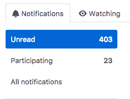

# 做一个开源维护者是什么感觉

> 原文：<https://nolanlawson.com/2017/03/05/what-it-feels-like-to-be-an-open-source-maintainer/?utm_source=wanqu.co&utm_campaign=Wanqu+Daily&utm_medium=website>

你的门外站着几百人的队伍。他们耐心地等待你回答他们的问题、抱怨、拉动请求和功能请求。

你想帮助他们所有人，但现在你在拖延。也许你工作了一天，或者你累了，或者你只是想和家人朋友享受一个周末。

但是如果你去 github.com/notifications，那里会不断提醒你有多少人在等待:

当你设法找到一些空闲时间，你向第一个人敞开大门。他们是善意的；他们试图使用你的项目，但是在 API 上遇到了一些困惑。他们将代码粘贴到 GitHub 注释中，但是他们忘记或者不知道如何格式化它，所以他们的代码是一大堆不可读的东西。

有益的是，您可以编辑他们的注释来添加代码块，这样它的格式就很好了。但还是有很多代码要读。

还有，他们对问题的描述有点难以理解。也许这个人不是把英语作为第一语言，或者他们有残疾，这使得他们很难通过书面交流。你不确定。无论哪种方式，你都很难理解他们发布的文字段落。

疲倦地，你看了一眼在他们后面排队等候的数百人。你*可以*花半个小时试图理解这个人的代码，或者你可以浏览一下，提供一些教程和文档的链接，希望这能帮助解决他们的问题。您还愉快地建议他们尝试堆栈溢出或松弛通道。

下一个排队的人皱着眉头。他们抱怨你的项目浪费了他们 2 个小时的时间，因为某个 API 没有像宣传的那样工作。他们的尖酸刻薄让你有一种不好的感觉。

你不会在这个人身上浪费太多时间。你只需说，“这是一个开源项目，由志愿者维护。如果代码中有 bug，请提交一个可重复的测试用例或 PR，”

下一个人遇到了一个非常常见的错误，有一个简单的解决方法。您知道您已经见过这个错误几次了，但是不太记得解决方案是在哪里发布的。堆栈溢出？维基？邮件列表？在谷歌搜索了几分钟后，你粘贴了一个链接并关闭了这个问题。

下一个人是定期投稿人。您从各种社区论坛和兄弟项目中认出了他们的名字。他们遇到了一个非常深奥的问题，并提出了一个拉请求来解决它。不幸的是，这个问题很复杂，所以他们的公关包含了许多解释这个问题的段落。

你的目光再次投向仍在排队的数百人。你知道这个人在他们的解决方案中投入了大量的工作，这可能是一个合理的解决方案。Travis 测试通过了，所以您很想说“ <abbr title="Looks Good To Me">LGTM</abbr> ”并合并拉请求。

然而，你以前也曾被它烧伤过。过去，你在没有充分评估的情况下合并了一份公关，最终因为你没有预见到的问题导致了新的麻烦。也许测试通过了，但是性能下降了十倍。也可能是它引入了内存泄漏。或者也许 PR 使项目对新用户来说太混乱了，因为它过度地复杂化了 API 表面。

如果你现在合并这个公关，明天你可能会遇到更多的问题，因为你解决了一个人的问题，打破了其他人的工作流程。所以你把它放在一边。当你有更多时间的时候，你会得到它。

下一个人发现了一个新的 bug，但是你知道它实际上是一个兄弟项目中的 bug。他们说这阻碍了他们发布应用程序。你知道这是一个大问题，但这是众多问题中的一个，所以你现在没有时间去解决它。

你回应说，这看起来像是一个真正的问题，但在另一个回购中打开更合适。因此，您关闭他们的问题并将其复制到另一个回购中，然后添加一条注释，建议他们可以在代码中的何处开始修复它。不过，你怀疑他们真的会这么做。很少有人知道。

下一个人只是说“这是什么状态？”你不确定他们在说什么，所以你看上下文。他们评论了一个冗长的 GitHub 线程，内容是关于项目中一个长期存在的 bug。许多人对这个问题的正确解决方法意见不一，因此引发了许多讨论。

关于这个特别的问题有 20 多条评论，你要花很长时间通读它们才能唤起你的记忆。所以你只需回答，“对不起，这个问题已经公开了一段时间，但还没有人解决它。我们仍在试图了解这个问题的范围；拉取请求可能是一个良好的开端！”

下一个人只是一个绿色守护者机器人。这些很容易。除了这个特殊的回购有相当古怪的测试，测试失败的原因看起来像是虚假的，所以你必须重新启动它们才能通过。您重新开始测试，并试图提醒自己在 Travis 有机会参加竞选后再研究它。

下一个人已经打开了一个拉请求，但是它是在一个相当活跃的回购上，所以另一个维护者已经在提供反馈了。你透过线瞥了一眼；您信任另一个维护者来处理这个问题。所以你把它标记为已读，然后继续前进。

下一个人遇到了一个看起来像是 bug 的东西，而且这个 bug 你以前从未见过。但不幸的是，他们没有提供问题实际发生的细节。是什么浏览器？什么版本的 Node？项目的哪个版本？他们用什么代码复制的？你要求他们澄清并关闭标签。

### 源源不断的水流

过了一段时间，你就这样经历了十几二十个人。还有一百多个在排队。但是现在你已经感到筋疲力尽了；每个人都有抱怨、问题或改进的要求。

从某种意义上说，这些 GitHub 通知是对你的项目的持续的负面评价。当他们对你的工作感到满意时，没有人会提出问题或拉动请求。他们只有在发现缺少什么的时候才会这么做。即使你只花一点点时间通读这些通知，也可能会在精神上和情感上令人疲惫不堪。

你的伴侣观察到你在经历了这个仪式后总是脾气暴躁。也许你发现自己无缘无故地对她发脾气，只是因为你心情不好。“如果做开源让你这么生气，你为什么还要做？”她问道。你没有一个好的答案。

你可以休息一下。事实上，你现在可能已经赢得了。在过去，你甚至会从 GitHub 休假一两周，仅仅是为了你自己的精神健康。但是你知道，这正是你在这种情况下的结局，数百人耐心地等待着。

如果你一直保持在 GitHub 通知的顶端，你可能每天会有 20-30 个更容易处理的通知。相反，你让它们堆积起来，所以现在有数百个。你感到内疚。

在过去，由于这样或那样的原因，你真的让问题堆积起来。你可能会看到一个几个月都没有答案的问题。通常，当你回去解决这样的问题时，打开它的人永远不会回应。或者他们回答说，“我通过放弃你的项目并使用另一个项目来解决我的问题。”这让你感觉很糟糕，但你理解他们的沮丧。

你已经从经验中了解到，对于这些陈旧的问题，最务实的回应通常只是说，“我正在结束旧的问题。如果这仍然是你的一个问题，或者如果你能提供更多细节，请重新打开。”通常没有回应。有时会有，但这只是一个愤怒的评论，关于他们如何被逼等了这么久。

所以现在你要更加努力地掌握你的通知。数百人排队太多了。你渴望这一行减少到 100 个，或者 12 个，甚至是虚构的零收件箱。所以你坚持下去。

### 吸引新的贡献者

在对足够多这样的问题进行分类之后，即使你最终到达了收件箱零，你可能仍然会有大量的未解决的 bug 和请求。标记会有所帮助——例如，您可以将问题标记为“需要重现”或“有测试用例”或“良好的第一个补丁”“好的第一补丁”尤其有用，因为它们经常吸引新的贡献者。

然而，您已经注意到，吸引新贡献者的问题通常是非常简单的问题，在这些问题中，记录问题并解释如何解决问题的努力比自己解决问题的努力更重要。你制造了一些这样的问题，因为你知道让新人参与开源是一个有价值的目标，当拉请求的作者告诉你，“这是我对开源项目的第一个贡献”时，你感觉很好

但是你知道他们不太可能会回来。通常这些人不会成为定期的贡献者或维护者。您想知道自己是否做错了什么，是否有更多的事情可以让新的维护人员加入进来，帮助减轻您的负担。

你的一个项目几乎是自给自足的。你已经很多年没碰过了，但是有一群维护人员会回复每一个问题和公关，所以你不用碰。你非常感激这些维护者。但是你不知道你做了什么让这么多的人参与到这个项目中来，而其他的项目最终都是你的责任，你一个人的责任。

### 展望未来

你不愿意创建新项目，因为你知道这只会增加你的维护负担。事实上，有一个反常的效果，你越成功，你就越受到 GitHub 通知的“惩罚”。

你仍然可以回忆起创作的激动，从头开始写一个新项目和解决一个以前没有解决的问题的喜悦。但是现在你要权衡这种喜悦和任何新项目都必然会从旧项目中窃取时间的认识。你想知道是时候正式废弃你的旧回购了，还是将它标记为未维护。

你想知道在你精疲力尽之前这种情况还能持续多久。你已经考虑过把开源作为你的日常工作，但是从和那些真正以开源为生的人的交谈中，你知道这通常意味着允许你把从事一个特定的开源项目作为你的日常工作。这对你没多大帮助，因为你有[几十个项目](https://www.npmjs.com/~nolanlawson)跨越不同的领域，它们都在占用你的时间。

你最想要的是有更多能自我维持的项目。你试着遵循所有的[最佳实践](https://medium.freecodecamp.com/how-to-attract-new-contributors-to-your-open-source-project-46f8b791d787):你有`CONTRIBUTING.md`和行为准则，你热情地给任何提交高质量 PR 的人发放所有者特权。然而，对每个项目都这样做是很累人的，所以你并不像你希望的那样勤奋。

你对此也感到内疚，因为你知道开源经常被视为特权白人男性的专属俱乐部，就像你一样。所以你担心你没有尽力帮助解决这个问题。

最重要的是，你会感到内疚:知道你本可以帮助别人解决他们的问题，但你却让他们的问题在结束前腐烂了几个月。或者知道有人在你的回购上打开了他们的第一个拉请求*，但是你没有时间回应它，正因为如此，你可能会永远阻止他们开源。你对你所做的工作感到内疚，对你没有做的工作感到内疚，对你没有招募更多的人来分享你不愉快的充满内疚的经历感到内疚。*

 *### 把所有的放在一起

我上面所说的一切都是基于我自己的经历。我不能代表所有做开源软件的人说话，但这就是我的感觉。

我做开源已经有很长一段时间了(大约七年)，我一直不愿意抱怨这些，因为我担心这可能会被认为是某个应该更了解的人的矫情抱怨。说到底，这种局面不就是我一手造成的吗？我可以随时离开 GitHub 我对任何人都没有义务。

还有，我不应该感恩吗？我在开源方面的工作帮助我在社区中树立了自己的地位。我收到在会议上发言的邀请。我有成千上万的推特粉丝，他们倾听我要说的话，并高度尊重我的观点。可以说，我在微软得到这份工作是因为我在开源方面的经验。我有什么资格抱怨呢？

然而，我知道很多和我处境相似的人已经筋疲力尽了。在消失得无影无踪之前，人们热情地合并拉取请求，修复问题，写关于他们项目的博客文章。对于其中一些人，我甚至懒得在他们的回复上打开问题，因为我知道他们不会回应。我不反对他们，但是我担心我会和他们一样的命运。

我已经采取了很多自我保健措施。我不再使用 GitHub 通知界面——我使用电子邮件过滤器，这样我就可以根据项目(未维护的会被忽略)或通知类型(我评论过的提及和主题通常值得更高的优先级)对我的通知进行分类。因为是电子邮件，这也有助于我离线工作，在一个地方管理一切。

我经常会突然收到电子邮件，请求支持一个我已经很久没有维护的项目(例如，我每个月至少会收到一封关于这个项目的邮件)，通常我甚至不会回复这些邮件。我也倾向于忽略我的博客帖子上的评论，对堆栈溢出答案的回应，以及邮件列表问题。我积极地不看回购，因为我觉得其他人已经做了足够好的维护工作。

这种情况如此令人沮丧的一个原因是，我越来越多地发现问题分类占用了项目的实际维护时间。换句话说，我通常只有足够的时间通读一期杂志，然后说，“抱歉，我现在没时间看。”仅仅是响应的行为就占据了我为开源留出的大部分时间。

[发布模板](https://github.com/blog/2111-issue-and-pull-request-templates)、[绿林人](https://greenkeeper.io/)、[特拉维斯](https://travis-ci.org/)、[特拉维斯 _ 重试](https://docs.travis-ci.com/user/common-build-problems/#travis_retry)、[连体工作服](http://coveralls.io/)、[酱实验室](http://saucelabs.com/)……开源维护的问题有这么多的技术解决方案，感谢所有人。如果没有这些自动化工具，我就无法保持头脑清醒。但是在某些时候，你会遇到更多的社会问题而不是技术问题。一个人是无法衡量的。我甚至不在[前 100 名 npm 维护者之列](https://gist.github.com/bcoe/dcc961b869bbf6685002)，但我已经感受到了压力；我无法想象那一百个人的感受。

我已经告诉我的合作伙伴，如果我们决定要孩子，我可能会永远退出开源。我只是不知道我怎样才能既有时间养家，又有时间做开源。我预计这将最终解决我的问题:核选择。我只希望它以积极的形式出现，就像开始我生活的新篇章，而不是消极的形式，就像毫不客气地筋疲力尽。

### 结束语

如果你已经读到这里，并且对困扰开源社区的问题和潜在的解决方案感兴趣，你可能想看看[纳迪亚·艾格巴尔](https://twitter.com/nayafia)的[《道路和桥梁】](http://www.fordfoundation.org/library/reports-and-studies/roads-and-bridges-the-unseen-labor-behind-our-digital-infrastructure)。这可能是对问题最清晰、最透彻的分析。

我也乐于接受建议，尽管请记住，我非常不愿意在我的开源项目中混合金钱和劳动(可能出于愚蠢的理想主义原因)。但是我看到它在其他项目中运行良好。

请注意，尽管上面表达了所有的负面意见，我仍然觉得开源是我生活中有价值的一部分，我并不后悔。但我希望这是一个有用的窗口，让你了解成为自己成功的受害者的感觉，以及被所有未完成的工作压垮的感觉。

如果说我从开源中学到了什么，那就是:你做的工作越多，要求你做的工作就越多。据我所知，这个问题没有解决办法。

*请在推特上随意评论[，并阅读](https://twitter.com/nolanlawson/status/838496056002260992)[迈克·罗杰斯](https://medium.com/@mikeal/time-to-leave-a68294ccb2af)和[简·莱纳特](http://writing.jan.io/2017/03/06/sustainable-open-source-the-maintainers-perspective-or-how-i-learned-to-stop-caring-and-love-open-source.html)的回复。**