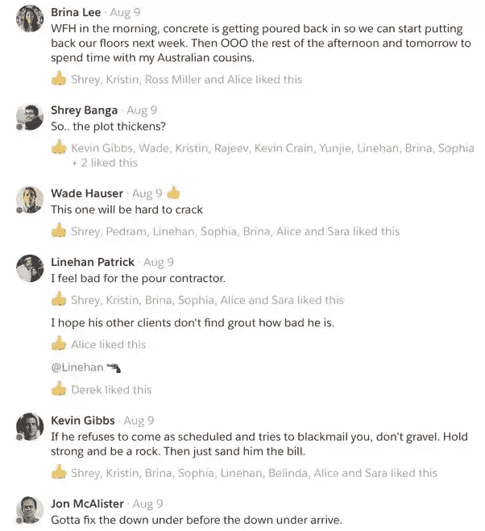

# Quip -深入了解 Quip 工程团队

> 原文：<https://quip.com/blog/engineering-at-quip?utm_source=wanqu.co&utm_campaign=Wanqu+Daily&utm_medium=website>

## 深入了解 Quip 工程团队

作者 Shrey Banga

*编者按:这是最初发布在 Quora 上的，作为对问题“[在 Quip 做软件工程师是什么感觉？](https://www.quora.com/What%E2%80%99s-it-like-to-work-at-Quip-as-a-Software-Engineer)”下面是这个问题的答案，作者是 Quip 工程师 [Shrey Banga](https://www.quora.com/profile/Shrey-Banga) 。*

Quip 是一家独特的公司。我在 2016 年 1 月开始工作后几乎立刻就感觉到了这一点，但我花了一段时间才说出原因。所以现在开始:

## 企业文化

Quip 由 Bret Taylor 和 Kevin Gibbs 创建，他们从在谷歌、脸书和 Friendfeed 等公司的经历中汲取了许多智慧。因此，在许多方面，Quip 的运作都像一家成熟的科技公司——大多数人每天工作约 8 小时，我们的随叫随到工作异常平静，我们的大多数工具对于一家初创公司来说都相当复杂。然而，他们也做出了一些不符合典型大型科技公司模式的选择——代码审查不是强制性的，工程师很少开会，组织结构更加扁平。有了这些选择，Quip 感觉比典型的创业公司更成熟，但没有完全牺牲小团队的敏捷性。

## 工程

如[中所述，Quip 采用了哪些技术？](https://www.quora.com/What-technologies-were-used-to-build-Quip)，Quip 的服务器用 Python 写，客户端用 JavaScript，Objective-C，Java，C++写。我们广泛使用协议缓冲区在这些之间进行通信。我们自己编写了很多核心抽象，以避免被无法修复的开源库所束缚，但我们确实使用了成熟的开源框架，如 React。

建造 Quip 的大部分工作都是在 Quip 上完成的。我们维护着按主题分组的需要工程或设计工作的优先任务列表。我们有部分产品、基础设施和新项目的任务列表(例如最近重新设计的“Jetson 任务列表”)。然后，工程师在文档的对话面板或评论中声明任务并讨论产品或技术权衡，供其他人查看和学习。我们使用 Quip chat 进行其他交流，如发布公告、寻求帮助、记录生产变更和开始双关语线程。通过这种方式，我们可以不断地尝试我们自己的产品，这有助于我们在一个改变进入世界之前收集大量的反馈。

## 工具制造

我在 Quip 的工程师中注意到的一个独特技能是构建节省时间的工具的习惯。多年来，我们已经拥有了许多高度复杂的工具，例如:

*   **xray:** 这是一款从我们基础设施中的各种服务收集流日志的工具。这在调试依赖于大量服务的请求过程中可能出现的问题时非常有用。我们在代码库中添加了记录到 xray 的日志语句。然后，该工具可以连接到生产环境中的所有主机，并提取按服务类型、路径正则表达式、服务器正则表达式等过滤的部分日志。

*   模型浏览器:我们的 JS 客户端存储模型对象，并使用它们在 web 和桌面应用程序上呈现 UI。模型浏览器智能地呈现支持这些模型对象的协议缓冲区，这在调试客户端问题时非常有用。

*   **诊断报告**:当 Quip 中出现客户端异常时，我们会向我们的服务器发回一份“诊断报告”,其中标记了许多有用的信息，如当前文档状态、异常的堆栈跟踪以及客户端正在使用的 JS 的散列(这样我们就可以解开堆栈跟踪)。这对于追踪和修复只在非常特殊的情况下才会出现的异常错误非常有用。

*   **错误聚类:**当报告了诊断报告或服务器端错误时，我们根据一些元数据对其进行聚类。然后当一个新的集群被创建时，我们知道我们可能在系统中引入了一个新的 bug。这些通常会在日常发布过程中被注意到并修复。

*   **编校系统:**有时我们需要查看文档、消息等的内容。调试问题。虽然我们总是在这样做之前征求用户的许可，但我们仍然希望将暴露给我们的内容数量减到最少。因此，我们构建了一个库，用 unicode squares 替换用户生成的内容，使我们可以在看不到内容的情况下看到文档结构。

除了构建工具之外，工程师经常迭代现有的工具，以确保它们在我们的需求变化时仍然相关和有用。这通常只是一个小问题，但是防止工具失修对依赖这些工具的开发人员的生产力有很大的影响。

作为构建新工具频率的一个例子， [Mihai](https://www.quora.com/profile/Mihai-Parparita) 构建了一个系统，通过编写“修复程序”并在某些诊断报告被触发时触发它们在文档上运行，来自动修复最终处于不良状态的文档。这是对一个问题的回应，在删除支持旧表的代码之前，我没有将所有旧的 Quip 表完全迁移到电子表格中。这个工具为我们节省了大量处理旧文档的精力，而且它对于修复由于其他原因而处于不良状态的文档也很有用。

## 频繁重构

Quip 的代码库经常被重构，以确保我们使用最好的工具，避免代码腐烂。例如:

*   Python 3:我们最近将代码库迁移到了 Python 3，这让我们可以用 async/await 替换我们自己开发的协同例程库。这不仅提高了我们的生产服务器的性能，而且通过转移到标准工具，新工程师更容易在我们的代码库中提高工作效率。

*   当我第一次开始工作时，获得一个本地的 Quip 实例需要一步一步地完成一个巨大的脚本，这个脚本会随着人们开发环境的改变而频繁中断。对于不熟悉环境的新员工来说，这是一次令人沮丧的经历。这与我们的生产环境也有微妙的不同，这意味着一些 bug 只能在生产中重现。所以我们最近迁移到使用 Docker 进行本地开发，这使得开发和调试变得更加简单。

*   **React:** 我们在 2015 年迁移到 React，并提供了一个定制的客户端对象模型，让我们可以快速迭代我们的 UI。这包括为 React 添加一个[定制](https://github.com/mihaip/react-closure-compiler)闭包编译器通道，同时分叉 React 源代码以防止闭包编译器缩小某些属性。

这些项目的一个显著特点是我们很快就完成了。这是仔细选择要做哪些重构，然后全力以赴完成这些工作的结果，包括清理，这样我们就不用长时间维护多个系统。

## 成熟

如果我必须挑选一件事情来区分 Quip 的工程与大多数团队的规模，我会说这是团队在每个创业公司都必须做出的权衡时的成熟程度。

在创业公司工作时，很容易选择最简单的方式来节省时间。然而，这个决定经常低估了维护一个拼凑起来的系统的成本。看着 Quip 工程师花费额外的努力来构建健壮的系统，让我意识到你可以在不牺牲代码质量的情况下构建一个快速发展的产品。

我们在发布过程中也进行类似的权衡。从周一到周四，我们每天只发布一次服务器端版本，以确保该产品对于依赖 Quip 进行关键工作的用户来说足够稳定。我们不在周五发布，以避免引起需要工程师在周末工作的问题。

同样，我们的随叫随到系统的设计是为了避免在工作时间之外为不重要的事情呼叫人们。我们还努力以更持久的方式解决问题，以避免重复救火，并推动重新设计经常引发问题的系统。

这些决定的一个共同主题是避免仅仅因为我们是一家初创公司就美化长时间工作的陷阱。这种文化经常导致精疲力竭，所以我们倾向于持续的工作节奏，每个人都互相帮助，而不是长时间工作在孤独的狼项目上。

Quip 的人深刻意识到科技领域缺乏多样性，并努力解决这一问题。我们去年开始了 Quip 多样性奖学金([)，刚刚宣布了第二个！并主办了一系列活动，以帮助代表性不足的群体获得技术指导。我们中的一些人也在](https://quip.com/blog/2017-quip-diversity-scholarship) [Hackbright](https://hackbrightacademy.com/) 为女性提供指导，我个人会向任何希望指导他人的人推荐这家公司。

最后，我们花了大量时间讨论在 Quip 面试的每个候选人，经常思考我们独特的工程文化以及我们希望如何保持它。我们倾向于看重强大的工程技能，而不是纯粹的学术聪明，并倾向于避免傲慢，无论候选人可能有多强。

## 乐趣

所有这些听起来都很严肃，但我们实际上是一群热情而有趣的人。虽然我们有工作之外的生活，但我们倾向于一起做很多活动，例如棋盘游戏之夜、内部管道旅行、滑雪旅行、波霸跑步、绘画之夜、电影之夜、爬山、一起出去吃饭、漂流等。有时一句漂亮的双关语就能让你开心一天

### 我们提到我们在招人了吗？

如果这听起来不错，来加入我们吧！ Quip 正在招聘几个工程职位，包括前端、移动、增长、基础设施和一名工程经理。

