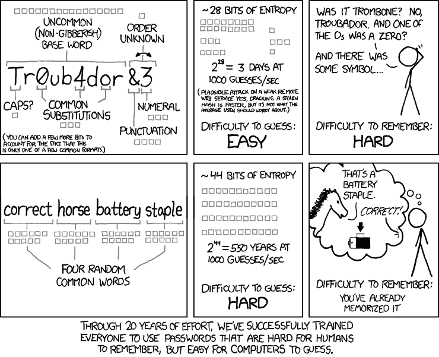
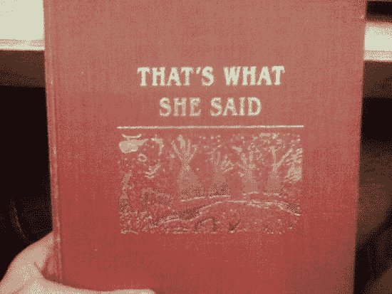
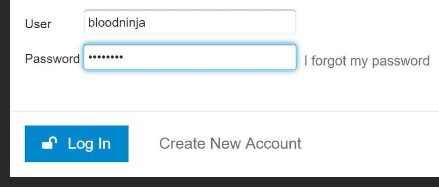
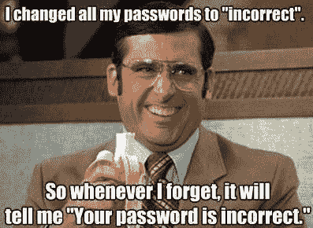
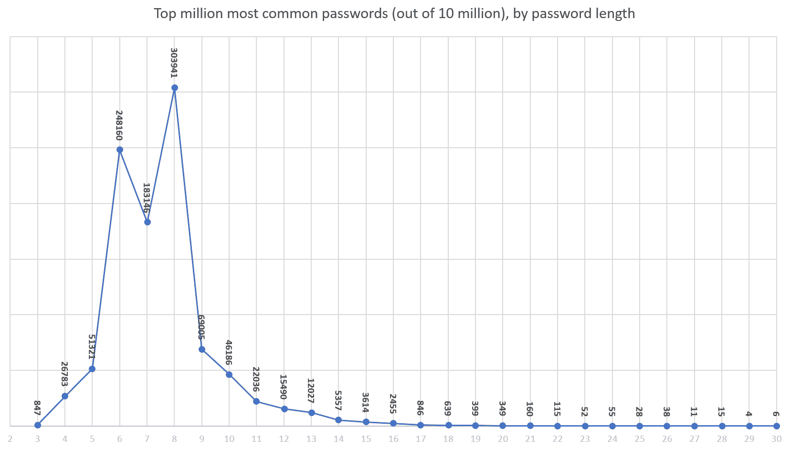
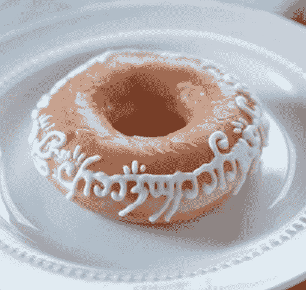
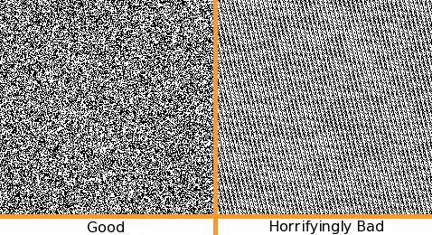

# 密码规则是狗屁

> 原文：<https://blog.codinghorror.com/password-rules-are-bullshit/?utm_source=wanqu.co&utm_campaign=Wanqu+Daily&utm_medium=website>


在很多很多*很多* [关于密码](https://blog.codinghorror.com/the-dirty-truth-about-web-passwords/)的坏处中，你知道最糟糕的是什么吗？密码规则。

让这一承诺在互联网的永久记录中得到应有的注意。我不知道是否有来生，但我很快就会知道了，我打算疯狂地出门。

这个世界充斥着可怕的密码规则:

但我不需要告诉你这些。你越有可能使用真正随机的密码生成工具，就像我们这些超级极客应该做的那样，你就越有可能在这种制度下遭受巨大的痛苦——而且是每天的痛苦。

关于密码的经典 XKCD [看过吗？](https://xkcd.com/936/)



我们[当然可以争论](https://security.stackexchange.com/questions/6095/xkcd-936-short-complex-password-or-long-dictionary-passphrase)“正确的马电池钉”是否是一个可行的密码策略，但这里的争论主要是*的长度很重要*。



不，说真的，真的。我甚至可以说[你的密码太短了](https://blog.codinghorror.com/your-password-is-too-damn-short/)。如今，鉴于云计算和 GPU 密码哈希破解的现状，任何 8 个字符或更少的密码都非常接近于*无密码。*

因此，也许我们有一个规则，即**密码不能短**。长密码比短密码更安全，对吗？

这个四个字符的密码呢？

# ⅹⅹⅹ.ⅹ.亚基列亚基列亚基列亚基列亚基列亚基列亚基列亚基列亚基亚基列亚基亚基亚基亚基亚基亚基亚基亚基亚基亚基亚基亚基亚基亚基亚基亚基亚基亚基亚基亚基亚基亚基亚基

这个八个字符的密码呢？

# Correct horse battery staple

还是这个(假设的，但太真实了)七个字符的密码？

# 緉緉緉▲̘緉

如果你把上面的四个 Unicode 表情符号粘贴到你最喜欢的登录对话框中，你可能会惊讶地发现……*实际上不是*四个字符。



哦亲爱的。

```
"💩".length === 2 
```

我们的老朋友 Unicode [再次出击](http://blog.jonnew.com/posts/poo-dot-length-equals-two)。

事实证明，即使是简单的规则“你的密码必须有合理的长度”…也不一定如此。特别是如果我们不再像丑陋的美国人那样思考。

那些漂亮的长密码呢？它们总是安全的吗？

```
aaaaaaaaaaaaaaaaaaa
0123456789012345689
passwordpassword
usernamepassword 
```

当然不是，因为*你最近有没有遇到什么用户？*



他们总是破坏我写的每一个软件。是的，是的，我知道你，超级极客先生或女士，知道所有关于熵的概念。但是把你对熵的热爱表达成可怕的、特殊的密码规则…

*   必须包含大写字母
*   必须包含小写
*   必须包含一个数字
*   必须包含特殊字符

…在一个 Unicode 和表情符号的世界里，这是想象力的一次惊人的失败。

当我们构建[对话](https://discourse.org)时，我发现[登录对话框是一个非常复杂的软件](https://blog.codinghorror.com/the-god-login/)，尽管它表面上很简单。我们使用的主要密码规则也是最简单的:**长度**。自从我写了那篇文章之后，我们已经将最小密码默认长度从 8 个字符增加到了 10 个字符。如果你碰巧是管理员或版主，我们决定最少要超过 15 个字符。

我还提倡**对照 10 万个最常见的密码**检查密码。如果你看看[2016 年](https://blog.keepersecurity.com/2017/01/13/most-common-passwords-of-2016-research-study/)数据泄露的 1000 万个密码，你会发现最常用的前 25 个密码是:

| `123456`
`123456789`
`qwerty`
`12345678`
`111111`
`1234567890`
`1234567`
`password`
`123123`
`987654321`
`qwertyuiop`
`mynoob`
 | `123321`
`666666`
`18atcskd2w`
`7777777`
`1q2w3e4r`
`654321`
`555555`
`3rjs1la7qe`
`google`
`1q2w3e4r5t`
`123qwe`
`zxcvbnm`
`1q2w3e`
 |

甚至这些数据也暴露了一些 ASCII 中心主义。我想这些数字在任何文化中都是一样的，但我很难相信普通中国人会选择“password”、“quertyuiop”或“mynoob”这样的密码。所以这个列表*有*可定制，可本地化。

(一个有趣的想法是在长密码中搜索常见的短密码匹配，但我认为这会导致太多的误报。)

如果您检查数据，这也会变成支持密码长度的论点。请注意，前 25 个密码中只有 5 个是 10 个字符，所以如果我们要求 10 个字符的密码，我们已经将最常见的密码减少了 80%。我最初是在[为话语研究](https://github.com/danielmiessler/SecLists/tree/master/Passwords)收集了数以百万计的泄露密码，然后过滤列表，只列出那些反映我们新的至少 10 个字符要求的密码时看到这一点的。



突然变成了*微小的*列表。(如果你做过类似的普通密码研究，请在评论中分享你的结果。)

我想给我的开发伙伴们提供以下常识性的建议:

#### 1.密码规则是狗屁

*   它们不起作用。
*   他们严重惩罚你的理想观众，使用真正的随机密码生成器的人。嘿，你猜怎么着，那个随机的密码*里没有*这个数字或符号。我刚刚仔细检查了我的数学课本，是的，这是可能的。我很确定。
*   他们挫败了普通用户，然后他们变得不合作，并使用“创造性”的变通方法，使他们的密码不那么安全。
*   根据我上面分享的许多令人羞愧的链接，从某种意义上说，他们通常是错误的，选择的规则是非常不完整和/或疯狂的。
*   说真的，看在上帝的份上，别再说这种武断的密码规则了。如果你不相信我的话，请阅读【2016 年 NIST 密码规则推荐。就在那里，“无构图法则”。然而，我确实看到一个错误，它应该说“没有*扯淡*构图规则”。

#### 2.强制实施最小 *Unicode* 密码长度

有一条规则至少容易记忆、理解和执行。这是众所周知的一条规则，把他们都带来，在黑暗中把他们捆绑起来。



*   很简单。用户可以统计。反正大部分都是。
*   它工作了。数据*向我们展示了*它的工作原理；只需下载您选择的任何常用密码列表，并按密码长度分组。
*   数学不会说谎。在其他条件相同的情况下，较长的密码*会比短密码*更随机，因此也更安全。
*   接受即使这一条规则也不是不可违背的。中国网站上的最小密码长度为 6 可能是完全合理的。一个 20 个字符的密码*可以*是荒谬的不安全。
*   如果您不允许(几乎)在密码输入字段中输入每一个 unicode 字符，那么您可能做错了。
*   这是一点实现细节，但是要确保*最大*密码长度也是合理的。

#### 3.检查常用密码

正如我已经提到的，“常见”的定义取决于您的受众和语言，但是当您让用户选择存在于 10k、100k 或 100 万最常见的数据泄露密码列表中的密码时，这是对用户的严重伤害。毫无疑问，黑客会在黑客攻击中提交这些常见的密码——即使有积极的密码尝试率限制，使用[1000 个最常见的密码](https://xato.net/10-000-top-passwords-6d6380716fe0)也能达到令人震惊的程度。

*   1.6%的人拥有排名前 10 的密码
*   4.4%的人拥有前 100 个密码中的一个
*   9.7%的人拥有前 500 个密码中的一个
*   13.2%的人拥有前 1000 个密码中的一个
*   30%的人拥有前 10，000 个密码中的一个

幸运的是，有数以百万计的真实密码列表需要筛选。做数据取证是一种乐趣，因为这些不是一些无聊的程序员虚构出来的假想的合成开膛手杰克密码规则，这些是真正的用户使用的真正的密码。

做研究。收集数据。保护你的用户免受其害。

#### 4.检查基本熵

这里不需要花里胡哨；选择让你内心深处感到满意的熵值。但是请记住，当用户没有通过检查时，你也必须能够向他们解释。

[T2】](http://www.digifail.com/software/spectra.shtml)

当我意识到用户选择字面意思为“aaaaaaaaaa”的 10 个字符的密码时，我有点难过。在我看来，最简单的方法是确保(y)个字符中至少有(x)个唯一字符。这就是我们在当前 beta 版 Discourse 中所做的。但是我也喜欢你在评论中的想法。越简单越清晰越好！

#### 5.检查特殊情况密码

我很不好意思地承认，在构建话语登录时，[正如我在神登录](https://blog.codinghorror.com/the-god-login/)中讨论的，我们错过了两个你真的*不得不*阻止的常见情况:

*   密码等于用户名
*   密码等于电子邮件地址

🤦如果您使用的是 1.4 之前的话语版本，我很抱歉，请立即升级。

类似地，您可能还想阻止其他特殊情况，如

*   密码等于网站的 URL 或域
*   密码等于应用程序名称

简而言之，试着像用户一样，在密码输入框之外思考。

> 🔔**澄清**
> 
> 一些人把这篇文章解释为“所有其他的*密码规则都是扯淡，除了我现在列出的这四条。”这不是我想说的。*
> 
> 这个想法是专注于一个可以理解的、简单的、实用的、在现实生活中任何情况下都有效的规则:**长度**。用户可以用合适的 Unicode 输入(几乎)任何东西，*，只要它足够长*。这就是我们需要教给用户的**绑定它们的唯一规则**:长度！
> 
> 第 3 项到第 5 项更像是“精灵-特殊-例外”检查，一种[你不能有无限愿望](https://www.youtube.com/watch?v=Bwic3hJ4q1A)的事情。它不需要预先讨论，因为它*应该*非常罕见。是的，你必须阻止用户拥有与他们的用户名相同的可笑的坏密码，或者`aaaaaaaaaaa`或`0123456789`，但只是作为进入后的检查，而不是作为需要事先解释的规则。
> 
> 所以 TL；大卫:一个规则。长度。输入您想要的任何内容，只要确保它足够长，是一个合理的密码。

| [广告]打造您的技术团队？ [Stack Overflow Careers](http://careers.stackoverflow.com/products) 帮助你从这个星球上最大的程序员社区中招聘。我们建立我们的网站是考虑到像你这样的开发者。 |

