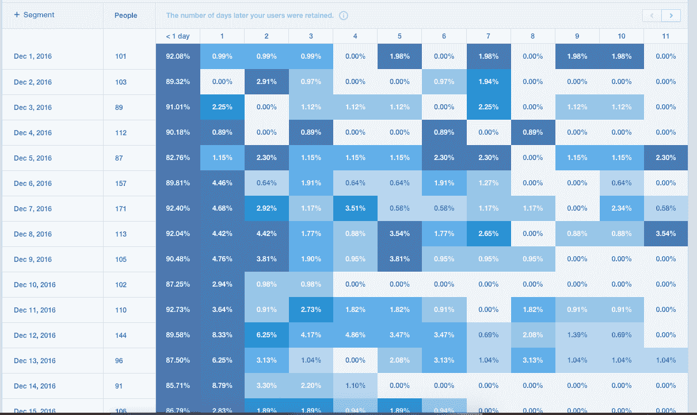
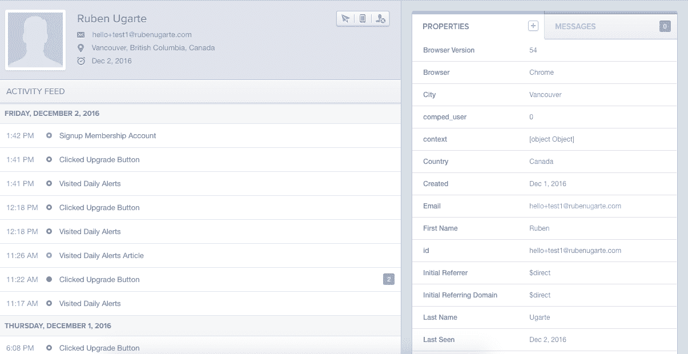
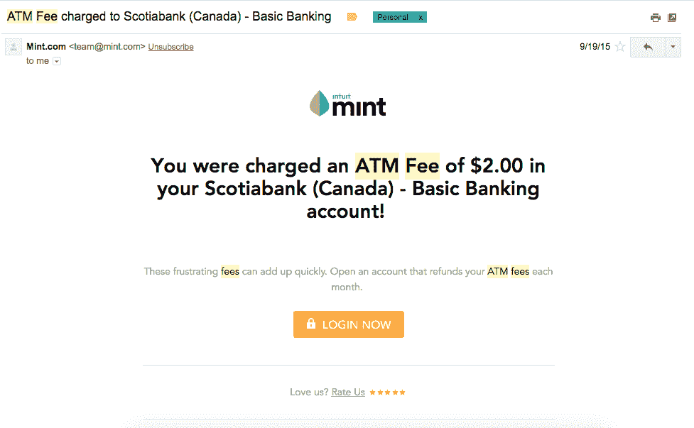
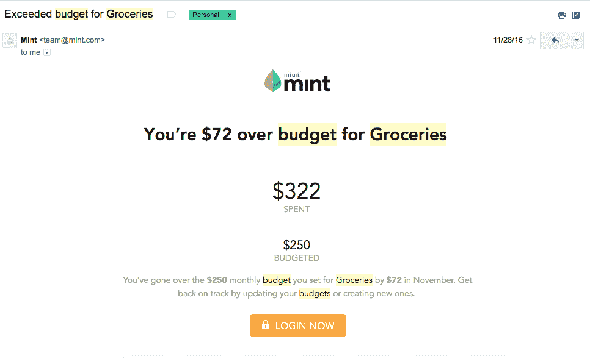
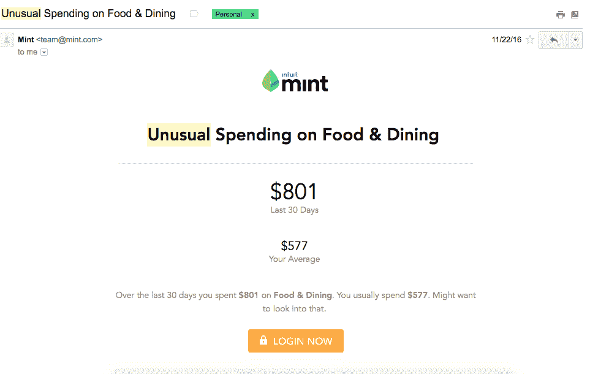
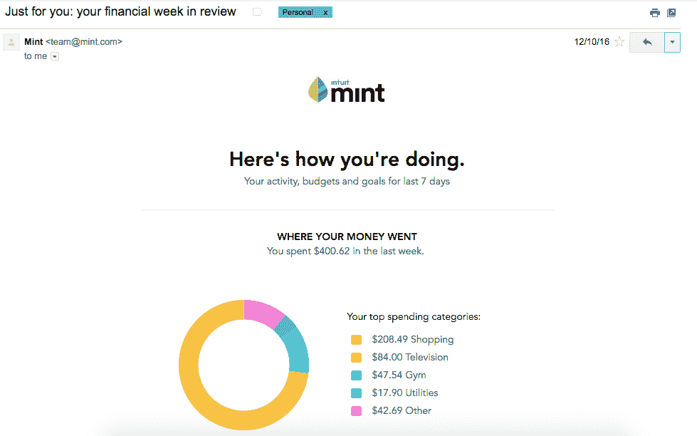
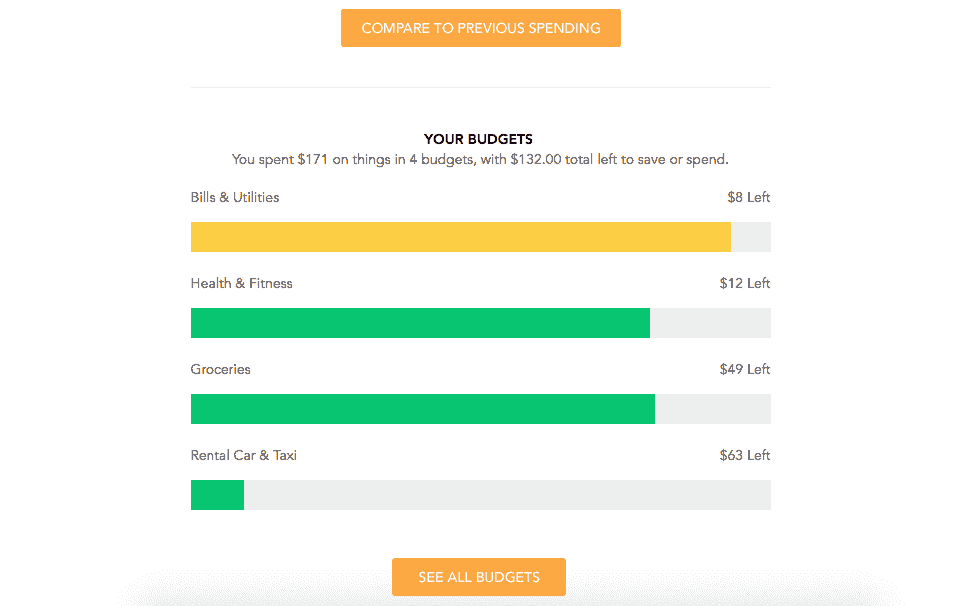

# Mint.com 如何使用客户生命周期通知来提高保留率

> 原文：<https://practicoanalytics.com/mint-uses-messages-retention/?utm_source=wanqu.co&utm_campaign=Wanqu+Daily&utm_medium=website>

我来描绘一幅你们可能经历过的画面。您的营销团队昨天刚刚完成了一项昂贵的收购活动。你获得了成千上万的新用户，你已经在考虑如何扩大这个活动。

然后，您打开您的分析工具，调出一份保留报告，它看起来像这样:

上面的报道不会说谎。你的大多数新用户都没有使用你的应用。其实大部分还没做什么就走了。

在这篇文章中，我想介绍一种策略，许多快速成长的初创公司使用这种策略来成功地引导他们的用户通过他们的客户生命周期，并提高保留率。这种策略包括根据用户采取的行动在合适的时间发送通知(电子邮件、短信、推送通知等)。

使用这种策略来留住用户的公司的一个最好的例子是 2009 年被 Intuit 以 1.7 亿美元收购的[Mint.com](https://www.mint.com/)[。如果你不熟悉 Mint.com，这是他们对自己的描述:](https://techcrunch.com/2009/09/13/intuit-to-acquire-former-techcrunch50-winner-mint-for-170-million/)

> “Mint 将您所有的财务信息集中在一个易于理解的地方。Mint 还免费为你提供如何省钱的建议

让我们了解一下 Mint.com 是如何使用信息的，以及我们可以将哪些信息应用到自己的产品中。

## 从弄清楚你的客户生命周期开始

在我们编写或设置任何消息之前，我们需要弄清楚我们希望用户做什么。我们的信息将简单地引导或推动用户采取这些行动。

考虑以下问题:

*   我希望新用户采取的最重要的行动是什么？
*   在最重要的动作之后，我希望我的用户采取的一系列动作是什么？
*   我需要向我的用户展示什么来证明我们产品的价值？

最后一个问题很重要。我们需要不断提醒我们的用户为什么他们应该关心我们的产品。正如您将在下面看到的，消息传递可以帮助您实现自动化。

这些问题旨在帮助您关注用户必须采取的关键行动。得到这些问题的答案的最好方法是问你的用户或者探索一个活跃的用户。像 Mixpanel 或 Amplitude 这样的工具使得查找用户资料和他们的所有活动变得很容易。

现在让我们看看 Mint.com 会如何回答这些问题。Mint 的产品有几个不同的功能:

*   查看您的交易历史
*   预算
*   个人现金流
*   支出趋势(按类别细分)
*   财务目标的进展
*   异常支出、费用等的警报

作为 Mint 的狂热用户，我一直定期跟踪他们发出的消息。我们可以看到 Mint 主要关注两件事:预算和警报。这意味着我会定期发电子邮件告诉我，我的预算如何，以及是否发生了意外费用，如手续费、大额交易等。

Mint.com 使用两种类型的消息将用户带回他们的产品:基于事件的消息和重复出现的消息。让我们看看每种类型的一些例子，以及如何为你的产品创建类似的信息。

## 如何在正确的时间发送正确的信息(并扩展它)

基于事件的消息由某个动作或事件发生而触发。“事件”部分与分析事件有关，这是像 [Mixpanel](https://mixpanel.com/) 、 [Segment](https://segment.com/) 或 [Amplitude](https://amplitude.com/) 这样的工具所使用的。

相关:如果你对正确设置 Mixpanel 感兴趣，那么我推荐你去看看我创建的免费视频课程[，它会教你所有你需要知道的关于 Mixpanel 的知识。](https://rubenugarte.com/ultimate-mixpanel-video-course/)

操作或事件会因您的产品而异，但以下是一些常见的示例:

*   一个用户添加了一个视频=收到一封带有视频链接的电子邮件(Youtube 就是这样做的)
*   用户评论你的状态=收到电子邮件或推送通知让你知道(脸书就是这样做的)
*   用户请求与您联系=收到一封电子邮件通知您(Linkedin 会这样做)

在每个例子中，我们都有一个重要的动作，我们希望用户采取，所以我们使用消息来推动他们。

您可以为产品中的任何操作(或无操作)触发事件。您还应该在事件属性中存储有用的信息，以便在消息中使用。

让我们看看 Mint.com 是如何使用基于事件的消息的。

**例子#1:标记为“ATM 费用”的交易将通过电子邮件或推送通知触发消息。**

我们可以看到大的“立即登录”按钮和一个有用的文本，上面写着“这些令人沮丧的费用会很快增加。开一个账户，每月退还你的自动取款机费用。”

突然间，Mint 让你意识到所有这些你以前可能忽略的费用。作为用户，你开始看到像 Mint 这样的产品背后的价值。

例 2:查看预先创建的预算会触发一条消息。

想象一下，这个月已经过了一半，你收到了上面的邮件。很明显，你在某项预算上花了太多钱，你应该缩减开支。我们再次看到“立即登录”按钮是主要的行动号召。

例 3:特定类别的不寻常支出。

这封电子邮件告诉您，与您的平均水平相比，您在给定类别中花费了太多的钱，这为您提供了此警报的背景。然后我们可以看到一条有用的信息*“在过去的 30 天里，你花了 801 美元在食物&上。你通常花 577 美元。或许你应该去调查一下。”*

所有这些信息都在引导用户使用 Mint.com 的产品，同时不断提醒他们为什么应该继续使用它。

基于事件的消息是在正确的时间用正确的消息与用户联系的一种强有力的方式。这些类型的消息也可以很好地扩展，因为您可以设置它们一次，然后让它们运行数百万次。

我们还有第二种类型的信息:重复。让我们探索一下如何以及在哪里使用它。

## 如何始终如一地提醒你的用户为什么他们应该关心你的产品

定期发送的消息按计划发送，例如每天、每周、每月等。这些消息倾向于总结您在产品中的活动，或者向您概述过去一周、一个月等发生的事情。

你会在产品中看到重复出现的信息，比如 [Slack](https://slack.com/) (团队活动总结)，以及 [Asana](https://asana.com/) (完成任务总结)。重复出现的信息是提醒用户为什么他们应该关注你的产品的好方法。

Mint.com 每周都会给你发一份关于你的消费和财务状况的总结。这封邮件看起来像这样:

我们可以看到，邮件的重点是你花了多少钱，以及这笔支出的分类细目。我们还看到一个行动号召按钮，上面写着让您“与以前的支出进行比较”。

邮件接着会向你展示本周受到影响的预算，以及你是如何应对的。

这是一个很好的例子，说明了重复出现的消息应该是什么样子。这封邮件很短，但充满了价值。每周，Mint.com 都会提醒我为什么应该使用他们的产品。

当考虑重复出现的信息时，请关注两点:

1.  我可以提醒或告诉用户哪些小成功？
2.  用户应该知道什么是有帮助的？

## 结论

您可以将重复出现的信息和基于事件的信息结合起来，以提高产品的整体留存率。就像任何其他分析项目一样，从小处着手，快速迭代。

像 [Customer.io](https://customer.io/) 、 [Intercom](https://www.intercom.com/) 和 [Outbound](https://outbound.io/) 这样的工具可以帮助你根据你已经跟踪的事件设置这些类型的消息。这些工具中的大多数可以帮助您通过不同的渠道发送消息，例如电子邮件、短信、推送通知等。

给你的问题:你可以添加什么信息来帮助你的用户理解他们为什么应该关注你的产品？请在评论中告诉我！