# 我如何通过自助出版一本关于 Ruby on Rails 的书赚到 220，033.50 美元

> 原文：<https://www.nateberkopec.com/blog/2017/03/10/how-i-made-self-publishing-about-ruby-on-rails.html?utm_source=wanqu.co&utm_campaign=Wanqu+Daily&utm_medium=website>

# 我如何通过自助出版一本关于 Ruby on Rails 的书赚到 220，033.50 美元

**总结:**一步一步地讲述我如何在 2016 年从我的 Ruby on Rails 课程中获得近乎全职的收入，以及它如何从根本上改变了我的自由职业生涯。*(7121 字/35 分钟)*

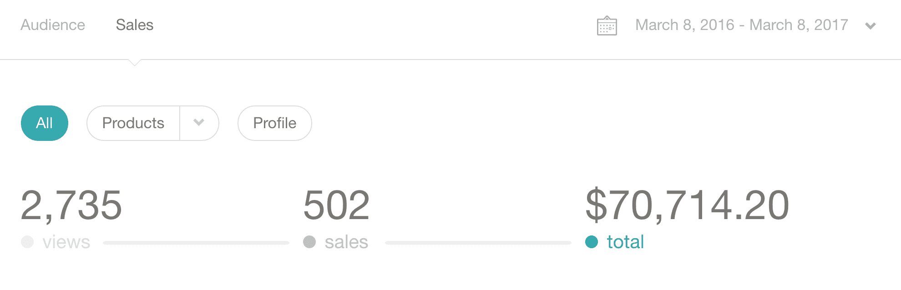 
我提到过住在离滑雪缆车 30 分钟路程的地方有多棒吗？2016 年 3 月，我推出了一门名为[Rails 性能完全指南](https://www.railsspeed.com)的课程。从那时起，我已经分发了 1800 多份，总收入为 220，033.50 美元(约 1000 美元/周)。虽然我是在三月份开设这门课程的，但我已经为此工作了大约 4 个月。发布课程对我来说是一个改变人生的事件。有史以来第一次，我一年的收入超过了产品收入，而不是服务收入。发布这个课程几乎使我平时的自由职业率翻了一倍，允许我通过搬到新墨西哥州的一个滑雪胜地来改变我的生活方式，并把我变成了 Ruby on Rails 领域的一个小思想领袖。

在这篇文章中，我想分享我创建[Rails 性能完全指南](https://www.railsspeed.com)(以下简称“CGRP”)的过程，我将来会做什么不同的事情，以及创建一个编程信息产品如何从根本上改变了我的自由职业生涯。

如果其他编程作者(无论是否自出版)会给我发电子邮件分享他们的经验和成果，这将对我有很大的帮助。我不确定我是一个局外人还是普通人！

## 睡觉时赚钱的方法

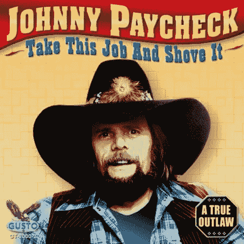
我没有编程“这里没有 mo”！ 
我才 18 岁就上了 ABC 的《鲨鱼池》第一季。我认为“产品钱”是几乎所有自由职业者或个体创业者的最终目标。可能也有很多开发人员坐在一旁，希望他们可以告诉他们的老板，把这场混战扔一边去。而且，现在我已经赚了一些产品的钱，我可以告诉你这是非常棒的。醒来时比睡觉时有更多的钱是一种非常非常好的感觉。我从 2008 年开始尝试“创业”(你可能从我 2009 年出现在 ABC 的真人秀《鲨鱼池》中认识我)。对于我来说，在我的兴趣/技能和人们会为之付费的理论维恩图中找到神奇的交叉点一直是一个挣扎。出于某种原因，我总是避开信息产品，因为我只知道编程，尤其是 Ruby on Rails。我想我想把编程的*从*中解放出来，为更多的“普通人”做一个产品，就像臭名昭著的宾果卡创造者一样。

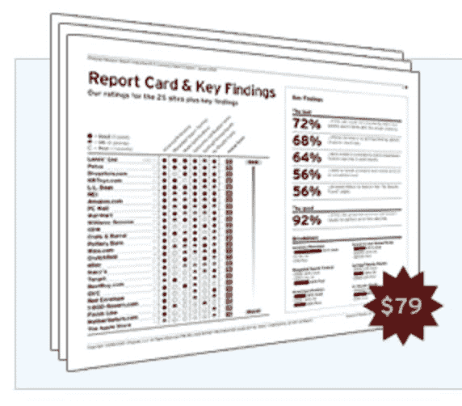
这份文案吹嘘说，它“登上了互联网零售商网站！”出于某种原因，作为软件开发创业者，我们很多人都被 SaaS 的产品迷住了。是的，订阅收入很高。但是 SaaS 并不容易，创建一个这样的网站的努力经常意味着你将自己大量的开发时间投入到一些最终没有赚到钱的事情上(或者赚的钱不足以和你的自由职业者比率相比)。更糟糕的是，作为开发人员，我们*热爱*编码。事实上，我们中的很多人非常喜欢它，以至于我们可以编码*年*而不用真正*发布*任何东西！我花了很长时间才忘记这件事。最后，[艾米·霍伊的一些话实际上把我推到了悬崖边上](https://unicornfree.com/2013/why-you-should-do-a-tiny-product-first)——她指出 37signal 的第一个产品不是一个软件，而是一个信息产品。这是一本 45 页的关于 SEO 的白皮书，价值约 79 美元。你仍然可以在这里下载。但是，当然，它充满了我们从 Basecamp-nee-37signals 中期待的观点、风格和逆向思维。所有重要的东西，所有*制造的*37 信号是什么，仍然可以在一个简单的信息产品中传递，而不是 SaaS。

这是我需要的最后一次推动——我坚定地考虑为程序员创造一个信息产品。这是 2015 年 5 月。

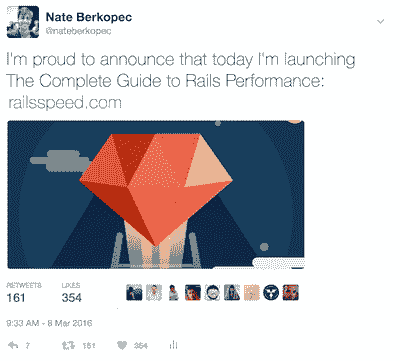
[原推文](https://twitter.com/nateberkopec/status/707242907582009344)从我推出

总的来说，从一名普通的 Rails 自由职业者到开设这门课程花了大约 9 个月的时间。实际创建这个产品花了大约 4-5 个月的时间，不过回想起来，如果我有更好的日常写作习惯，我可以把时间压缩到大约 3 个月。总的来说，制作这个课程花了大约 240 个小时，我估计在发布后还要花 60 个小时(因为我发布/录制了视频内容，我稍后会谈到)。对于那些在家计算的人来说，每小时的费用是 291 美元。

我将把我创建课程的步骤分成 5 个部分:

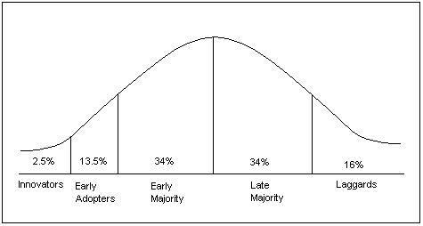
在科技界，早期多数的意思是“有人在用这个赚钱”

*   选择一个主题和受众——选择一个从早期到晚期占多数的主题领域，这是你有深刻知识的领域，也是你可以采取相反或新颖立场的领域。
*   **找到你的声音**——这是你的“品牌”。看看你选择的学科领域目前的写作，然后试着反其道而行之。
*   将博客文章作为原型 -通过将博客文章作为产品原型来磨练你的主题、受众和信息。衡量参与度，用它来完善你的写作和信息。
*   **建立你的追随者**——继续定期制作内容。创建电子邮件简讯和社交关注。
*   **打造产品**——一边写帖子，一边慢慢打造你的产品。创建一些插件(视频、休闲频道、采访)，并通过你的时事通讯和 Gumroad 发布。

## 找到你的主题领域和听众

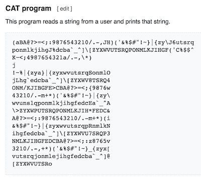
如果你认为一门编程语言不会比 Brainfuck 差，那你就错了。

剧透一下——你不能想写什么就写什么。本指南不是关于如何通过撰写关于 [Malbolge](https://en.wikipedia.org/wiki/Malbolge) 的深入教程成为一名成功的作者。第一步是猜测你的专业知识和人们想要的东西有什么交集。对大多数人来说，这通常是最难的部分，但是如果你能抓住这一点(并在下一部分找到你独特的声音)，其他部分就容易多了。

我是一个卢布主义者。我从 2011 年开始用 Ruby 编程，所以我知道无论我做什么都必须和 Ruby 相关。我在 Ruby 的实际工作经历完全是在小型创业公司和公司——我最初的几份工作中，我是唯一的全职工程师，我的自由职业工作几乎都是为小型创业公司服务的，通常是刚刚离开 YC 或 500 家创业公司。

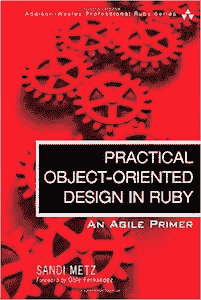
POODR 代表了当时大多数的 Ruby/Rails 编写。这是一本很棒的书，但是这个领域已经饱和了。所以——我了解 Ruby(和 Rails)，也了解初创公司。截至 2015 年，Ruby/Rails 领域的大多数文章主要围绕“可维护性”展开，尤其是在 Rails 3 发布之后。大多数 Ruby 作者都鼓吹对 Rails 应用程序采用更加面向对象的方法的好处。我认为这一领域的领导者是桑迪·梅茨([Ruby](http://www.poodr.com/)的实用面向对象设计)、阿夫迪·格林([自信的 Ruby](http://www.confidentruby.com/) 和拉斯·奥尔森([雄辩的 Ruby](https://www.amazon.com/Eloquent-Ruby-Addison-Wesley-Professional/dp/0321584104) )。因此，Ruby 编写的这个领域通常得到了很好的处理。此外，我不太喜欢这些作者的一些言辞(“可维护性”是对无止境的抽象层的一种非常不可靠的辩护，[如“六角形架构”](https://github.com/alphagov/email-alert-api/pull/36))，并且认为他们的文章没有充分解决*所有*像我习惯与之合作的小型 Ruby 商店的日常问题。

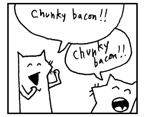
T3】

当然，到 2015 年，Ruby 中也有很多“如何做”的内容。Pragprog 的书是事实上的标准，但是 Michael Hartl 的 [Rails 教程](https://www.railstutorial.org/)和 [_why 的传奇辛酸指南](http://poignant.guide/)对初学者也很有价值。高级用户拥有优秀的 [RubyTapas 截屏系列](https://www.rubytapas.com/)。在这个子类别中有着巨大的竞争，我也不认为我有什么可以添加的。

 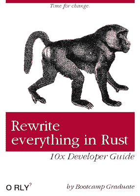 

但在 2015 年，一种新的时代精神正在 Ruby 社区生根发芽。ruby 爱好者总是担心他们的应用程序的性能，但这种担心已经达到了流行的程度。JavaScript 和 Node 长期以来一直试图窃取 Rails 在服务器上事实上的领先地位，但现在甚至更多的语言，如 Rust、Go、Scala 等，都试图篡夺王者地位。类似 Ruby 的语言(Elixir、Crystal)也开始出现，承诺 Ruby 的友好性和更好的性能。ruby 爱好者曾经(现在仍然)非常担心自己被更快的语言甩在了后面。这在博客帖子和会议讨论中显而易见——ruby 爱好者正在考虑跳槽去“更快”的语言。

我很好，谢谢。[通过推特](https://twitter.com/andrej_kn/status/618951591081717761)

令人惊讶的是，特定于 Ruby 的性能编写在当时还相当薄弱。对于一个一直渴望通过窗口看到更快语言的社区来说，似乎没有人能够告诉你如何让你现有的 Ruby 应用程序更快。流行的建议是“rm -rf 并用 JavaScript 重写”，或者是“使用 Rails 作为 API，在前端使用单页面应用程序框架”的折中方案。

于是就有了风景:

图为:某人的 Webpack 配置文件。

*   我热爱 Rails，对 Ruby 和 Rails web 应用程序有着深刻的体验。
*   ruby 爱好者对速度和性能有很多担忧，这一点非常明显，因为所有的会议都在谈论其他语言的出现(ruby 爱好者的灵丹妙药，等等)以及关于 X framework 有多快的博客帖子。
*   在这一点上，Ruby 的“How-to”内容已经铺好了，就像“面向对象编程”主题的内容一样。
*   我知道小型 Ruby 初创公司很难编写快速、高性能的应用程序，并且不想通过转换语言或框架来完全抛弃他们现有的应用程序和技能。他们想要 Rails 著名的“搞定一切”的方法，而不是 JavaScript 采用的“学习这 4 个框架和 12 个构建工具”的方法(友好地戳一下！).

因此，我有了自己的主题领域:Ruby 性能。虽然这是我如何得出我的主题的，但是当你试图决定你的编程内容的主题领域时，这里有一些你应该考虑的事情。

图为:帕特向一群主要是 Ruby 的观众介绍 C 编程

你可以向新观众介绍一个老话题。我*有点*这样做(性能对于 ruby 爱好者来说是一个不寻常的话题，尽管在其他语言社区中并非如此)，但其他作者更有意这样做。你可以把一种语言的概念教给另一个可能不熟悉它的群体(例如“Rubyists 的函数式编程”)。[帕特·沙乌格内西](http://patshaughnessy.net/)，我最喜欢的作者，为普通的 Ruby 读者写了一些 Ruby C 运行时的内部知识。语言运行时(和 C 语言！)是 Ruby 爱好者知之甚少的领域，但是这些知识很有用，因为它可以解释 Ruby 的一些怪癖和特点。

当你解决他们的需求时，企业做什么。

对企业来说，你的主题领域应该是一个昂贵的问题。从把你的写作视为爱好或副业的读者那里赚钱是极其困难的——你需要卖给他们一些他们*需要的东西*，而不是他们*想要的东西*。大多数“如何做”或“学习 X 语言”都落入了这个陷阱。更好的办法是看看你的观众有什么样的问题，并尝试去解决它们。例如，在 Ruby 社区中，写“面向对象编程”的作者经常从降低维护和重构成本的角度推销他们的内容。“敏捷编程”的作者通常从增加特性速度和增加项目对需求变化的弹性方面来阐述他们的观点。当然，在我的主题领域，性能改善了客户体验，降低了扩展成本。

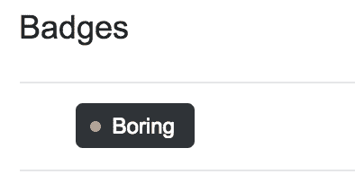
T3】

在编程写作中要避免的一个主要陷阱是我称之为**的“StackOverflow 陷阱”**。很多程序员的博客(大部分是初学者的)，读起来就像一系列 StackOverflow 的回答。它们是简短的帖子，描述了程序员在日常工作中遇到的一个狭窄的、特定的问题的解决方案。我猜，如果你写了一千篇这样的文章，你可能会有某种星火燎原/搜索引擎优化策略，但这不是那种让人们订阅并回来的内容。

你的主题领域和受众应该是你非常了解的东西，而不仅仅是你在过去 6 个月里学到的东西。例如，不要写你几个月前才学会的、只在周末使用的语言。如果你深耕某个热门领域，你会取得更大的成功。学习一个新的专业通常比学习一门全新的技能更容易。实际上，在我开始写性能之前，我对性能并不太了解，但是我对 Ruby 和 Ruby 爱好者非常了解，因为我在开始写之前已经做了 4 年的 Ruby 和 Ruby 爱好者了。

虽然你应该通过你的定位和你的写作声音(我马上会谈到这些)，但你不应该在你的主题领域看起来太独特。许多语言还不够强大，不足以支持一本关于它们的主要书籍或信息产品——选择一种成熟的语言并向该语言的用户介绍一个新概念要好得多。

所以，我知道*我在卖什么*(关于 Ruby 性能的内容)，但是现在*我该如何*去卖呢？我的“角度”是什么？那就是定位的问题。

T3】

引起人们注意的一个方法是为一个不受欢迎的立场做一个好的、合理的论证。这似乎违反直觉——当然，如果你想要更多的观众，你会选择受欢迎的位置，对吗？然而，受欢迎的职位可能已经有几十人写了(这就是它最初变得受欢迎的原因)，你必须加倍努力才能脱颖而出。如果你能看看你自己的编程观点，找到那些冷门的、不常见的或怪异的，然后写下那些，会更好(对你来说也更容易)。黑客新闻*喜欢*一个好的争议或魔鬼的倡导者，如果你能雄辩地站在“反对”的一方反对一篇 200 多分的头版文章，当你发表你的反驳时，你几乎可以保证你自己的头版文章。稍后我们将详细介绍分销渠道。

以下是我曾持有(现在仍然持有)的一些不受欢迎的职位，这些职位帮助我的博客变得更受欢迎:

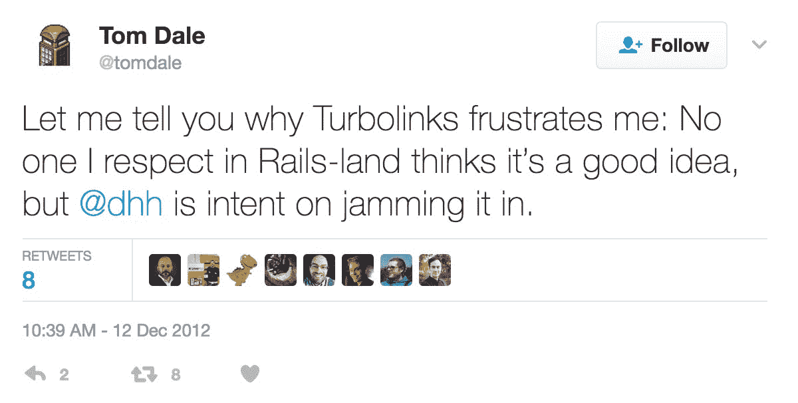
当[一个人的薪水](http://tomdale.net/2017/01/im-joining-linkedin/)取决于他对某事的不理解时，让他理解这件事是很困难的。

*   我相信 Turbolinks(Rails 经常被人诟病的 JS 插件)，反对大多数应用程序使用 JavaScript 框架。这个职位导致了我最初的一些曝光——我首先在 2015 年的 GORUCO 发表了一篇关于为什么我认为 Turbolinks 被低估的演讲，这篇演讲很受欢迎。那次演讲几个月后，我发表了一篇关于 Turbolinks 的博文，经 DHH 在 Twitter 上分享后，获得了数万次访问。
*   我认为 Ruby 已经足够快了。我认为，如果应用服务器能够在 100 毫秒或更短的时间内可靠地提供响应，那么水平扩展将会解决剩下的问题，我们可以投入更多的硬件来解决这个问题。幸运的是，只要稍加了解和优化，任何 Ruby 或 Rails 应用程序都可以达到这个门槛。程序员喜欢看“相对”基准——例如，某某框架比其他框架快 100 倍。但是，如果我们谈论的是应用服务器在 100 毫秒或 1 毫秒内做出响应，我认为差别只是在您的服务器账单上。
*   **前端性能与后端性能同样重要**，如果不是更重要的话。前端性能——渲染时间——是目前为止*最终用户*对性能感知的最大贡献者。应用服务器的响应时间约为 100 毫秒，但前端通常需要 3-5 秒才能加载。Rails 开发人员经常承担“全栈”责任，但很少了解(或关心)前端性能，但我认为这是一个错误。
*   **规模不是指 Twitter 规模。**  大多数关于“缩放”的写作变成了自我测量竞赛，其中“真实缩放”仅从每秒 1000 个请求开始。事实是，我已经看到大量的应用程序在扩展到每分钟 100 个请求时失败，因为运行它的工程师不了解他们需要多少服务器来处理多少流量的基本知识，或者他们通过一些简单的设置来限制他们的应用程序的性能，他们从来没有费心去调整。因此，当我写“规模”时，我指的是处理流量的增加，而不是互联网评论者认为的“真实规模”的任意每秒请求数。
*   我尊重观众的隐私和自由。在大多数出版商的网站重量接近 10 兆字节的时代，我博客上的页面重量约为 10 千字节。我用明文给我的时事通讯发邮件，我不跟踪点击。我所有的内容都受到 HTTPS/TLS 的保护。我不再使用追踪器了——最近，当我意识到谷歌分析对我来说并不重要时，我把它从我的网站上删除了。我的课程(稍后详述)没有任何形式的 DRM，我甚至将“源代码”(降价文件)发送给我的购买者。在像我这样精通技术的观众中，人们会注意到这种事情，并因此尊重你。
*   我写深入的、冗长的内容。在 10 秒病毒式视频和 140 字话语的时代，我的内容经常是 4000-5000 字，相当于一本杂志“长读”的长度。

那些只是我的职位。如果你正在考虑自己写关于编程的文章，这里有一些其他人已经采取的或者你应该考虑的立场:

*   学习应该是艰苦的。这是泽德·肖的[“艰难地学习 X”系列的全部要点。这是一个伟大的定位，因为它直接面对几十年来在 90 年代末和整个 00 年代主导书架的“在 24 小时内学习 X”的书籍。Zed 是为不同于这些书籍的受众写作-他想要的是寻求深刻理解的人，而不是捷径。](https://learncodethehardway.org/)
*   **学习应该是怪异的。**这是 _why 的遗产。这份令人心酸的指南是一份绝对疯狂的编程指南。它不仅仅是可爱的、非常友好的“让编程变得有趣”的材料，比如说， [Rails 僵尸](http://railsforzombies.org/)。这很奇怪，这是真正独特的，它不同于任何之前或之后出现的东西。
*   看看主导群体的想法，然后朝相反的方向走。 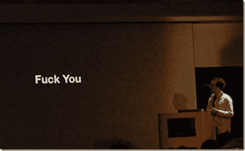
    冷门观点:讨厌这个的人都不明白 Rails 为什么会成功。例如，JavaScript 似乎有很多机会，这是一个具有极强群体思维的社区。谁在倡导 JavaScript 的简单性？据我目前所知，没有人。框架越大越差越好。JavaScript 中的*稳定性*呢？现在，是学习这个月最热门的新框架的时候了。我认为，有人写过在实际环境中使用普通的、无框架的 JavaScript，或者写过更简单、更小的库，在这种环境下可能会做得很好。也许这已经存在了，我不是 JavaScript 博客世界的忠实追随者。或者对于一般的编程语言来说，目前的迷因更倾向于强类型语言——那么经典的 OO，动态类型的倡导者在哪里呢？谁会让艾伦·凯或者一些原始 Smalltalk 的天才复活？看看那条常走的路，朝相反的方向走。编程中没有一个主题领域可以只支持单一的、正确的立场。总有替代方案，而这些替代方案需要倡导者。
*   如果你对定位感兴趣，你可能想看看[22 条不变的营销法则](https://www.amazon.com/22-Immutable-Laws-Marketing-Violate/dp/0887306667)。这是一部经典巨著。

## 寻找你的声音

你的声音是写作的“谁”——是什么让你的内容与众不同？在我看来，这是 PragProg 或 O'Reilly 等技术出版商通常会犯的严重错误。几乎所有出版的编程书籍听起来都完全一样，就像是同一个人写的一样。从某种意义上说，的确如此，因为它通常都是由一小群编辑审核的。要脱颖而出，你需要*不做那种*。

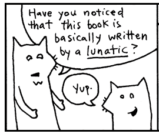 我最喜欢的例子(当然来自 Ruby 社区)是[为什么是 Ruby 的辛酸指南](http://poignant.guide/)。如果你是一个 Ruby 爱好者，你已经知道这是什么，但是如果你不是，这是 Ruby 社区的一部传奇巨著。充满了冗长的切线、连环漫画和荒谬的例子，读起来有点像亚历桑德罗·佐杜洛夫斯基写的编程指南。但这并没有真正公正地对待尖锐的指南，因为*读起来真的像是由 _why* 写的。我不认为在此之前或之后有人写过类似的编程书籍。

拥有独特的声音是让你的内容在“废话”的海洋中脱颖而出的最重要的事情之一。它会让读者记住你，并不断回来。

没有规则，只是海明威拍摄摄影师的脸。 **“有独特的声音”就是没有规则**。我经常听到的一些建议是通过阅读斯特伦克·怀特、乔治·奥威尔或其他关于写作技巧的书籍来提高你的写作质量。然而，具有优美的头韵、结构和遣词造句的完美句子只是众多可能声音中的一种声音。比像海明威那样精心构思句子更重要的是，听起来要与你所在领域的其他人不同。拼写和语法的正确性实际上只与高中英语水平相关，除此之外的一切都只是额外加分。你的观众必须能够理解你，但他们不需要认为你是海明威。我的帖子经常充满拼写错误，例如(我认为我是一个很好的拼写者！).然而，与此同时，过于友好的千禧副本被大大夸大了。不是每个句子都需要以模因结尾。

看看别人在你的主题领域写了什么，然后反其道而行之。在大多数技术写作中，尤其是在我的领域——表演中，作者过于枯燥、拘泥于形式，并且通常认为自己的知识和能力远远超出一般读者。几乎所有的技术写作都可以受益于创造性、幽默、怪异和野性的注入。大多数关于性能的文章都是针对该领域前 1%的程序员的，但是我们所有人每天都在和性能打交道。

我决定另辟蹊径，为剩下的 99%写文章，清楚地解释我使用的术语，如果有人不熟悉我在说什么，就链接到更多信息。 
顺便说一句，如果你们谁偷了我的工具条 GIF shtick，我就揍你们一顿。我博客的边栏包含了 gif 的动态评论。我经常发誓。这绝对不是你拿起最新的奥莱利的书就能得到的那种东西。

每个人都以某种独特的方式变得有趣——找到自己的声音只需要带上有趣的东西，把它调到 11 度。 
耶，亚伦的独特好吧。 [Aaron Patterson](https://twitter.com/tenderlove) ，Ruby 和 Rails 的核心成员，是一个拥有独特嗓音的程序员的好例子。他的会议演讲(总是座无虚席，因为每个人都知道会发生什么)非常有趣，充满双关语，最终总是深入到 Ruby 或 Rails 内部的技术领域。Aaron 博客和谈话中的幽默是帮助技术材料深入人心的糖。幽默并不是脱颖而出的唯一方式，尽管你可能会说像泽德·肖或加里·伯恩哈特这样的作家更有“愤怒”的声音。“声音”甚至不一定与写作有关:[例如，Bret Victor](http://worrydream.com/) 因其出色的图表、图形和排版而闻名。

把你写作的声音想象成你自己夸张的漫画版本。回头看看你过去做过的演示或写过的东西，想想别人对什么感兴趣。人们告诉你他们喜欢他们的什么？我有一个有点疯狂、充满活力的演讲风格的小名声。我通过模仿我说话的方式将这一点带回到我的写作中——充满活力，有时离题，通常很有趣(至少对我来说)。

现代写作就是把别人已经整理好的长串单词粘在一起，然后用纯粹的骗人的东西把结果变得可以看得见——乔治·奥威尔

无论你决定怎么做，记住写作中唯一好的立场是自信的、坚定的立场。人们想听到强有力的观点，而不是“我也是”或“哎呀，我不知道”。这可能意味着你需要在写作之前进行更多的研究，这样你才能收集更多的证据，并对你的结论完全确定。或者，这可能意味着你需要[删除使你的句子变得柔和的填充短语](http://www.orwell.ru/library/essays/politics/english/e_polit/)，例如“我认为”或“我假设”。

## 作为原型的帖子

既然你已经有了你想写什么(你的主题领域)和你将如何写(你的声音)的假设，你需要开始写作了。

写一本书是一场可怕的、令人筋疲力尽的斗争，就像与某种痛苦的疾病进行一场漫长的较量。如果一个人不是被一个他既无法抗拒也无法理解的恶魔驱使，他是绝不会做出这种事的。乔治·奥威尔。很明显，他是个聪明人。这是最难的部分。如果你希望得到作家用来在纸上写东西的某种深刻、黑暗的秘密，那么你会失望地发现没有。很痛苦。我仍然觉得坐下来写作这一实际行为极其困难。事情变得稍微容易了一点，但不会太多。我不知道有多少职业作家用“有趣”来形容写作过程——这是一场战斗，一场每天都在进行的战斗。

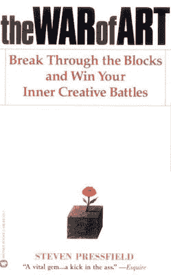 不过，对于处理这种日常战斗来说，有很多资源来自以前的那些人。[艺术家之路](https://amzn.to/2nmPXVX)是一本学习如何建立写作习惯的流行书籍，尽管我发现[艺术之战](https://amzn.to/2m8jx0b)更合我意。然而，每个人都会告诉你同样的事情——无论如何，每天都要写作。培养写作习惯实际上是学习将写作任务与编辑任务分开。写作就是在纸上写下任何东西。它不一定要很好，有趣，甚至连贯。编辑，我们在之后*做的事情，而不是在*写作期间*做的事情，是我们实际上让好东西从我们的写作中出来的地方。学会将这些依赖于完全不同的思维模式的任务分开，是我发现的治疗文思枯竭的最好方法。*

当然，你需要把你的作品放到网上的某个地方。因为这篇文章是关于程序员写作的，所以你有很多选择。我使用一个定制的 Jekyll 站点和主题，它托管在亚马逊 S3 上，使用 Cloudfront 作为 CDN。Github Pages 上的 Jekyll 也很受欢迎，尽管他们的 Pages 产品最近的变化意味着这不再是高流量博客的一个选项。

不，微 AWS 实例不是一个好主意。如果你不打算使用托管解决方案，如 Medium，你*必须* *必须* *必须*在大型提供商(如亚马逊)上托管一个静态网站，并使用 CDN。如此多的个人程序员博客都托管在两位 VPSes 上，这比亚马逊 S3 贵，而且当网站在 HN 的首页出现时，总是会失败。我有意设计了我自己的博客，这样我就不会控制任何托管我网站的服务器，而且在高流量期间，它从来没有*宕机甚至变慢过。对任何网站来说，进入 HN 前 10 名或获得大量转发都是一个关键时刻，你不能在这个时候倒下。*不要运行你自己的服务器，让别人帮你做吧。**

不要让你的网站充斥着过多的营销广告。你是在为精明的技术读者写文章——那些仍然使用过时技术的书呆子，比如`lynx`，尊重隐私权的浏览器，比如 RSS。我最近重新设计了我的博客( [speedshop](http://www.speedshop.co) 的那个，不是这个),没有加载*任何被 uBlock Origin 等内容屏蔽器屏蔽的东西*。人们会注意到。我不加载谷歌分析，因为我意识到这些数字只是虚荣的指标，不会改变我写的方式、时间或内容。我现在甚至以纯文本格式写电子邮件简讯。

不要在指标上超载。当然，你需要一些关键数字来衡量你的帖子的接受度，但你不需要优化和一千个其他的分析工具。例如，我的关键数字是社交分享和时事通讯注册。

## 分配

好吧，你每隔几周就会写一篇很棒的文章，现在如何让每个人都知道它呢？

不成为这种家伙最简单的方法就是实际拥有一个伟大的产品。首先，让我们记住，好的产品是最好的营销。如果张贴了大约 3 个月之后，你仍然没有得到你想要的数字，这意味着你的写作没有按对按钮。要么是你的学科领域太窄，要么是你的定位没意思，要么是你还没把声音扭到 11。

许可营销之王，[塞斯·戈丁](http://sethgodin.typepad.com/seths_blog/2008/01/permission-mark.html)。我遵循的整个策略是基于建筑许可的。我们正在免费赠送很棒的东西(我们的博客文章，就像微型产品),以换取将来向某人推销的许可。我给你一篇精彩的、内容丰富的博客文章，你给我你的电子邮件地址，并允许我将来给你发电子邮件(你的时事通讯)。因此，考虑到这一点，我们最重要的分销渠道将是我们的时事通讯。

有很多方法可以在你的文章中嵌入时事通讯。我在这个问题上反复思考了很多次，最终在你浏览帖子的一半时，右下角会出现一个弹出窗口，在帖子的末尾会出现一个额外的注册框。 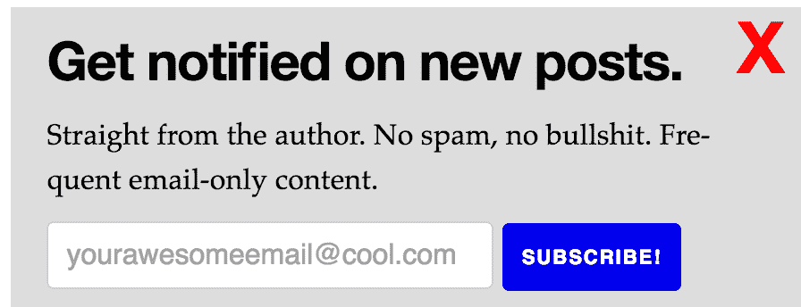
我的时事通讯侧弹出。如果你点击 x，它就不会再出现了。很多人选择那个又大又显眼的 popover 来注册时事通讯。你知道那种——它完全屏蔽了页面内容，并说“注册获得我的 5 个免费提示关于……”我不认为这对每天大部分时间都呆在互联网上的技术观众有用。也许它甚至可以增加时事通讯注册的数量，但是请记住:如果他们填写电子邮件地址只是为了让你的愚蠢弹出窗口消失，他们就没有允许你以后向你推销你的产品。简讯注册是关于*获取*你的优秀内容所产生的许可，所以你希望它们*有用*，而不是引人注目。如果读者还没有阅读你的内容，他们怎么可能给你许可呢？

至于你实际上用什么来发送你的简讯，这并不重要。我使用 Mailchimp，但我认为我只使用了它 10%的可用功能。当我开始的时候，你可以注册我的时事通讯的唯一方法是*给我发电子邮件*，我会把你添加到电子表格中。当我发送简讯时，我只是将电子表格中的所有电子邮件地址复制到 Gmail 中。

我还将在这里提到我在纯文本时事通讯上的成功。我不确定它是否更好(或更差)地通过了垃圾邮件过滤器，但当我转换时，我收到了很多来自读者的感谢邮件。在你自己的清单上试试。

至于简讯内容，我一般是每次写新帖就写。我写了大约几百字的帖子，并附上了一个链接。没有比这更好的了。

你的另一个主要渠道，也是你用来获得新读者的渠道，是社交媒体。你使用的确切的社交媒体渠道会根据你的主题领域而有所不同。此外，媒介，如果你用它来发布，有点像它自己的社交网络。

不同的社交媒体网站更适合不同的内容。以下是我成功使用的社交媒体渠道，以及哪种内容在每种渠道上表现更好:

*   **黑客新闻** - 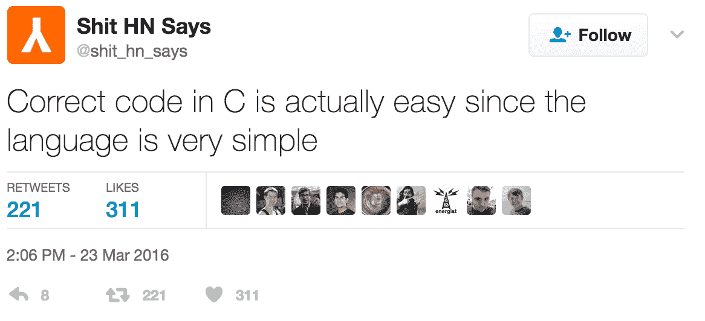 他们所有人的祖师爷。如果你能进入前 10 名，HN 仍然比几乎任何其他与节目相关的社交媒体频道带来更多的流量。然而，不可否认的是，前 10 名可能很难实现。我从来没有使用过像投票环，请朋友投票之类的技巧。我认为 HN 已经很好地察觉到了这一点，现在不值得这么做了。*重要的是*选择一个好的发帖时间(太平洋标准时间上午 9 点到下午 5 点),通过你的时事通讯或其他渠道立刻为你的帖子带来大量流量。登上首页是一个动力的问题，所以一次把你所有的流量都放在一个帖子上可能会有帮助。倾向于在 HN 做得很好的内容是逆向思维和关于最新/最伟大的编程迷因的东西(静态类型、并发性，无论最新的热门话题是什么)。
*   **Reddit** - 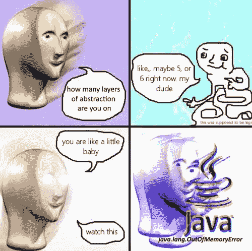
    典型的 Reddit 内容，也称为‘潮湿的迷因’我主要发布到 Ruby 和 webdev 的 subreddits 上。我的“如何做”的内容在这里会做得更好。编程 subreddit 更像是一面黑客新闻镜子。在最好的情况下，Reddit 将为我带来 HN 1/10 的流量，但它更倾向于针对我想要的受众。
*   推特(Twitter)——推特上一篇帖子的病毒式传播似乎几乎无法预测，但它仍然为我提供了源源不断的流量。
*   **龙虾**——一个不太知名的类似黑客新闻的网站。龙虾*曾经*更偏向于高技术含量，典型的 HN“X 被认为是危险的”的想法不会在那里做得很好，但这似乎在去年已经改变了。虽然龙虾仍然喜欢一个很好的“我如何使用口香糖和 CB 无线电实现 Unix”的技术深度挖掘，但它们现在更像没有商业内容的 HN。

## 构建产品

一旦你获得了几个成功的帖子和大约 1000 名时事通讯订阅者，你就可以开始考虑创造一个产品了。

我在这里描述的产品开发过程基本上是再循环的精益启动方法——没有什么新奇或特别的。如果你一直遵循这个指南，你会注意到你已经通过你的博客文章经历了旧的“构建-测量-学习”循环。

认识到这将是你的第一个产品，当然不是最后一个，这一点很重要。对于“长期”来说，大多数人最终会拥有一个由几种越来越复杂、价格越来越高的产品组成的**产品阶梯**。产品阶梯有两个目的:价格歧视(从那些有能力支付你的人那里获取最大价值)，以及通过让不确定你是否有能力提供产品的客户开始购买阶梯中较低层次的产品，然后慢慢地向上销售来建立信任。

有一百万种方法来分割它，但是我的产品阶梯有五个梯级:

*   **一个免费的产品**。 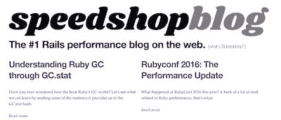 这是我的博客。有些人喜欢在这个位置放一些可下载的白皮书或其他 PDF 产品，但我认为这些感觉有点俗气。所以，现在，我的博客占据了我梯子上的“免费”位置。
*   一个 10 美元的产品。在“$”层级中，重要的是要认识到我们在这里谈论的是数量级，而不是确切的价格。因此，我的“10 美元”产品实际上可能值 5 美元、15 美元或 20 美元。我还没有 10 美元的产品，尽管我有一些想法。我今年会试着部署一个。一个 10 美元的产品 99%的时间将是一本简短的电子书，或者可能是一个截屏(或者甚至是一个截屏系列，你每月支付 10 美元)。我*不会*建议从这个梯级开始你的产品阶梯。
*   一个 100 美元的产品。 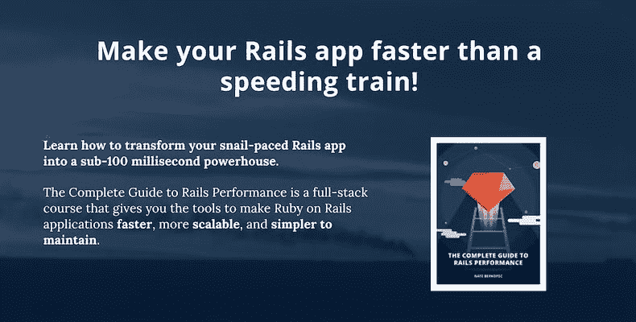 这是你应该瞄准开始你的产品阶梯的地方——一个介于 100 美元到 500 美元之间的主要信息产品。我的产品《Rails 性能完全指南》有两个包——99 美元和 199 美元的包，但 80%的人选择 200 美元的包。回想起来，我可能甚至会花 150 美元或 300 美元，但一个新手产品创造者的永恒诅咒是低估他们自己的产出。在给自己的产品定价时，不要忘记这一点。一个 100 美元的产品通常可以采取一个广泛的，专业的书籍加上一些额外的投入，如截屏，采访和一个私人的 Slack 频道。我说你应该从这里开始你的阶梯，因为这是一个积累现金的好方法——我只卖出了几百台这种产品，并从中获得了几乎全职的薪水。这比销售数千件 10 美元的产品要容易得多，但你也不必交付同样多的价值(阅读:做同样多的工作！)至于一款 1000 元的产品。你可能会认为这个价位对于一本书和电影来说太高了——我不同意，我认为我的成果就是证据。我提供你在其他地方得不到的高度专业化的信息。遵循我的建议可以为您节省数千美元的服务器费用。200 美元太便宜了。
*   一个 1000 美元的产品。这是大多数产品阶梯开始模糊产品和服务的地方。对我来说，我的阶梯被 Speedshop 报告占据，在那里我对客户的 Ruby on Rails 应用程序进行冗长的定制性能分析，告诉他们性能问题和改进机会在哪里。一些*非常复杂的*信息产品可以占据这个梯级，但是交付这种价值所需的工作量意味着我不会向初学者推荐它。如果你想知道价值 1000 美元的信息产品是什么样的，看看艾米·霍伊(Amy Hoy)和拉米特·塞西(Ramit Sethi)的东西吧。
*   一个 1 万美元的产品。如果没有个性化服务，这种水平的价值可能很难实现。对我来说，这是目前在大公司的面对面研讨会。

我再次建议你买一个价值 100 美元(100-500 美元价位)的信息产品。这是几个问题之间的一个很好的平衡:用一个产品从你的观众那里获取最大价值，它很复杂，提供了很多价值，但不需要一年的努力来生产，它为你提供了大量的收入来资助你的阶梯的其余部分。

另外，我不建议从订阅开始。如今这些看起来更难卖了，因为竞争太激烈了——每个自由职业者都认为他们想要订阅收入流，所以有无尽的每月 10 美元的屏幕播放服务，你必须与之竞争。秘诀在于，有了足够高价格的产品(即不是 10 美元的产品)，你就可以赚到和订阅一样多的钱，并体验到类似的稳定性。

至于实际决定我的 100 美元产品将会是什么，以及我将如何销售它，我几乎一丝不苟地遵循了[布莱恩·哈里斯的](http://videofruit.com/blog/online-course-sell/)流程。如果你真的把这篇文章当作指南，我建议你直接去找他，但要点是:

我用来测试 CGRP 的原始飞溅图像

*   **写一个长文风格的营销页面** - [这是我在开发完整的 Rails 性能指南时使用的实际 Google 文档](https://docs.google.com/document/d/1wOxDoPyroW7hapOYF0g869IEemegmfZF_aezecDO4ng/edit?usp=sharing)。写大约 2000+字关于你的产品，从各个角度描述它。关于如何写长篇营销的更多信息，[看这里](http://videofruit.com/blog/online-course-sell/)。你基本上是在试图解决每个可能的异议，解释为什么有人*不会*购买你的产品。如果你认为冗长的营销页面不起作用，那你就大错特错了，很明显你以前没有尝试过销售这样的产品。我这么做是有原因的，每个成功的信息产品销售者这么做也是有原因的。他们工作。
*   **以 50 名简讯订阅者为一组，请他们预订** -我们第一次构建-测量-学习循环的时间！随机抽取 50 名简讯订阅者，向他们发送你的营销页面。告诉他们你正在尝试这个产品创意，并征求他们的反馈。Videofruit 有一个具体的问题列表，我也用过。当他们回答你的问题时，回复一句谢谢，并要求他们以你测试的价格点预订。我使用 Gumroad 来接受预订(稍后会详细介绍)。
*   根据你学到的知识修改营销页面。您收到的调查反馈将是金色的。根据这些反馈，返回并修改营销页面。如果你的 50 个订户中有 5 个或更多(也就是 10%)真的投入了他们的信用卡并点击了“预购”，那么这次测试一个*更高的*价位。如果 5 个人点了 200 美元，测试 300 美元。
*   再找 50 个简讯订阅者，再试一次。对另一组 50 名简讯订阅者重复这一过程。同样，你的目标是让 10%的人填写信用卡并点击“预订”。

一旦你有了 10%的测试组预购，你就可以开始实际开发产品了。总的来说，从接受预订到实际发货，这个过程花了我大约 4-5 个月的时间。在那段时间里，我为这本书写了大约 125000 字，制作了大约 6 个小时的视频。发布后，我又制作了大约 12 个小时的截屏，在发布后“滴”出来。

以下是我的产品开发工具和技巧:

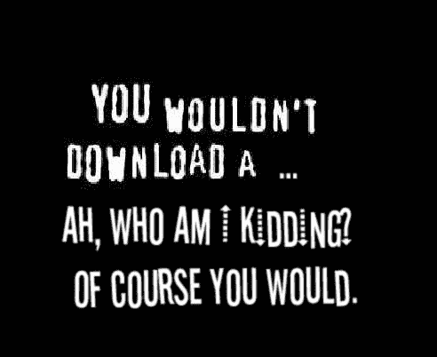
T3】

**不做 DRM** 。这个指南是为程序员开发信息产品的人准备的——不要限制他们的自由！软件开发人员讨厌 DRM，所以不要做。你的受众还没有大到 torrents 或其他非法分享会严重影响你的收入潜力的程度，所以为什么还要麻烦呢？我查看了开源许可的实际课程内容，但最终决定不这样做。相反，我的课程的所有内容都是无数字版权管理的，以几种格式分发，并且可以使用完全免费的软件(即没有专有的视频编解码器等)。

我用 [**Gitbook**](https://www.gitbook.com/) 来制作这本书本身。这真的很好，因为你可以导出到 HTML，PDF，EPUB 和 MOBI，甚至 JSON 格式。然而，设计 Gitbook 文档的样式太难了。我最终还是选择了默认的风格。

作为附加产品的一部分，出售一条私人的 **Slack** 。我很惊讶我的读者从中获得了多少价值，但这是他们最喜欢的产品部分之一。

不要自己写卖平台。我用 gum road 接受付款。这是一种可靠的结账体验，他们收取的费用也不算太高。不过，有时海外人士确实对 Paypal 的底层实现有问题，所以如果你主要是向非美国客户销售，我会去别处看看。

用**扎皮尔**把工具粘在一起。例如，我使用几个 zaps 将 Mailchimp、Gumroad 和 Slack 结合在一起。一旦您购买了我的产品，您将自动被添加到电子邮件列表和 Slack。

没有必要把**视频**做得超精致。许多*信息产品*生产*极其*华而不实的视频内容，但我认为这是不必要的。我当然没有去抛光。我买了 100 美元的麦克风和 100 美元的网络摄像头，就此打住。视频是一个时间和金钱的大坑，你可以轻松地花 10，000 美元试图让你的视频达到专业质量。视频内容也比文本内容更难保持更新。所以要警惕视频，不要花太多时间制作。

最终产品应该有三个**层**。中间层是主要产品，你期望每个人都购买的产品。提供一个价格较低的精简版本，然后提供一个价格较高的奖励版本。我的低端价位是 99 美元，我的中间层价位是 200 美元。我的第三层是“企业套餐”，我把它想象成一种面向企业客户的培训工作坊。结果是他们都不想这样——每个给我发电子邮件询问“公司套餐”的人都在询问指南本身的座位价格，这是我做的*而不是*想做的。因此，没有人最终真正购买我的“第三层”。

退款不是问题。在数百次销售中，我只有 4 次退款。在销售页面上尽可能多地提供退款和 100%满意的保证，因为它们提供的收益远远大于成本。

## 经验教训

如果我能回到过去，做一些不同的事情，我会说我会把写作作为我的习惯，而不是我在 T2 的工作。

如果你每天写 1000 字，每天，一年就是 365000 字。现在，通过练习，我已经达到了写 1000 个单词只需要一个小时的地步。一年 365，000 字是一个巨大的产出，尽管足够支持一本书，外加每周至少一篇博客文章。

然而，我没有那样做。相反，在开设这门课程的前一个月，我完全违背了自己设定的最后期限，每天写 3-5 千个单词。这太糟糕了，也是我在课程开始后感到筋疲力尽，无法继续坚持写博客的主要原因。

我想，如果我在课程开始后一直写博客的话，我可以很容易地从这个产品中增加 50-100%的收入。

我明白了一致性比努力更重要。你每天写 1000 字很重要，是的，但是更好的目标可能是每天写 *1* 个字，或者*每天坐在该死的键盘前一个小时*。写作最难的部分就是写任何东西——通常一旦我坐下来开始写，事情就简单多了。

看看成功的内容创作者——他们都是一致的产出。我发现 YouTubers 在这方面很有启发性。他们中的许多人每周制作一个视频，有时甚至更多。

然而，就像我在介绍中说的，我学到的另一件事是**写作可以完全改变你的职业**。我已经把每小时的费用翻了一倍，现在我收到了大量严肃的咨询，而我却没有任何拓展。此外，在睡觉的时候赚钱的好处在于，它可以让你休长假。我不认为今年 6 月到 9 月间我真的在工作——我花了所有的时间开车穿越美国西部，寻找一个新的地方和我的伴侣一起生活(我们最终在新墨西哥州)。

如果你有任何关于编程写作的问题，或者分享的技巧或经验，或者你有一个运行缓慢的 Ruby on Rails 应用程序:[给我发电子邮件](mailto:nate.berkopec+blog@speedshop.co)。

## 想要一个更快的网站？

我是内特·伯克佩克([@内特伯克佩克](https://twitter.com/nateberkopec))。我从全栈开发人员的角度在线撰写关于 web 性能的文章。我主要写前端性能和 Ruby 后端。如果你喜欢这篇文章，并想知道下一篇，请点击下面。我不发垃圾邮件——你每周会收到一封邮件。一切都很低调，直接来自我。

## 现已发布:Rails 性能完全指南

我撰写了一篇关于如何让 Ruby 和 Rails 应用程序运行得更快的深度教程。《Rails 性能完全指南》是一个全栈课程，它为您提供了使 Ruby on Rails 应用程序更快、更可伸缩、更易于维护的工具。它包括一个 361 页的 PDF 和超过 15 小时的视频内容。

[Learn more at railsspeed.com](https://www.railsspeed.com/).