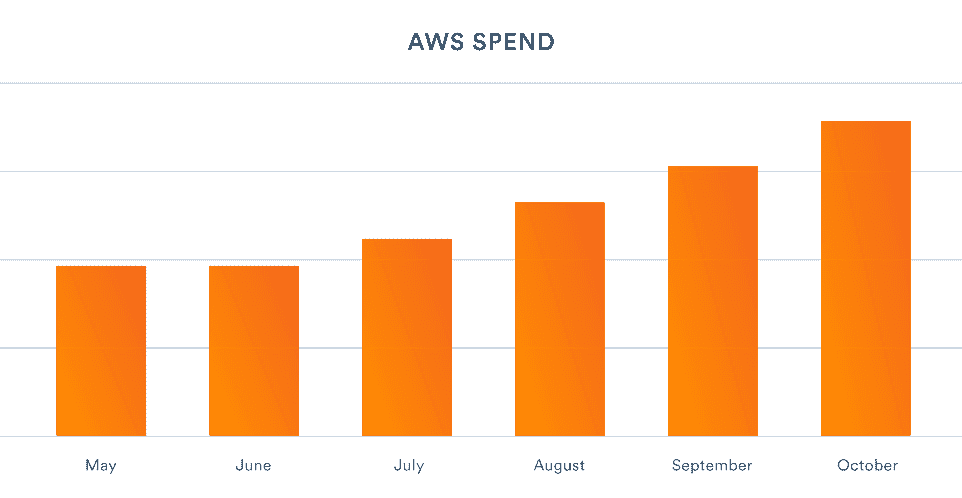
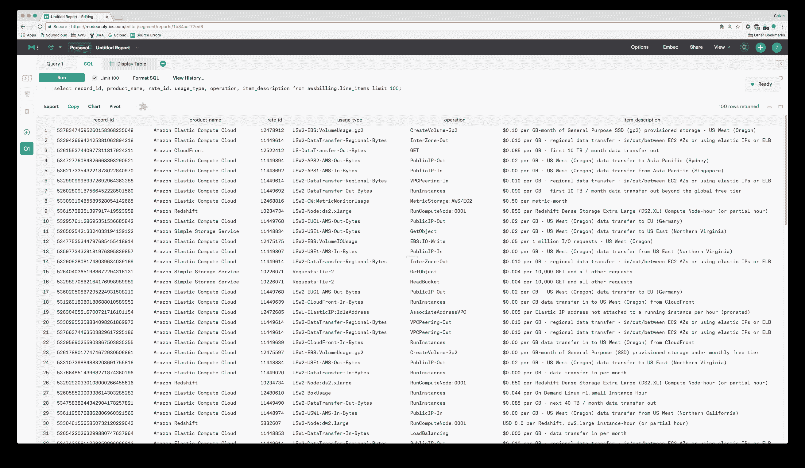
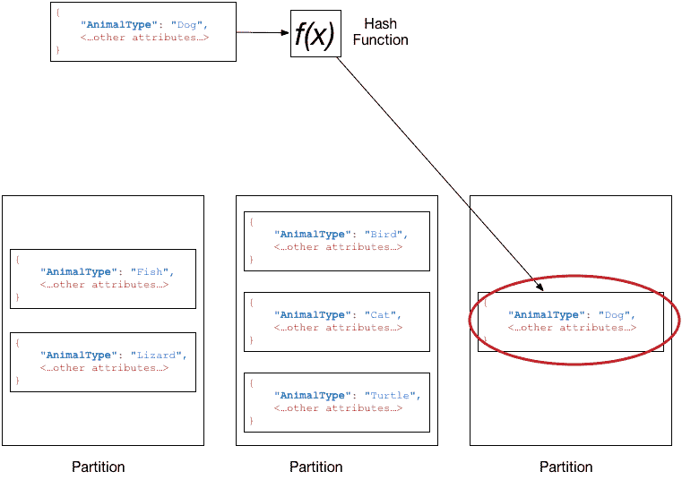
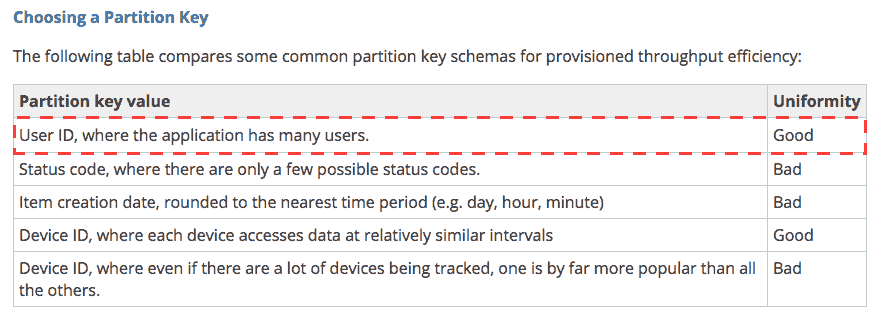
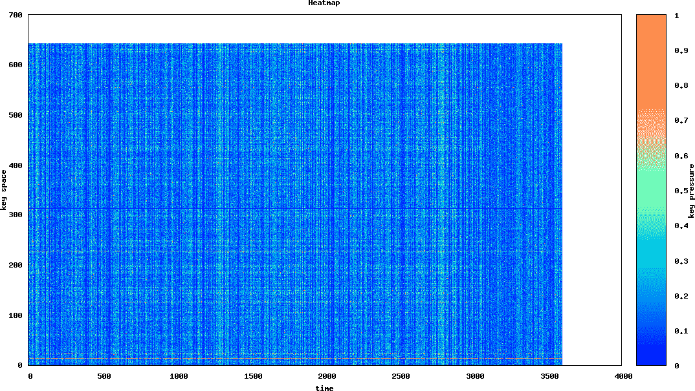
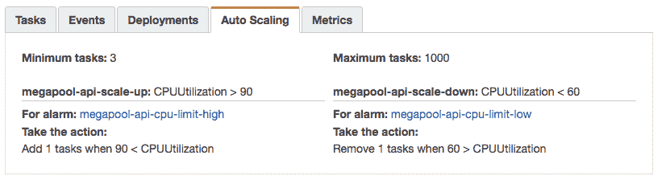
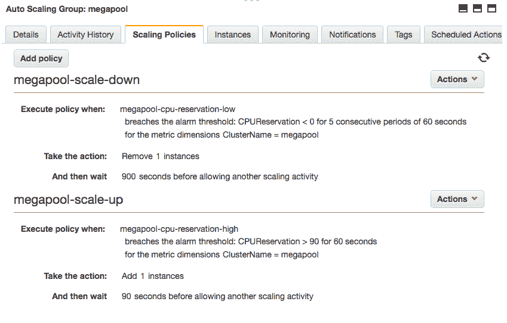
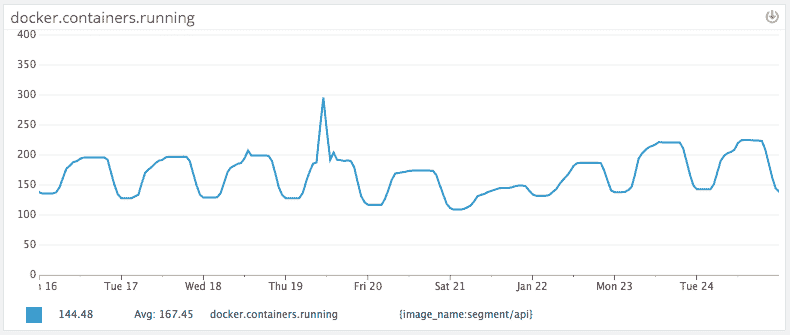
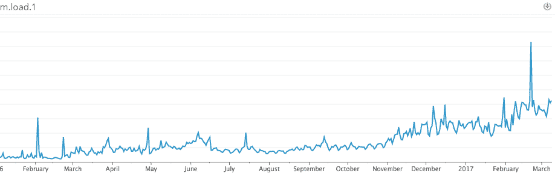

# 百万美元的工程问题| Twilio Segment 博客

> 原文：<https://segment.com/blog/the-million-dollar-eng-problem/?utm_source=wanqu.co&utm_campaign=Wanqu+Daily&utm_medium=website>

对于早期的创业公司来说，如今使用云甚至不是问题。没有 RFP、供应订单或服务器的实际发货。只是承诺在几分钟内启动并运行“无限可扩展”的计算能力。

但是，通过一个 API 调用来提供价值数千美元的基础设施的能力带来了*非常大的隐性成本*。这是你在任何定价页面上都找不到的东西。

因为外包基础设施是如此简单(RDS、红移、S3 等)，*很容易陷入一个循环，其中* ***对任何问题的第一反应是花更多的钱*** *__。*

如果你的创业公司正试图尽快行动，公司可能很快就会在每个月底看到一张*五、六或七位数的账单*。

在细分市场，我们发现自己在去年年底处于类似的情况。我们遇到了典型的创业扩展问题，我们的成本开始增长过快。因此，我们决定专注于减少主要贡献者:我们的 AWS 法案。

经过三个月的集中工作，我们成功地将 AWS 账单每年削减了 100 多万美元。以下是我们如何做到这一点的故事。

## 现金主宰着我周围的一切

在开始之前，有必要解释一下真正推动我们围绕基础架构成本建立纪律的业务原因。

大多数 SaaS 产品的成本往往会在早期发现规模经济。如果你只是卖软件，分发本质上是免费的，初期开发后可以支持几百万用户。但是基础设施即服务产品(如细分市场)的成本往往会随着采用而线性增长。不是次线性的。

举一个具体的例子:单个 Salesforce 服务器支持数千或数百万用户，因为每个用户每秒生成少量请求。另一方面，单个分段容器必须每秒处理*千*条消息，所有这些消息都可能来自同一个客户。

截至 2016 年第三季度末，我们三分之二的商品销售成本(COGS)来自 AWS。这是每月支出的图表，根据我们 5 月份的支出进行标准化。

我们的基础设施成本高得令人无法接受，并开始影响我们创建可持续长期业务的努力。是改变的时候了。

## 了解情况

如果降低成本的第一步是“承认你有问题”，那么第二步就是“识别潜在的节约”对于 AWS 来说，这是一件非常困难的事情。

如何确定按小时计费的环境的成本，包括混合年度提交、自动扩展实例和带宽成本？

有很多工具承诺帮助优化您的基础架构支出，但让我们先说清楚:*没有灵丹妙药*。

在我们的例子中，这意味着逐行挖掘账单，仔细检查每一项资源。

为此，我们启用了 [AWS 详细计费](http://docs.aws.amazon.com/awsaccountbilling/latest/aboutv2/billing-reports.html)。它将实例小时、供应的数据库和所有其他资源的完整原始日志转储到 S3。接下来，我们使用 [Heroku 的 AWSBilling](https://github.com/heroku/awsdetailedbilling) worker 将数据导入 Redshift 进行进一步分析。

这是一个混乱的数据集，但是一些深入的分析列出了 15 个最大的问题领域，总计约占我们每月账单的 40%。

一些问题相当平常:数百个大型 EBS 驱动器、过度配置的缓存和 RDS 实例。负载增加事件遗留下来的遗迹，没有被缩小。

但是有些问题需要明确的投资和专门的工程努力来解决。其中，有三个修复对我们来说最为突出:

*   DynamoDB 热碎片(每年 30 万美元)

*   服务自动扩展(每年 60，000 美元)

*   装箱和整合实例类型(每年 240，000 美元)

剩余的 400，000 美元/年归因于成本降低的长尾效应。虽然从消除这些碎片中有一些教训，但我们将集中讨论前三个。

## DynamoDB 热碎片

Segment 将 DynamoDB 大量用于我们加工流水线的各个部分。Dynamo 是亚马逊托管版的 Cassandra——它是一个 NoSQL 数据库，充当 K/V 和文档存储的组合。它支持二级索引，可以有效地执行多个查询和扫描，并抽象出底层的分区和复制方案。

发电机定价模型根据**吞吐量来工作。**作为一个用户，您为一个给定的表上的特定容量(根据每秒的读写次数)付费，Dynamo 会抑制任何超出您容量的读写。从表面上看，这似乎是一个相当简单的模型:你支付的越多，你得到的吞吐量就越大。

然而，正确地提供所需的吞吐量有一点微妙，并且需要了解幕后发生了什么。

根据官方文档，DynamoDB 服务器根据一致的哈希方案分割分区:

实际上，这意味着给定键的所有写操作都将进入同一个服务器和同一个分区。

现在，常识告诉我们，我们应该分布读取和写入，以便它们是均匀分布的。当您的其他服务器处于闲置状态时，您不希望有一个热分区或单个服务器不断过载写入。

不幸的是，尽管我们在 DynamoDB 实例上提供了明显更多的容量，我们还是看到了大量的节流。

为了理解上游事件，我们的发电机设置如下所示:

我们有一堆未分区的、随机分布的队列，由多个消费者读取。这些对象然后被写入 Dynamo。如果迪纳摩变慢了，将会导致整个队列倒退。更重要的是，为了清空队列，我们必须将吞吐量容量*增加到远远超过所需的写吞吐量*。

让我们困惑的是，我们的密钥是由最终被跟踪的用户进行分区的。并且每天跟踪数亿用户的键*应该*均匀地分配写负载。我们完全遵循了 AWS 文档中的建议:

那么为什么迪纳摩还在减速呢？似乎有两个答案。

第一个事实是，dynamo 的吞吐量定价实际上决定了**分区的数量**而不是**总吞吐量。**

这很容易被忽略，但是在谈到分区时，Amazon DynamoDB 文档陈述了以下内容:

这里的含义是，您不是在为总吞吐量付费，而是为 T2 分区数付费。如果您碰巧有几个键使相同的单个分区饱和，您必须**加倍容量**以将单个热分区拆分到它们自己的分区上，而不是线性扩展容量。即使在那里，您也受限于单个分区的吞吐量。

当我们与 AWS 团队交谈时，他们的内部监控讲述了一个与我们想象的“均匀分布”不同的故事。它解释了为什么我们看到的吞吐量远远低于我们所调配的:

这是他们提供的所有分区的热图，以及每个分区上的关键压力。Y 轴表示分区(这个表上有 647 个分区)，X 轴表示一个小时内的时间。更频繁访问的“热”分区显示为红色，而不被访问的分区显示为蓝色。

垂直的非蓝色线条是好的——它们表明发生了批量装载，并且均匀地分布在键空间中，最大化了我们的吞吐量。然而，如果你向下看第 19 个分区，你可以看到一条细细的红色条纹:

啊哦。我们找到了确凿的证据:一个单一的慢速分区。

很明显需要做些什么。他们提供的热图是一个主要的关键，但是它的粒度是在分区级别，而不是关键。不幸的是，没有现成的方法来识别热键(提示提示！).

所以我们想出了一个简单的方法来给我们提供我们需要的数据:**每当我们被 DynamoDB 压制时，我们记录密钥**。该表的预配容量暂时减少，以导致限制行为。然后将日志聚集在一起，并提取顶部的关键字。

调查结果？一些键是 Segment 的“创造性”使用的结果。

以下是我们看到的一个例子:

发现问题？

在每天的某个时间，似乎每天都有针对我们的生产 API 的自动化测试，这导致了与单个用户 id*(在本例中是字面意思`user_id`)相关的成千上万个事件的爆发。以及静态设置或错误插值的用户 Id。*

虽然我们可以修复自己代码中的错误，但我们无法控制我们的客户。

通过检查每种情况可以清楚地看到，*中没有正确处理这些数据的值*，因此从限制日志中构建了一组被阻止的键*(“userId”、“user_id”、“#{user_id}”和变体)*。几天后，我们慢慢减少了配置的容量，阻止了任何新发现的表现不佳的密钥。最终，我们将容量减少了 4 倍。

当然，修复单个分区和黑名单键只是成功的一半。我们正处于从 NSQ 到卡夫卡的过程中，这将为迪纳摩的上游*提供适当的划分。Dynamo 的上游分区将*确保*我们高效地批处理写入，并在一小部分服务器上合并更改，而不是将写入分散到全局。*

## 服务自动扩展

关于我们的栈的一点背景:Segment 在早期采用了微服务架构。我们是第一批使用 [ECS](https://aws.amazon.com/ecs/) (EC2 容器服务)进行容器编排的用户，也是第一批使用 [Terraform](https://www.terraform.io/) 管理我们所有 AWS 资源的用户。

ECS 管理我们所有的集装箱调度。这是一个托管的 AWS 服务，要求每个实例运行一个本地 ECS 代理。您向 ECS API 提交作业，它与运行在每个主机上的代理通信，以确定哪些容器应该运行在哪些实例上。

当我们第一次开始使用 ECS 时，自动缩放*实例、*很容易，但是没有方便的方法来自动缩放单个的*容器*。

[推荐的方法是构建 Cloudwatch 警报的弗兰肯斯坦管道](https://aws.amazon.com/blogs/compute/scaling-amazon-ecs-services-automatically-using-amazon-cloudwatch-and-aws-lambda/),这将触发更新 ECS API 的 Lambda 函数。但是【2016 年 5 月，ECS 团队为服务推出了一流的自动扩展。

这种方法相当简单。它实际上与自动化方法相同，但是需要的活动部件要少得多。

**第一步:**为 ECS 服务设置 CPU 和内存阈值限制:

这需要大约 30 秒的时间，然后该服务会根据它所使用的资源量自动增减任务的数量。

**第二步:**我们使实例能够根据所需的 ECS 资源分配进行扩展。这意味着，如果一个集群不再有足够的 CPU 或内存来放置给定的任务，AWS 会自动向自动伸缩组(ASG)添加一个新的实例。

成绩如何？

在实践中，这真的工作得很好(如我们的 API 容器所建模的):

我们的流量负载非常接近美国的高峰和低谷(东部时间上午 9:00 大幅上升)。因为我们在晚上和周末只有 60%的高峰流量，所以我们可以通过添加自动扩展来大幅节省成本，而不必担心突然的流量高峰。

额外的好处是在过度配置后自动缩减，以应对超额负载。我们不再需要以两倍的容量运行，因为容量是动态设置的。这给我们带来了最后一个改进:箱型包装。

## 装箱和合并实例类型

我们一直在考虑转换到更大的实例，然后用容器包装它们。但是，直到我们开始“本杰明项目”(我们削减成本努力的内部名称)，我们没有一个清晰的计划。

有很多关于[在更大的虚拟](https://www.datadoghq.com/blog/top-5-ways-to-improve-your-aws-ec2-performance/)主机上运行获得更好性能的[文章](https://www.quora.com/How-did-you-fix-the-noisy-neighbor-problem-while-using-Amazon-EC2)。一般的观点是，如果只有你一个人在一台物理机器上，你可以从嘈杂的邻居那里得到更少的窃取。而且，如果您以尽可能大的实例规模运行，那么您将更有可能成为一台物理机上唯一的 VM。

还有一些额外的好处:更少的主机意味着更低的单主机监控成本和更快的映像部署。

此外，如果您使用*相同的*实例类型(大的或小的),您可以使用保留的实例获得更便宜的账单。预订实例比每小时的价格低近 40%，但需要每年提交一次。

因此，我们意识到，开始整合我们正在运行的实例，并开始构建一支由 *c4.8xlarges* 组成的大军(我们的工作负载很大程度上受计算和 I/O 限制)对我们最有利。但是要实现这一点，我们需要一个必要的先决条件:从弹性负载平衡器(ELBs)转移到新的应用程序负载平衡器(ALBs)。

为了理解与传统的 ELB 相比，迁移到 ALBs 给了我们什么，有必要讨论一下它们是如何工作的。

根据我们最好的估计，ELBs 本质上是建立在运行 HAProxy 的小型自动扩展实例的基础上的。

将 ECS 与 ELBs 一起使用时，每个容器都在服务定义指定的单个主机端口上运行。然后，ELB 连接到该端口，并将流量转发给每个实例。

这有三个主要影响:

1.  如果你想在一个给定的主机上运行多个服务，每个服务*必须监听一个唯一的端口*，这样它们就不会冲突。

2.  您*不能在一台主机*上运行相同服务的两个容器，因为它们会发生冲突并试图监听相同的端口。(无箱型包装)

3.  如果您有 *n 个正在运行的容器*，您必须保持 *n+1 个主机可用*来部署新的容器(假设您想在部署期间保持 100%健康的容器)。

简而言之，将 ELBs 与 ECS 结合使用要求我们过度配置实例，并且每个实例只堆叠几个服务。你好成本城市，人口:美国。

幸运的是，随着 ALB 的引入，端口冲突问题得到了解决。

ALB 允许 ECS 为单个容器动态设置端口，然后将尽可能多的容器打包到给定的实例中。此外，ALB 使用网状路由系统而不是单个主机，这意味着它不需要“预热”,并且可以自动扩展以满足流量需求。

在某些情况下，我们目前每个实例包装 100-200 个容器。它极大地提高了我们的利用率，并减少了运行我们的基础架构所需的实例数量(与此同时，我们将 api 数量提高了 4 倍)。

*一段时间内的利用率*

## Terraform 默认情况下很容易

当然，通过这种集中的“一次性”努力，很容易削减成本。保持稳定利润的最困难部分是随着你的团队和产品规模的扩大，系统地保持低成本。否则，我们知道我们将注定在 6 个月内重复这个过程。

要做到这一点，我们必须让**变得简单，正确**。每当 eng 团队的成员想要添加新服务时，我们必须确保它可以免费获得我们所有的效率度量*，而无需额外的样板文件或配置。*

*这就是地形的用武之地。它是我们在细分市场使用的配置语言，用于调配和应用对生产基础架构的更改。*

*作为我们努力的一部分，我们创建了下面的模块来给我们的队友一个“默认有效”的高级原语集。他们不必提供任何额外的配置，通过使用我们的模块，他们将自动获得以下内容:*

*   ***群集**，用于配置链接到 ECS 群集的自动扩展组。*

*   ***服务**设置暴露在 ALB(应用程序负载平衡器)后面的 ECS 服务。*

*   ***Workers** 设置 ECS 服务，使用队列中的作业，但不公开远程 API。*

*   ***自动扩展**作为在基础设施上运行的所有主机和容器的默认行为。*

*如果你想知道它们是如何组合在一起的，你可以看看我们在 Github 上的开源版本:[段栈](https://github.com/segmentio/stack)。它包含所有这些现成的组件，并且很快将支持每个服务的自动伸缩。*

## *外卖食品*

*在荒废了三个月之后，我们设法达到了目标。我们每年从 AWS 账单中减少了超过 100 万美元的支出。并设法将我们的平均利用率提高了 20%。*

*

虽然我们希望分享我们在降低成本的过程中遇到的一些非常具体的问题背后的一些见解，但有一些更大的收获应该对希望提高基础架构效率的任何人都有用:

**默认高效:**重要的是，提高效率的努力不仅仅是一个规则手册或一次性策略。虽然成本管理需要持续的警惕，但最重要的投资是从一开始就防止问题发生。简单模式应该是高效的。我们通过在 Terraform 中提供一个环境和构建块来实现这一点，这使得服务在默认情况下是高效的。

但是，这超出了配置工具的范围，包括选择简化容量规划的基础架构。众所周知，S3 在这方面非常出色:它不需要任何前期容量规划。当考虑 SQL 数据库时，团队可能会选择 MySQL 或 PostgreSQL，考虑使用类似亚马逊的 Aurora。Aurora 以 10GB 为增量自动扩展磁盘容量，无需提前规划容量。在这个项目之后，效率成为我们的默认，现在是我们基础设施规划的一部分。

**自动扩展:**在此过程中，我们发现自动扩展对效率非常重要，但不仅仅是因为随需求扩展这一显而易见的原因。实际上，工程师会配置他们的服务，在他们不得不重新评估他们的容量分配之前，给他们几个月的余量。这意味着服务的分配实际上远远超过了每周的高峰需求。这种配置本身往往并不完美，浪费了宝贵的工程时间来调整这些设置。在这一点上，我们可以说无处不在的自动伸缩是微服务架构的实际需求。管理单块系统的容量相对容易，但是如果有几十个服务，这就变成了一场噩梦。

**辛苦工作:**有一些工具可以帮助提高云效率，但在实践中，这需要工程团队付出巨大的努力。不要听信供应商的炒作。只有你知道你的系统，你的需求，你的财务目标，从而做出正确的权衡。工具可以使这个过程变得更容易，但它们不是灵丹妙药。

* * *

对于任何成长中的初创公司来说，成本管理都是一个需要时间来构建的学科。就像安全或政策一样，越早开始衡量，往往越容易制定。

现在该说的都说了，该做的都做了，我们很高兴成本管理和衡量是我们很早就开始锻炼的肌肉。随着我们继续扩大规模和增长，它应该会继续产生复合效应。*