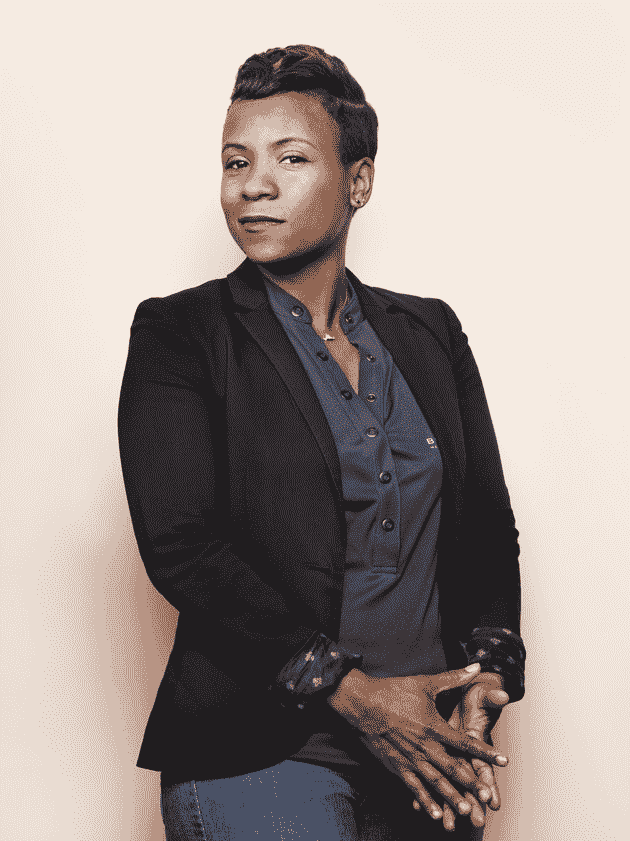
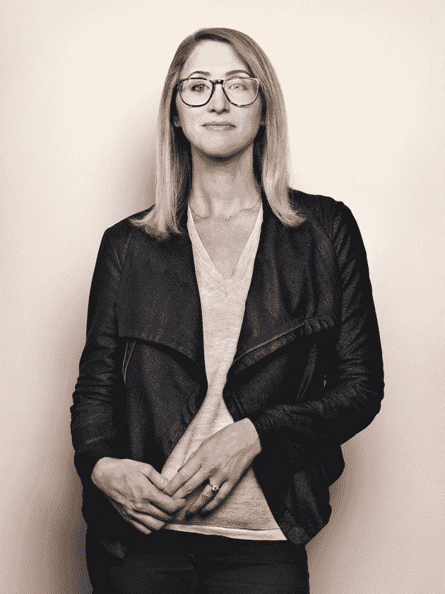
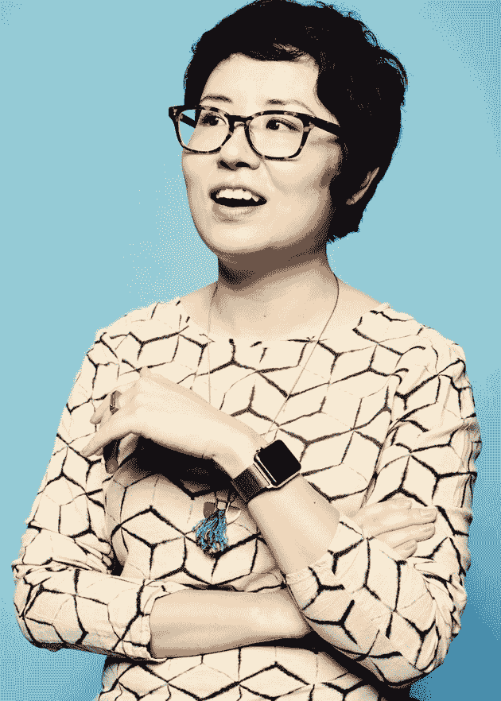

# 为什么硅谷对女性这么可怕？-大西洋

> 原文：<https://www.theatlantic.com/magazine/archive/2017/04/why-is-silicon-valley-so-awful-to-women/517788/?utm_source=wanqu.co&utm_campaign=Wanqu+Daily&utm_medium=website>

[<small>Click here for reading chinese version | Read this article in Chinese.</small>](https://www.theatlantic.com/magazine/archive/2017/04/why-is-silicon-valley-so-awful-to-women-translation/520479/)

2007 年的一个工作日的早上，贝瑟妮·布朗特很早就去面试一位求职者。布朗特当时 30 多岁，是一名资深软件工程师，在运营在线虚拟世界“第二人生”的公司担任高级职位。善良而自信的她通常穿着那种象征庄重的服装——牛仔裤、帽衫、运动鞋。那天，她甚至可能穿着所谓的“全套创业套装”:一件“第二人生”t 恤和一件“第二人生”帽衫。

简而言之，她的一切都表明她是一个认真的技术人员。因此，当求职者几乎没给她时间时，她大吃一惊。他知道她的职称。他知道她将在决定他是否被录用方面发挥关键作用。然而，每次布朗特问他技能方面的问题，或者试图将谈话引向工作范围，他都用轻率的评论打发她。随后，布朗特与另一位高层女性——一位副总统——交谈，后者说他也以同样的方式对待她。

*Listen to the audio version of this article:**Feature stories, read aloud: [download the Audm app for your iPhone.](https://goo.gl/kqioUS)*

显然第二人生不会雇佣这个笨蛋。但管他呢:他在这里，他们有一个新员工，一个需要练习接受采访的男人，所以他们让他进来了。当这位雇员出现时，他脸上有一种奇怪的表情。“我不知道刚刚发生了什么，”他说。“我进去告诉他我是新来的，他说他很高兴我在那里:‘终于有人知道发生了什么！’ "

布朗特所能做的就是大笑——即使是现在，当她回忆起这件事的时候。在性别歧视遭遇的等级中，它的排名并不高。不过，这也提醒了我，作为一名从事科技行业的女性，她应该做好准备，自己的权威随时会受到质疑，甚至是被一些试图在她公司谋职的人质疑。

她认为，她事业如此成功的一个原因是她重视忽略轻视和愚蠢的评论。也是尴尬的沉默。这些年来，她经历过——很多次——走到一群男同事面前，注意到他们变得很安静，好像他们在谈论一些不想让她听到的事情。她被要求在会议上做笔记。她发现自己深夜站在科技会议的电梯里，一个男人决定，用她自己的话来说，动手动脚。当她和一名男性合伙人创办一家公司时，潜在投资者几乎总是向他提问——即使这个话题显然属于布朗特的专业领域。这让他发疯，布朗特不得不敦促他抑制自己的愤怒。“我没有时间生气，”她说。

<picture class="ArticleInlineImageFigure_picture__HoflP"></picture>

Bethanye Blount, co-founder and CEO, Cathy Labs (Jason Madara)

但在某个时候，她内心的某些东西崩溃了。也许是在科技会议上，听到自己这个“年长的女政治家”警告年轻女性不要喝酒，因为这样的会议——以酒精、派对和产品摊位上的辣妹而闻名——一直是不受欢迎的性挑逗和性侵犯的滋生地，你永远不知道某个混蛋是否会在你的鸡尾酒里放些东西。她无法相信女人还得担心这种事情；他们仍然被要求去取咖啡；她仍然听到有人谈论雇佣女性或有色人种意味着“降低门槛”；女性在网上表达观点时，仍然经常感到沉默或受到攻击。

布朗特说:“对于一个事业刚起步的 22 岁女孩来说，情况并不比 25 年前我刚刚起步时好，这让我很生气。”。“一路上，我做出了对我来说更容易并帮助我成功的决定——不要让别人注意到我是女人，永远不要谈论性别，永远不要和男人谈论‘这些事情’，”除非行为特别出格。“它帮我度过了难关。但现在回想起来，我觉得我应该做得更多。”

[<picture class="ArticleMagazinePromo_picture__3DWDM"></picture>](https://www.theatlantic.com/magazine/toc/2017/04/)

## 探索 2017 年 4 月刊

查看本期的更多内容，并找到您的下一个故事来阅读。

[View More](https://www.theatlantic.com/magazine/toc/2017/04/)

布朗特认为，开始直言不讳永远不会太迟，并与其他经历了类似觉醒的女性合作。今年 5 月，他们成立了一个名为“包括 T1 在内的 T0 项目”的组织，旨在为公司和投资者提供一个如何变得更好的模板。苏珊吴(Susan Wu)是这项工作的合作者之一，她是一名企业家和投资者，她说，当她十几岁时自学编程时，她太天真了，没有意识到互联网文化中的性别歧视。但随着她职业生涯的推进，进入投资和大额风险资本，她开始明白一个女人坚持自己的立场所需要的复杂的柔术。在一次聚会上，一家初创企业的创始人告诉吴，她需要与他度过“亲密时光”，才能参与他的交易。一位负责另一项交易的天使投资人告诉她类似的事情。她成了一个温暖而坚定的自我解脱大师。

回想起来，吴(音译)感到震惊的是“在一次会议(或社交活动或专业午餐或头脑风暴会议或推介会议)中，我无数次不得不将一个男人的手从我的大腿(或背部或肩膀或头发或手臂)移开，而没有表现出对抗(或泼妇或拒绝或要求或攻击)。”她发现，在一个有着宏大想法和更大融资提案的地方，巧妙地拒绝一个男人的追求而不伤害他的自尊心的能力是“一项非常重要的技能，我敢打赌，我们行业中大多数成功女性都拥有这项技能。”

吴学会了如何调节自己行为的温度:友好、平易近人，既不太亲密也不太疏远。她学会了四分之三微笑的艺术，以及如何将话题从她的个人生活转移到体育和市场策略等话题上。她学会了区分真正的掠食者和善意的家伙，只是有点无能。但也不要过度警惕，因为这也会影响职业前景。

我为这篇文章采访的几十位女性都喜欢在科技行业工作。他们喜欢解决问题、友爱、快速晋升和高薪的机会，以及与技术本身一起工作的乐趣。他们欣赏那些体贴和支持他们的男性同事。然而，他们都有关于事件的故事，无论多么迅速或短暂，都削弱了他们的归属感和专业知识。事实上，最近一项名为“山谷中的大象”的调查发现，参与调查的 200 多名科技行业高级女性几乎都经历过性别歧视。(就在这篇文章的印刷版付印之际，一位前优步工程师在[写了一篇博文](https://www.susanjfowler.com/blog/2017/2/19/reflecting-on-one-very-strange-year-at-uber)，详细描述了她所说的硅谷性别歧视行为的模式，为硅谷的性别问题增添了新的证据。)

正如 Bethanye Blount 和 Susan Wu 的例子所表明的，作为一名女性，要在科技领域取得成功，需要比那句古老的格言做所做的一切(只不过是穿着高跟鞋倒着做)更叛逆的东西。这更像是穿着高跟鞋反着做所有的事情，而一个人试图拽你的裙子，另一个人告诉你一个女人不能像一个男人那样跳舞，哦，你能不能停止跳舞一会儿，给他拿点喝的？

这种削弱是今天女性只占据美国大约四分之一的计算和数学工作的原因之一——这一比例在过去 15 年中实际上略有下降，尽管女性在其他领域取得了长足的进步。女性不仅比男性受雇人数少；她们离开科技行业的速度是男性的两倍多。不难看出原因。研究表明，在科技行业工作的女性在会议中比男性更容易被打断。人们以一种不同于男性的方式来评价她们的个性。他们不太可能从风险投资家那里获得资金，研究还显示，风险投资家认为男性——尤其是英俊的男性——的推介更有说服力。尤其具有讽刺意味的是，女性对开源软件的贡献比男性更容易被接受，但前提是她们的性别未知。

<picture class="ArticleInlineImageFigure_picture__HoflP"></picture>

Stephanie Lampkin, founder and CEO, Blendoor (Jason Madara)

对于有色人种女性来说，这些轻视的累积效应因种族多样性的显著缺乏而加剧——以及随之而来的一切。斯蒂芬妮·兰普金(Stephanie lamp kin)15 岁时是一名全栈开发人员(意味着她已经掌握了前端和后端系统)，在斯坦福大学主修工程，她在申请工作时被告知她“技术不够”，应该考虑销售或营销——这是该领域许多白人女性都能体会到的经历。但她也曾在一次会议上被一名白人妇女告知，因为她的肤色，她的名字应该是乌木。

在过去的几年里，硅谷已经开始努力解决这些问题，或者至少将它们量化。2014 年，谷歌发布了其雇佣的女性和少数族裔人数的数据。其他公司紧随其后，包括 LinkedIn、雅虎、脸书、Twitter、Pinterest、易贝和苹果。这些数字并不好，随之而来的新闻报道也不好，但这些公司承诺将花费数亿美元来改变他们的工作氛围，改变他们的领导层组成，并完善他们的招聘做法。

终于，这个改变了我们学习、思考、购买、旅行、烹饪、社交、生活、恋爱和工作方式的行业似乎准备好将其破坏性本能转向自身的性别不平等——并在此过程中开发出其他不那么前瞻性的行业可以复制的工具和最佳实践，从而改善各地职业女性的生活。

三年来，硅谷的多元化会议和培训课程比比皆是；一个由顾问和软件制造商组成的家庭手工业已经涌现出来提供解决方案。其中一些补救措施已经开始渗透到科技世界之外的工作场所，因为硅谷是福音派。但这种转变尚未实现:该行业的多样性数字几乎没有变化，许多女性表示，尽管性别歧视已经变得不那么明显，但它仍然和以前一样有害。即便如此，随着公司开始搞清楚什么行得通，什么行不通，或许还是有希望的。

第二次世界大战后，当硅谷兴起时，软件编程被认为是死记硬背、单调乏味、有点文秘的工作，因此适合女性。人们认为，辉煌的未来在于硬件。但是一旦软件展示了它的潜力和盈利能力，男人们就蜂拥而至，编码变成了男人的领域。

家用电脑的出现可能加速了这种转变。像 Commodore 64 和 Apple IIc 这样的早期型号通常作为玩具销售。根据加州大学洛杉矶分校的研究人员简·马戈利斯的说法，一些家庭购买了它们并把它们放在儿子的房间里，即使他们有倾向于技术的女儿。当 80 年代和 90 年代的孩子进入大学时，许多男孩已经知道如何编码。更少的女孩知道。

但那是很久以前了。想想我们今天在哪里。一半以上的大学生是女性，进入许多领域的女性比例已经上升。计算机科学是一个明显的例外:计算机和信息科学专业的女生比例在 1984 年达到顶峰，约为 37%。从那以后，它或多或少地稳步下降。今天，这一比例为 18%。

<aside class="ArticlePullquote_root__YtnHv">“Workplace conditions, a lack of access to key creative roles, and a sense of feeling stalled” are the main reasons women leave tech.</aside>

哈佛大学(Harvard)经济学家克劳迪娅·戈尔丁(Claudia Goldin)告诉我，科技似乎是一个对女性有吸引力的领域，因为许多公司承诺同样的优势——灵活性和合理的工作时间——吸引女性成群结队地进入其他曾经几乎全是男性的职业。大型科技公司还提供有利于家庭的福利，比如丰厚的带薪育儿假；例如，谷歌的新妈妈们有 22 周的带薪假期。戈尔丁说:“对于那些想要可预测性和灵活性的人来说，这些应该是最好的工作。”“那么发生了什么？”

人才创新中心的一份报告发现，当女性退出科技行业时，通常不是因为家庭原因。他们辍学也不是因为他们不喜欢这份工作——相反，他们喜欢这份工作，在许多情况下，他们会在能够发挥其技能的部门找到新工作。相反，该报告得出的结论是，“工作场所的条件、缺乏获得关键创造性角色的机会，以及感觉自己的职业生涯停滞不前”是女性离职的主要原因。“破坏管理者的行为”是一个主要因素。

这种文化的敌意是一个公开的秘密，以至于抱怨性别歧视的推文和文章往往以否认的方式开始，承认这个主题是多么陈旧。“我最不喜欢的话题是‘科技领域的女性’，所以我长话短说，”一位博主写道，并指出，在她开始在会议上发言并为开源项目做出贡献后，她开始收到威胁和辱骂电子邮件，包括来自男性的邮件，他们说他们“在我的会议视频上手淫”另一名女性在推特上写道，在一个著名的会议 Pubcon 上等待做报告时，一名男性与会者告诉她，“不要紧张。你很性感！没人指望你做得好。”

在办公室里，性别歧视通常采取一种更微妙的形式。与我交谈过的女性描述了一种氛围:她们发现自己身处令人羡慕的现代工作场所，周围都是思维正常的同事，谈论的都是精英管理，但她们感到自己受到了难以表达的轻视，更不用说证明了。

安妮塔·博格研究所(Anita Borg Institute)是一家支持女性从事科技工作的非营利机构，该机构的总裁兼首席执行官泰勒·惠特尼(Telle Whitney)表示，性别偏见是初创企业中的一个大问题，这些企业通常由直接从精英大学毕业的年轻男性组成的兄弟会(在许多情况下是朋友或室友)经营。例如，2014 年，Snapchat 首席执行官埃文·斯皮格尔毕业两年，当他的大学男生联谊会最厌恶女性的电子邮件发表并传播开来时，他已经领导着一家价值 100 亿美元的公司。在这些照片中，他唯一稍微年轻一点的自己开玩笑说要向“胖女孩”发射激光，将斯坦福大学的一名院长描述为“院长朱莉秀给我们看你的乳房”，此外，还向另一个兄弟会致敬，因为它决定“不再是同性恋”。

尽管初创企业可能是最糟糕的违规者，但值得注意的是，保守的老公司也经常犯错。就在去年，微软举办了一场派对，让“女学生”舞者穿着短裙和胸罩，在讲台上跳舞。该活动是在旧金山的游戏开发者大会之后举行的——当天早些时候，该公司赞助了一场女性参与游戏午餐会，以促进包容性文化。

此外，还有一些公开言论，揭示了一些科技领域的领军人物对女性及其能力的看法。当彭博的一名记者问红杉资本(Sequoia Capital)董事长迈克尔·莫里茨爵士，为什么该公司在美国没有女性投资合伙人时，他回答说，“我们非常努力地寻找”，并补充说，该公司已经“从斯坦福聘请了一名年轻女性，她和她的同龄人一样优秀。”但是，他补充说，“我们不准备做的是降低我们的标准。”

当鲍康如(Ellen Pao)以性别歧视为由起诉另一家知名风险投资公司凯鹏华盈(Kleiner Perkins Caufield & Byers)时，2015 年的审判在科技界引发了一场震动。雅虎前总裁苏·德克尔(Sue Decker)为科技行业网站 *Recode* 写了一篇文章，称她一直痴迷地关注这场审判，因为它与她产生了如此深刻的共鸣。她带着女儿们离开学校去听结案陈词。“我和我认识的大多数女性都至少参与了一些工作场所的性别歧视或歧视行为，”她写道，并解释说，她和许多其他女性都目睹过类似“与同事一起旅行时在更衣室讨论”的事情，她们试图对此置之不理，因为“抱怨任何个人行为似乎都很愚蠢。”然而，对包青天的审判改变了她的态度。

鲍康如败诉，但这次审判是一个分水岭。随后，一个由七名资深女性组成的小组进行了“山谷中的大象”调查。84%的受访者被告知他们过于咄咄逼人；66%的人因为他们的性别而感到被排除在重要的社交机会之外；90%的人在会议和公司外部会议上目睹过性别歧视行为；88%的人有过客户和同事直接向男性同事提问的经历，这些问题应该是向他们提出的；60%的人抵挡了不受欢迎的性挑逗(大多数情况下是来自上司)。在这些女性中，三分之一的人说她们担心自己的人身安全。

鲍康如继续与布朗特、吴等人合作，包括崔西·周。作为一名毕业于斯坦福大学的软件工程师，周告诉我，在一家初创公司工作时，一位联合创始人常常会想，他们刚刚聘用的一个人会比她更好、更快。当 Chou 发现公司代码中的一个重大缺陷并指出来时，她的工程团队打消了她的顾虑，说他们使用代码的时间已经够长了，任何问题都会被发现。周坚持说，她可以证明在什么情况下会引发这种病毒。最后，一名男同事发现她是对的，于是发出了警报，于是办公室里的人开始倾听。周告诉她的团队，她知道如何修复这个缺陷；他们持怀疑态度，告诉她让另外两名工程师审查这些修改并签字，这是一种不同寻常的预防措施。她的同事解释说，漏洞很重要，修复也很重要，从而使他们的审查合理化。

<picture class="ArticleInlineImageFigure_picture__HoflP"></picture>

Tracy Chou, co-founder, Project Include (Erik Tanner)

“我知道这很重要，”她最近告诉我。“这就是我试图标记它的原因。”

对周来说，即使是开放式办公室的平面图也是有压力的:这意味着没有办法逃避一个喜欢突然出现在她身后并对她的工作吹毛求疵的男同事。当她提出技术问题时，她被称为“情绪化”，人们希望她友好，从不抱怨，即使她周围的人为难以共事的男工程师找借口。该公司的另一位女工程师周(音译)也有同样的感觉——似乎她们被置于不同的标准之下。这不是公开的性别歧视；这更像是被解雇和不被尊重，“感觉我们不够好，不应该在那里——尽管客观地说，我们是。”

### 视频:技术是如何变得如此男性主导的？

科技行业对女性如此敌视不仅仅是违反直觉。硅谷到处都是进步的、受过高等教育的人，他们大谈如何让世界变得更好。这也是一个年轻的领域，没有法律或医学的历史，在这个领域，女性长期被拒绝进入专为“养家糊口的男人”设立的研究生院。

“我们没有被排斥的历史，”旧金山一家公司 Paradigm 的创始人兼首席执行官 Joelle Emerson 说，该公司为公司提供多元化和包容性方面的建议。但成为新人也有自己的问题:因为硅谷是一个新人可以取代最老牌企业的地方，所以那里的许多人认为——尽管到处都有相反的证据——科技是精英统治。具有讽刺意味的是，这种信念可以让不平等永久化。2010 年的一项名为“组织中精英管理的悖论”的研究发现，在崇尚精英管理的文化中，管理者事实上可能“对表现同样出色的女性表现出更大的男性偏好。”在一系列的三个实验中，研究人员向参与者展示了表现相似的男性和女性的个人资料，并要求他们发放奖金。研究人员发现，告诉参与者他们的公司重视基于绩效的决策只会增加他们给男性更高奖金的可能性。

这种偏见在硅谷可能特别普遍，因为它的另一个基本信念:科技的成功几乎完全取决于天生的天才。没有人会想到律师、会计师甚至脑外科医生；虽然有些人显然比其他人更有天赋，但人们普遍认为法学院是你学习法律的地方，准备并通过注册会计师考试是你成为注册会计师的途径。外科医生是训练出来的，不是天生的。相比之下，2015 年发表在 *Science* 上的一项研究证实，计算机科学和某些其他领域，包括物理、数学和哲学，崇拜“才华”，培养了潜力是天生的这一观点。该报告得出结论，这些领域对女性来说往往是个问题，因为人们固执地认为天才是男性的特征。

该研究的作者考虑了这些领域女性人数较少的几种替代解释——包括女性可能不想长时间工作，以及可能有更多男性处于能力范围的高端，这是时任哈佛大学校长拉里·萨默斯在 2005 年提出的一个众所周知的想法。

但是数据并不支持这些其他的理论。

“越重视天赋的领域，女性博士越少，”研究发现，指出同样的模式也适用于非裔美国人。因为这两个群体仍然倾向于“缺乏天生的智力天赋的刻板印象”，该研究总结道，“一门学科的从业者认为成功完全取决于才华的程度是女性和非裔美国人代表性的一个强有力的预测因素。"

<aside class="ArticlePullquote_root__YtnHv">Women leave tech at more than twice the rate men do. It’s not hard to see why.</aside>

这可能就是为什么多年来，科技行业的性别差异被认为几乎是一件自然而然的事情。她说，当 Tracy Chou 2007 年在谷歌实习时，人们会开玩笑说，山景城的主要园区大多由男性工程师居住，女性往往被安排到其他部门，如营销部门。但周说，尽管是开玩笑，但奇怪的是，很难讨论为什么会这样，女性对此的感受如何，以及如何改变这种状况。

2013 年 10 月，周小川参加了格蕾丝·赫柏会议，这是一个计算机行业女性的年度聚会，脸书首席运营官雪莉·桑德伯格在会上警告说，科技行业的女性人数正在下降。小周吓了一跳。她意识到，对于这样一个数据驱动的行业，几乎没有可靠的多样性统计数据可用。同一个月，她在 Medium 上写了一篇帖子，呼吁人们分享自己公司的数据，她还建立了一个电子表格，人们可以这样做。“这件事在硅谷已经是公开的秘密，现在对所有人都公开了，”周告诉我。

当时，一些大型科技公司正在对抗《圣何塞水星报》提出的《信息自由法》要求，该报要求劳工部公布他们劳动力构成的数据。这些公司辩称，这些统计数据是商业秘密，披露这些数据会损害它们的竞争优势。但呼吁透明度的声音不止周一个。杰西·杰克森和他的彩虹推动联盟代表女性和有色人种进行宣传，维权投资者开始向公司施压，要求其披露工资和性别薪酬差距的信息。

2015 年 1 月，在拉斯维加斯国际消费电子展的主题演讲中，英特尔首席执行官布莱恩·科兹安尼克宣布，他的公司将在未来五年投入 3 亿美元用于多元化努力。两个月后，苹果承诺投资 5000 万美元，与致力于改善女性和少数族裔进入科技行业渠道的非营利组织合作，同年春天，谷歌宣布将促进多元化的年度预算从 1.15 亿美元增加到 1.5 亿美元。今年 6 月，33 家公司签署了一份保证书，让员工队伍更加多样化。

据今年 2 月退休前担任谷歌人力运营副总裁的南希·李称，该公司认为这既是一种商业需要——毕竟，这是设计一种全球产品——也是一种道德需要。她指出了谷歌创始人的“最初愿景”，即“我们将长期建设这家公司。我们不会变得邪恶。”谷歌公布了其员工的详细信息，因为“我们的数字并不太好”，李开复告诉我，其他公司觉得公布他们的信息是安全的。她说，谷歌想要公开它的数据，因为“这样我们就被套牢了。没有回头路了。”

确实如此。在谷歌，最初的统计显示，只有 17%的技术员工是女性。女性技术人员在 Twitter 占 10%，在脸书占 15%，在苹果占 20%。诚然，女性目前只占计算机科学专业学生的 18 %,但这些公司资金雄厚，极具吸引力，应该能够获得不成比例的比例。这些公司决心做得更好，并开始寻找吸引和留住女性的新方法。他们的方法包括从更广泛的大学中招聘和创造更多的实习机会。但是最闪光的——也是被模仿最多的——方法是所谓的无意识偏见训练。

最近，无意识偏见培训已经成为硅谷多元化赤字的普遍解决方案。这是新千年的多元化培训，让人们意识到自己隐藏的偏见。它基于大量的社会心理学研究——数百项研究显示了女性和少数民族是如何被定型的。李开复告诉我，谷歌之所以求助于它，部分原因是该公司认为，它的工程师会喜欢基于社会科学的方法:“这种学科真的真的与我们这里勤奋的科学家产生了有效的共鸣。”脸书也把无意识偏见训练放在多样化努力的前沿和中心；两家公司都在网上发布了培训模块的视频，为其他工作场所提供了一个模式。从那以后，关于无意识偏见的讨论就像病毒一样传遍了硅谷。

去年夏天的一个周四上午，多元化顾问乔埃尔·爱默生(Joelle Emerson)拜访了一家中型初创企业，就无意识偏见发表了演讲。艾默生知道员工不喜欢被拖去参加多元化培训会议，所以她努力让自己的演讲保持乐观、有趣，充满有趣的发现，就像 ted 演讲一样。“当我们在多元化的团队中工作时，我们作为个体会变得更聪明，更好，”她告诉观众，并指出，当你与不同背景或人口统计资料的人开会时，你会坐得更直一些。期待更多的反对，你变得更有说服力。“我们的大脑功能略有不同；我们更加警惕，更加小心，”她引用一项研究说，该研究发现不同的陪审团能更好地回忆法庭诉讼。随后，她的演讲就像许多培训课程一样，进入了所谓的内隐联想测试。

内隐联想测试是一种证明无意识偏见如何起作用的流行方法。1995 年，华盛顿大学的心理学教授安东尼·g·格林沃尔德率先提出了这一观点。这个想法是让人们非常快速地对单词和概念进行分类，揭示他们大脑所做的隐含的或隐藏的联想，以及隐藏在这些联想之下的刻板印象。

<picture class="ArticleInlineImageFigure_picture__HoflP"></picture>

Joelle Emerson, founder and CEO, Paradigm (Jason Madara)

爱默生开始让每个人练习举起右手说“右”，然后举起左手说“左”“我知道让你练习感觉有点屈尊俯就，但这里的目标是尽可能快，”她娇媚地说。观众们服从了，掌声和笑声此起彼伏。

然后她进行了测试，在屏幕上闪现一系列单词，并让观众举起他们的左手，如果这个单词指的是男性，比如儿子或 T2 叔叔，如果这个单词指的是女性，就举起他们的右手。然后，她闪现出与科学(右手)或文科(左手)相关的单词。接下来，她加大赌注:如果这个词与男性或科学有关，他们必须举起右手，如果这个词与女性或文科有关，他们必须举起左手。观众没费多大劲就完成了这项工作。但接下来是启示的时刻。“这一次我们要交换类别，”爱默生说，他指示小组成员，如果一个词是男性或文科方向的，就举起左手，如果是女性或理科方向的，就举起右手。屏幕上闪现出一连串的词语——*化学*、*历史*、*姐姐*、*儿子*、*英语*、*爷爷*、*数学*、*女孩*、*物理*、*侄女*、*男孩*——房间陷入了混乱和懊恼的笑声中他们跟不上。

埃默森解释说，不管任务以什么顺序出现，当被要求将女性与科学、男性与文科联系起来时，大约四分之三的测试者反应较慢。她谈到了自己第一次参加一个版本的测试，但是是关于家庭和工作的类别。“我想，*我要搞定这个*，”她说，但她承认，即使有一个职业母亲，一份职业，多年沉浸在性别研究中，她也倾向于将女性与家庭联系在一起，将男性与工作联系在一起。无意识偏见，显露无遗。

每个人都有偏见，有偏见并没有错，这是培训的核心宗旨。主持人经常指出，偏见和刻板印象是一种自然的、进化的防御机制，这种机制可以追溯到我们早期的人类根源:当原始人看到一条蛇时，他没有时间确定它是有毒还是无害；他的大脑说*蛇！*和他起了反应。我们今天的大脑在任何给定的时刻都会接收超过 1100 万条信息；因为我们只能有意识地处理其中的大约 40 个，我们的无意识思维接管，使用偏见、刻板印象和模式来过滤噪音。

<aside class="ArticlePullquote_root__YtnHv">**The idea that everyone holds biases and that there is nothing wrong with
having them is a core tenet of unconscious-bias training.**</aside>

这些会议传达的信息是，仓促的判断通常是有偏见的。在像技术这样的领域，这是一个问题，招聘经理可能需要填补数百个职位。该培训认为，太多的决定是凭直觉做出的:一位时间紧迫的招聘经理看着简历，看到某个兄弟会或爱好，或者一个传统的白人或男性名字，然后*砰*——由于无意识的大脑制造捷径，那个人得到了面试机会。人们恭敬地听那个人说话，而其他人——女性、有色人种——则被打断并仔细审视。

斯坦福大学克莱门性别研究所的系主任谢莉·科雷尔于 2003 年在康奈尔大学发表了她的第一次无意识偏见演讲，她说，当时这个话题是学术部门最感兴趣的。她说，现在，随着科技公司采用这种培训，需求激增。“事实上，我所知道的每一家公司都在部署无意识偏见培训，”安妮塔·博格研究所的泰勒·惠特尼说。“这是一种快速且感觉良好的训练，能让你感觉自己正在发挥作用。”

但是有一个问题。无意识偏见训练可能不起作用。一些人认为这甚至可能适得其反。虽然这种方法比 20 世纪 80 年代和 90 年代流行的“敏感性训练”(在这种训练中，白人男性通常被扮演成反派角色)更合适，但它也有同样的问题:人们讨厌被迫坐在椅子上，听别人告诉他们如何行动。强迫他们这样做可能会激起人类回答的基本冲动:不，谢谢，我会做相反的事情。

更糟糕的是，反复说“我有偏见，你也是”会让偏见看起来不可避免，甚至是好的。人们更容易接受自己的偏见，或者放弃自己，认为自己无能为力。

他们甚至可能变得更有偏见。康奈尔大学的米歇尔·m·杜吉德和弗吉尼亚大学的梅丽莎·c·托马斯·亨特在 2015 年进行的一项研究表明了将不良行为正常化的危险。指责某些行为，如乱扔垃圾和酗酒，会让人们意识到他们的行为不正常，并被证明是改变这些行为的一种强有力的方式。相反，将良好行为作为一种社会规范的信息——“大多数客人重复使用他们的毛巾”——可以让人们接受这种行为。

那么，当你说偏见是自然的，存在于我们每个人心中时，会发生什么呢？Duguid 和 Thomas-Hunt 发现，告诉参与者许多人持有刻板印象会使他们更容易表现出偏见——在这项研究中，是对女性、超重者或老年人的偏见。研究人员还颇具挑衅性地提出，即使只是过多地谈论性别不平等也可能导致性别不平等正常化:当你一遍又一遍地说女性遇到了玻璃天花板时，人们开始接受这一点，是的，女性遇到了玻璃天花板——事实就是如此。

我和 Maxine Williams 谈论了所有这些问题，Maxine Williams 是脸书公司的全球多元化总监，负责公司在线培训模块的一部分。威廉姆斯原籍特立尼达和多巴哥；在该模块中，她提到了一项研究，该研究发现，白人求职面试官认为深色皮肤的人不如浅色皮肤的人聪明。她告诉我，她发现很难谈论这样的研究，她不得不强迫自己这样做。

她说，在脸书，“管理偏见”课程是“建议的”，而不是强制的，她希望这样可以减少任何不满。我们的目标是创造一种文化，即使你选择退出培训，你也无法避免这些教训，因为经理们会四处谈论偏见，人们被鼓励在会议中大声呼叫同事，比如说，当他们打断某人时。“你最近打断过别人吗？，”威廉姆斯喜欢问观众。她认为，谈论偏见的普遍性有助于消除人们对精英主义谬误的误解。

她还告诉我，如果你要认真对待偏见培训，你必须创造一个让人们感到安全的工作场所，让他们说出自己的偏见——比如，他们可以承认认为男性更擅长数学，或者新妈妈对工作不太投入——她承认，这是一项危险的任务。“一旦你开始走上这条路，并对人们说，‘要开放！“各种各样的事情都会浮出水面，”威廉姆斯说。“我们将不得不一起走过这片泥泞。这意味着你也必须宽容。”她补充说，有必要假设人们，不管他们承认什么样的偏见，都是善意的。“假定意图良好”至关重要。

当我向曾在脸书工作过的贝瑟尼·布朗特(Bethanye Blount)提起这段对话时(她认为这是一个很好的工作场所)，她对“假设意图良好”的部分一笑置之。“他们在迎合工程师，”布朗特说——工程师构成了一个令人垂涎的、往往敏感的群体，他们喜欢把自己视为“特殊的雪花”，脸书聪明地小心对待他们。无意识偏见培训的一个不言而喻的优势是，在公司争夺人才的环境中，它有望帮助吸引有才华的女性，而不会吓跑有才华的男性。

<picture class="ArticleInlineImageFigure_picture__HoflP"></picture>

Bo Ren, product manager, Tumblr (Erik Tanner)

我还和博任聊过，他曾是脸书的员工，现在是 Tumblr 的产品经理。任表示，的氛围很平静，表面上感觉良好，但就像所有工作场所一样，背后隐藏着权力。她说，要想在硅谷的任何地方取得成功，你需要有社会信誉，能够让人们接受你的观点，让他们接受新产品或解决方案，能够让你的想法“社会化”。“你会认为所有的事情都是平等的，”她说，“但是这些秘密谈话发生在不邀请女性的场合。整个男孩俱乐部的事情仍然适用。如果你和合适的人在火人节聚会，你就会成为这个男孩俱乐部的一员。”至于在会议中叫人出来，这听起来是个好主意，她说，但她从未见过有人这样做。“只是——你真的要成为那个人吗？”

最近，无意识偏见训练的问题变得更加广为人知。不是别人，正是安东尼·格林沃尔德，内隐联想测验的发明者，表达了他的怀疑。“理解隐性偏见实际上并不能为你提供解决问题的工具，”他告诉《福布斯》杂志。卡拉·斯威舍是 *Recode* 的联合创始人，她说关于无意识偏见训练的讨论“听起来很累”，是不够努力的借口。一位技术高管迈克·埃农(Mike Eynon)在一篇中期文章中写道，偏见培训让“我们白人感觉更好”，让“特权阶层意识到每个人都有偏见，他们没有错”，而受歧视的群体没有任何改变。

2016 年，谷歌报告了逐步改善的情况:其整体员工中现在有 31%是女性，比上一年增加了一个百分点。19%的技术职位由女性担任，也上升了一个百分点。在脸书，女性的总体比例从 32%上升到 33%。在技术岗位上，女性的比例也增加了一个百分点，从 16%增加到 17%。

泰勒·惠特尼指出，对于像谷歌这样庞大的员工队伍来说，一个百分点的增长并不是微不足道的。尽管这些公司的承诺似乎是真诚的，但缓慢的变革步伐突显出他们还有很长的路要走。如果他们想真正转型，他们可能需要采取更严厉的措施。

### 反偏见应用

现在存在大量的应用程序和软件平台来规避无意识的偏见。以下是一些产品:

Textio 使用数据和机器学习来扫描招聘信息，并标记可能会排斥女性的短语。有些是显而易见的:*摇滚明星*，*乒乓*， *Nerf 枪*。但 Textio 的联合创始人基兰·斯奈德(Kieran Snyder)表示，其他单词可能会表现出更微妙的男性偏见。例子包括她称之为“一路向上”的语言:像*硬驱动*和*碾碎它*这样的短语，以及像*完美无瑕*、*无情*和*极度*这样的最高级。该软件建议性别中立的替代品。

在求职者进行旨在评估其技能的测试之前，他们会隐藏简历和其他身份信息，包括性别。这是试图复制性别偏见流派中最著名的研究之一:2000 年，克劳迪娅·戈尔丁和塞西莉亚·劳斯表明，当美国主要管弦乐队允许音乐家在隐藏性别的屏幕后试演时，女性被选中的比例大幅上升。他们证明了当人们被评估纯粹的能力时，女性更有可能晋级。

正如其创始人斯蒂芬妮·拉姆金所说，blend door 是“招聘的火种”。这款应用让求职者和招聘者可以互相查看:求职者可以看到一家公司在多样性方面的排名；招聘人员可以看到一个人的技能、教育和工作经历，但看不到他或她的种族、年龄和性别。

Interviewing.io 提供了一个免费的平台，让工程师们进行模拟技术面试，给女性(以及其他任何可能感到格格不入的人)一个练习的机会。它也有软件，公司可以在实际面试中用它来掩盖应聘者的声音。

unity 基于“轻推”的理念，即小变化产生大影响。它在招聘过程中为经理们提供指导，找到防止他们带着偏见行事的方法。例如，在简历评估过程中，姓名和性别会被隐藏起来；在面试过程中，该软件会引导经理回答一些旨在评估相关技能的问题。

最近，一个新的补丁出现了。试图改变人们无意识的态度是杂乱而复杂的。但如果你不能轻易消除偏见，你能做的就是设计一套结构性变化，阻止人们据此采取行动。Joelle Emerson 在她的演讲中多次谈到这一点，并与公司合作，将反偏见培训的见解嵌入招聘和晋升流程。在招聘中避免偏见的一个方法是确保面试者事先写下一套明确的技能，问每个申请人同样的问题，并根据一个标准评估答案的质量，而不是在事后简单地说，“我真的很喜欢那个和我上同一所学校的人，他和我一样喜欢冰球。”

谷歌一直是这种变革的支持者。在他 2015 年的书里，*工作法则！在去年夏天之前一直担任公司人力运营高级副总裁的拉兹洛·博克引用了托莱多大学的一项研究，该研究发现前 20 秒往往能预测 20 分钟面试的结果。他写道，问题在于这种快速印象毫无意义。他补充说，谷歌强烈鼓励面试官使用技能评估和标准问题的组合，而不是依赖主观印象。*

<aside class="ArticlePullquote_root__YtnHv">“Until we see changes in the way we work, I don’t think we’re going to crack this nut,” says Shelley Correll.</aside>

其他专家表示，公司需要的是一份反偏见清单。这种想法正在传播——例如，Pinterest 已经与艾默生合作开发了一个六点清单，其中包括保留大量时间来评估员工的表现等措施，以抵消可能引入偏见的认知捷径。但这还为时尚早:去年夏天，在爱默生关于无意识偏见的演讲中，听众中有人问她，哪些硅谷公司在管理偏见方面做得很好。“没有人，”她说，“因为把它嵌入到组织设计中的想法是相当新的。”

这里是硅谷，新公司已经涌现出来，将清单的想法数字化，为科技领域的性别问题提供科技解决方案:掩盖申请人性别的软件，或者通过更客观的评估过程指导招聘经理的软件。(参见上面侧边栏的“[反偏差应用](#apps)”。)

然而，即使它们有效，这些偏见干预也只能让你到此为止。多元化顾问和倡导团体表示，他们仍然对科技公司不愿改变其文化的核心部分感到沮丧。例如，在求职面试中，工程师需要站起来在白板上写代码，这是一个神圣的传统，这种高压局面对那些感到格格不入的人不利。事实上，白板会议充满了偏见判断的机会。在斯坦福大学，谢莉·科雷尔和一名研究生一起工作，这名研究生为了他的论文，参加了一次白板会议，会上的一个问题有错误；当一位女性求职者意识到这一点并不断提问时，评估者认为她所有的问题都表明她没有能力。

“直到我们看到我们工作方式的改变，我不认为我们会打破这个坚果，”Correll 说。“我曾与一家公司合作，该公司坚持认为，产生好想法的最佳方式是让团队中的人互相大声说出他们的想法。当你看这些团队工作时，他们真的会互相尖叫，互相辱骂。他们相信这种动力对于科学发现是必不可少的——绝对必要。我说，‘你能不能至少说你不同意某人，而不说你认为他是个白痴？’ "

有一个术语是指科学发现中的尖叫和谩骂。这被称为“建设性对抗”，它是由帮助硅谷命名的公司首创的。那应该是英特尔，硅芯片的制造商。英特尔诞生于战后的美国，在那里，公司办公室一眼望去都是男性。Telle WhItney 说，it 和其他早期的科技公司“都是由男性创立的，不管是好是坏，他们都有一种男性的感觉”。正如英特尔前首席执行官安德鲁·格罗夫在他的书*中所说的，只有偏执狂才能生存*:“从所有早期的争吵中，我们发展出了一种激烈争吵但仍保持朋友关系的风格。”

当然，现在谈论的是包容，而不是对抗。我很惊讶地听到英特尔——老式的英特尔——被认为是围绕性别问题成功创新的公司之一。自 2000 年以来，它一直在发布多样性数据，尽管没有一些同行那样大张旗鼓，也没有太大的改进。但在过去几年里，英特尔决定尝试一些其他方法，包括招聘配额。

不是配额。你不能说配额。至少在美国没有。在一些欧洲国家，如挪威，真实的配额——例如，规定上市公司董事会成员的 40%必须是女性——运作良好；合格的女性已经找到，地球继续转动。然而，在美国，招聘配额是非法的。“在英特尔，我们从来不使用配额这个词，”该公司的首席多元化和包容性官员丹妮尔·布朗说。相反，英特尔设定了极其坚定的招聘目标。2015 年，它希望 40%的雇员是女性或代表性不足的少数族裔。

现在，许多公司确实有招聘目标。但是为了让它的目标更像配额，英特尔在等式中引入了资金。在英特尔的年度绩效奖金计划中，成功实现多元化目标是公司是否向员工发放全面奖金的一个因素。(数额差异很大，但可能很大。)如果多元化努力取得成功，公司的每个人都会变得更富有一点。

诚然，与其他一些公司相比，英特尔还有很长的路要走，部分原因是它的大部分员工是技术人员，不像新兴的社交媒体公司。在全球拥有约 10 万名员工和数十年根深蒂固的文化的情况下，这是一艘掉头缓慢而笨重的船。

但自从开始将奖金与多元化招聘挂钩以来，英特尔已经达到或超过了目标。2015 年，43%的新员工是女性和代表性不足的少数族裔，比目标高出 3 个百分点。去年，它将其目标提高到新员工的 45 %,并达到了目标。这些变化不仅仅发生在初级职位上:40%的新副总裁是女性和少数族裔。2014 年，英特尔的美国员工中女性仅占 23.5%。到去年年中，这一比例上升了两个百分点，达到 25.4%。

英特尔还推出了提高保留率的措施，包括一条“热线”,员工可以使用这条热线报告问题——感觉自己陷入了职业生涯，或者与经理发生了冲突——并找人调查此事。一项新举措将从热线电话和员工离职面谈中获取数据，为经理们提供定制的剧本。例如，如果一个团队失去了很多女性，经理会得到她们为什么离开以及如何解决这个问题的数据。

英特尔并不完美——一些人认为，在该公司陷入 Gamergate 丑闻后，该公司为多元化努力承诺的 3 亿美元是为了恢复其形象，gamer gate 是一个复杂的丑闻，涉及许多与性别有关的丑陋。在那里工作过的女性表示，英特尔也不能幸免于困扰该行业的性别歧视。但是我被许多人谈论公司真正的承诺所震惊。

伊丽莎白·兰德(Elizabeth Land)在 2015 年离职前在英特尔工作了 18 年，她表示，招聘目标确实引发了男性的一些不满。尽管如此，她还是希望更多的公司采取类似的方法，迫使招聘经理将目光投向他们的直接关系网之外。“如果你愿意花精力和时间去寻找合适的高层女性，你可以做到。”

<picture class="ArticleInlineImageFigure_picture__HoflP"></picture>

Shelley Correll, faculty director, Clayman Institute for Gender Research (Jason Madara)

谢莉·科雷尔同意这个观点。“将奖金与多元化结果挂钩表明，多元化是公司关心并认为重要的事情，”她说。“经理们会认真对待的。”她指出，事实上，这个想法有历史渊源:百事公司在 21 世纪初就做了类似的事情。当第二年，该公司没有达到 50%的多元化招聘目标时，高管奖金受到了影响。但最终该公司的员工确实变得更加多样化了。从 2001 年到 2006 年，女性和少数族裔在高管中的比例从 34%增加到 45%。

希望还有其他原因:风险投资公司已经成立，专门投资由女性经营的初创企业，某些大学——特别是卡内基梅隆大学、斯坦福大学和哈维马德大学——已经大幅增加了计算机科学专业的女生人数。

也许最令人鼓舞的是，随着新公司的出现，其中一些公司正在抢先采用英特尔和谷歌等公司已经学到的经验。其中包括群发信息公司 Slack，该公司因从一开始就将多元化作为优先事项而广受赞誉，而不必回头尝试重新设计。去年，当 Slack 获得 TechCrunch 最快崛起创业公司奖时，该公司派出了四名黑人女性软件工程师——而不是首席执行官斯图尔特·巴特菲尔德(白人)——上台领奖。“我们是工程师，”其中一名女性金内·卡马拉意味深长地说。从 2015 年 9 月到 2016 年 2 月，随着 Slack 的发展，其技术人员中女性的比例从 18%上升到 24%。无论多么缓慢，这个行业似乎正在改变对天赋和天才来自哪里的看法。

