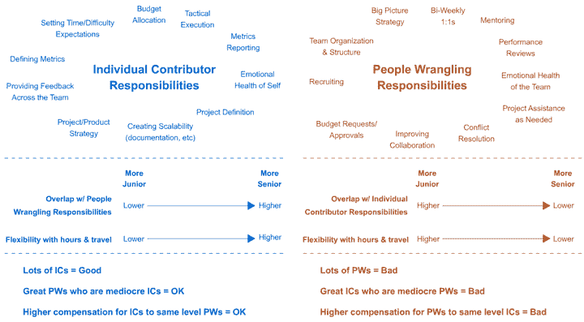

# 如果管理是上升的唯一途径，我们都是该死的傻瓜

> 原文：<https://moz.com/rand/if-management-is-the-only-way-up-were-all-fd/?utm_source=wanqu.co&utm_campaign=Wanqu+Daily&utm_medium=website>

Geraldine 曾经热爱她在 Cranium 的工作(在孩之宝收购&裁员之前，西雅图的桌游初创公司)。她为棋类游戏写问题，为盒子和营销材料抄写。她很擅长这个。但是，奇怪的事情发生了——他们试图提升她。我记得她晚上回家，没完没了地烦恼。她不想让别人向她汇报。她不想让团队承担更大的责任。她想写作。

很奇怪。当我们审视一家公司的结构时，很容易发现，我们需要的是大量高质量的团队贡献者和少量高质量的人员管理人员。然而，不知何故，我们的企业文化和“商业”世界创造了一种期望，即除非你管理好员工，否则你的影响力、薪水、福利、头衔和自我价值都不会增加。

我要打电话给 BS。

在过去，我曾写过关于多轨道进步的重要性——[ICs 和 people wrangler](/blog/whats-the-right-team-structure/)——但我们最近在 Moz 花了更多时间来交流想法，并且很快将实施新的头衔/团队结构，最终将这一点付诸实践。我对此很兴奋。

今天，当一个个人贡献者在工作中表现出色，并对人事管理表现出兴趣时，我很担心。我担心，这种表达出来的愿望中有很大一部分并不是来自对管理者职责的真正热情，而是因为他们希望提升自己的职业生涯和/或影响力，并认为这是唯一的道路。

我制作这个图表是为了帮助说明这两种角色之间的区别:

 
( [大版](https://images.sparktoro.com/blog/wp-content/uploads/2017/10/ics-vs-pws-large.gif) )

个人贡献者对他们自己和他们的工作负责。随着他们在 IC 赛道上的资历越来越高，他们的影响力变得越来越广泛。在 Moz，一个很好的例子是像皮特博士这样的人，他认识到公司的战略需要并投入其中。他协助工程和大数据部门进行评估，协助营销部门提供战术建议和战略投入，发布高质量的[博客文章](http://www.seomoz.org/blog/are-exact-match-domains-in-decline)和[指南](http://www.seomoz.org/google-algorithm-change)，甚至[从头开始设计整个项目](http://mozcast.com/)并执行它们的创作。他的影响力遍及全公司、跨团队，而且是最高级别的。他让自己的影响力决定自己的角色，而不是相反。

另一方面，优秀的人员管理者负责团队的快乐、凝聚力、授权、评估、指导等等。他们的级别越高，就越不应该处于“战壕”中。很多时候，他们触及战略只是为了帮助定义战略问题。这些然后被传递给 ICs，ICs 帮助定义范围，研究可能的答案，并执行它们的实现。Moz 的萨曼莎·布兰妮就是一个很好的例子。她在 IC 部门工作了很长一段时间，但后来进入了人力资源管理领域，如今她帮助产品团队中的几名 IC 对自己的工作充满信心，获得了做好工作所需的工具/资源/帮助，并提供了一名优秀的人力资源管理人员应该具备的指导/一对一/评估/人力资源职能。她几乎从不参与报告的细节，但总是在那里帮助他们推进项目。

基本上，如果你喜欢把事情做好，并把它做好，你应该成为一名 IC。如果你喜欢授权给别人，帮助他们成长和成功(你很擅长)，你应该成为一个人的拥护者。

所有这些 IC(个人贡献者)与 PW(人员争论者)之间有一些细微差别:

*   随着 IC 的级别越来越高，他们往往会与一些 PW 职责有更多的重叠。对于普华永道来说，情况正好相反——随着职位越来越高，他们做的实际工作越来越少。
*   高级集成电路对他们的角色也有更大的灵活性——他们通常可以在任何地方完成这项工作，而且，由于工作得到了认可，他们会收到更多的会议/活动邀请。资深 pw 则相反——他们在办公室的时间更重要，所以出差更困难，他们通常更幕后(首席执行官是一个明显的例外)。
*   如果您有很多 IC，但只有几个 pw，您可能会发现报告和管理方面的挑战。但是，如果你有很多 pw 而没有很多 ICs，你会遇到可怕的“厨师太多，厨房员工不够”的问题(这通常意味着你的文化和组织已经严重混乱)
*   优秀的集成电路有时会被提升为 PWs，结果却表现平平或更差。这糟透了。你不仅失去了一位优秀的公司贡献者，还导致了糟糕的管理，这造成了问题的大规模传播。另一方面，如果一个集成电路表现不佳，其影响几乎没有问题。
*   补偿很棘手。在我的理想世界中(以及我们在 Moz 建立的薪资范围)，PWs 和 ICs 的薪资水平大致相当。假设你在每个轨道上有 7 个级别，3 级 ICs 将做 3 级 pw 做的事情。最高级别的集成电路应该能够像高级管理人员那样赚钱。

当我与人们(内部和外部)分享时，这看起来很直观。我遇到的最大问题与一个概念有关——战略和战术的所有权。前几天，我和另一位 Mozzer 在这个问题上意见不一。此人表示，在 Moz 的历史上，一些团队的战略和战术都是由人力资源管理人员负责的。ICs 没有定义他们做什么，如何做，如何衡量，以及执行的过程，他们接受命令。

这确实是可行的，而且已经奏效了。但我不同意我的同事的观点，即如果我们让 ICs 对什么、何时、何地和如何拥有更大的自主权，而让 PWs 只拥有“谁”和“为什么”的所有权，那也一样有效。当然，更多的初级经理将与 ICs 有更多的重叠，更高级的 ICs 甚至可能接管 who 和 why(如上所述)。但我坚信，从长远来看，我们必须走这条路。人们的幸福取决于此。

当丹尼尔·平克问“什么让我们在工作中感到快乐？“答案很清楚(并且得到了该主题的许多其他研究人员和非正式调查人员的支持):

1.自主性——掌控自己生活的愿望。

2.精通——在重要的事情上变得越来越好的冲动。

3.目标——渴望做我们所做的事情，为比我们自己更伟大的事情服务。

如果集成电路不能控制他们自己的工作生活，也没有能力达到精通，我们将失去那些有机会的好公司。我们将只保留 PWs，可能不会太久。

奇怪的是，我有点像集成电路风格的 CEO(也许这并不奇怪)。我是一名高级 IC，所以我与 PW 的职责有更多的重叠，但我的下属都拥有自己的团队、工作和细节。我可能最直接地参与到产品和营销中，对于这两者，我经常告诉在这些团队中工作的 Mozzers 把我当作一种资源和工具。你让我写点东西，我会照做的。你让我回复一个客户，我就去做。你需要谈论一个项目如何适应更广泛的目标，以及这将如何改变你做这件事的方式，让我们聚在一起。我喜欢向 Moz 的员工汇报工作的感觉，而不是相反。我想永远都是这样。

附:我真的很喜欢 Phil Scarr 的这篇博文，这篇博文描述了他从一个人牧马人到 IC 的经历，以及他为什么喜欢它。我真的为 [Carin](http://www.seomoz.org/team/carin) 感到骄傲，她是我们大数据团队的人，刚刚被提升到产品团队的高级 IC 职位——干得好！

p.p.s .如果我在这个问题上偏离了轨道(或者偏离了轨道),而你以前也经历过，我很乐意在评论中听到你的意见。我可以利用我能得到的所有帮助——正如我不断提醒我的团队的那样，我是第一次担任首席执行官🙂