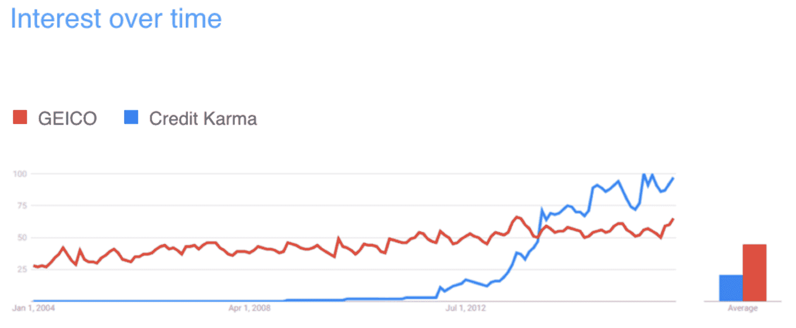
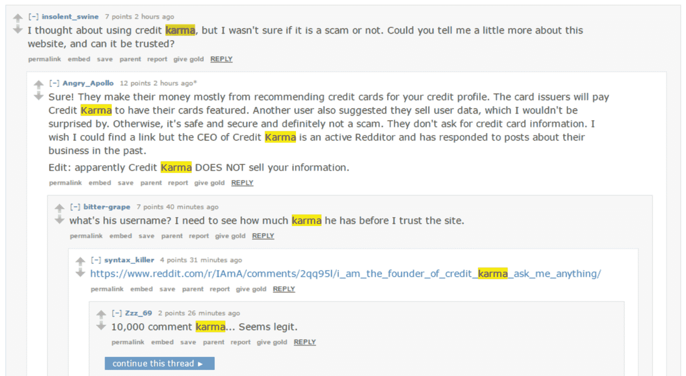
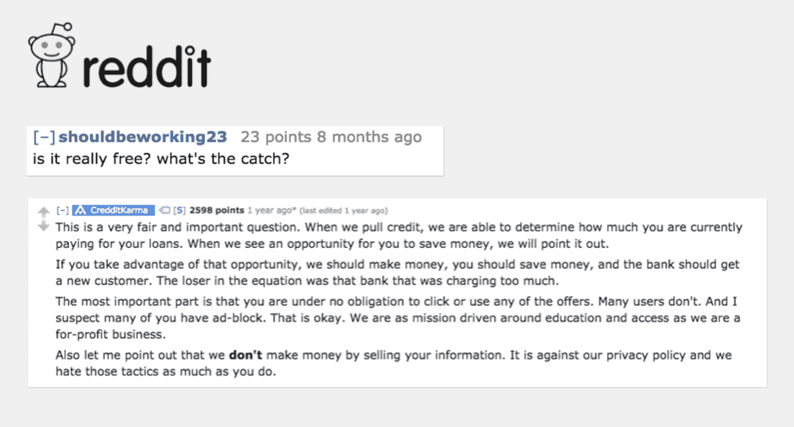

# Credit Karma 的首席执行官在没有公关公司和预算很少的情况下，在一个不性感的类别中建立了一个性感的品牌——以下是第一轮评论

> 原文：<http://firstround.com/review/credit-karmas-ceo-built-a-sexy-brand-in-an-unsexy-category-with-no-pr-firm-and-a-tiny-budget-heres-how/?utm_source=wanqu.co&utm_campaign=Wanqu+Daily&utm_medium=website>

肯尼斯·林(Kenneth Lin)在浏览 Reddit——一个不起眼的日常习惯——时，他发现了一件永远改变了他生活的事情:他的公司 [Credit Karma](http://www.creditkarma.com "null") 终于闯入了主流。这就是:一个关于信用监控的帖子由一个怀疑他公司的免费信用检查服务是一个骗局的用户发起——包括一个捍卫和赞美信用因果报应的用户的热情回应。“天啊，”林心里想。“那个人甚至不为我们工作。”这是一个纯粹的有机时刻——预示着口碑传播的趋势，将在未来几个月为这家初创公司赢得数百万用户。

十年后，Credit Karma 已经确立了市场主导地位，超过 50%的客户是从其他用户那里听说这个网站的。它被谷歌搜索的次数超过了 Geico——Geico 被认为是成功在明显不性感的行业建立性感、个性驱动的品牌的公司的旗手。这使得 Credit Karma 在早期、关键的品牌建立时期，在只有 Geico 1%的员工、微不足道的预算以及没有公关机构帮助的情况下完成这项工作更加令人惊讶。

在第一轮中，我们总是被问到，当公司几乎没有任何资源可以投入时，他们如何能够抓住注意力和顾客的兴趣。林的公司正是这样创造了一个现在价值超过 30 亿美元的公司，在我们上次的 CEO 峰会上，他向观众们讲述了他是如何做到的。在这篇文章中，我们与你分享他的答案。

# 三个早期练习

具有讽刺意味的是，林从来不认为品牌非常重要。“对我来说，这是大公司在没有任何问责制或衡量标准的情况下花钱买的模糊东西——一开始对我们来说似乎没有意义。”因此，当涉及到获得信贷业的名字和它的信息，他们自举自己的过程。一路上，他们发现了三个他们希望从一开始就有的教训:

1.调查你的创始团队，了解你是谁，而不是你想成为谁。

林和他早期的员工做的第一件事，就是列出形容词来区分市场上的信用因果报应。但他们最终得到的——乐于助人、诚实务实——并没有引起人们的共鸣。他们意识到，他们谈论的是他们渴望创建的公司，而不是实际摆在他们面前的公司。“即使你说‘我们公司是这样，这样，这样’，它也不会神奇地变成那样，”林说从你的团队诚实的信念和经验开始会更有力量。“你会在一个更有创造力、更独特的地方结束。

通过向员工提出以下问题来实现这一目标:

我们都有哪些共同的性格特征？

哪些词描述了我们如何相互交流？

是什么信念让我们留在这里，致力于这个想法？

汇总回答并找出共同点。然后推回去。最常见的回答准确吗？人们写下的话是否描述了整个公司？

“我们最终得到了一个与我们想象中完全不同的单词列表，”林说。“你想成为什么样的人和你实际上是什么样的人很少是一回事。我们最终聚集在“公平”、“谦逊”、“乐于助人”、“关系驱动”、“诚信”的周围“简而言之，它们不够华丽，不适合 salespeak。但是他们更诚实——这是一个更值得信赖的品牌。

一个品牌不是你可以凭空捏造出来的。它必须反映现实。

**2。不要复制你喜欢的品牌——用它们来更准确地定位你的公司。**

抓住其他品牌中你真正喜欢的元素会很快让你误入歧途。Credit Karma 早期团队中的每个人都迷恋苹果，尤其是它对完美的痴迷。“我们认为我们当然应该像他们一样，”林说。“但完美对苹果公司的作用方式对我们来说毫无意义。我们是一家总是需要向前推进而不是把每一个细节都做好的公司。我们需要比苹果更容易接近，我们的客户希望我们总是在迭代和改进。”

如果我有一条建议给刚开始做品牌的人，那就是不要过度模仿你认为理想的其他公司。

相反，使用这些其他品牌作为陪衬来决定什么对你的公司有意义，什么没有意义。也许你想传达苹果对清洁 UX 的重视，但你需要更多的迭代。也许你热爱亚马逊，也想展现同样的便利形象，但你的客户服务方式不同。

在一张纸上创建三列。在第一张纸上，写上你崇拜的品牌的名字。第二，写出你想借用的形容词。第三，放置你不想体现的属性。通过这个练习，你可以使用你最喜欢的品牌来更准确地定位你自己的公司，而不会错误地跟随别人的脚步。

**3。把你的品牌“不要”放在其他优先事项的上游。**

“很多时候，人们在谈论品牌时，会忽略被认为更重要的任务，比如设计和制造，”林说。“这是一种误导，因为你的品牌应该影响你最终做出的每一个成立公司的决定。了解你的品牌将确保你在其他选择、招聘、组建团队和发展中保持真实的自我。”

在你做出其他重要决定之前，尽可能早地进行上面列出的练习 1 和 2。与此同时，列出一个你永远不会做出的选择的具体清单，冒着妥协、改变或背叛你所代表的东西的风险。这些信念将成为你的护栏。“把它们写下来，永远不要划掉，”林说。

例如，Credit Karma 的禁忌之一是向客户收取信用信息费用。这样做将从根本上改变公司的论点，完全背离他们的既定目标，违背对市场的关键承诺。在过去十年的历史中做出的所有决定都坚持这个核心“不要”，他们的增长、合作和营销都围绕着它——尽管批评者坚持认为这种模式是不可持续的。如果你不清楚地断言什么是你不会做的，你最终总会有做这件事的风险。安装护栏，让你远离诱惑。

# “勇敢品牌”的习惯

当 Credit Karma 在 2008 年推出时，信用评分公司不仅仅是不性感，而是被厌恶。他们中有太多的人虚假承诺免费报告，只向注册的人发送垃圾邮件。为了打破这种噪音，让自己与众不同，林的团队不得不在品牌信息和行为上远离他们的舒适区。这些行动加在一起，定义了一个需要真正勇气的品牌战略。

选择品牌优先于收入的领域。

即使人们喜欢你的品牌，他们也不会使用它或推荐他们的朋友，除非你让他们觉得简单。这需要构建一些功能来推动积极的参与，当你刚刚起步时，这可能是一个艰难的推销。“不产生收入的功能可能会成为你以后最大的竞争优势，这似乎有悖常理，”林说。“但我们建立了信用模拟器和工具来解决信用报告错误，即使这不会带来金钱，因为我们希望推动与该网站的习惯性接触。

“这是信用因果报应搜索最终超过 Geico 及其 10 亿美元年度广告预算的关键原因之一，”他说。“当我们开始时，我们的搜索为零。而且不是一夜之间改变的。我们花了五年时间来摆脱商业模式带来的包袱。我们必须明确投资工具来扭转这种局面。”教训:你的品牌就像房子的地基。您希望在构建它之前完全正确，即使它最初会占用收入中的资源。

**自愿接受火的考验。**

在 Credit Karma 的早期，林花了几个小时在与信用相关的论坛上与人们交谈，以澄清这项服务是什么，不是什么。“除了给 20 个写关于我们或这个空间的博主发邮件，我每天晚上还会回复 50 个帖子，”他说。“任何公关人员可能都会告诉我，这是个糟糕的主意。人们往往非常愤世嫉俗，找出你所有的缺点。但这对我们来说是有益的，因为它给了我一个活生生的脉搏，让我知道我们在业内是如何被看待的。这也让我能够回应和揭穿围绕我们品牌的具体批评。与其逃避，不如勇敢面对。直面负面反馈，作为一个人，而不是作为你的公司，直接与那些给出反馈的人接触。”教训:作为首席执行官、创始人或早期领导者，花时间与用户直接互动，不管他们的体验如何。不要让客户服务的询问和投诉得不到回应。不要发送固定的回复。留出固定的、不间断的时间来回复、跟进和寻找对人们所关心的问题的深思熟虑的回应。大多数时候，他们会非常惊讶地收到你的来信，这种个人接触会融入到他们与朋友和同事的谈话中。这对你的声誉会有惊人的影响。

**为客户或用户的“快乐”创造衡量标准和基准**

如今，许多初创公司都在努力实现数据驱动的决策。但这可能意味着要衡量许多不同的东西——参与度、转化率和收入都是典型的。围绕客户满意度定期收集、审查和(最重要的是)响应数据并不常见。

你想要实现主动衡量新特性是否对用户体验产生积极影响的指标。

“净推广分数(NPS)在这里是一个明确的选择，值得用来做决定和绘制路线图，”林说。

“研究表明，在任何给定的类别中，NPS 得分最高的公司的增长速度是行业平均水平的两倍，”他说。“当你这样想的时候，你会意识到品牌不是你可以靠运气打造的。这是你必须量化的东西，以确保你在正确的轨道上。关注 NPS，它不仅会增加你的忠诚度，还会增加你的口碑营销，这是非常有价值的。如今，超过 65%的 Credit Karma 用户都是通过口碑推荐来到这个网站的。”

其他反映满意度的指标包括:回头客的比例、他们回头客的频率、他们选择通过社交媒体或电子邮件分享你的内容的频率，以及他们是否使用了任何内置的推荐工具。你想让这些数字向右上方。不要忽视它们，即使你的董事会似乎对其他增长迹象感兴趣。

追踪并奖励你的冠军。

随着时间的推移，有一类用户是你想要亲近的——你会认识他们，因为他们的 NPS 分数很高，他们参与分享和推荐工具，他们喜欢在论坛和博客评论中热情地写关于你的文章。他们会告诉很多人你的产品，甚至不用你问。值得努力去寻找他们，并在你找到他们时联系他们。“你的超级促销员为你的企业带来不可替代的价值，”林说。“他们买得更多，不厌其烦地提供反馈，停留更长时间，并推荐他们的朋友。让他们加入你的社区，加深他们的忠诚度。”

例如，Credit Karma 追踪了会在评论区为自己辩护的 Reddit 用户。他们伸出手，问他们还想从这项服务中看到什么。他们得到的反馈是，人们对信用报告中的不准确性感到沮丧。解决这些问题既繁琐又昂贵。他们听取并部署了直接争议作为回应，这使得消费者只需点击几下鼠标就可以质疑他们报告中的不准确之处。

记住你的超级促销员不是一刀切的。“节省 25 美元的优惠对一些消费者来说可能会有很大的不同，但对另一些消费者来说则完全不同，”林说。“如果你发送太多与受众无关的电子邮件，你会伤害你的人际关系。定制优惠并让人们轻松选择退出对留住人才至关重要。”他特别建议密切关注退订与你的超级推广人的交流。“这是你是否在为那个人创造有形价值的最清晰的信号。”Credit Karma 每周运行多达 15 次 A/B 测试，以了解这些客户的行为，并相应地定制他们的服务。

勇敢的一部分是有冠军支持你。不要认为他们是理所当然的。当你下大赌注时，你需要人们支持你。

一旦你明确了自己的立场，就要坚持下去。重新定义一个行业需要勇气。

# 运行 Reddit 测试

正如你所知道的，林是 Reddit 的忠实粉丝——尽管它是许多 Credit Karma 最响亮的批评者的家园。事实上，这正是他喜欢它的地方:这是一个有价值的工具，可以用来看看公司的论点是会飞还是会死，什么样的信息传递效果最好，以及他们如何才能转变怀疑论者。

如果你正在开发一个消费产品，你可能会在 Reddit 上找到当前或潜在的用户。你也一定会发现数量惊人的人对任何话题都充满热情——即使它很模糊。他们会非常不同，从知情的到支持的，从无知的到敌对的。他们准备直言不讳、坦诚相待——毕竟，这也是该网站出名的原因。林说，因此，向这些观众展示你的商业模式和营销语言可能是一个极具教育意义的试金石。

你说的话会不会让没有动力退缩的人觉得过得去？这是获得难得的真相时刻的一种方式。

特别是，Redditors 倾向于挑选那些偏离他们价值观的公司，或者那些在他们为自己设定的禁忌上妥协的公司。林说，这似乎是这群人中的一种特殊才能。清晰和真诚是加分的。“如果人们接受你对他们的抱怨和尖锐问题的回应，这是一个很好的迹象，表明你足够真诚和透明。”一旦你在 Reddit 上学习了语言，你就可以把你学到的东西应用到你更广泛的受众中。

Credit Karma 最重要(也是最常见)的 Reddit 测试聚焦于该公司被问得最多的问题:它真的是免费的吗？本质上，有什么问题？为了完善他们如何谈论他们的模型并最大限度地获得反馈，林决定于 2014 年在 Reddit 上举办一个 AMA(问我任何问题)主题。在用户名 CredditKarma 下，他证明了自己的身份，做好了准备。随即，他被这个问题击中了要害:“这不是骗局吗？”

“我想，‘如果我们能在 Reddit 上打开闸门，那将证实我们足够有自知之明，并清楚地传达这个超级重要的想法，’”他说。“我感谢用户提问，并尽可能直接地解释了商业模式。我强调了我们从不出售用户信息，以及我们是如何反对诈骗策略的。我强调不要为自己辩护，也不要隐藏任何东西。”他的回答成为了帖子中投票最多的评论，点击该帖子或搜索信用因果的用户可以立即看到。“没有人大喊，‘那是胡说！’这是对我们打造品牌的价值观的一次重大信任投票。"

林建议其他企业家去看看 Reddit 上关于他们的产品或他们正在建立的类别的对话。人们对类似的公司或竞争对手有什么看法？你会如何回应这些问题或投诉？在相关的子栏目中找到相关对话的切入点，把自己呈现为一个透明的信息来源。这些观众很少能直接与创始人或首席执行官交流。考虑自己开一个帖子，问问你一直困扰的 pivotal 品牌问题。很少有沙盒里坦诚是一种珍贵的属性——在那里你可以得到诚实的反馈，同时赢得忠诚的粉丝。

Reddit 并不是唯一一个可以做到这一点的地方。产品论坛也是受过教育和诚实的评论者的重要来源，他们会毫不犹豫地告诉你他们的想法。他们已经看够了胡说八道，但欣赏诚实传达的良好构建的产品。当你在创业时，焦点小组可能不可行。让这些喜欢免费发表意见的人来执行你的品牌战略，是一种简单的方式，可以让你在为你的其他客户群部署之前，看到你需要在哪里做出改变。

最重要的是，利基产品论坛和子网站的常客通常对他们免费讨论的产品非常兴奋，以至于你可以从他们的热情中学习。如果你在一个不太吸引人的市场建立一家公司，围绕它创建一个令人兴奋的品牌可能会令人生畏。看看那些对这些话题真正感兴趣的人使用的单词和形容词。哪些功能或产品让他们眼前一亮？他们是如何互相描述的？记下他们使用的关于你正在做的事情的词汇。当你解释为什么你更广泛的消费者基础也应该被提升时，它们可能会派上用场。

# 性感对一个品牌意味着什么

尽管我们在第一轮评估中写了很多关于品牌的文章，我们仍然听到一些公司认为他们不能围绕他们正在做的事情建立一个引人注目的品牌——他们说，这太小众、太技术化、太不可靠、太乏味，难以沟通。如果有人能证明他们错了，那就是林。只是采取了不同的方法。这是非常值得的，因为品牌应该决定你在下游采取的一系列行动，从你如何与客户互动到你如何确定下一步要构建哪些功能。

如果一个品牌吸引了特定受众的注意力，那么它就是性感的。就这些。它不一定要让世界着火，只是它的一个子集。所以不要抄袭别人，或者觉得自己需要其他品牌所有相同的花里胡哨。找到你独特的声音，通过引导你的创始团队的个性，并对那些最关心你的公司的人诚实，为你的客户消除噪音。听听他们谈论的内容和提出的问题。让自己容易受到批评，即使这是你最不想做的事情。不要因为认为品牌永远不会成为你的优势而过早地取消自己的资格。

“品牌不仅仅是你向世界展示的东西。它是你公司的活的灵魂，”林说。“这是你不断迭代和衡量对你的每一个客户有价值的方式。根据贵公司的规模，每天可能会有数百或数千次关于贵公司的对话。”

当你的顾客认为没有人在看你时，他们如何谈论你，这是一个未被充分利用的衡量你的品牌有多强的标准。

“当那位 Reddit 用户澄清了 Credit Karma 的使命时，看到有人花时间纠正另一位用户并提供支持性研究是如此有意义，”他说。“这就是为什么一个伟大的品牌对你的业务发展至关重要。它创造了一群永远支持你的追随者。”