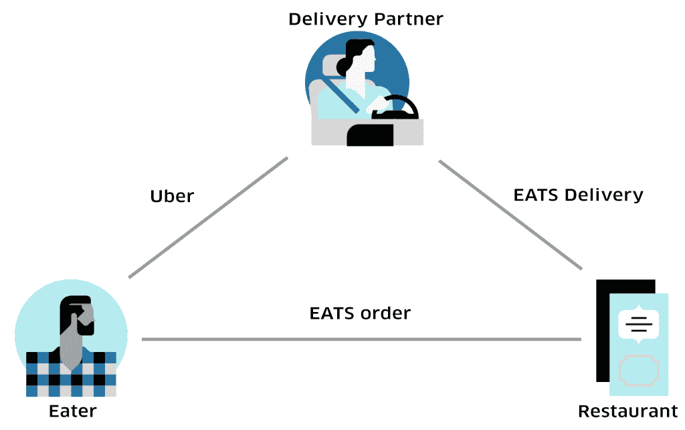
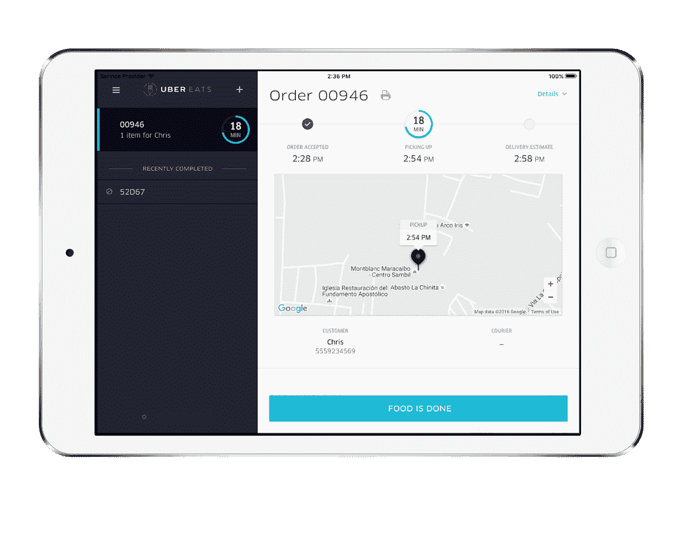
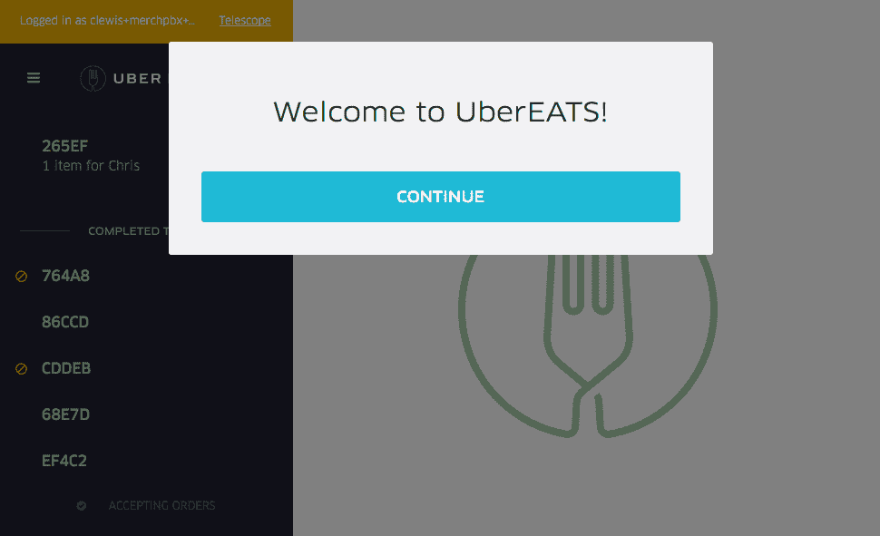
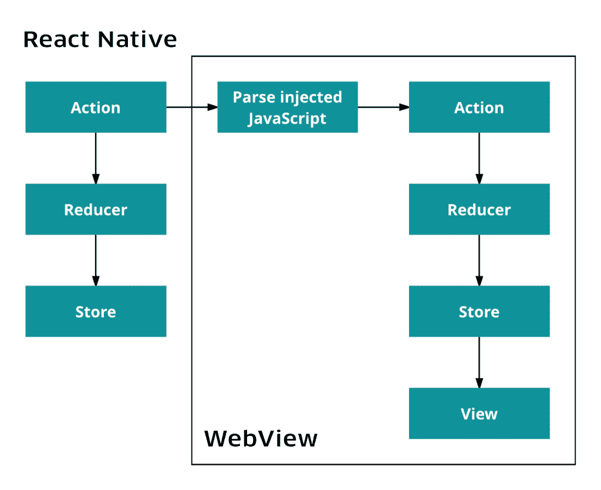
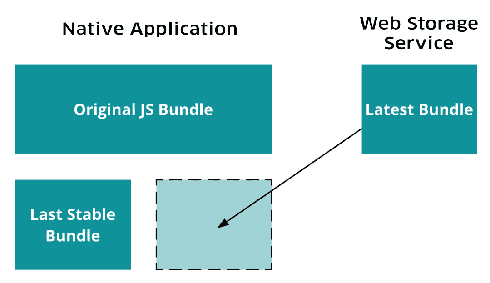
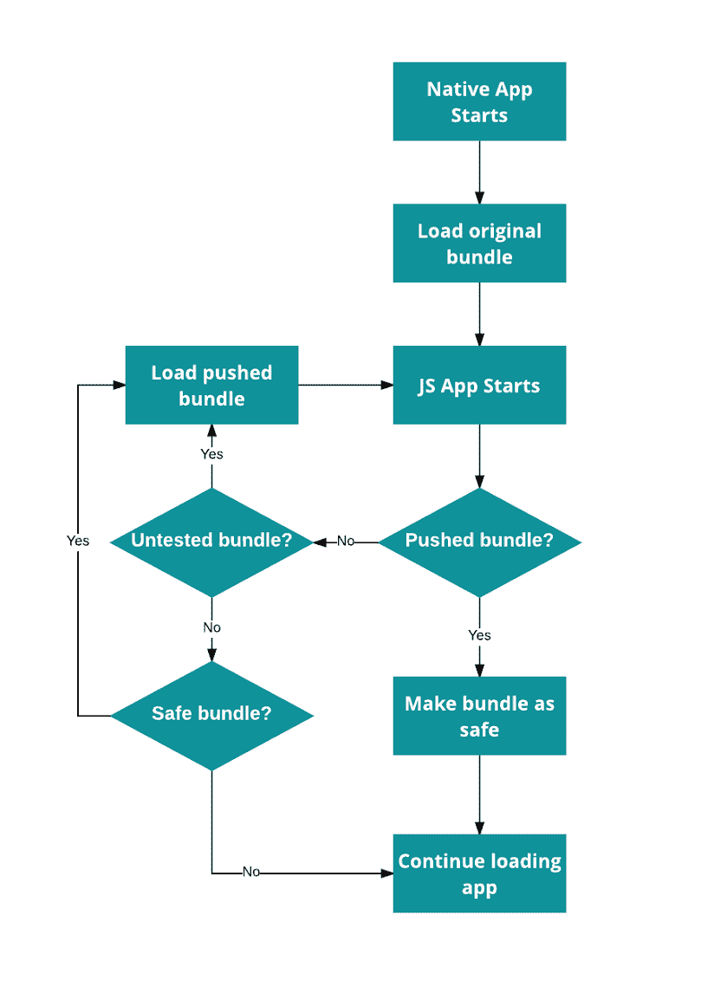
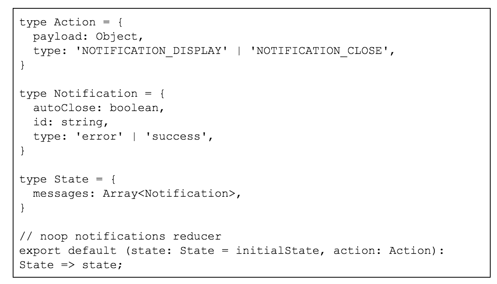
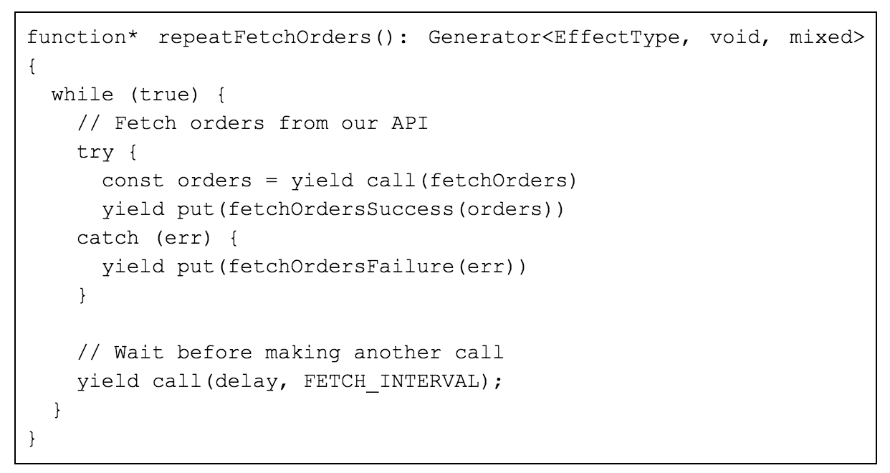
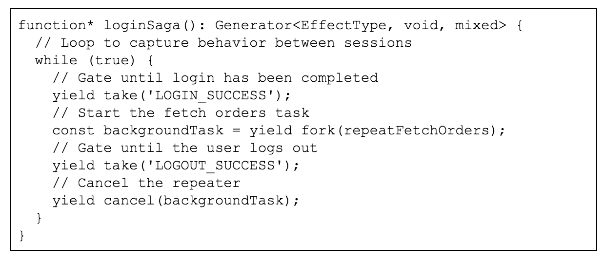

# React Native 和优步工程为 UberEATS 提供动力|优步博客

> 原文：<https://eng.uber.com/ubereats-react-native/?utm_source=wanqu.co&utm_campaign=Wanqu+Daily&utm_medium=website>

使用[【Uber eats】](https://www.ubereats.com)，我们的目标是让从您最喜欢的餐厅点餐像使用 uberX 或 uberPOOL 请求搭车一样无缝。像推出任何新产品一样，建立一个食品配送网络伴随着工程上的成功和惊喜。虽然好吃，但这位新的美味乘客(食物！)也带来了相当大的挑战。例如，它不能指定自己喜欢的路线，也不能与司机聊天，而且在取车和下车时需要更多的步骤。在这篇文章中，我们特别关注一个挑战:优步工程公司是如何将第三方引入一个以前的双边市场的。

幸运的是，我们能够利用优步现有的大部分技术，让 UberEATS 快速启动并运行。一次旅行变成了送货。司机伙伴变成了送货伙伴，乘客变成了食客。但是没有类似于餐馆的聚会，因为在过去的五年里，人们一直认为一次旅行中只有两个人；不是三个人一份芝士披萨，泰式炒面，或者鸡肉法士达。

### **建筑餐厅仪表盘**

Figure 1: The UberEATS marketplace includes three parties: restaurants, delivery-partners and eaters. This new dynamic turns Uber’s traditional two-sided model on its head.

餐馆需要一种与送餐伙伴和用餐者沟通的方式。至少，各方需要传达:

1.  下新订单
2.  接受订单
3.  交货伙伴到达
4.  订单完成

这四个基本需求催生了餐馆仪表盘，一个通过平板设备访问的[反应](https://facebook.github.io/react/) / [流动](https://github.com/facebook/flux)单页面网络应用。

Figure 2: A Restaurant Dashboard showing one active order.

### **为未来 50 个城市改造餐厅仪表盘**

自独立应用程序的 [于 2015 年 12 月在多伦多首次推出](https://newsroom.uber.com/canada/ubereatsapp/) 以来，我们一直致力于为餐厅创建一个轻松、可靠的界面来协调交付。几个月后，我们清楚地意识到，为了继续改进餐厅仪表盘，有必要进行彻底的改造。

我们的网络应用程序只提供有限的设备访问权限，这被证明是一个严重的问题，因为它限制了我们向餐厅传达重要信息的能力。这方面的一个例子是，在基于声音的通知可以被提示之前，用户必须与网页进行交互。餐馆里熙熙攘攘，所以声音是一个非常重要的方式，可以通知餐馆员工下了新订单，或者当送货- 的合作伙伴来取货时。为了解决这个问题，我们在每次页面加载时都显示一个模态，以强制用户交互。虽然这给了我们播放声音的隐含许可，但这是以牺牲用户体验为代价的。

Figure 3: Restaurant Dashboard showing a modal to force user interaction and therefore enable sound.

我们还需要开发一些功能，这些功能在网络浏览器上根本不可行，或者只能在高度受限的格式下使用。例如，打印物理收据对许多餐馆来说是一项既定任务，但网络浏览器只允许那些使用 [AirPrint](https://en.wikipedia.org/wiki/AirPrint) 兼容打印机的餐馆使用该功能。这种限制是餐馆和工程师们困惑和沮丧的一个很大的来源。我们意识到，为了克服这个障碍，我们需要访问硬件，这将允许我们使用打印机供应商提供的本地 SDK 直接与打印机通信。

### **评估 React Native**

虽然称[React Native](https://facebook.github.io/react-native/)为移动应用开发的银弹还为时过早，但它似乎非常适合 UberEATS 的用例。由于 Restaurant Dashboard 的最初版本是为 web 构建的，我们的团队在使用 React 方面有丰富的经验，但在 iOS/Android 上的曝光率有限。还有大量关于服务中餐馆部分如何运作的知识，这些知识是我们从一开始就在 UberEATS 上工作积累的。这些考虑使得 React Native 成为一个引人注目的选择，它为 web 语言的移动开发提供了一个平台。它为我们提供了“烹饪”我们想要接近完美的应用程序所需的工具。

多平台支持也是我们关心的一大问题。目前，优步与餐馆密切合作，寻找平板设备并安装餐馆仪表盘应用程序，但随着 UberEATS 的继续扩张，这种做法可能变得不太可持续。当我们转向 BYOD(自带设备)模式时，优步的司机合作伙伴也经历了类似的转变。通过 以平台无关的方式构建 UberEATS 应用，我们可以选择以后扩展到 Android，并支持两个平台向前发展。

要让 React Native 成为我们的一个可行选项，同样重要的是，它要能在我们现有的移动基础设施内工作，并支持最初促使我们转向原生应用的各种功能。为此，我们构建了一个“演示”应用程序，专门用于验证关键特性。这包括我们从优步的其他团队引入本地依赖项来测试功能，包括崩溃报告、用户认证和分析。由于这些特性跨越了本机 Objective-C 层和解释的 JavaScript 层，所以这也是对我们交付需要在这两个非常不同的环境之间进行集成的特性的能力的一个有用的测试。

总的来说，演示能够交付我们想要的结果。像崩溃报告这样的库，可以独立于应用程序的业务逻辑运行，开箱即用。对于触发分析事件等特性，桥接到 JavaScript 层也非常简单。事后看来，这种技术壁垒的缺乏可能导致我们过于依赖原生库，而原生功能和 JavaScript 功能之间的这种紧张关系将继续影响我们后来的许多架构决策。

#### **构建迁移路径**

最初的目标是构建最低限度的脚手架，让餐馆仪表盘在本地运行。为了实现这一点，我们创建了一个本地导航和认证系统，以及一个指向我们现有 web 应用程序的 WebView。

Figure 4: The above diagram showcases interaction between the native and web Restaurant Dashboard Flux stores.

使用[NSURLProtocol](https://developer.apple.com/reference/foundation/nsurlprotocol)修改了来自 WebView 的网络请求，以获得必要的认证头。窗口中添加了额外的挂钩，允许我们通过在 WebView 中注入 JavaScript 来更新基于 web 的餐馆仪表盘的 flux store。这在逐步迁移功能方面给了我们很大的灵活性。

在功能对等的情况下有效地拥有这种最小可行产品(MVP ),使我们能够迅速开始在真正的餐厅进行测试。它还在原生功能方面释放了一些“速赢”。我们集成了几个本地打印机 SDK，将兼容打印机的范围扩展到 AirPrint 支持的范围之外。我们还禁用了睡眠模式，这只需要一行本地代码，但在 web 上是不可能做到的。

然后，应用程序的其余部分可以一部分一部分地移植到本机。在可能的情况下，我们的目标是使这些迁移成为更广泛的特性工作的一部分，而不是为了重写而重写。

#### **定义架构**

如前所述，React Native 融合了 web 和移动开发，允许我们以原生方式或 JavaScript 编写特性。这种功能也分别带来了移动和 web 社区的模式和概念。这个思想的熔炉给了我们更多的选择，但也提出了选择正确抽象的新挑战。

我们最终设计 UberEATS 的方式与我们设计常规[React/Redux](https://github.com/reactjs/react-redux)web 应用的方式非常相似，尽可能避免使用 iOS 模式和模块。幸运的是，对于我们的需求和偏好来说，web 概念和技术总体上可以很好地转化为本地开发。

这种简单的网络翻译的一个例子是应用程序的路由功能。在 web 上，Restaurant Dashboard 使用流行的 react-router 库，该库支持以声明方式定义路由，与视图的方式非常相似。然而，该系统假设存在 URL，而这些 URL 在浏览器之外往往是缺乏的。React Native 提供了命令式导航库，类似于[UINavigationController](https://developer.apple.com/reference/uikit/uinavigationcontroller)提供的接口。

为了提高速度，我们最初保留了 react-router 库，目的是在 MVP 启动并运行后替换路由框架。不存在的 URL 问题很容易通过在 JavaScript 内复制 [HTML5 历史](https://developer.mozilla.org/en/docs/Web/API/History) API 来解决，它实际上只是一个堆栈。

当需要将 react-router 迁移到 react 本地库(如 Navigator 或[navigation experial](https://github.com/ericvicenti/navigation-rfc))时，新的实现似乎并没有比我们当前的解决方案提供任何令人信服的优势。事实证明，vanilla react-router 是一种非常棒的路由方式，无论您是在浏览器中还是在本机中。

移植过程中的另一个重要经验是，最大限度地减少 iOS 和 JavaScript 之间的交互并将逻辑集中在 JavaScript 层是非常有利的。这样做有许多显著的好处，例如:

*   减少 JavaScript 和 Objective-C 之间的上下文切换
*   增加可移植性(通过减少特定于平台的代码)
*   缩小了 bug 的范围

当我们开始这个项目的工作时，我们开发了一个简单的 API 来与本地层进行通信。虽然我们意识到保持这一层薄的优势，但我们低估了 React 原生层中可以保留多少代码。分析和登录等功能基本上只是网络调用，可以相对容易地用 JavaScript 实现，而最初用 Objective-C 编写的代码需要移植到 Java 中以支持 Android。然而，更有可能的是，我们将抓住机会用 JavaScript 重写这些库，以便它们可以跨平台共享。

#### **自动推送更新**

React 本地应用由少量 Objective-C/Java 代码引导，然后加载 JavaScript 包。这个包是应用程序附带的，就像任何其他资产一样。正如我们所建议的，如果业务逻辑仍然集中在 bundle 中，应用程序可以通过在启动时加载不同的 JavaScript 文件来更新，这是一个简单的过程。在本地层，应用程序可以更改 React 本地桥使用的文件，并请求重新加载该文件。

为了保持我们的更新逻辑平台不可知，我们选择更进一步，在桥周围创建一个本机包装器，允许 JavaScript 包本身决定加载哪个包。

Figure 5: Restaurant Dashboard can store up to three JavaScript bundles at any given time.

Restaurant Dashboard 会定期检查新捆绑包并自动下载。本机代码和捆绑代码都遵循语义版本控制，为每个新部署分配唯一的标识，如果更改了本机 JavaScript 通信接口，则该更改被视为破坏。例如，将*Analytics*模块重命名为*Analytics v2*将被视为重大变更，因为从 JavaScript 包到 Analytics 的现有调用将触发异常。

当然，即使对语义版本化非常小心，糟糕的更新仍然是可能的。在 UberEATS 的上下文中，坏的更新是指在包处理逻辑有机会运行之前导致餐馆仪表板崩溃的包更新。崩溃的时间安排使得通过推出新的捆绑包来解决问题变得不可能。导致这种不稳定性的更新最终会发生，因此拥有一个能够检测不稳定版本并从中恢复的弹性系统是非常重要的。

避免部署不良更新的一个方法是将每个版本都视为一个实验，这允许逐步推出，并且如果必要的话，允许更新的回滚。

Figure 6: The Restaurant Dashboard’s rollback process determines which bundle to load.

为了使回滚过程正常工作，Restaurant Dashboard 需要识别出它有一个坏的捆绑包，然后重新加载一个“安全”的捆绑包(即我们知道没有错误的捆绑包，如应用程序最初附带的捆绑包)，否则它将无法找到要回滚到哪个版本的软件。我们通过自动重新加载应用程序附带的原始 JavaScript 包来实现这一点，然后加载两个推送包之一:最新的安全包或最新的包。如果可以加载最新的包，它将升级为安全包。如果不存在安全包，原始包将继续使用，没有更新。

这种更新餐厅仪表盘的方法比常规的移动应用程序更新摩擦小得多，因为新版本可以根据需要发布，从而将发布新功能的时间从几周缩短到几天。更新在后台下载并在完成后加载，避免了用户交互。这种缺乏即时用户交互的情况使得更新可以更快地传播，并且大多数设备可以保持最新的版本。同样的机制也允许我们快速回滚坏的构建，最大限度地减少对餐厅合作伙伴的干扰。

虽然以这种方式推送更新并没有完全取代正常的应用程序版本(iOS 或 Android 原生代码的变化偶尔仍需要这些版本)，但它降低了它们的频率。随着原生层随着项目的成熟，我们预计这种趋势将会继续。

### **测试和型式检查**

在优步工程中，团队行动迅速，网络项目往往随着变更被推送到存储库而交付，而不是等待构建列车。这与移动应用通常需要数周的发布过程形成了鲜明对比。当我们考虑在餐馆仪表板的开发期间转移到本机应用程序时，我们担心应用程序的稳定性可能会由于这种紧张的周转而受到影响；毕竟，如果您在 React 本机解释器中崩溃，您将在现实生活中崩溃。即使捆绑推送提供了降低这种风险的方法，崩溃也远非理想。

特别是单元测试和浅层渲染已经存在了很长一段时间，但是最近在 JavaScript 社区中有一种通过 [流](https://github.com/facebook/flow) 或 TypeScript 来合并静态类型检查的增长趋势。

这一次更新应用程序时，我们决定使用 Flow 进行类型检查，这个决定让我们对业务逻辑的正确性更有信心。事实上，它已经被证明是一个非常有价值的工具，用于测试代码并在错误进入生产之前捕捉它们。

流能力的一个简单例子是类型检查缩减器函数。如下所述，reducer 将当前状态和动作作为输入，反过来，它将返回新的状态作为输出:

#### **处理副作用**

使用 Flow to type check 允许我们验证我们的状态在这个过程之后保持其正确的形状，并且新的版本继续在我们的应用程序中找到错误的可能来源，这是 Flow 社区的功劳。此外，与可选类型相关的最小开销意味着它不会妨碍快速迭代和开发。

餐厅仪表盘使用 [Redux](https://github.com/reactjs/redux) 来管理数据流。Redux 为我们提供了一种简单、可预测的方法，通过遵循一些关键原则来对应用程序状态进行建模:

1.  所有状态都在存储中，这是一个单一的不可变对象
2.  视图将商店作为输入，呈现 React 原生组件
3.  视图可以分派动作，这些动作是修改商店的请求
4.  还原器将动作和当前状态作为输入，返回一个新的存储

通常有必要改变存储以响应异步操作，例如网络请求。Redux 没有规定这样做的方法，但是一种常见的方法是使用， amIdlewaRefoRRe

Figure 7: In Restaurant Dashboard, data flows through a Redux application.

我们最初的方法是使用 Thunks，但是随着应用程序逻辑(和副作用)变得更加复杂，我们很快就遇到了问题。具体来说，我们遇到了两种不适合 Thunk 模型的副作用模式:

1.  定期更新应用状态
2.  副作用之间的协调

[传奇故事](https://redux-saga.github.io/redux-saga/) ， a n 备选sIdeeffectmod pps，利用 ES6([ECMAScript 6](http://es6-features.org/))生成器函数提供一个不太复杂的选项。 它们没有扩展动作的概念，而是被建模为一个独立的线程，可以访问存储、监听 Redux 动作并分派新的动作。为了避免与 Thunk 相关的问题，[UberEATS.com](https://www.ubereats.com/)最近完全迁移到 Sagas，这让我们相信它们可以扩展，并且足够成熟，可以满足我们的需求。(这里没有没完没了的长篇大论！)

Sagas 真正大放异彩的一个领域是管理应用程序状态的周期性变化，比如检索一个新的活动订单列表。使用 Thunks 可以实现这一点，但并不完美。(谁会想到呢？不是我们！)例如，组件可以定期调度一个动作来获取订单；或者，Thunk 可以递归地调用自己。然而，除了实现问题之外，没有一个带定时器逻辑的组件——也没有一个独立的 Thunk 不断触发自己——完全适合 Redux 模型。

Sagas 为解决这个问题提供了一个干净的方法，因为它们使我们能够创建一个长期的任务，定期获取新订单并分派一个动作来更新商店。

与长时间运行的任务相关的一个问题是维护它们之间的通信，如下所示:

以上面的取订单示例为基础，只有当有效的用户会话存在时，才应该检索订单和更新存储。不执行这个规则会导致不明显的错误，比如餐馆注销和订单更新之间的竞争情况。这反过来可以揭示触发崩溃或来自 UI 的奇怪提示的边缘情况，因为传入订单的代码可以非常合理地假设不存在的餐馆存在。

防范这些问题相对简单，但是识别潜在的竞争条件并添加必要的检查是耗时且容易出错的。更重要的是，我们的订单代码不应该关注用户会话的状态，因为它们是两个独立的关注点。

Sagas 提供了一种简单的方法来监听与会话相关的动作，并启动或停止获取订单的后台任务。例如，当我们看到一个登录事件时，我们应该派生出一个任务来定期获取订单，如果看到一个注销，就取消这个任务。这可以简明地表述为一个传奇故事，如下:

分叉任务是另一个生成器，它将继续运行，直到它(或它的父任务)被终止。

事实上，这种将任务限制在特定动作上的模式相当普遍。很像组件装饰者，我们可以把这个逻辑拉到一个更高阶的生成器函数中，如下所示:

传说的本质也简化了测试的过程。使用 Sagas，对给定的功能进行单元测试就像调用相关的 Saga 并对结果进行深度比较一样简单。

许多后端工程师对这种让许多小服务通过消息传递相互通信的方法会很熟悉，但我们生成和使用的是 Redux 动作，而不是 [卡夫卡](https://kafka.apache.org/) 事件。从我们开发人员的角度来看，看到这些模式应用于客户端代码是非常令人着迷的。

### **反思 UberEATS 之旅**

几乎不可能在一篇文章中总结部署一个应用程序的全部体验，尤其是对餐馆与 UberEATS 应用程序的交互方式影响如此之大的应用程序。如果有的话，我们希望这篇文章为我们团队选择 React Native for UberEATS 提供了一些额外的见解，以及我们采取的一些步骤，以确保我们的餐厅合作伙伴获得稳定而强大的用户体验。

虽然 React Native 仍然只是 UberEATS 工程生态系统的一小部分，但我们使用它来重建餐馆仪表盘的体验非常积极。自去年实施以来，改进后的餐馆仪表盘已经成为 UberEATS 上几乎每家餐馆的标准工具。以这样的速度，我们对框架的能力持乐观态度，随着我们规模的扩大和用户市场的扩大，它将继续满足我们的需求。

有兴趣在 UberEATS 上用 React Native 烹饪一些美味吗？请务必查看 UberEATS 职位公告板，了解我们 UberEATS 开发团队的空缺职位。

克里斯·路易斯是优步的一名软件工程师，负责 UberEATS 餐厅仪表盘的工作。为了给自己的节目加油，Chris 使用 UberEATS 从旧金山他最喜欢的餐馆订购寿司。T3】